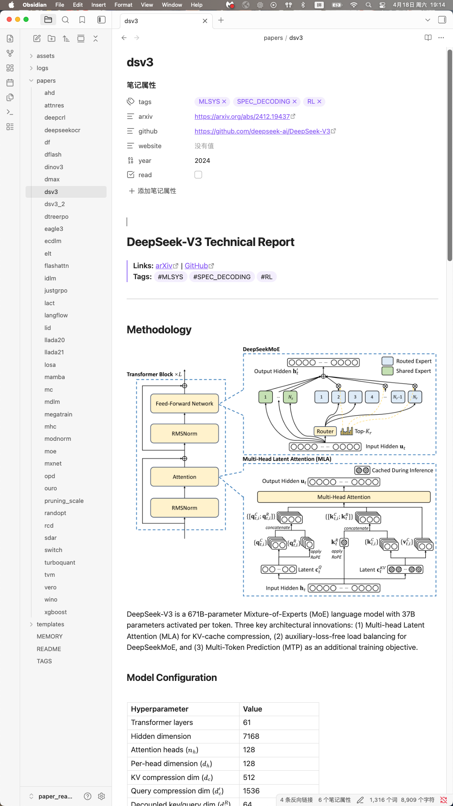
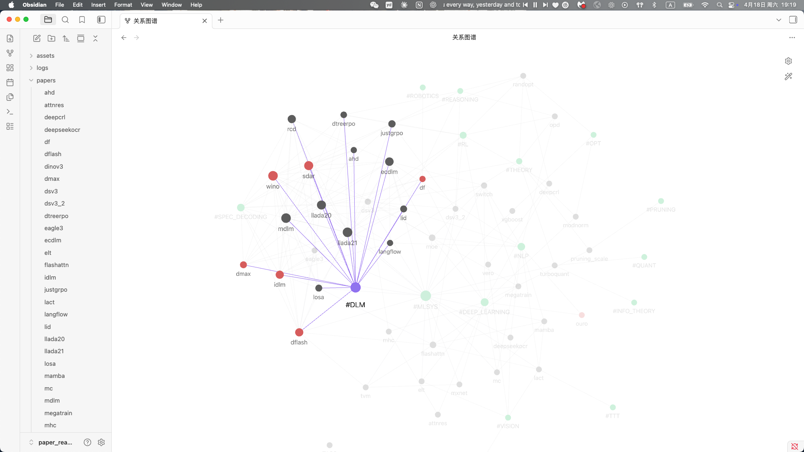
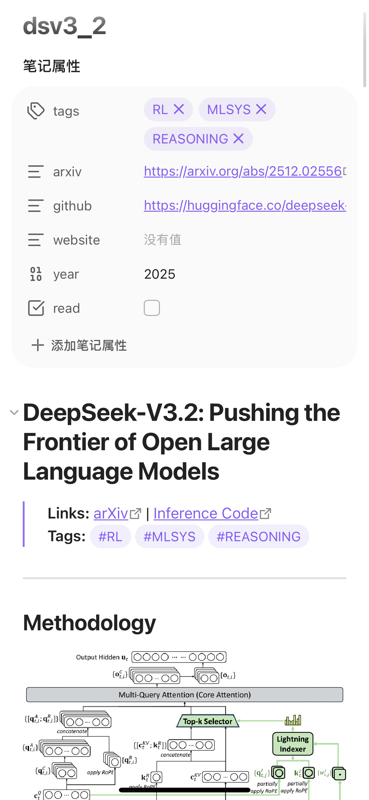
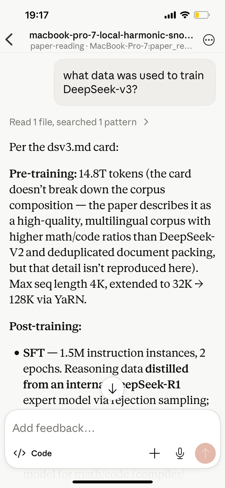
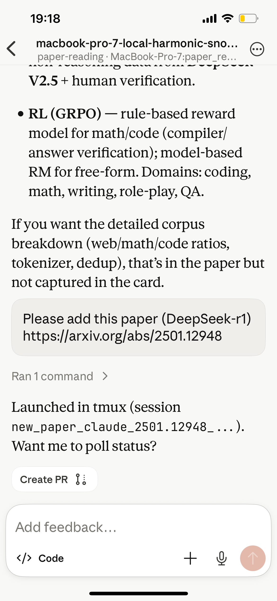

# paper-reading

A personal paper reading vault. View with [Obsidian](https://obsidian.md) for graph-based navigation between papers.

<p align="center">
  
</p>

## Installation

**Claude Code**
```bash
curl -fsSL https://claude.ai/install.sh | bash
```

**Codex**
```bash
npm install -g @openai/codex
```

**tmux**

```bash
brew install tmux
```

**Clone the repo**
```bash
git clone <repo_url>
cd paper-reading
chmod +x new_paper.sh
```

**Obsidian**
Download [Obsidian](https://obsidian.md), then: **Open folder as vault** → select this directory.

## Adding a paper

```bash
# Using Claude Code (default)
./new_paper.sh https://arxiv.org/abs/XXXX.XXXXX
# or
./new_paper.sh --claude https://arxiv.org/abs/XXXX.XXXXX

# Using Codex (default)
./new_paper.sh --codex https://arxiv.org/abs/XXXX.XXXXX
```

## Viewing

Open the vault in Obsidian. Use **Graph View** to explore connections between papers and tag hubs.

<p align="center">
  
</p>

## Sync across Apple devices

Place the vault inside `~/Library/Mobile Documents/iCloud~md~obsidian/Documents/` on your Mac — iCloud Drive syncs it to your iPhone/iPad automatically. On mobile, install the **Obsidian** app and it will pick up the vault under iCloud. No extra setup needed.

<p align="center">
  
</p>

## Ask Claude about the vault from your phone

Run Claude Code's remote-control on your Mac and query the vault from the Claude mobile app (or `claude.ai/code`):

```bash
chmod +x ./remote_control.sh
./remote_control.sh
```

The script launches `claude remote-control` in a detached tmux session and prints a `claude.ai/code?environment=...` URL. Open it on your phone (or scan the QR by attaching with `tmux attach -t claude-rc`). Stop with `tmux kill-session -t claude-rc`. Requires a Pro/Max/Team plan; the Mac must stay awake.

<p align="center">
  
</p>

## Adding papers from your phone

Once the remote-control session is running (see above), just tell Claude in the phone session:

> Add a paper: https://arxiv.org/abs/XXXX.XXXXX

Claude runs `./new_paper.sh` on your Mac, which writes the card and figure locally. iCloud syncs the result back to your phone's Obsidian app within seconds.

<p align="center">
  
</p>
