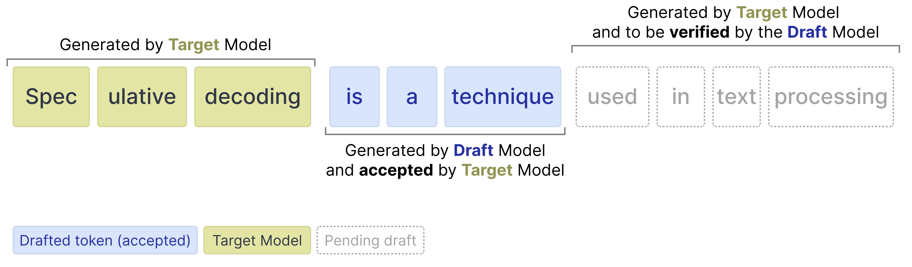
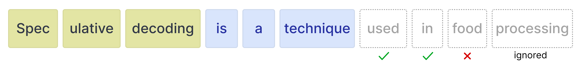
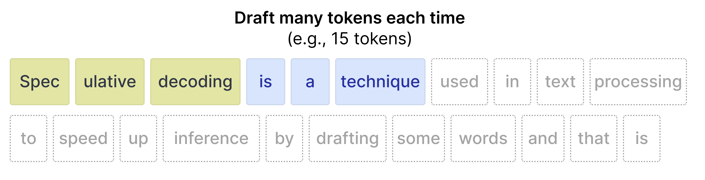
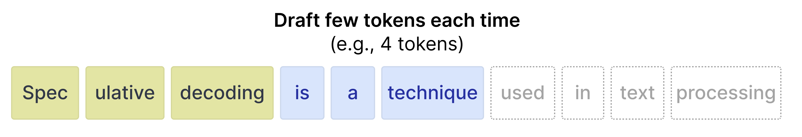

---
tags:
  - SPEC_DECODING
  - MLSYS
url: https://blog.google/innovation-and-ai/technology/developers-tools/multi-token-prediction-gemma-4/
author: Olivier Lacombe, Maarten Grootendorst
site: Google Blog
year: 2026
read: true
---

# Accelerating Gemma 4: faster inference with multi-token prediction drafters

> **Links:** [Blog](https://blog.google/innovation-and-ai/technology/developers-tools/multi-token-prediction-gemma-4/) · [MTP Overview](https://ai.google.dev/gemma/docs/mtp/overview) · [HF Docs](https://ai.google.dev/gemma/docs/mtp/mtp)
> **Tags:** #SPEC_DECODING #MLSYS

---

## Summary

Google released Multi-Token Prediction (MTP) drafter models for all four Gemma 4 variants (E2B, E4B, 26B MoE, 31B Dense) on May 5, 2026. Each drafter is a lightweight companion model that uses speculative decoding to achieve up to 3× faster inference with no change to output quality. The drafter shares the target model's KV cache and embedding table — a tightly coupled accelerator, not a standalone model.

---

## How MTP Speculative Decoding Works

**Drafter proposes, target verifies in one parallel pass.** Yellow = target-generated tokens; blue = drafter-proposed tokens accepted by the target; dashed = drafter proposals still pending verification.

**Accept/reject mechanics.** The target verifies all drafted tokens in a single forward pass. Tokens are accepted left-to-right until the first mismatch; everything after the rejection is discarded. The target always emits one extra token beyond the last accepted draft, so even a fully-rejected step still makes progress.

$$\text{effective TPS} \approx \text{TPS}_\text{target} \times \bar{k}$$

where $\bar{k}$ is the mean number of tokens accepted per draft step.

### Draft-length tradeoff

Drafting more tokens per step increases the *potential* speedup but lowers acceptance rate — late tokens are more likely to be wrong and get discarded as wasted compute. Drafting fewer tokens is safer but caps the speedup.

| Many tokens (e.g. 15) | Few tokens (e.g. 4) |
|---|---|
|  |  |

---

## Drafter Architecture

A small 4-layer transformer, tightly coupled to the target:

- **Shared embeddings** — reuses the target's input embedding table.
- **Activation reuse** — concatenates the target's last-layer activations with token embeddings, then down-projects to the drafter's internal dimension. No separate context encoding.
- **Shared KV cache** — reads directly from the target's KV cache; no redundant prompt attention.
- **Edge clustering (E2B/E4B only)** — groups tokens into clusters in the embedder and restricts logit computation to likely clusters, addressing the logit bottleneck on memory-limited devices.

---

## Performance

| Setup | Speedup |
|---|---|
| Gemma 4 26B (NVIDIA RTX PRO 6000) | ~2× |
| Apple Silicon, batch size 4–8 | ~2.2× |
| General target (any Gemma 4 variant) | up to 3× |

MoE variants (26B A4B) see smaller gains at batch size 1: different tokens activate different expert weights, requiring extra expert weight loads that limit parallelism.

---

## Deployment

One drafter per Gemma 4 variant, all Apache 2.0: E2B, E4B, 26B MoE, 31B Dense.

**Frameworks**: Hugging Face Transformers, MLX (Apple Silicon), vLLM, SGLang, Ollama, LiteRT-LM, Google AI Edge Gallery (Android/iOS).

---

## Related

- [eagle3](../papers/eagle3.md)
- [medusa](../papers/medusa.md)
- [vllm](../papers/vllm.md)
