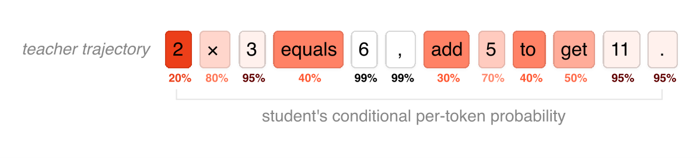
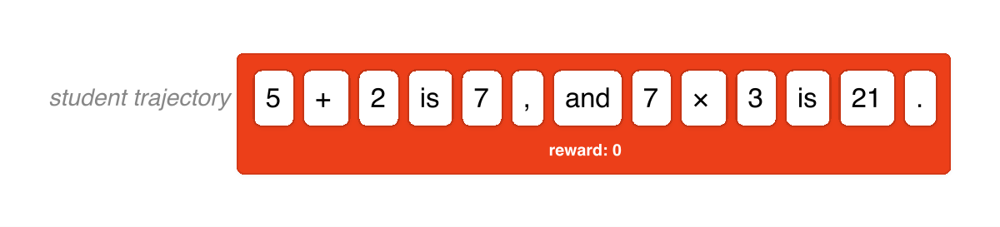
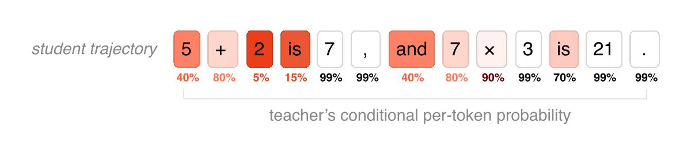
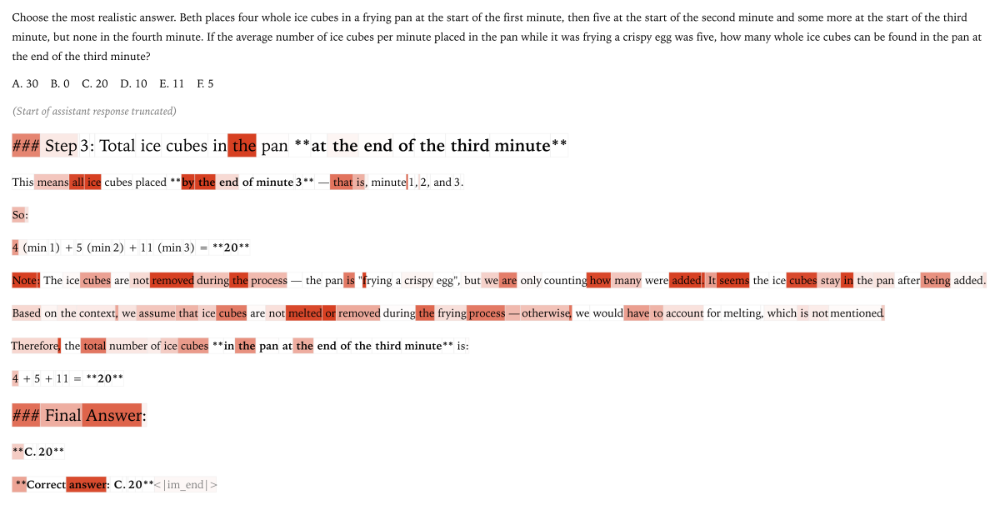

---
tags:
  - RL
  - REASONING
  - NLP
url: https://thinkingmachines.ai/blog/on-policy-distillation/
author: "Kevin Lu"
site: "Thinking Machines"
year: 2025
read: false
---

# On-Policy Distillation

> **Links:** [Blog](https://thinkingmachines.ai/blog/on-policy-distillation/)
> **Tags:** #RL #REASONING #NLP

---

## Summary

On-policy distillation combines the dense token-level supervision of knowledge distillation with the on-policy sampling of RL, achieving better compute efficiency than either approach alone. The student generates its own trajectories; a teacher model scores every token; the per-token reverse KL divergence becomes the per-token advantage for a policy-gradient update. On AIME'24 the method reaches 74.4% accuracy at ~1,800 GPU hours versus 17,920 GPU hours for a comparable RL run — a 9–30x cost reduction.

---

## Key Points

### The Training Landscape

The core idea is that SFT is off-policy with dense reward, RL is on-policy with sparse reward; on-policy distillation captures both desirable axes.

| Method | Sampling | Reward signal |
|---|---|---|
| Supervised fine-tuning (SFT) | Off-policy | Dense |
| Reinforcement learning (RL) | On-policy | Sparse |
| On-policy distillation | On-policy | Dense |

*Off-policy distillation: teacher trajectories fed to student — the student never samples its own rollouts.*

*RL: student generates its own rollouts, but reward is sparse (outcome only).*

*On-policy distillation: student generates its own rollouts, teacher provides dense per-token log-probs as reward.*

---

### Loss Function

Per token $t$ of a student rollout $y_{1:T}$, compute the reverse KL divergence to the teacher:

$$r_t = -D_{\mathrm{KL}}^{\text{rev}}\!\bigl(\pi_{\theta}(\cdot \mid x, y_{<t}) \;\|\; \pi_{\text{teacher}}(\cdot \mid x, y_{<t})\bigr)$$

- $\pi_\theta$ — student policy, parameterized by $\theta$
- $\pi_{\text{teacher}}$ — frozen teacher (larger model)
- $r_t$ — per-token "reward" used as the per-token advantage in a standard policy-gradient update (e.g. GRPO or PPO)

Reverse KL is *mode-seeking*: the student is penalized heavily for putting mass where the teacher has none, preventing the student from ignoring high-probability teacher modes. It also eliminates exposure bias because the student is always scored on its own samples.

*Illustration of reverse vs. forward KL: reverse KL snaps to a single mode of the teacher; forward KL spreads mass to cover all teacher modes. On-policy distillation uses reverse KL.*

---

### Implementation

The method is a one-line change on top of any RL training loop:

1. **Initialize a teacher client** for the larger model (API or local weights).
2. **Sample trajectories** from the student $\pi_\theta$.
3. **Query teacher log-probs** on every token of each student trajectory.
4. **Compute per-token advantages** as the negative reverse KL (above).
5. **Run policy-gradient update** (GRPO / PPO) with those advantages.

No changes to the optimizer, scheduler, or rollout buffer are needed.

---

### Experimental Results

**Mathematical reasoning — AIME'24:**

| Method | AIME'24 accuracy | GPU hours |
|---|---|---|
| Off-policy distillation | 60% | — |
| RL (baseline) | 67.6% | ~17,920 |
| **On-policy distillation** | **74.4%** | **~1,800** |

**Self-distillation (student = teacher at smaller scale):**
- Reproduces an RL-trained policy ~7–10x faster in gradient steps.
- ~50–100x overall computational savings.

---

### Personalization Case Study

When fine-tuning on new internal documents caused instruction-following regression, on-policy distillation with a general-purpose teacher recovered:
- **83% IF-eval score** (instruction following)
- **41% knowledge retention** on the new documents

The dense per-token KL keeps the student anchored to the teacher's general behavior while absorbing new task-specific content.

---

## Notable Quotes / Takeaways

> "On-policy distillation provides O(N) bits per episode versus O(1) for RL — every token is a training signal."

> "The method is a one-line change on top of RL implementations."

---

## Related

- [deepseekr1](../papers/deepseekr1.md)
- [deepcrl](../papers/deepcrl.md)
