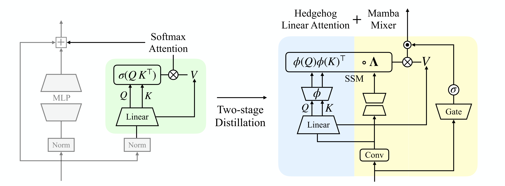

---
tags:
  - NLP
  - DEEP_LEARNING
  - MLSYS
arxiv: https://arxiv.org/abs/2604.14191
github: ""
website: ""
year: 2026
read: false
---

# Attention to Mamba: A Recipe for Cross-Architecture Distillation

> **Links:** [arXiv](https://arxiv.org/abs/2604.14191)
> **Tags:** #NLP #DEEP_LEARNING #MLSYS

---

## Methodology

### Overview

A two-stage distillation recipe (**HedgeMamba**) to transfer a pretrained Transformer (Pythia) into a pure Mamba SSM student without using any hybrid Attention blocks. The key insight is that equipping Mamba with a principled initialization derived from linearized Attention greatly improves cross-architecture knowledge transfer.

### Stage 1 — Softmax Attention to Linear Attention (Hedgehog)

The exponential kernel in softmax Attention is rewritten via Mercer's theorem:

$$e^{\mathbf{x}^\top \mathbf{x}'} = \kappa(\mathbf{x}, \mathbf{x}') = \boldsymbol{\phi}(\mathbf{x})^\top \boldsymbol{\phi}(\mathbf{x}')$$

- $\boldsymbol{\phi}: \mathbb{R}^d \to \mathcal{H}$: feature map approximating the exponential kernel.

A single-layer MLP learns this feature map:

$$\boldsymbol{\phi}_{\texttt{MLP}}(\mathbf{x}) := \sigma(\mathbf{W}\mathbf{x} + \mathbf{b})$$

- $\mathbf{W} \in \mathbb{R}^{d \times d}$, $\mathbf{b} \in \mathbb{R}^d$: learnable weights (trained from scratch in Stage 1).
- $\sigma$: nonlinearity.

**Loss:** cosine embedding matching between each teacher Transformer layer output and the corresponding Hedgehog-linearized student layer output. All parameters except $\boldsymbol{\phi}_{\texttt{MLP}}$ (MLPs, layer norms, embeddings) are frozen.

**Budget:** 1B tokens (10% of total budget), batch size 48, sequence length 1024, ~20K steps.

### Stage 2 — Linear Attention to Mamba (HedgeMamba)

The Hedgehog parameters initialize a Mamba block via the correspondence between Linear Attention and SSMs (setting $\boldsymbol{\Lambda} \equiv \mathbf{I}$):

$$\mathbf{B}(\mathbf{X}) \leftarrow \boldsymbol{\phi}_{\texttt{MLP}}(\mathbf{K}(\mathbf{X})), \quad \mathbf{C}(\mathbf{X}) \leftarrow \boldsymbol{\phi}_{\texttt{MLP}}(\mathbf{Q}(\mathbf{X})), \quad \mathbf{X} \leftarrow \mathbf{V}(\mathbf{X})$$

- $\mathbf{B}, \mathbf{C} \in \mathbb{R}^N$: SSM input/output projection matrices, initialized from Hedgehog K/Q feature maps.
- $\boldsymbol{\Lambda} \in \mathbb{R}^{N \times d}$: SSM causal state-transition matrix, initialized to identity.
- $\mathbf{K}, \mathbf{Q}, \mathbf{V}$: key, query, value linear maps copied from the teacher Attention.
- $N$: SSM hidden state size.

**Attention score normalization:** to mimic the normalization in softmax Attention, a denominator pass is added:

$$\mathbf{Y}_\phi \leftarrow \mathbf{Y}_\phi / \bar{\mathbf{Y}}_\phi, \qquad \bar{\mathbf{Y}}_\phi := \bigl(\boldsymbol{\phi}_{\texttt{MLP}}(\mathbf{Q})\,\boldsymbol{\phi}_{\texttt{MLP}}(\mathbf{K})^\top\bigr)\mathbf{1}$$

Implemented efficiently by concatenating an all-ones column to $\mathbf{V}$ and duplicating $\boldsymbol{\Lambda}$ — one forward pass handles both numerator and denominator.

Additional Mamba components (short input convolution, SiLU gate branch) are initialized to identity and unlocked during fine-tuning.

**Loss:** standard cross-entropy on next-token prediction.
**Budget:** 9B tokens (90% of total), ~180K additional steps. Input/output embedding layers stay frozen.

---

## Experiment Setup

| Item | Details |
|---|---|
| Teacher | Pythia-1B (300B token pretrain on The Pile) |
| Student | HedgeMamba-1B (~1,087M params) |
| Distillation data | OpenWebText (~9B tokens) |
| Total distillation budget | 10B tokens (~2.7% of teacher's token count) |
| Stage 1 / Stage 2 split | 10% / 90% (optimal; Hedgehog paper used 50/50) |
| Stage 1 objective | Cosine embedding matching; only $\boldsymbol{\phi}_{\texttt{MLP}}$ trained |
| Stage 2 objective | Cross-entropy; all layers unfrozen except embeddings |
| Tokenizer | GPT-NeoX (same as Pythia and Mamba) |
| Hardware | 8xA100 (~12d 9h for 10B tokens at 1B scale) |
| Evaluation | lm-eval-harness downstream tasks + validation perplexity |

---

## Results

### Main Results (1B models, 10B distillation tokens)

| Model | PPL | Arc-C | Arc-E | SIQA | PiQA | Lambada | BoolQ | RACE | LogiQA | WinoG | HSwag |
|---|---|---|---|---|---|---|---|---|---|---|---|
| Pythia (Teacher) | 13.86 | 27.04 | 56.98 | 39.86 | 70.72 | 42.07 | 60.82 | 32.92 | 22.12 | 53.43 | 47.16 |
| Hedgehog (Baseline) | 14.89 | 26.45 | 52.74 | 38.38 | 68.01 | 30.60 | 54.80 | 30.43 | 21.65 | 50.91 | 40.79 |
| **HedgeMamba (Ours)** | **14.11** | 27.13 | 53.66 | 39.76 | 68.72 | 32.31 | 55.20 | 30.91 | 20.89 | 52.17 | 41.87 |

*PPL = validation perplexity (lower is better; arrows omitted for brevity). Arc-C = ARC-Challenge; Arc-E = ARC-Easy; SIQA = Social IQA; WinoG = WinoGrande; HSwag = HellaSwag. Arc-C and HSwag use accuracy normalized by sequence length; all other columns use raw accuracy.*

### Ablation: Mamba Component Contributions (1B, 10B tokens, 50/50 S1/S2 split)

| Mixer | #Params | PPL | Arc-C | Arc-E | SIQA | PiQA | Lambada | BoolQ | RACE | LogiQA | WinoG | HSwag |
|---|---|---|---|---|---|---|---|---|---|---|---|---|
| Hedgehog | 1,014M | 14.89 | 26.45 | 52.74 | 38.38 | 68.01 | 30.60 | 54.80 | 30.43 | 21.66 | 50.91 | 40.79 |
| +SSM | 1,020M | 14.89 | 26.54 | 52.90 | 38.02 | 68.23 | 31.24 | 55.63 | 30.05 | 22.73 | 51.38 | 40.77 |
| +SSM +Conv | 1,020M | 14.89 | 26.62 | 52.74 | 38.28 | 68.93 | 31.63 | 55.84 | 30.14 | 22.43 | 51.78 | 40.74 |
| **+SSM +Conv +Gate (HedgeMamba)** | **1,087M** | **14.58** | 26.19 | 53.11 | 39.56 | 68.77 | 32.16 | 57.61 | 31.00 | 24.42 | 50.99 | 41.81 |

*+SSM: adds learnable causal mask $\boldsymbol{\Lambda}$ and projection matrices $\mathbf{B}, \mathbf{C}$ on top of Hedgehog. +Conv: adds short depthwise convolution at input. +Gate: adds SiLU gating branch — the largest single contributor to PPL improvement.*

### Sensitivity: Stage 1 / Stage 2 Token Split (HedgeMamba, 10B total)

| S1 / S2 (%) | PPL | Arc-C | Arc-E | SIQA | PiQA | Lambada | BoolQ | RACE | LogiQA | WinoG | HSwag |
|---|---|---|---|---|---|---|---|---|---|---|---|
| 100 / 0 (no FT) | 25.71 | 25.85 | 48.70 | 36.34 | 66.49 | 12.12 | 61.47 | 27.27 | 20.58 | 50.83 | 26.14 |
| 90 / 10 | 16.15 | 25.00 | 52.06 | 38.69 | 68.93 | 28.08 | 56.15 | 30.24 | 22.43 | 51.14 | 39.69 |
| 75 / 25 | 15.18 | 26.71 | 52.31 | 38.59 | 69.26 | 30.66 | 60.61 | 30.24 | 20.58 | 49.96 | 41.02 |
| 50 / 50 | 14.58 | 26.19 | 53.11 | 39.56 | 68.77 | 32.16 | 57.61 | 31.00 | 24.42 | 50.99 | 41.81 |
| 25 / 75 | 14.25 | 26.19 | 53.91 | 39.71 | 68.93 | 31.90 | 55.41 | 30.81 | 21.35 | 51.30 | 41.59 |
| **10 / 90 (default)** | **14.11** | 27.13 | 53.66 | 39.76 | 68.72 | 32.31 | 55.20 | 30.91 | 20.89 | 52.17 | 41.87 |
| 0 / 100 (no S1) | 17.08 | 26.11 | 50.67 | 37.31 | 67.03 | 27.61 | 54.01 | 30.33 | 21.35 | 50.51 | 40.25 |

*S1 = Stage 1 (Hedgehog feature map learning). S2 = Stage 2 (full HedgeMamba fine-tuning). Both stages are needed: 100/0 (no fine-tune) gives PPL 25.71; 0/100 (naive fine-tune without principled init) gives PPL 17.08 vs. default 14.11.*

### Scaling: Distillation Token Budget (HedgeMamba, 10/90 split)

| Token Budget | PPL | Arc-C | Arc-E | SIQA | PiQA | Lambada | BoolQ | RACE | LogiQA | WinoG | HSwag |
|---|---|---|---|---|---|---|---|---|---|---|---|
| 1B | 16.56 | 26.19 | 52.27 | 38.74 | 67.68 | 27.32 | 57.49 | 29.76 | 20.43 | 52.25 | 40.67 |
| 2B | 15.61 | 25.94 | 51.05 | 38.79 | 69.04 | 29.30 | 56.45 | 29.57 | 23.04 | 51.85 | 40.29 |
| 3B | 15.15 | 25.09 | 52.69 | 38.43 | 69.10 | 30.56 | 56.57 | 29.28 | 23.04 | 51.93 | 41.03 |
| **10B** | **14.11** | 27.13 | 53.66 | 39.76 | 68.72 | 32.31 | 55.20 | 30.91 | 20.89 | 52.17 | 41.87 |

*Performance improves monotonically with token budget; not yet saturated at 10B tokens.*

---

## Related Papers

- [mamba](mamba.md)
- [ssd](ssd.md)
