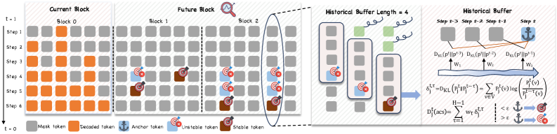

---
tags:
  - DLM
  - SPEC_DECODING
arxiv: https://arxiv.org/abs/2604.08964v1
github: https://github.com/zs1314/AHD
website: ""
year: 2026
read: false
---

# Breaking Block Boundaries: Anchor-based History-stable Decoding for Diffusion Large Language Models

> **Links:** [arXiv](https://arxiv.org/abs/2604.08964v1) | [GitHub](https://github.com/zs1314/AHD)
> **Tags:** #DLM #SPEC_DECODING

---

## Methodology

### Background: Semi-Autoregressive Decoding in DLMs

Diffusion LLMs (e.g., LLaDA) decode using **semi-autoregressive (Semi-AR)** blocks: the output sequence is partitioned into blocks of length $B$ (default 32 tokens) and decoded left-to-right. Within each block, $T$ diffusion steps unmask tokens. The block boundary constraint forces full completion of block $k$ before block $k{+}1$ can begin, preventing tokens that have already converged within a block from contributing to subsequent blocks early.

### Key Observations

1. **Block-boundary delay**: Many tokens stabilize their predictions well before the block's final unmasking step. Empirically, stable tokens cluster at the beginning of the scheduled unmasking window, meaning there is an avoidable delay.
2. **Local fluctuation vs. absolute stability**: Single-step confidence metrics are noisy (local fluctuations persist even after true convergence). A trajectory-level view — comparing current predictions to a historical window — reliably detects convergence.

### AHD Algorithm (Training-Free)

AHD designates the current prediction as a **dynamic anchor** and measures stability by comparing it against a historical buffer of length $H$.

**Anchored Consistency Score:**

$$D^{t,\text{acs}}_j = \sum_{\tau=1}^{H-1} w_\tau \cdot D_{\mathrm{KL}}\!\left(P^t_j \,\|\, P^{t-\tau}_j\right)$$

$$w_\tau = \frac{e^{-\lambda\tau}}{Z}, \quad Z = \sum_{\tau=1}^{H-1} e^{-\lambda\tau}$$

- $P^t_j$: predicted token distribution for position $j$ at diffusion step $t$
- $P^{t-\tau}_j$: predicted distribution $\tau$ steps prior (from the historical buffer)
- $D_{\mathrm{KL}}(\cdot \| \cdot)$: KL divergence acting as a distance between distributions
- $w_\tau$: exponential decay weight, favouring recent history; $\lambda > 0$ controls the decay rate; $Z$ is the normalisation constant
- $H$: history buffer length (default 6); $\tau$ ranges over $[1, H{-}1]$

**Early Unlock Decision:** Token $j$ is released for cross-block decoding when:

$$D^{t,\text{acs}}_j < \varepsilon$$

- $\varepsilon$: stability threshold (default 0.01; task-specific values below)

### Decoding Procedure

1. Run standard diffusion denoising within the current block.
2. At each step $t$, compute $D^{t,\text{acs}}_j$ for all unmasked positions $j$.
3. Tokens satisfying $D^{t,\text{acs}}_j < \varepsilon$ are frozen and immediately propagated as context to subsequent blocks (cross-block unlock).
4. Continue until all tokens in the current block are stable or the block's $T$ steps are exhausted; then advance to the next block.

The method is **training-free and plug-and-play** — no model retraining required.

---

## Experiment Setup

**Models:** LLaDA-8B-Instruct, LLaDA-1.5, MMaDA-8B-MixCoT (vision-language), DIFFA (audio-language)

**Baselines:** Vanilla Semi-AR; Fast-dLLM (fixed confidence threshold + KV cache); KLASS (adjacent-step KL divergence only); Saber (adaptive parallel size + backtracking re-masking)

**Default hyperparameters:** $\varepsilon = 0.01$, $H = 6$

**Task-specific threshold overrides:** HumanEval $\varepsilon=0.02$; Math $\varepsilon=0.001$; BBH $\varepsilon=0.05$

**Generation config:** length 256, block size 32 (8 blocks), $T=256$ vanilla steps

---

## Results

### Main Results — LLaDA-8B-Instruct

| Benchmark | Vanilla | Fast-dLLM | KLASS | Saber | **AHD** | Vanilla Steps | **AHD Steps** | Reduction |
|-----------|:---:|:---:|:---:|:---:|:---:|:---:|:---:|:---:|
| HumanEval | 40.85 | 41.46 | 40.85 | 36.59 | **43.29** | 256 | **77.24** | −70% |
| MBPP | 29.20 | 29.40 | 29.20 | 26.00 | **31.20** | 256 | **66.03** | −74% |
| BBH | 53.11 | 53.17 | 53.03 | 52.88 | **56.78** | 256 | **51.48** | −80% |
| MMLU-Pro | 35.57 | — | — | — | **37.42** | 256 | **133.06** | −48% |
| TruthfulQA | 40.39 | — | — | — | **41.49** | 256 | **52.91** | −79% |
| MATH | 33.50 | — | — | — | **33.62** | 256 | **88.50** | −65% |
| ASDiv | 75.57 | — | — | — | **77.09** | 256 | **61.58** | −76% |

*Score columns: higher is better. Steps columns: lower is better. "—" = not reported for that baseline.*

### Main Results — LLaDA-1.5

| Benchmark | Vanilla | Fast-dLLM | KLASS | Saber | **AHD** | Vanilla Steps | **AHD Steps** |
|-----------|:---:|:---:|:---:|:---:|:---:|:---:|:---:|
| HumanEval | 42.68 | 43.29 | 43.29 | 42.07 | **43.90** | 256 | **75.85** |
| BBH | 50.35 | 49.85 | 50.28 | 50.02 | **51.90** | 256 | **56.00** |

### Multimodal Results — MMaDA-8B

| Task | Baseline | **AHD** | Speedup |
|------|:---:|:---:|:---:|
| MathVista-mini | 32.90 | **36.00** | 2.37× |
| ScienceQA | 48.88 | **49.93** | 2.70× |
| GQA | 50.52 | **50.58** | 16.40× |

*Speedup = vanilla steps / AHD steps (higher is better). Score: higher is better.*

### Audio Results — DIFFA

| Task | DIFFA Baseline | **AHD** | Step Reduction |
|------|:---:|:---:|:---:|
| OpenBookQA | 36.50 | **38.50** | −78% |
| BBH | 53.00 | **54.30** | −56% |

### Ablations

| Variable | Value | BBH Score | BBH Steps |
|----------|-------|:---------:|:---------:|
| History length $H$ | 2 | 55.92 | 50.86 |
| | 4 | 56.46 | 50.89 |
| | **6** (default) | **56.78** | **51.48** |
| | 8 | 56.60 | 51.86 |
| Threshold $\varepsilon$ | 0.001 | 53.28 | 73.46 |
| | 0.01 | 55.16 | 59.58 |
| | **0.05** (BBH default) | **56.78** | **51.48** |
| | 0.1 | 55.26 | 50.86 |

*Larger $H$ improves accuracy up to $H=6$ then plateaus; larger $\varepsilon$ reduces steps aggressively but too large degrades accuracy.*

---

## Related Papers

- [llada20](llada20.md)
- [llada21](llada21.md)
- [rcd](rcd.md)
- [wino](wino.md)
- [sdar](sdar.md)
