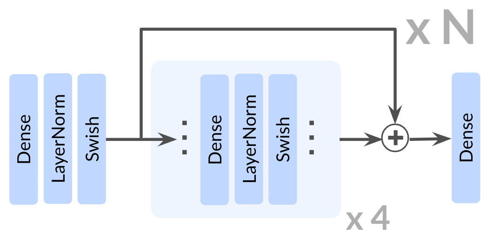

# 1000 Layer Networks for Self-Supervised RL: Scaling Depth Can Enable New Goal-Reaching Capabilities

> **Links:** [arXiv](https://arxiv.org/abs/2503.14858) | [GitHub](https://github.com/wang-kevin3290/scaling-crl) | [Website](https://wang-kevin3290.github.io/scaling-crl/)
> **Tags:** #RL #DEEP_LEARNING

---

## Methodology

The paper shows that scaling network **depth** (up to 1024 layers) in **Contrastive RL (CRL)** substantially improves goal-conditioned performance, while the same scaling applied to temporal-difference methods (SAC, TD3+HER) yields zero or negative gains.

### Contrastive RL Objective

The critic is trained with an InfoNCE (contrastive cross-entropy) loss over a replay buffer $\mathcal{B}$:

$$\min_{\phi,\psi}\;\mathbb{E}_{\mathcal{B}}\!\left[-\sum_{i=1}^{|\mathcal{B}|}\log\frac{e^{f_{\phi,\psi}(s_i,a_i,g_i)}}{\sum_{j=1}^{K}e^{f_{\phi,\psi}(s_i,a_i,g_j)}}\right]$$

where $f_{\phi,\psi}(s,a,g) = -\|\phi(s,a) - \psi(g)\|_2$ (negative $L_2$ distance between state-action embedding and goal embedding). The actor maximizes the critic:

$$\max_{\pi_\theta}\;\mathbb{E}\!\left[f_{\phi,\psi}(s, \pi_\theta(s), g)\right]$$

Reward is sparse: $r = 1$ only when the agent reaches goal proximity. Hindsight Experience Replay (HER) relabels goals in the replay buffer to increase signal density.

### Residual Block Architecture

Each block: **Dense → LayerNorm → Swish → residual add**.

- Hidden width: 256 (fixed across all depth experiments)
- Network depth swept: 4, 8, 16, 32, 64, 256, 1024 layers
- Critical depth thresholds emerge per environment (e.g., depth 8 for Ant Big Maze, depth 64 for Humanoid U-Maze), with performance jumping qualitatively rather than gradually

### Why Depth Beats Width

Depth 8 (width 256) outperforms depth 4 (width 2048) across all tested environments with comparable or fewer parameters. The authors hypothesize two mechanisms: **expressivity** (richer representations from deeper networks) and **implicit exploration** (more varied policies early in training). These are disentangled via a shared-replay-buffer experiment where the shallower network trains on trajectories collected by the deep network, isolating the expressivity component.

### Algorithm Specificity

Depth scaling is CRL-specific. Temporal-difference methods (SAC, SAC+HER, TD3+HER) saturate at depth 4 — no improvement from deeper networks across all 10 environments.

---

## Experiment Setup

**Benchmark:** JaxGCRL (Brax / MJX physics):

| Environment Group | Tasks |
|---|---|
| Locomotion | Ant Big Maze, Ant U-Maze variants |
| Humanoid | Humanoid U-Maze (U4, U5) |
| Manipulation | Arm Push Easy, Arm Push Hard |

10 total environments. Success metric: fraction of timesteps within goal proximity (out of 1000), averaged over last 5 training epochs.

**Baselines:** GCBC, GCSL, SAC, SAC+HER, TD3+HER, CRL (depth 4).

**Key hyperparameters:**
- Residual block: 4 units
- Hidden dim: 256 (depth ablations); width swept to 2048 (width ablations)
- Framework: JAX (JaxGCRL); online RL with replay buffer + HER

---

## Results

### Depth Scaling vs. Baselines

Results reported as learning curves. Improvements over the depth-4 CRL baseline:

| Environment | Critical Depth | Peak Improvement |
|---|---|---|
| Ant Big Maze | 8 | ~8× |
| Humanoid U-Maze | 64 | ~50× |
| Humanoid U5-Maze | 64 | ~20× |
| Arm Push Easy | 16–64 | 2–5× |

Scaled CRL outperforms all baselines in **8 out of 10** tasks.

### Ablations

**Width vs. Depth:**

| Config | Ant Big Maze | Arm Push Easy | Humanoid |
|---|---|---|---|
| Depth 4, Width 2048 | Lower | Lower | Lower |
| Depth 8, Width 256 | Higher | Higher | Higher |

**Actor vs. Critic Scaling:**

| Environment | Critic-only | Actor-only | Both |
|---|---|---|---|
| Arm Push Easy | Best | Moderate | Good |
| Ant Big Maze | Moderate | Best | Good |
| Humanoid | Poor | Poor | Best |

**Batch size × depth:** Depth-4 networks show marginal batch-size benefit; depth-64 networks unlock further gains from larger batches.

**Offline RL:** Depth scaling does not improve CRL on OGBench (offline goal-conditioned benchmark); gains appear specific to the online setting.
