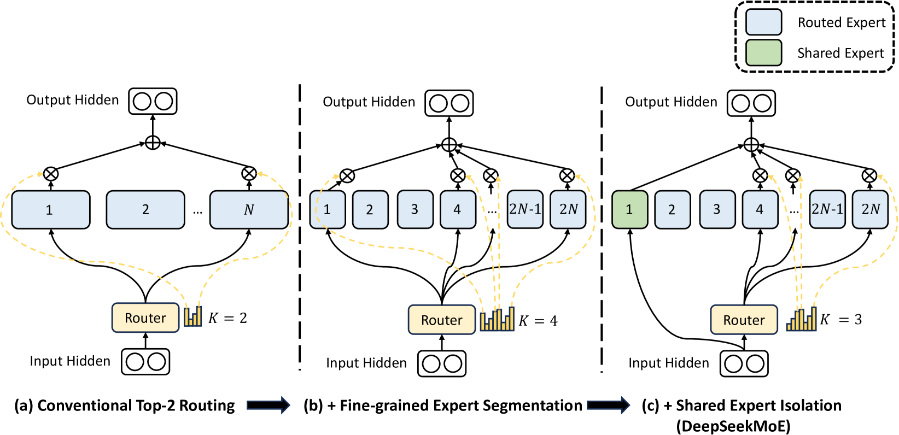

---
tags:
  - NLP
  - MLSYS
  - DEEP_LEARNING
arxiv: https://arxiv.org/abs/2401.06066
github: ""
website: ""
year: 2024
read: false
---

# DeepSeekMoE: Towards Ultimate Expert Specialization in Mixture-of-Experts Language Models

> **Links:** [arXiv](https://arxiv.org/abs/2401.06066)
> **Tags:** #NLP #MLSYS #DEEP_LEARNING

---

## Methodology

DeepSeekMoE introduces two complementary strategies on top of standard top-K MoE FFN layers:

### 1. Fine-Grained Expert Segmentation

Each expert's FFN intermediate dimension is shrunk to $\frac{1}{m}$ of the standard size, and $m$ times more experts are created. The activation count scales proportionally from $K$ to $mK$, keeping total computation constant. This dramatically increases the combinatorial space of possible expert combinations, from $\binom{N}{K}$ to $\binom{mN}{mK}$.

$$h_t^l = \sum_{i=1}^{K_s} \mathrm{FFN}_i(u_t^l) + \sum_{i=K_s+1}^{mN} g_{i,t} \cdot \mathrm{FFN}_i(u_t^l) + u_t^l$$

$$g_{i,t} = \begin{cases} s_{i,t} & \text{if } s_{i,t} \in \mathrm{Top\text{-}K}\!\left(\{s_{j,t}\}_{j=K_s+1}^{mN},\ mK - K_s\right) \\ 0 & \text{otherwise} \end{cases}$$

$$s_{i,t} = \mathrm{Softmax}_i\!\left(u_t^{l\top} e_i\right)$$

- $u_t^l$: hidden state of token $t$ at layer $l$, $\in \mathbb{R}^d$.
- $h_t^l$: output hidden state of the MoE layer.
- $K_s$: number of always-active shared experts.
- $mN$: total fine-grained experts ($N$ standard experts each split into $m$ smaller ones).
- $mK - K_s$: number of routed experts activated per token.
- $g_{i,t}$: gating weight for expert $i$, token $t$; zero if not selected.
- $s_{i,t}$: token-expert affinity score via softmax over dot-products with expert embeddings $e_i \in \mathbb{R}^d$.

### 2. Shared Expert Isolation

$K_s$ experts are designated as always-active **shared experts** that absorb universal knowledge. The remaining $mN - K_s$ experts are **routed experts** forced to specialize, reducing redundancy across routed experts.

### Load Balancing Losses

**Expert-level balance loss:**

$$\mathcal{L}_\text{ExpBal} = \alpha_1 \sum_{i=1}^{N'} f_i \cdot P_i$$

- $N' = mN - K_s$: number of routed experts.
- $f_i$: fraction of tokens routed to expert $i$ in the batch.
- $P_i$: mean gating probability for expert $i$ across the batch.
- $\alpha_1 = 0.001$.

**Device-level balance loss** (ensures uniform GPU utilization):

$$\mathcal{L}_\text{DevBal} = \alpha_2 \sum_{j=1}^{D} f_j' \cdot P_j'$$

- $D$: number of devices; $f_j', P_j'$: device-level analogs of $f_i, P_i$.
- $\alpha_2 = 0.01$.

---

## Experiment Setup

**DeepSeekMoE 16B architecture:**

| Hyperparameter | Value |
|---|---|
| Transformer layers | 28 |
| Hidden dimension $d$ | 2048 |
| Attention heads | 16 (128-dim each) |
| Total experts | 64 routed + 2 shared |
| Expert FFN size | 1/4 standard |
| Activated per token | 6 routed + 2 shared |
| Total parameters | 16.4B |
| Activated parameters | 2.8B |
| FLOPs per 4K tokens | 74.4T |

**Training (16B pretraining):**
- Optimizer: AdamW ($\beta_1 = 0.9$, $\beta_2 = 0.95$, weight decay $= 0.1$)
- Learning rate: $4.2 \times 10^{-4}$ with warmup + step-decay schedule
- Batch size: 4500 sequences $\times$ 4096 tokens = 18M tokens/step
- Training tokens: 2T (106,449 steps)

**SFT (Chat model):**
- 1.4M bilingual (EN/ZH) examples; 8 epochs; batch size 1024; max length 4096; constant LR $10^{-5}$

**Baselines:** Dense 0.2B, Switch Transformer (top-1), GShard (top-2), DeepSeek 7B dense, LLaMA2 7B.

---

## Results

### DeepSeekMoE 2B vs. Baselines (100B tokens)

| Model | Act. Params | Pile Loss | HellaSwag | ARC-Challenge | TriviaQA (EM) |
|---|---|---|---|---|---|
| Dense 0.2B | 0.2B | 2.060 | 38.8 | 26.0 | 4.9 |
| Switch | ~0.3B | 1.881 | 49.1 | 30.2 | 8.9 |
| GShard | ~0.3B | 1.867 | 50.5 | 31.6 | 10.2 |
| DeepSeekMoE 2B | ~0.3B | **1.808** | **54.8** | **34.3** | **16.6** |
| Dense×16 (upper bound) | 3.2B | 1.806 | 54.9 | 34.6 | 16.9 |

*Dense×16: a 3.2B dense model trained identically, serving as the theoretical upper bound. DeepSeekMoE 2B achieves near-identical performance while activating only ~10% of Dense×16's parameters.*

### DeepSeekMoE 16B vs. Dense Baselines (2T tokens)

| Model | Act. Params | FLOPs/4K tokens | Pile (BPB) | HumanEval | MBPP | TriviaQA |
|---|---|---|---|---|---|---|
| DeepSeek 7B (dense) | 6.9B | 183.5T | 0.75 | 26.2 | 37.4 | 59.7 |
| DeepSeekMoE 16B | 2.8B | 74.4T (40.5%) | **0.74** | **26.8** | **39.2** | **64.8** |

### DeepSeekMoE 16B vs. LLaMA2 7B (selected benchmarks)

| Benchmark | LLaMA2 7B | DeepSeekMoE 16B |
|---|---|---|
| GSM8K | 15.5 | **18.8** |
| HumanEval | 14.6 | **26.8** |
| MBPP | 21.8 | **39.2** |
| CMMLU | 32.6 | **42.5** |
| C-Eval | 33.9 | **40.6** |
| Compute (relative FLOPs) | 100% | ~39.6% |

*DeepSeekMoE 16B matches or exceeds LLaMA2 7B on 18 of 24 benchmarks using ~40% of the FLOPs.*

### Ablations

**Strategy contribution (2B scale, Pile loss):**

| Configuration | Pile Loss |
|---|---|
| GShard baseline | 1.867 |
| + Fine-grained segmentation only | 1.830 |
| + Shared expert isolation only | 1.845 |
| DeepSeekMoE (both strategies) | **1.808** |

**Progressive fine-grained segmentation:**

| Expert config | Pile Loss |
|---|---|
| top-2 of 16 (GShard) | 1.867 |
| top-4 of 32 | 1.842 |
| top-8 of 64 | 1.830 |

**Shared expert criticality:**

| Setting | Pile Loss |
|---|---|
| DeepSeekMoE (1 shared + 6 routed) | 1.808 |
| No shared expert (0 shared + 7 routed) | 2.414 |

*Replacing the shared expert with a routed one causes catastrophic degradation, confirming the shared expert captures irreplaceable universal knowledge.*

---

## Related Papers

- [moe](moe.md)
- [switch](switch.md)
- [dsv3](dsv3.md)
