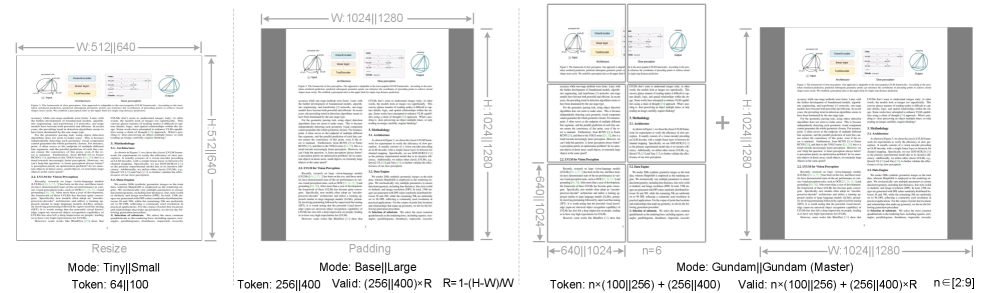

---
tags:
  - VISION
  - MLSYS
  - NLP
arxiv: https://arxiv.org/abs/2510.18234
github: https://github.com/deepseek-ai/DeepSeek-OCR
website: ""
year: 2025
read: false
---

# DeepSeek-OCR: Contexts Optical Compression

> **Links:** [arXiv](https://arxiv.org/abs/2510.18234) | [GitHub](https://github.com/deepseek-ai/DeepSeek-OCR)
> **Tags:** #VISION #MLSYS #NLP

---

## Methodology

DeepSeek-OCR is an OCR-focused vision-language model that investigates the feasibility of compressing long textual contexts via optical 2D mapping. The core question: **how many vision tokens are needed to faithfully decode text from a document image?**

### DeepEncoder Architecture

The encoder is a three-stage cascade:

1. **SAM-base** (80M params, patch size 16): Window-attention transformer. Processes high-resolution input locally. For a $1024 \times 1024$ input, produces 4096 patch tokens.

2. **Convolutional Compressor** (2-layer): Reduces token count by $16\times$. Each layer: kernel 3, stride 2, padding 1; channels $256 \to 1024$. Output: 256 tokens from 4096.

3. **CLIP-large** (300M params): Dense global-attention transformer. First patch-embedding layer removed; receives compressed tokens from the compressor instead of raw pixels.

**Decoder:** DeepSeek-3B-MoE (64 experts, 570M activated params). Standard autoregressive text generation.

### Resolution / Compression Modes

| Mode | Input Resolution | Vision Tokens | Notes |
|------|-----------------|---------------|-------|
| Tiny | $512 \times 512$ | 64 | ~20x compression at 1200+ text tokens |
| Small | $640 \times 640$ | 100 | ~10x at 1000 text tokens |
| Base | $1024 \times 1024$ | 256 (182 valid) | <10x for typical pages |
| Gundam | Tiled local + global | 795-1,853 | lowest compression |

*"Valid tokens" excludes padding regions; Gundam dynamically tiles the image into 2-9 local patches ($640 \times 640$, 100 tokens each) plus a global view ($1280 \times 1280$, 256 tokens).*

### Training: Two-Stage Pipeline

**Stage 1 — DeepEncoder Pretraining**
- Objective: autoregressive next-token prediction (OCR text)
- Data: 38M OCR pages (OCR 1.0 + OCR 2.0) + 100M LAION samples
- Optimizer: AdamW, LR $5 \times 10^{-5}$, cosine annealing
- Batch size 1,280; sequence length 4,096; 2 epochs

**Stage 2 — Full Model Training**
- Frozen: SAM + convolutional compressor; Trainable: CLIP layer + full decoder
- Decoder: 12 layers of DeepSeek-3B-MoE
- Data mixture: 70% OCR, 20% general vision, 10% text-only
- Hardware: 20 nodes x 8x A100-40G; global batch size 640
- LR: $3 \times 10^{-5}$, step-based schedule; throughput: 70B tokens/day

---

## Experiment Setup

- **Fox benchmark**: 688 English document pages; evaluates character-level OCR precision across compression ratios
- **OmniDocBench**: Chinese/English multi-category document benchmark; metric is edit distance (lower = better)
- **Baselines**: GOT-OCR2.0, MinerU2.0, dots.ocr, Nougat, Qwen2.5-VL, InternVL2.5

---

## Results

### Compression Ratio vs. Precision (Fox Benchmark)

*Compression ratio = (# text tokens) / (# vision tokens). Precision measured on character-level OCR.*

| Text Token Range | 64 Vision Tokens | 100 Vision Tokens |
|------------------|-----------------|------------------|
| 600-700 | 96.5% | 98.5% |
| 700-800 | 93.8% | 97.3% |
| 800-900 | 83.8% | 96.8% |
| 900-1000 | 85.9% | 96.8% |
| 1000-1100 | 79.3% | 91.5% |
| 1100-1200 | 76.4% | 89.8% |
| 1200-1300 | 59.1% | 87.1% |

At $<10\times$ compression (text tokens $< 10 \times$ vision tokens), precision $\approx 97\%$; at $\approx 20\times$, precision $\approx 60\%$.

### OmniDocBench (Table 3)

*Edit distance (lower = better). EN = English overall, ZH = Chinese overall. Gundam-M = Gundam Master mode.*

| Model | Vision Tokens/Page | EN Overall | ZH Overall |
|-------|--------------------|------------|------------|
| **DeepSeek-OCR (Gundam-M)** | 1,853 | **0.123** | **0.157** |
| dots.ocr (200 dpi) | 5,545 | 0.125 | 0.160 |
| **DeepSeek-OCR (Gundam)** | 795 | 0.127 | 0.181 |
| MinerU2.0 | 6,790 | 0.133 | 0.238 |
| **DeepSeek-OCR (Base)** | 256 (182 valid) | 0.137 | 0.240 |
| **DeepSeek-OCR (Small)** | 100 | 0.221 | 0.284 |
| GOT-OCR2.0 | 256 | 0.287 | 0.411 |
| Nougat | 2,352 | 0.452 | — |

### Category Breakdown (Table 4, edit distance, lower = better)

| Document Category | Tiny (64) | Small (100) | Base (256) | Gundam (795) |
|-------------------|-----------|-------------|------------|--------------|
| Slides | 0.116 | 0.111 | 0.080 | 0.085 |
| Books | 0.147 | 0.085 | 0.037 | 0.035 |
| Financial reports | 0.207 | 0.079 | 0.027 | 0.289 |
| Newspapers | 0.940 | 0.744 | 0.645 | 0.122 |

*Financial reports degrade in Gundam mode due to multi-column layout sensitivity to dynamic tiling.*

### Production Throughput

Single A100-40G: **200k+ pages/day** in Small/Base modes.

---
