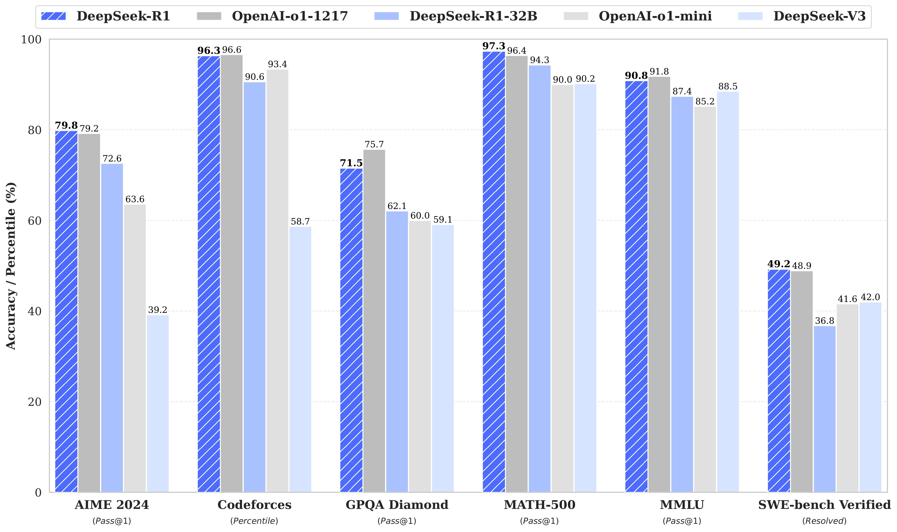

---
tags:
  - RL
  - REASONING
  - NLP
arxiv: "https://arxiv.org/abs/2501.12948"
github: "https://github.com/deepseek-ai/DeepSeek-R1"
website: ""
year: 2025
read: false
---

# DeepSeek-R1: Incentivizing Reasoning Capability in LLMs via Reinforcement Learning

> **Links:** [arXiv](https://arxiv.org/abs/2501.12948) | [GitHub](https://github.com/deepseek-ai/DeepSeek-R1)
> **Tags:** #RL #REASONING #NLP

---

## Methodology

### Overview

DeepSeek-R1 shows that strong chain-of-thought reasoning can emerge from pure reinforcement learning on a capable base LLM, without requiring human-annotated reasoning trajectories. Two models are introduced:

- **DeepSeek-R1-Zero**: Base model (DeepSeek-V3-Base, 671B MoE, 37B activated) trained with RL only — no supervised cold start.
- **DeepSeek-R1**: Full pipeline with a cold-start SFT stage before RL, plus rejection-sampling and a second RL phase.

### RL Algorithm: Group Relative Policy Optimization (GRPO)

For each prompt $q$, GRPO samples a group of $G$ outputs $\{o_1, \ldots, o_G\}$ from the old policy $\pi_{\theta_{\text{old}}}$ and optimizes:

$$\mathcal{J}_{\text{GRPO}}(\theta) = \mathbb{E}_{q, \{o_i\}} \left[ \frac{1}{G} \sum_{i=1}^{G} \min\!\left(\frac{\pi_\theta(o_i|q)}{\pi_{\theta_{\text{old}}}(o_i|q)} A_i,\; \text{clip}\!\left(\frac{\pi_\theta(o_i|q)}{\pi_{\theta_{\text{old}}}(o_i|q)}, 1\!-\!\epsilon, 1\!+\!\epsilon\right) A_i\right) - \beta\, D_{\mathrm{KL}}(\pi_\theta \| \pi_{\mathrm{ref}}) \right]$$

- $\pi_\theta$: current policy being optimized.
- $\pi_{\theta_{\text{old}}}$: policy used to sample outputs (frozen per update step).
- $\pi_{\mathrm{ref}}$: reference (initial) policy for KL regularization.
- $A_i$: group-normalized advantage for output $o_i$, computed as $A_i = (r_i - \bar{r}) / \sigma_r$ where $r_i$ is the scalar reward, $\bar{r}$ and $\sigma_r$ are the group mean and std.
- $\epsilon$: PPO clip ratio (controls policy update step size).
- $\beta$: KL penalty coefficient (keeps policy near reference).
- GRPO removes the value/critic network entirely; the group baseline replaces it.

### Reward Design (Rule-Based, No Reward Model for Core RL)

| Reward Type | Signal |
|---|---|
| Accuracy reward | +1 if answer matches ground truth (exact match for math; sandboxed execution for code) |
| Format reward | +1 if model wraps reasoning in `<think>...</think>` and answer in `<answer>...</answer>` |
| Language consistency penalty | Negative reward if reasoning switches language mid-response |

No neural reward model is used during the reasoning-oriented RL phase. A reward model is added only in the final general-scenario RL stage.

### DeepSeek-R1 Training Pipeline (Four Stages)

1. **Cold-start SFT** — Fine-tune DeepSeek-V3-Base on a few thousand long-CoT examples collected from DeepSeek-R1-Zero with a human-readable format (natural language reasoning, no raw `<think>` artifacts). Stabilizes the subsequent RL.

2. **Reasoning-oriented RL** — Apply GRPO on math, code, and STEM prompts using the rule-based rewards above. Emergent behaviors (self-verification, backtracking) appear naturally.

3. **Rejection-sampling SFT** — Sample 600k reasoning trajectories from the RL checkpoint, filter by correctness, and combine with 200k general-domain examples (writing, QA, translation) from DeepSeek-V3 SFT data. Fine-tune the RL checkpoint on this 800k mixture.

4. **General-scenario RL** — Second RL pass with mixed prompt types; uses both rule-based rewards (math/code) and a trained reward model (open-ended tasks) to improve helpfulness and safety without degrading reasoning.

### Distillation

800k samples from DeepSeek-R1 are used to fine-tune smaller dense base models (Qwen, Llama families) via standard SFT — no RL required on the student side.

---

## Experiment Setup

- **Base model**: DeepSeek-V3-Base (671B total, 37B activated MoE)
- **RL training data**: AIME, MATH, Codeforces-style problems; rule-based verifiable rewards
- **SFT data for Stage 3**: 600k reasoning + 200k general samples
- **Distillation student models**: Qwen2.5-1.5B/7B/14B/32B, Llama-3-8B/70B
- **Distillation training data**: 800k samples from DeepSeek-R1
- **Evaluation**: pass@1 (sampling temperature 0.6, top-p 0.95); majority voting uses 64 samples (maj@64)

---

## Results

### Main Results — DeepSeek-R1 vs. Frontier Models

| Benchmark | DeepSeek-R1 | OpenAI o1-1217 | Claude 3.5 Sonnet | DeepSeek-V3 |
|---|---|---|---|---|
| AIME 2024 (pass@1) | **79.8** | 79.2 | 16.0 | 39.2 |
| MATH-500 (pass@1) | **97.3** | 96.4 | 78.3 | 90.2 |
| Codeforces Rating | 2029 | **2061** | 717 | 1134 |
| LiveCodeBench (pass@1) | **65.9** | 63.4 | 38.9 | 40.6 |
| GPQA Diamond (pass@1) | **71.5** | 75.7 | 65.0 | 59.1 |
| MMLU (pass@1) | 90.8 | **91.8** | 88.3 | 88.5 |
| FRAMES (accuracy) | **82.5** | 82.7 | 72.5 | 73.3 |

*pass@1: single-sample accuracy. Codeforces Rating: estimated ELO from competitive programming submissions. GPQA Diamond: graduate-level science QA. FRAMES: multi-hop retrieval-augmented QA.*

### DeepSeek-R1-Zero (Pure RL, No SFT)

| Benchmark | DeepSeek-R1-Zero | OpenAI o1-0912 |
|---|---|---|
| AIME 2024 (pass@1) | 71.0 | 74.4 |
| AIME 2024 (maj@64) | **86.7** | — |
| MATH-500 (pass@1) | 95.9 | 94.8 |
| LiveCodeBench (pass@1) | 73.3 | 77.3 |

*maj@64: majority voting over 64 independently sampled responses.*

### Distilled Model Results

| Model | AIME 2024 (pass@1) | MATH-500 (pass@1) | LiveCodeBench (pass@1) |
|---|---|---|---|
| DeepSeek-R1-Distill-Qwen-1.5B | 28.9 | 83.9 | 16.9 |
| DeepSeek-R1-Distill-Qwen-7B | 55.5 | 92.8 | 37.6 |
| DeepSeek-R1-Distill-Qwen-14B | 69.7 | 93.9 | 53.1 |
| DeepSeek-R1-Distill-Qwen-32B | **72.6** | 94.3 | 57.2 |
| DeepSeek-R1-Distill-Llama-8B | 50.4 | 89.1 | 39.6 |
| DeepSeek-R1-Distill-Llama-70B | 70.0 | **94.5** | 57.5 |
| QwQ-32B-Preview (baseline) | 50.0 | 90.6 | 41.9 |
| OpenAI o1-mini (baseline) | 63.6 | 90.0 | 53.8 |

*Distilled models trained via SFT only on 800k DeepSeek-R1 outputs — no RL on the student. QwQ-32B-Preview and o1-mini are size-matched reference baselines.*

---

## Related Papers

- [justgrpo](justgrpo.md)
- [dsv3](dsv3.md)
- [dtreerpo](dtreerpo.md)
