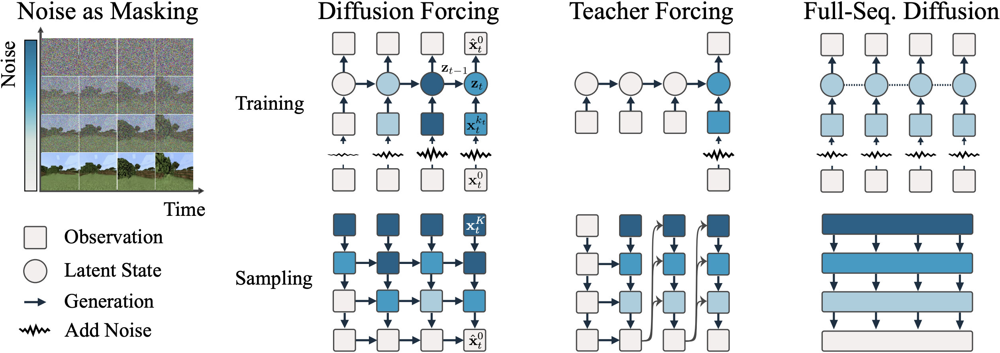

---
tags:
  - DLM
  - ROBOTICS
  - DEEP_LEARNING
  - THEORY
arxiv: https://arxiv.org/abs/2407.01392
github: https://github.com/buoyancy99/diffusion-forcing
website: https://boyuan.space/diffusion-forcing
year: 2024
read: true
---

# Diffusion Forcing: Next-token Prediction Meets Full-Sequence Diffusion

> **Links:** [arXiv](https://arxiv.org/abs/2407.01392) | [GitHub](https://github.com/buoyancy99/diffusion-forcing) | [Website](https://boyuan.space/diffusion-forcing)
> **Tags:** #DLM #ROBOTICS #DEEP_LEARNING #THEORY

---

## Methodology

Diffusion Forcing (DF) is a training and sampling framework that assigns **independent per-token noise levels** to sequence tokens. It unifies two axes of masking: (1) masking along the time axis (next-token prediction / teacher forcing) and (2) masking along the noise axis (full-sequence diffusion). Each token $\mathbf{x}_t$ is noised to level $k_t \in \{0, 1, \ldots, K\}$ independently, giving a noisy observation $\mathbf{x}_t^{k_t}$.

### Unified View

- **Teacher forcing**: noise level $k_t = K$ for future tokens (fully masked), $k_t = 0$ for past tokens.
- **Full-sequence diffusion**: uniform noise level $k_t = k$ for all $t$.
- **Diffusion Forcing**: arbitrary per-token noise levels $\{k_t\}_{t=1}^T$ drawn independently.

### Architecture (paper implementation)

A causal RNN (GRU-based) maintains a latent $\mathbf{z}_t$ summarizing past context:

$$\mathbf{z}_t \sim p_\theta(\mathbf{z}_t \mid \mathbf{z}_{t-1}, \mathbf{x}_t^{k_t}, k_t)$$

The noise predictor is conditioned on both the latent and the current noisy token:

$$\hat{\boldsymbol{\epsilon}}_t = \boldsymbol{\epsilon}_\theta(\mathbf{z}_{t-1}, \mathbf{x}_t^{k_t}, k_t)$$

### Training

For each sequence $(\mathbf{x}_1, \ldots, \mathbf{x}_T)$:

1. Sample independent noise levels $k_t \sim \text{Uniform}\{0, \ldots, K\}$ for each $t$.
2. Forward-diffuse: $\mathbf{x}_t^{k_t} = \sqrt{\bar{\alpha}_{k_t}}\,\mathbf{x}_t + \sqrt{1 - \bar{\alpha}_{k_t}}\,\boldsymbol{\epsilon}_t$, where $\boldsymbol{\epsilon}_t \sim \mathcal{N}(0, \sigma_{k_t}^2 I)$.
3. Update latents sequentially: $\mathbf{z}_t \sim p_\theta(\mathbf{z}_t \mid \mathbf{z}_{t-1}, \mathbf{x}_t^{k_t}, k_t)$.
4. Minimize MSE noise-prediction loss:

$$\mathcal{L}(\theta) = \mathbb{E}_{k_{1:T},\, \mathbf{x}_{1:T},\, \boldsymbol{\epsilon}_{1:T}} \left[ \sum_{t=1}^T \|\boldsymbol{\epsilon}_t - \boldsymbol{\epsilon}_\theta(\mathbf{z}_{t-1}, \mathbf{x}_t^{k_t}, k_t)\|^2 \right]$$

**Theoretical guarantee**: DF training optimizes a reweighted ELBO on $\ln p_\theta((\mathbf{x}_t^{k_t})_{1 \le t \le T})$ averaged over noise levels, and simultaneously maximizes a lower bound on the likelihood for all sequences of noise levels.

### Sampling

Sampling is defined by a 2D scheduling matrix $\mathcal{K} \in [K]^{M \times T}$ (rows = denoising steps, columns = time steps). The algorithm proceeds row-by-row (outer loop over $m$) and left-to-right (inner loop over $t$):

$$\mathbf{x}_t^{\mathrm{new}} \leftarrow \frac{1}{\sqrt{\alpha_k}}\!\left(\mathbf{x}_t - \frac{1-\alpha_k}{\sqrt{1-\bar{\alpha}_k}}\,\boldsymbol{\epsilon}_\theta(\mathbf{z}_t, \mathbf{x}_t, k)\right) + \sigma_k\,\mathbf{w}, \quad \mathbf{w} \sim \mathcal{N}(0, I)$$

By designing $\mathcal{K}$, one can realize different behaviors without retraining:

| Sampling Schedule | Effect |
|---|---|
| Uniform noise across all $t$ | Full-sequence diffusion |
| Zero noise on past, full noise on future | Teacher forcing / autoregressive |
| Zig-zag (near future less noisy than far future) | Causal uncertainty modeling |
| Autoregressive with small residual noise $0 < k \ll K$ on past | Stabilized long-horizon rollout |

### Decision-Making Framework

Tokens $\mathbf{x}_t = [\mathbf{a}_t, r_t, \mathbf{o}_{t+1}]$ (action, reward, next observation). At execution step $t$, the latent $\mathbf{z}_{t-1}$ conditions sampling of a lookahead plan $\hat{\mathbf{x}}_{t:t+H}$. After taking action $\hat{\mathbf{a}}_t$, the real transition $\mathbf{x}_t = [\hat{\mathbf{a}}_t, r_t, \mathbf{o}_{t+1}]$ updates the latent via the posterior $p_\theta(\mathbf{z}_t \mid \mathbf{z}_{t-1}, \mathbf{x}_t, 0)$.

**Monte Carlo Guidance (MCG)**: draw multiple future trajectory samples and average their guidance gradients to plan under uncertainty:

$$\mathbf{x}_t^k \leftarrow \mathbf{x}_t^k + \nabla_{\mathbf{x}}\,\mathbb{E}\left[\log c(\mathbf{x}_{t:T})\right]$$

---

## Experiment Setup

**Video prediction** (Minecraft, DMLab):
- Architecture: convolutional RNN (causal)
- Training sequence length: 36 frames (DMLab), 72 frames (Minecraft); 100K steps
- Baselines: teacher-forcing next-frame diffusion, causal full-sequence diffusion (same RNN backbone)

**Planning** (D4RL Maze2D):
- Environments: U-Maze, Medium, Large (single-task and multi-task with random start goals)
- Dataset: random walks (offline RL)
- Metric: cumulative reward
- Baselines: MPPI, CQL, IQL, Diffuser (with PD controller* and with diffused actions directly)

**Robotics** (Franka robot, fruit-swap task):
- Dataset: teleoperated demonstrations; non-Markovian task (goal depends on initial fruit configuration)
- Corruption test: visual distractors / camera occlusion flagged via $k > 0$
- Baseline: Diffusion Policy (Chi et al., 2023)

**Time series forecasting** (GluonTS):
- 6 datasets: Exchange (8D), Solar (137D), Electricity (370D), Traffic (963D), Taxi (1,214D), Wikipedia (2,000D)
- Metric: $\text{CRPS}_\text{sum}$ (lower = better)
- Early stopping on validation; 100 batches/epoch; same architecture/hyperparameters across all datasets
- Baselines: TimeGrad, Transformer-MAF, ScoreGrad, GP-Copula, DeepAR, LSTM-Copula

---

## Results

### Planning (D4RL Maze2D) — Cumulative Reward

| Environment | MPPI | CQL | IQL | Diffuser* | Diffuser (raw action) | DF w/o MCG | **DF** |
|---|---|---|---|---|---|---|---|
| Maze2D U-Maze | 33.2 | 5.7 | 47.4 | 113.9 ± 3.1 | 6.3 ± 2.1 | 110.1 ± 3.9 | **116.7 ± 2.0** |
| Maze2D Medium | 10.2 | 5.0 | 34.9 | 121.5 ± 2.7 | 13.5 ± 2.3 | 136.1 ± 10.2 | **149.4 ± 7.5** |
| Maze2D Large | 5.1 | 12.5 | 58.6 | 123.0 ± 6.4 | 6.3 ± 2.1 | 142.8 ± 5.6 | **159.0 ± 2.7** |
| **Single-task Avg** | 16.2 | 7.7 | 47.0 | 119.5 | 8.7 | 129.7 | **141.7** |
| Multi2D U-Maze | 41.2 | — | 24.8 | 128.9 ± 1.8 | 32.8 ± 1.7 | 107.7 ± 4.9 | **119.1 ± 4.0** |
| Multi2D Medium | 15.4 | — | 12.1 | 127.2 ± 3.4 | 22.0 ± 2.7 | 145.6 ± 6.5 | **152.3 ± 9.9** |
| Multi2D Large | 8.0 | — | 13.9 | 132.1 ± 5.8 | 6.9 ± 1.7 | 129.8 ± 1.5 | **167.1 ± 2.7** |
| **Multi-task Avg** | 21.5 | — | 16.9 | 129.4 | 20.6 | 127.7 | **146.2** |

*Diffuser\* uses a hand-crafted PD controller; asterisk denotes it does not execute raw generated actions.

### Robotics — Fruit-Swap Success Rate

| Method | Normal | With observation corruption |
|---|---|---|
| Diffusion Policy | 0% | — |
| Next-frame diffusion baseline | — | 48% |
| **DF** | **80%** | **76%** |

### Time Series Forecasting — $\text{CRPS}_\text{sum}$ (lower is better)

| Method | Exchange | Solar | Electricity | Traffic | Taxi | Wikipedia |
|---|---|---|---|---|---|---|
| TimeGrad | 0.006 | 0.287 | 0.021 | 0.044 | 0.114 | 0.049 |
| ScoreGrad sub-VP SDE | 0.006 | **0.256** | **0.019** | 0.041 | 0.101 | **0.043** |
| Transformer-MAF | 0.005 | 0.301 | 0.021 | 0.056 | 0.179 | 0.063 |
| **DF (Ours)** | **0.003** | 0.289 | 0.023 | **0.040** | **0.075** | 0.085 |

DF is best on Exchange, Traffic, Taxi; competitive overall (roughly tied with ScoreGrad).

### Video Prediction

DF generates stable rollouts of 2,000+ frames from models trained on 36 (DMLab) or 72 (Minecraft) frames without a sliding window. Teacher-forcing and full-sequence diffusion baselines diverge rapidly; full-sequence diffusion also exhibits frame-to-frame discontinuities within the training horizon.

---

## Related Papers

- [mdlm](mdlm.md)