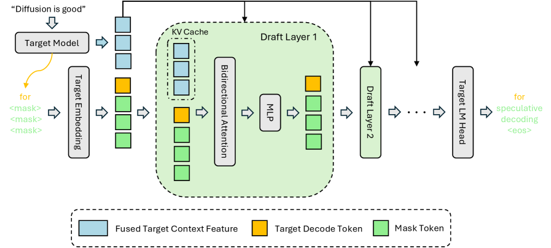

---
tags:
  - SPEC_DECODING
  - DLM
  - MLSYS
arxiv: https://arxiv.org/abs/2602.06036
github: https://github.com/z-lab/dflash
website: https://z-lab.ai/projects/dflash
year: 2026
read: true
---

# DFlash: Block Diffusion for Flash Speculative Decoding

> **Links:** [arXiv](https://arxiv.org/abs/2602.06036) | [GitHub](https://github.com/z-lab/dflash) | [Website](https://z-lab.ai/projects/dflash)
> **Tags:** #SPEC_DECODING #DLM #MLSYS

---

## Methodology

DFlash replaces the autoregressive draft model in speculative decoding with a **block diffusion** model that generates $\gamma$ draft tokens in a single forward pass. A lightweight draft network conditions on frozen target-model hidden states injected via KV-cache, making drafts high-quality without costly autoregressive rollout.

### Inference Pipeline

1. **Target prefill + feature extraction** — the target model processes the prompt; hidden states from $L_f = 5$ uniformly sampled intermediate layers are extracted.
2. **Feature fusion** — a small projection layer collapses the extracted states into a compact *target context feature*.
3. **KV-cache injection** — the context feature is inserted into the draft model's KV cache at every draft layer, so every draft attention head can attend to target-model information.
4. **Block diffusion drafting** — the draft model generates $\gamma$ tokens jointly in one forward pass using bidirectional attention within the block (no cross-block attention).
5. **Parallel verification** — the target model verifies all $\gamma$ draft tokens in a single forward pass; accepted tokens are kept, the first rejected token is resampled.

### Training

- **Attention mask** — Flex Attention sparse mask: bidirectional within each block, causal across blocks; target context features (blue), clean prompt tokens, clean response anchor tokens (yellow), masked positions (green).
- **Anchor sampling** — 512 anchor positions randomly drawn per sequence; remaining block positions are masked. Random anchoring substantially outperforms uniform block division.
- **Position-dependent loss decay**:

$$w_k = \exp\!\left(-\frac{k-1}{\gamma}\right)$$

where $k$ is position index within the block and $\gamma = 7$ for block size 16. Earlier positions receive higher weight.

- **Optimizer:** AdamW, lr = 6e-4, 6 epochs, max sequence length 3072 tokens.

### Key Hyperparameters

| Hyperparameter | Default | LLaMA 3.1 variant | Qwen3-Coder variant |
|---|---|---|---|
| Block size $\gamma$ | 16 | 10 | 16 |
| Draft layers $L_d$ | 5 | 5 | 8 |
| Target feature layers $L_f$ | 5 | 5 | 5 |
| Anchor positions per seq | 512 | 512 | 512 |

---

## Experiment Setup

- **Target models:** Qwen3-4B, Qwen3-8B, Qwen3-Coder-30B, LLaMA 3.1-8B, LLaMA 3.1-70B
- **Baselines:** EAGLE-3 (state-of-the-art autoregressive speculative decoding)
- **Benchmarks:** GSM8K, MATH-500, AIME 2025, HumanEval, GPQA, MT-Bench
- **Hardware:** B200 GPU (throughput experiments via SGLang)
- **Serving framework:** SGLang for multi-request throughput evaluation
- **Pretrained draft models:** released on HuggingFace at `z-lab/dflash`

---

## Results

### Single-Request Latency Speedup (vs. autoregressive baseline, temperature=0)

| Target Model | Method | GSM8K | MATH-500 | AIME 2025 | HumanEval | Avg |
|---|---|---|---|---|---|---|
| Qwen3-4B | EAGLE-3 (16) | 1.99x | 1.83x | 1.79x | 1.84x | 1.81x |
| Qwen3-4B | DFlash (16) | 5.15x | 6.09x | 5.41x | 5.21x | 4.91x |
| Qwen3-8B | EAGLE-3 (16) | 1.94x | 1.81x | 1.57x | 1.89x | 1.76x |
| Qwen3-8B | DFlash (16) | 5.15x | 6.08x | 5.51x | 5.14x | 4.86x |

### Reasoning Mode (Thinking Enabled, temperature=0)

Speedup as wall-clock / token-throughput tau:

| Target Model | GPQA | MATH-500 | AIME 2025 |
|---|---|---|---|
| Qwen3-4B | 4.23 / 5.23 tau | 4.59 / 5.74 tau | 4.39 / 5.54 tau |
| Qwen3-8B | 4.17 / 5.17 tau | 4.64 / 5.82 tau | 4.51 / 5.74 tau |

### SGLang Multi-Request Throughput (B200 GPU)

| Target Model | Benchmark | Peak Tokens/s | Speedup @ concurrency 32 |
|---|---|---|---|
| Qwen3-4B | MATH-500 | 20,417 | 2.9x |
| Qwen3-8B | MATH-500 | 16,076 | 2.8x |
| Qwen3-Coder-30B | -- | 8,314 | 3.1x |

### Ablations

**Draft layer count (Qwen3-8B, block size 16):**

| Draft Layers | MATH-500 | HumanEval | MT-Bench |
|---|---|---|---|
| 3-L | 4.69 / 5.64 tau | 3.90 / 4.61 tau | 2.38 / 3.18 tau |
| 5-L | 4.71 / 5.99 tau | 3.96 / 4.94 tau | 2.35 / 3.37 tau |
| 8-L | 4.64 / 6.33 tau | 3.96 / 5.29 tau | 2.23 / 3.50 tau |

- Fewer draft layers reduce wall-clock speedup but increase token throughput; 5-L balances both.
- Random anchor sampling substantially outperforms uniform block division for acceptance length.
- Models trained at larger block sizes generalize well to smaller inference-time blocks.

---

## Related Papers

- [eagle3](eagle3.md)
- [mdlm](mdlm.md)