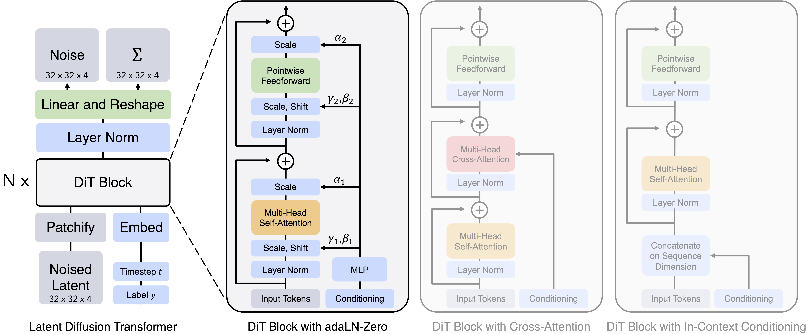

---
tags:
  - VISION
  - DEEP_LEARNING
arxiv: https://arxiv.org/abs/2212.09748
github: https://github.com/facebookresearch/DiT
website: https://www.wpeebles.com/DiT
year: 2022
read: false
---

# Scalable Diffusion Models with Transformers

> **Links:** [arXiv](https://arxiv.org/abs/2212.09748) | [GitHub](https://github.com/facebookresearch/DiT) | [Website](https://www.wpeebles.com/DiT)
> **Tags:** #VISION #DEEP_LEARNING

---

## Methodology

DiT replaces the U-Net backbone in latent diffusion models with a Vision Transformer (ViT). Images are first encoded into a spatial latent $z$ via a pre-trained VAE (8× spatial downsampling), then patchified and fed as a token sequence to a sequence of transformer blocks, before a final linear decoder predicts noise $\epsilon$ or velocity.

### Patchification

For a latent of shape $I \times I \times C$ (where $I = 32$ for 256×256 images), patches of size $p \times p$ are extracted and linearly embedded into tokens of dimension $d$:

$$T = (I / p)^2 \text{ tokens}, \quad x_i \in \mathbb{R}^{p^2 C} \xrightarrow{\text{linear}} \mathbb{R}^d$$

- $I$: spatial resolution of the latent (32 for 256×256 images, 64 for 512×512)
- $p$: patch size; denoted by "/p" suffix (e.g., DiT-XL/2 uses $p=2$)
- $C$: latent channels (4 for the SD VAE)
- Standard 2D sinusoidal positional embeddings are added

### Conditioning: adaLN-Zero Block

Four conditioning strategies are compared; **adaLN-Zero** is chosen as it achieves the lowest FID with the fewest Gflops.

Given a conditioning signal $c$ formed by adding the timestep embedding $e_t$ and class-label embedding $e_y$, a shared MLP regresses six vectors per block:

$$[\gamma_1,\, \beta_1,\, \alpha_1,\, \gamma_2,\, \beta_2,\, \alpha_2] = \text{MLP}(c), \quad c = e_t + e_y$$

The block forward pass:

$$x \leftarrow x + \alpha_1 \odot \text{MSA}\!\left(\gamma_1 \odot \text{LN}(x) + \beta_1\right)$$
$$x \leftarrow x + \alpha_2 \odot \text{MLP}\!\left(\gamma_2 \odot \text{LN}(x) + \beta_2\right)$$

- $\gamma_i, \beta_i$: dimension-wise scale and shift applied inside layer norm (replace learned LN parameters)
- $\alpha_i$: gating scalars applied before the residual addition; **initialized to zero** so each block is an identity at the start of training
- $\odot$: element-wise multiply (broadcast over sequence length)
- $\text{MSA}$: multi-head self-attention; $\text{LN}$: layer normalization (without its own affine parameters)
- The zero initialization of $\alpha_i$ means the network starts as a stack of identity functions and gradually activates each block during training

### Classifier-Free Guidance (CFG)

At inference, the predicted noise is blended:

$$\hat{\epsilon} = \epsilon_\theta(z_t, \varnothing) + s \cdot \left[\epsilon_\theta(z_t, y) - \epsilon_\theta(z_t, \varnothing)\right]$$

- $s$: guidance scale (1.50 used for main results)
- $\varnothing$: null class embedding (10% dropout on $y$ during training)

---

## Experiment Setup

**Pre-training encoder:** Stable Diffusion VAE (8× spatial downsampling, $C=4$ latent channels)

**Dataset:** ImageNet 1000-class conditional; horizontal flips only (no other augmentation)

**Optimizer:** AdamW, $\text{lr} = 1 \times 10^{-4}$, no weight decay, constant schedule

**Batch size:** 256

**Training duration:** 400K steps (ablations); 7M steps (final DiT-XL/2 256×256)

**Hardware:** TPU-v3 pods (~5.7 iterations/second for DiT-XL/2)

**Diffusion:** 1000-step DDPM; noise schedule and parameterization follow ADM

**Sampling:** 250 DDPM steps with CFG at inference

### Model Configurations

Gflops measured at $I=32$, $p=4$ (64 tokens) for fair comparison across sizes.

| Model | Layers $N$ | Hidden dim $d$ | Heads | Gflops | Params |
|-------|-----------|----------------|-------|--------|--------|
| DiT-S | 12 | 384 | 6 | 1.4 | ~33M |
| DiT-B | 12 | 768 | 12 | 5.6 | ~130M |
| DiT-L | 24 | 1,024 | 16 | 19.7 | ~458M |
| DiT-XL | 28 | 1,152 | 16 | 29.1 | ~675M |

Each model is further combined with patch size $p \in \{2, 4, 8\}$ (e.g., DiT-XL/2). Smaller $p$ yields more tokens and higher Gflops; DiT-XL/2 has the highest compute.

---

## Results

### Conditioning Strategy Ablation (DiT-XL, 400K steps, ImageNet 256×256)

| Strategy | Gflops | FID-400K↓ |
|----------|--------|-----------|
| In-context | 119.4 | ~35 |
| Cross-attention | 137.6 | ~26 |
| adaLN | 118.6 | ~25 |
| **adaLN-Zero** | **118.6** | **best** |

*adaLN-Zero matches adaLN in Gflops but outperforms all variants thanks to zero initialization of $\alpha_i$.*

### ImageNet 256×256 Class-Conditional Generation

| Model | FID↓ | sFID↓ | IS↑ | Prec↑ | Rec↑ |
|-------|------|-------|-----|-------|------|
| LDM-4-G ($s$=1.50) | 3.60 | — | 247.67 | 0.87 | 0.48 |
| StyleGAN-XL | 2.30 | 4.02 | 265.12 | 0.78 | 0.53 |
| DiT-XL/2 (no CFG) | 9.62 | 6.85 | 121.50 | 0.67 | 0.67 |
| **DiT-XL/2-G** ($s$=1.50) | **2.27** | **4.60** | **278.24** | 0.83 | 0.57 |

### ImageNet 512×512 Class-Conditional Generation

| Model | FID↓ | sFID↓ | IS↑ | Prec↑ | Rec↑ |
|-------|------|-------|-----|-------|------|
| ADM-G + ADM-U | 3.85 | 5.86 | 221.72 | 0.84 | 0.53 |
| DiT-XL/2 (no CFG) | 12.03 | 7.12 | 105.25 | 0.75 | 0.64 |
| **DiT-XL/2-G** ($s$=1.50) | **3.04** | **5.02** | **240.82** | 0.84 | 0.54 |

*Legend — FID: Fréchet Inception Distance (lower is better); sFID: spatial FID; IS: Inception Score (higher is better); Prec/Rec: precision and recall w.r.t. real distribution; -G / CFG suffix: with classifier-free guidance at scale $s$; ADM-U: ADM with an additional pixel-space upsampler.*

### Scaling Analysis

Across all model sizes and patch sizes, Gflops is the single best predictor of FID: **higher Gflops → lower FID**, regardless of whether depth, width, or token count is increased. Parameter count is a weaker predictor. DiT-XL/2 (119 Gflops at $I=32$, $p=4$ equivalent) achieves better FID than ADM-U (742 Gflops) while using 6× less compute.

---

## Related Papers

- [meanflow](meanflow.md)
