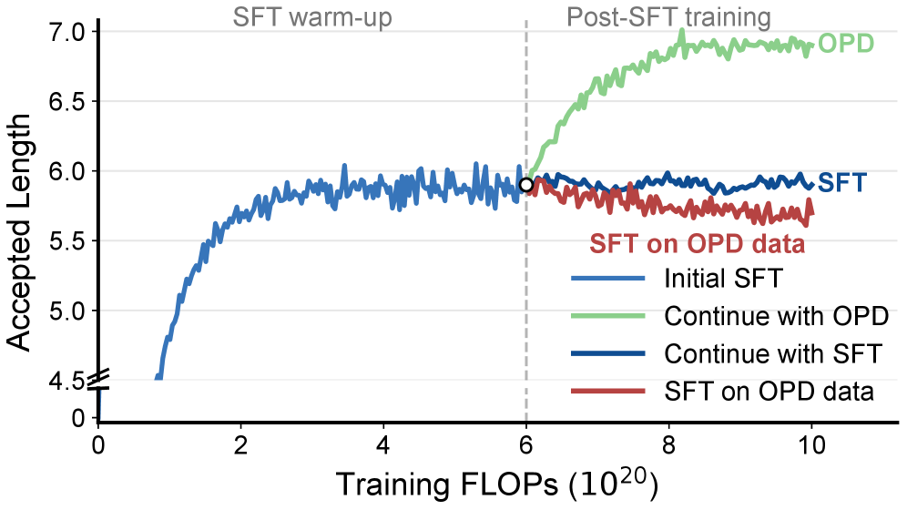
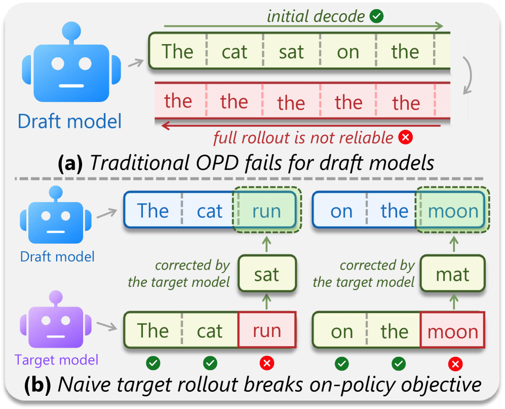
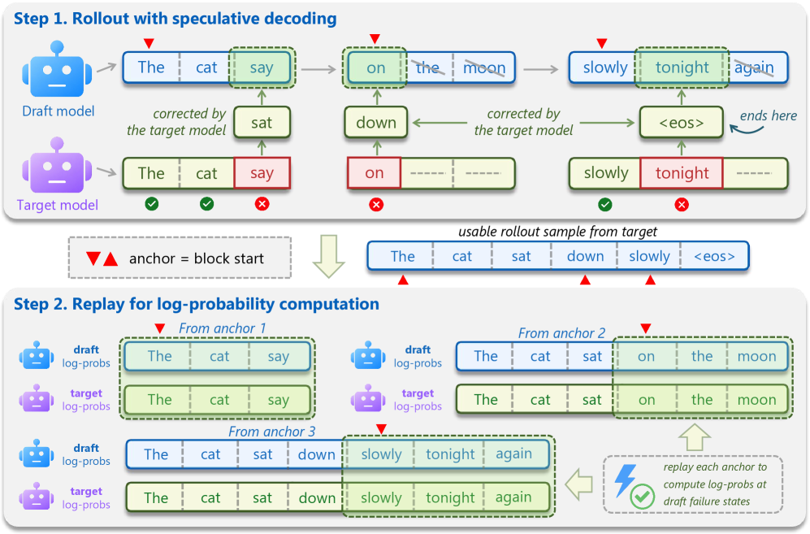
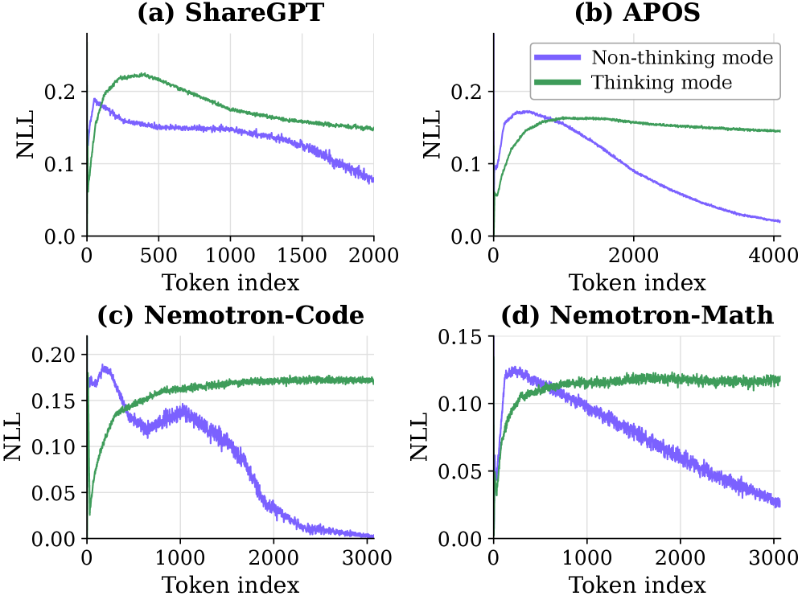
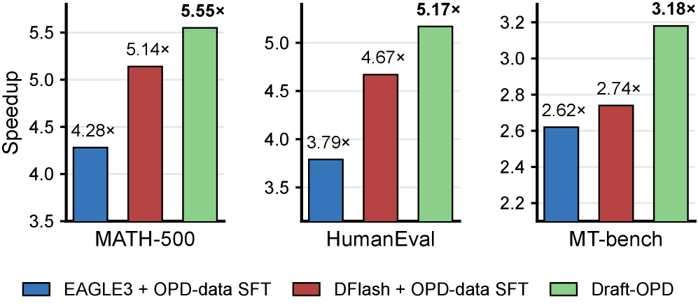

---
tags:
  - SPEC_DECODING
  - REASONING
arxiv: https://arxiv.org/abs/2605.29343
github: https://github.com/bingyang-lei/Draft-OPD
website: https://www.haodilei.top/draft-opd
year: 2026
read: true
---

# Draft-OPD: On-Policy Distillation for Speculative Draft Models

> **Links:** [arXiv](https://arxiv.org/abs/2605.29343) | [GitHub](https://github.com/bingyang-lei/Draft-OPD) | [Website](https://www.haodilei.top/draft-opd)
> **Tags:** #SPEC_DECODING #REASONING

---

## Methodology

### Problem: Offline-to-Inference Mismatch

Standard SFT for draft models trains on fixed target-generated trajectories. At inference, however, the drafter proposes tokens from its own policy — a distribution mismatch that causes SFT to plateau early.

*Figure 1: Accepted token length during training. SFT plateaus quickly; Draft-OPD continues improving through on-policy data.*

### Why Naive On-Policy Training Fails

Two failure modes arise when applying on-policy distillation directly:

*Figure 2: (a) Draft-only rollouts degenerate into repetition. (b) Target-assisted rollout discards draft-policy signals by keeping only target-verified tokens.*

Draft-OPD resolves both issues via **target-assisted rollout** (for stable continuations) and **anchor-based replay** (to recover rejected-token information).

### Draft-OPD Framework

*Figure 3: Draft-OPD overview. Speculative decoding generates stable rollouts; anchor positions record draft-block starts; replay from anchors computes log-probabilities for both accepted and rejected tokens.*

**Step 1 — Rollout with anchor collection.** Run speculative decoding on prompt $x$. Before each draft block $m$, record the anchor position $a_m$ (where the block starts). The target verifies each block in parallel and produces a high-quality continuation. This gives a trajectory that follows the target distribution while preserving draft-proposed states.

**Step 2 — Replay for log-probability computation.** From each anchor $a_m$, replay the original drafted block $\mathbf{d}_m$. Both the draft model (student) and target model (teacher) score the same draft-generated prefix, yielding token-level log-probabilities $\log q(\cdot)$ and $\log p(\cdot)$, including for tokens subsequently rejected during verification.

**Step 3 — Acceptance-aware distillation loss.** Verification partitions each drafted token into accepted ($\mathcal{A}$) or rejected ($\mathcal{R}$) sets. The loss applies different KL directions:

$$\mathcal{L}_{\text{acc}} = \frac{1}{|\mathcal{A}|} \sum_{(m,k) \in \mathcal{A}} D_\text{KL}(p_{m,k} \,\|\, q_{m,k})$$

$$\mathcal{L}_{\text{rev}} = \frac{1}{|\mathcal{R}|} \sum_{(m,k) \in \mathcal{R}} w_k \cdot D_\text{KL}(q_{m,k} \,\|\, p_{m,k})$$

$$\mathcal{L}_{\text{Draft-OPD}} = \frac{\lambda_{\text{acc}} \cdot \mathcal{L}_{\text{acc}} + \lambda_{\text{rej}} \cdot \mathcal{L}_{\text{rev}}}{\lambda_{\text{acc}} + \lambda_{\text{rej}}}$$

- $p_{m,k}$, $q_{m,k}$: teacher and student distributions at token position $k$ in block $m$
- $w_k = \gamma^{k-1}$: exponential position-decay weight; later rejected positions count less ($\gamma = 0.8$)
- $\lambda_{\text{acc}} = \lambda_{\text{rej}} = 1.0$ (equal weights)
- Forward KL on accepted tokens: mode-covering, pushes the drafter toward the target at verified positions
- Reverse KL on rejected tokens: mode-seeking, penalizes mass on tokens the target rejects

---

## Experiment Setup

**Models:** Qwen3-4B and Qwen3-8B draft models targeting their respective larger variants; initialized from DFlash/EAGLE-3 SFT checkpoints.

**Data mixture (16K prompts):** 2K GSM8K, 5K MATH corpus, 4K AoPS, 5K CodeAlpaca. Responses generated online by the target model during training.

**OPD hyperparameters:**

| Hyperparameter | Value |
|---|---|
| Optimizer | AdamW |
| Learning rate | $3 \times 10^{-4}$ |
| Warmup ratio | 0.05 |
| LR schedule | Cosine decay |
| OPD epochs | 8 |
| Block size | 16 |
| Max response length (thinking) | 4096 tokens |
| Max response length (non-thinking) | 2048 tokens |
| $\gamma$ (position decay) | 0.8 |
| Training framework | verl |

**Baselines:** EAGLE-3, DFlash — both trained under matched SFT conditions using SpecForge.

**Evaluation:** Wall-clock speedup (A100), acceptance length $\tau$, across MATH-500, GSM8K, HumanEval, and both thinking/non-thinking modes. Deployment tested on SGLang at concurrency 1-32.

---

## Results

### Main Results

**Thinking mode enabled (temp=0):**

| Model | Method | Speedup | $\tau$ |
|---|---|---|---|
| Qwen3-4B | EAGLE-3 | 3.87x | 5.33 |
| Qwen3-4B | DFlash | 4.33x | 5.51 |
| Qwen3-4B | **Draft-OPD** | **4.86x** | **5.96** |
| Qwen3-8B | EAGLE-3 | 4.06x | 5.64 |
| Qwen3-8B | DFlash | 4.34x | 5.19 |
| Qwen3-8B | **Draft-OPD** | **4.89x** | **5.73** |

**Thinking mode disabled (temp=0):**

| Model | Method | Speedup | $\tau$ |
|---|---|---|---|
| Qwen3-4B | EAGLE-3 | 4.30x | 5.84 |
| Qwen3-4B | DFlash | 4.84x | 6.04 |
| Qwen3-4B | **Draft-OPD** | **5.31x** | **6.60** |
| Qwen3-8B | EAGLE-3 | 4.63x | 5.99 |
| Qwen3-8B | DFlash | 5.11x | 6.04 |
| Qwen3-8B | **Draft-OPD** | **5.60x** | **6.57** |

> $\tau$: mean accepted tokens per speculation step. Higher = more tokens accepted per draft block = greater speedup.

Draft-OPD improves over EAGLE-3 by ~23% and over DFlash by ~13% in wall-clock speedup.

### Thinking Mode: Higher Uncertainty

*Figure 5: Token-level NLL comparison. Thinking-mode responses show higher uncertainty, explaining the lower absolute speedup compared to non-thinking mode.*

### Ablations

*Figure 4: Ablation on Qwen3-4B (MATH-500, non-thinking). Each removed component degrades performance.*

| Ablation | Speedup | $\tau$ |
|---|---|---|
| **Draft-OPD (full)** | **5.55x** | **6.57** |
| w/o weight decay ($\gamma=1$) | 5.13x | 6.18 |
| All reverse KL | 5.11x | 6.14 |
| All forward KL | 5.34x | 6.35 |
| Random anchors (no replay) | 5.04x | 6.08 |

> Anchor-based replay (vs. random anchors) contributes the largest single gain. Asymmetric KL (forward for accepted, reverse for rejected) outperforms using either direction alone.

### SGLang Deployment

Consistent **7-17% throughput gains** over DFlash across concurrency levels 1-32 on Qwen3-4B/8B.

---

## Related Papers

- [eagle3](eagle3.md)
- [dflash](dflash.md)
