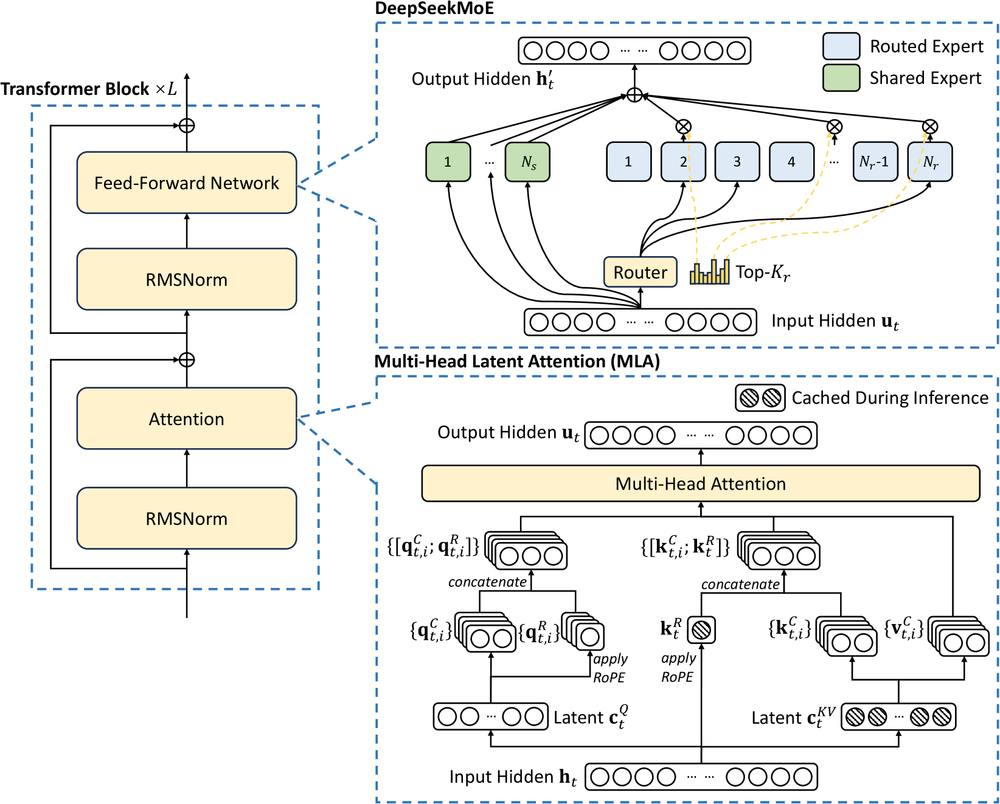

---
tags:
  - MLSYS
  - SPEC_DECODING
  - RL
arxiv: "https://arxiv.org/abs/2412.19437"
github: "https://github.com/deepseek-ai/DeepSeek-V3"
website: ""
year: 2024
read: false
---

# DeepSeek-V3 Technical Report

> **Links:** [arXiv](https://arxiv.org/abs/2412.19437) | [GitHub](https://github.com/deepseek-ai/DeepSeek-V3)
> **Tags:** #MLSYS #SPEC_DECODING #RL

---

## Methodology

DeepSeek-V3 is a 671B-parameter Mixture-of-Experts (MoE) language model with 37B parameters activated per token. Three key architectural innovations: (1) Multi-head Latent Attention (MLA) for KV-cache compression, (2) auxiliary-loss-free load balancing for DeepSeekMoE, and (3) Multi-Token Prediction (MTP) as an additional training objective.

### Model Configuration

| Hyperparameter | Value |
|---|---|
| Transformer layers | 61 |
| Hidden dimension | 7168 |
| Attention heads ($n_h$) | 128 |
| Per-head dimension ($d_h$) | 128 |
| KV compression dim ($d_c$) | 512 |
| Query compression dim ($d_c'$) | 1536 |
| Decoupled key/query dim ($d_h^R$) | 64 |
| MoE layers | all FFNs except first 3 |
| Shared experts per MoE layer | 1 |
| Routed experts per MoE layer | 256 |
| Expert intermediate hidden dim | 2048 |
| Activated routed experts ($K_r$) | 8 |
| Max nodes per token ($M$) | 4 |
| MTP depth ($D$) | 1 |
| Total / activated parameters | 671B / 37B |

### Multi-Head Latent Attention (MLA)

MLA reduces KV cache via low-rank joint compression of keys and values into a latent vector $\mathbf{c}_t^{KV} \in \mathbb{R}^{d_c}$:

$$\mathbf{c}_t^{KV} = W^{DKV}\mathbf{h}_t, \quad \mathbf{k}_t^C = W^{UK}\mathbf{c}_t^{KV}, \quad \mathbf{v}_t^C = W^{UV}\mathbf{c}_t^{KV}$$

At inference, only $\mathbf{c}_t^{KV}$ and the decoupled RoPE key $\mathbf{k}_t^R = \text{RoPE}(W^{KR}\mathbf{h}_t)$ are cached. Because $d_c \ll d_h n_h$, this dramatically reduces the KV cache footprint while maintaining MHA-level quality.

### DeepSeekMoE with Auxiliary-Loss-Free Load Balancing

FFN output per token $t$:

$$\mathbf{h}_t' = \mathbf{u}_t + \sum_{i=1}^{N_s} \text{FFN}_i^{(s)}(\mathbf{u}_t) + \sum_{i=1}^{N_r} g_{i,t}\,\text{FFN}_i^{(r)}(\mathbf{u}_t)$$

Expert affinity and gating:

$$s_{i,t} = \text{Sigmoid}(\mathbf{u}_t^T \mathbf{e}_i), \quad g_{i,t} = \frac{s_{i,t}}{\sum_{j \in \text{Top-}K} s_{j,t}}$$

**Auxiliary-loss-free load balancing**: Each expert $i$ carries a scalar bias $b_i$ used only during routing ($\text{Top-}K$ selection uses $s_{i,t}+b_i$; gating uses original $s_{i,t}$). After every training step $b_i$ is decreased by $\gamma$ for overloaded experts and increased for underloaded ones ($\gamma=0.001$ for first 14.3T tokens). A tiny sequence-level balance loss $\mathcal{L}_{\text{Bal}} = \alpha \sum_i f_i P_i$ with $\alpha=0.0001$ prevents extreme within-sequence skew.

**Node-limited routing**: Each token routed to at most $M=4$ nodes (top $K_r/M$ experts per node), enabling full computation-communication overlap during training.

### Multi-Token Prediction (MTP)

One sequential MTP module ($D=1$) predicts the token at offset $k=1$ beyond the next token. At depth $k$ the module linearly projects a concatenation of the previous-depth hidden state and the future token embedding:

$$\mathbf{h}_i^{\prime k} = M_k\big[\text{RMSNorm}(\mathbf{h}_i^{k-1});\,\text{RMSNorm}(\text{Emb}(t_{i+k}))\big]$$

$$\mathbf{h}_{1:T-k}^k = \text{TRM}_k(\mathbf{h}_{1:T-k}^{\prime k}), \quad P_{i+k+1}^k = \text{OutHead}(\mathbf{h}_i^k)$$

Total MTP loss weighted by $\lambda$ (0.3 for first 10T tokens, 0.1 thereafter):

$$\mathcal{L}_{\text{MTP}} = \frac{\lambda}{D}\sum_{k=1}^{D} \mathcal{L}_{\text{MTP}}^k$$

The embedding and output head are shared with the main model. During inference, MTP modules can be discarded or reused for speculative decoding.

### Infrastructure Highlights

- **DualPipe**: overlaps computation and communication in both forward and backward passes, hiding all-to-all and PP communication latency.
- **FP8 mixed precision**: tile-wise ($1\times128$) quantization for per-token activations; block-wise ($128\times128$) for weights; high-precision accumulation for GEMM outputs. First large-scale validation at 671B parameter scale.
- No token dropping during training or inference.

---

## Experiment Setup

### Pre-Training

| Setting | Value |
|---|---|
| Training tokens | 14.8T |
| Max sequence length | 4K (pre-training), extended to 32K then 128K via YaRN |
| Optimizer | AdamW ($\beta_1=0.9$, $\beta_2=0.95$, weight\_decay=0.1) |
| Peak LR | $2.2 \times 10^{-4}$ |
| LR schedule | 2K-step linear warmup → constant (10T tokens) → cosine decay (4.3T) → constant tail |
| Final LR | $7.3 \times 10^{-6}$ |
| Batch size | 3072 → 15360 (ramp over first 469B tokens) |
| Gradient clip | 1.0 |
| Precision | FP8 mixed precision |
| Parallelism | 16-way Pipeline, 64-way Expert, ZeRO-1 Data |
| Hardware | 2,048 H800 GPUs |
| Total compute | 2.788M H800 GPU hours (~$5.6M at $2/hr) |

### Post-Training

- **SFT**: 1.5M instruction instances; 2 epochs; cosine LR from $5\times10^{-6}$ to $1\times10^{-6}$. Reasoning data distilled from an internal DeepSeek-R1 expert model via rejection sampling; non-reasoning data from DeepSeek-V2.5 + human verification.
- **RL (GRPO)**: rule-based RM for math/code (compiler/answer verification); model-based RM for free-form. Domains: coding, math, writing, role-play, QA.

GRPO objective for group size $G$:

$$\mathcal{J}_{GRPO}(\theta) = \frac{1}{G}\sum_{i=1}^G \left(\min\!\left(\frac{\pi_\theta}{\pi_{\theta_{old}}}A_i,\;\text{clip}\!\left(\frac{\pi_\theta}{\pi_{\theta_{old}}}, 1\pm\epsilon\right)A_i\right) - \beta\,\mathbb{D}_{KL}(\pi_\theta \| \pi_{ref})\right)$$

---

## Results

### Base Model (Pre-Training)

| Benchmark | Metric | DSv2-Base (21B act.) | Qwen2.5-72B | LLaMA-3.1-405B | **DSv3-Base (37B act.)** |
|---|---|---|---|---|---|
| BBH | 3-shot EM | 78.8 | 79.8 | 82.9 | **87.5** |
| MMLU | 5-shot EM | 78.4 | 85.0 | 84.4 | **87.1** |
| MMLU-Redux | 5-shot EM | 75.6 | 83.2 | 81.3 | **86.2** |
| MMLU-Pro | 5-shot EM | 51.4 | 58.3 | 52.8 | **64.4** |
| DROP | 3-shot F1 | 80.4 | 80.6 | 86.0 | **89.0** |
| HumanEval | Pass@1 | 43.3 | 53.0 | 54.9 | **65.2** |
| MBPP | Pass@1 | 65.0 | 72.6 | 68.4 | **75.4** |
| LiveCodeBench-Base | Pass@1 | 11.6 | 12.9 | 15.5 | **19.4** |
| GSM8K | 8-shot EM | 81.6 | 88.3 | 83.5 | **89.3** |
| MATH | 4-shot EM | 43.4 | 54.4 | 49.0 | **61.6** |
| CMath | 3-shot EM | 78.7 | 84.5 | 77.3 | **90.7** |
| AGIEval | 0-shot EM | 57.5 | 75.8 | 60.6 | **79.6** |
| C-Eval | 5-shot EM | 81.4 | 89.2 | 72.5 | **90.1** |
| MMMLU-non-English | 5-shot EM | 64.0 | 74.8 | 73.8 | **79.4** |

### Chat Model (Post-Training)

| Benchmark | DSv2.5 | Qwen2.5-72B-Inst | LLaMA-3.1-405B-Inst | Claude-3.5-Sonnet | GPT-4o-0513 | **DSv3** |
|---|---|---|---|---|---|---|
| MMLU | 80.6 | 85.3 | 88.6 | 88.3 | 87.2 | **88.5** |
| MMLU-Pro | 66.2 | 71.6 | 73.3 | **78.0** | 72.6 | 75.9 |
| GPQA-Diamond | 41.3 | 49.0 | 51.1 | **65.0** | 49.9 | 59.1 |
| DROP F1 | 87.8 | 76.7 | 88.7 | 88.3 | 83.7 | **91.6** |
| LongBench v2 | 35.4 | 39.4 | 36.1 | 41.0 | 48.1 | **48.7** |
| HumanEval-Mul | 77.4 | 77.3 | 77.2 | 81.7 | 80.5 | **82.6** |
| LiveCodeBench (CoT) | 29.2 | 31.1 | 28.4 | 36.3 | 33.4 | **40.5** |
| Codeforces | 35.6 | 24.8 | 25.3 | 20.3 | 23.6 | **51.6** |
| SWE Verified | 22.6 | 23.8 | 24.5 | **50.8** | 38.8 | 42.0 |
| Aider-Polyglot | 18.2 | 7.6 | 5.8 | 45.3 | 16.0 | **49.6** |
| AIME 2024 | 16.7 | 23.3 | 23.3 | 16.0 | 9.3 | **39.2** |
| MATH-500 | 74.7 | 80.0 | 73.8 | 78.3 | 74.6 | **90.2** |
| CNMO 2024 | 10.8 | 15.9 | 6.8 | 13.1 | 10.8 | **43.2** |
| C-Eval | 79.5 | 86.1 | 61.5 | 76.7 | 76.0 | **86.5** |

### Ablations

| Ablation | Setting | Result |
|---|---|---|
| MTP | $D=1$ vs $D=0$ | Consistent benchmark gain (English, code, math) |
| Load balancing | Aux-loss-free vs. aux-loss ($\alpha=0.003$) | Better expert utilization; less performance degradation |
| FP8 vs BF16 | FP8 mixed precision | Training loss matches BF16 within noise |
