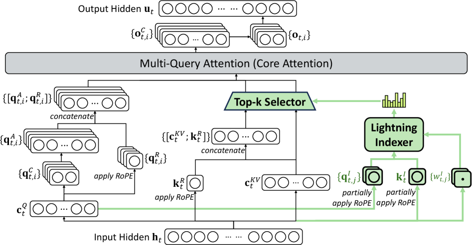

---
tags:
  - RL
  - MLSYS
  - REASONING
arxiv: "https://arxiv.org/abs/2512.02556"
github: "https://huggingface.co/deepseek-ai/DeepSeek-V3.2-Exp/tree/main/inference"
website: ""
year: 2025
read: false
---

# DeepSeek-V3.2: Pushing the Frontier of Open Large Language Models

> **Links:** [arXiv](https://arxiv.org/abs/2512.02556) | [Inference Code](https://huggingface.co/deepseek-ai/DeepSeek-V3.2-Exp/tree/main/inference)
> **Tags:** #RL #MLSYS #REASONING

---

## Methodology

*Figure: DSA instantiated under MLA. The lightning indexer computes top-k index scores; the green path shows sparse token selection feeding into the main attention.*

DeepSeek-V3.2 introduces three technical advances on top of its predecessor DeepSeek-V3.1-Terminus: (1) DeepSeek Sparse Attention (DSA), (2) a scalable GRPO-based RL framework, and (3) a large-scale agentic task synthesis pipeline. The architecture is otherwise identical to DeepSeek-V3.1-Terminus (MLA + MoE, 128K context).

### 1. DeepSeek Sparse Attention (DSA)

DSA replaces full MLA attention with a two-stage sparse attention mechanism:

**Lightning Indexer.** For each query token $\mathbf{h}_t$, a lightweight indexer computes an index score against all preceding tokens $\mathbf{h}_s$:

$$I_{t,s} = \sum_{j=1}^{H^I} w_{t,j}^I \cdot \text{ReLU}\!\left(\mathbf{q}^I_{t,j} \cdot \mathbf{k}^I_s\right)$$

- $\mathbf{h}_t, \mathbf{h}_s \in \mathbb{R}^d$: hidden states of the current query token $t$ and a preceding token $s$ ($s < t$).
- $I_{t,s} \in \mathbb{R}$: relevance score from query $t$ to key $s$; higher means $s$ more likely to be selected.
- $H^I$: number of indexer heads (small, e.g. 4 — much less than main attention).
- $\mathbf{q}^I_{t,j} \in \mathbb{R}^{d^I}$, $w_{t,j}^I \in \mathbb{R}$: $j$-th indexer query vector and its scalar weight, both linear projections of $\mathbf{h}_t$.
- $\mathbf{k}^I_s \in \mathbb{R}^{d^I}$: indexer key for token $s$, a linear projection of $\mathbf{h}_s$; $d^I$ is the (small) indexer head dim.
- ReLU chosen for throughput; indexer runs in FP8.

**Fine-Grained Token Selection.** Only the top-$k$ key-value entries are passed to the main attention:

$$\mathbf{u}_t = \text{Attn}\!\left(\mathbf{h}_t,\; \left\{\mathbf{c}_s \;\middle|\; I_{t,s} \in \text{Top-}k(I_{t,:})\right\}\right)$$

- $\mathbf{u}_t$: attention output at position $t$.
- $\mathbf{c}_s$: the MLA-compressed key/value cache entry for token $s$.
- $I_{t,:} = (I_{t,1}, \ldots, I_{t,t-1})$: indexer scores from $t$ to all preceding tokens; $\text{Top-}k$ keeps only the $k$ largest.
- $L$: sequence length; $k = 2048$ is fixed and $\ll L$.

**Continued Pre-Training (two stages):**

| Stage | Steps | Tokens | Batch | LR | Notes |
|-------|-------|--------|-------|----|-------|
| Dense Warm-Up | 1,000 | 2.1B | 16 x 128K | $10^{-3}$ | Indexer only; KL loss vs. full-attention distribution |
| Sparse Training | 15,000 | 943.7B | 480 x 128K | $7.3\times10^{-6}$ | All params; indexer aligned to selected token set $\mathcal{S}_t$ |

Warm-up objective: $\mathcal{L}^I = \sum_t D_\text{KL}(p_{t,:} \| \text{Softmax}(I_{t,:}))$, where $p_{t,:}$ is the L1-normalized sum of main attention scores across heads (the "target" distribution the indexer is trained to match), and $D_\text{KL}$ is KL divergence.

---

### 2. Scalable GRPO

Post-training uses GRPO with four additional techniques for stable RL scaling at large compute budgets:

**Unbiased KL Estimate.** Replaces the K3 estimator with an importance-sampling-corrected form:

$$D_\text{KL}(\pi_\theta(o_{i,t}) \| \pi_\text{ref}(o_{i,t})) = \frac{\pi_\theta}{\pi_\text{old}} \left(\frac{\pi_\text{ref}}{\pi_\theta} - \log\frac{\pi_\text{ref}}{\pi_\theta} - 1\right)$$

- $o_{i,t}$: the $t$-th token of the $i$-th rollout in the GRPO group.
- $\pi_\theta$: current policy being optimized; $\pi_\text{ref}$: frozen reference (SFT) policy; $\pi_\text{old}$: behavior policy that generated the rollout.
- All three $\pi$ terms are shorthand for $\pi(o_{i,t} \mid \text{context})$. The $\pi_\theta / \pi_\text{old}$ prefactor is the importance-sampling correction.

Eliminates gradient bias when $\pi_\theta \ll \pi_\text{ref}$; K3 assigns unbounded gradient weight to such tokens.

**Off-Policy Sequence Masking.** Binary mask $M_{i,t}$ zeroes out negative-advantage sequences with large per-sequence KL:

$$M_{i,t} = \begin{cases} 0 & \hat{A}_{i,t} < 0 \;\text{and}\; \frac{1}{|o_i|}\sum_t \log\frac{\pi_\text{old}(o_{i,t})}{\pi_\theta(o_{i,t})} > \delta \\ 1 & \text{otherwise} \end{cases}$$

- $\hat{A}_{i,t}$: advantage estimate for token $t$ of rollout $i$ (standardized group reward).
- $|o_i|$: length of rollout $i$; the inner sum is the per-sequence average log-ratio between behavior and current policy.
- $\delta$: fixed threshold above which the sequence is deemed too off-policy to safely train on when its advantage is negative.

**Keep Routing.** Expert routing paths from inference rollout are frozen during training, preventing routing inconsistency in MoE that destabilizes optimization.

**Keep Sampling Mask.** Top-p/top-k truncation masks from $\pi_\text{old}$ applied to $\pi_\theta$, ensuring both policies share identical action subspaces.

**Post-training pipeline:**
1. Specialist distillation across 6 domains (math, coding, logical reasoning, general agent, agentic coding, agentic search); each specialist trained with large-scale RL.
2. Mixed single-stage RL merging reasoning + agent + human-alignment data.
Post-training compute exceeds 10% of pre-training cost.

---

### 3. Thinking in Tool-Use

**Context Management.** Reasoning traces retained across tool calls; discarded only on new user messages. Tool-call history preserved when reasoning is removed. Avoids redundant re-reasoning per tool call.

**Agentic Task Synthesis.** 85,267 tasks across 1,827 synthesized environments:

| Task Type | # Tasks | Environment | Prompt Source |
|-----------|---------|-------------|---------------|
| Code Agent | 24,667 | Real | Extracted |
| Search Agent | 50,275 | Real | Synthesized |
| General Agent | 4,417 | Synthesized | Synthesized |
| Code Interpreter | 5,908 | Real | Extracted |

General-agent environments synthesized via automated pipeline producing (env, tools, task, verifier) tuples; retained only if pass@100 > 0.

---

## Experiment Setup

- **Base:** DeepSeek-V3.1-Terminus (128K context, MLA + MoE, exact parameter count undisclosed)
- **Hardware:** H800 GPU clusters
- **Variants:** DeepSeek-V3.2 Thinking (thinking + non-thinking modes); DeepSeek-V3.2-Speciale (extended thinking, incorporates DeepSeek-Math-V2 techniques for math proofs)
- **Baselines:** Claude-4.5-Sonnet, GPT-5 High, Gemini-3.0-Pro, Kimi-K2-Thinking, MiniMax-M2

---

## Results

### Main Results (DeepSeek-V3.2 Thinking vs. frontier models)

| Category | Benchmark | Metric | Claude-4.5-Sonnet | GPT-5 High | Gemini-3.0-Pro | Kimi-K2-Thinking | MiniMax-M2 | DSV3.2 Thinking |
|----------|-----------|--------|:-----------------:|:----------:|:--------------:|:----------------:|:----------:|:---------------:|
| English | MMLU-Pro | EM | 88.2 | 87.5 | **90.1** | 84.6 | 82.0 | 85.0 |
| English | GPQA Diamond | Pass@1 | 83.4 | 85.7 | **91.9** | 84.5 | 77.7 | 82.4 |
| English | HLE (text) | Pass@1 | 13.7 | 26.3 | **37.7** | 23.9 | 12.5 | 25.1 |
| Code | LiveCodeBench | Pass@1-COT | 64.0 | 84.5 | **90.7** | 82.6 | 83.0 | 83.3 |
| Code | Codeforces | Rating | 1480 | 2537 | **2708** | - | - | 2386 |
| Math | AIME 2025 | Pass@1 | 87.0 | 94.6 | **95.0** | 94.5 | 78.3 | 93.1 |
| Math | HMMT Feb 2025 | Pass@1 | 79.2 | 88.3 | **97.5** | 89.4 | - | 92.5 |
| Math | HMMT Nov 2025 | Pass@1 | 81.7 | 89.2 | **93.3** | 89.2 | - | 90.2 |
| Math | IMOAnswerBench | Pass@1 | - | 76.0 | **83.3** | 78.6 | - | 78.3 |
| Code Agent | Terminal Bench 2.0 | Acc | 42.8 | 35.2 | **54.2** | 35.7 | 30.0 | 46.4 |
| Code Agent | SWE Verified | Resolved | **77.2** | 74.9 | 76.2 | 71.3 | 69.4 | 73.1 |
| Code Agent | SWE Multilingual | Resolved | **68.0** | 55.3 | - | 61.1 | 56.5 | 70.2 |
| Search Agent | BrowseComp | Pass@1 | 24.1 | **54.9** | - | -/60.2* | 44.0 | 51.4/67.6* |
| Search Agent | BrowseCompZh | Pass@1 | 42.4 | 63.0 | - | 62.3 | 48.5 | **65.0** |
| Tool Use | tau2-Bench | Pass@1 | 84.7 | 80.2 | **85.4** | 74.3 | 76.9 | 80.3 |
| Tool Use | MCP-Universe | Success Rate | 46.5 | 47.9 | **50.7** | 35.6 | 29.4 | 45.9 |
| Tool Use | MCP-Mark | Pass@1 | 33.3 | **50.9** | 43.1 | 20.4 | 24.4 | 38.0 |
| Tool Use | Tool-Decathlon | Pass@1 | **38.6** | 29.0 | 36.4 | 17.6 | 16.0 | 35.2 |

*Legend: **Bold** = best within open-source or closed-source class. \* = with context management technique. HMMT = Harvard-MIT Mathematics Tournament. HLE = Hard Level Evaluation (text-only subset). tau2-Bench = multi-turn tool-use benchmark. BrowseCompZh = Chinese BrowseComp. GPQA Diamond = Graduate-level science QA. IMOAnswerBench = IMO answer correctness benchmark (no proofs required).*

---

### DeepSeek-V3.2-Speciale (High-Compute Variant)

| Benchmark | GPT-5 High | Gemini-3.0-Pro | Kimi-K2-Thinking | DSV3.2 Thinking | DSV3.2-Speciale |
|-----------|:----------:|:--------------:|:----------------:|:---------------:|:---------------:|
| AIME 2025 (Pass@1) | 94.6 (13k) | 95.0 (15k) | 94.5 (24k) | 93.1 (16k) | **96.0** (23k) |
| HMMT Feb 2025 (Pass@1) | 88.3 (16k) | 97.5 (16k) | 89.4 (31k) | 92.5 (19k) | **99.2** (27k) |
| HMMT Nov 2025 (Pass@1) | 89.2 (20k) | 93.3 (15k) | 89.2 (29k) | 90.2 (18k) | **94.4** (25k) |
| IMOAnswerBench (Pass@1) | 76.0 (31k) | 83.3 (18k) | 78.6 (37k) | 78.3 (27k) | **84.5** (45k) |
| LiveCodeBench (Pass@1-COT) | 84.5 (13k) | **90.7** (13k) | 82.6 (29k) | 83.3 (16k) | 88.7 (27k) |
| Codeforces (Rating) | 2537 (29k) | **2708** (22k) | - | 2386 (42k) | 2701 (77k) |
| GPQA Diamond (Pass@1) | 85.7 (8k) | **91.9** (8k) | 84.5 (12k) | 82.4 (7k) | 85.7 (16k) |
| HLE (Pass@1) | 26.3 (15k) | **37.7** (15k) | 23.9 (24k) | 25.1 (21k) | 30.6 (35k) |

*Numbers in parentheses = output token count in thousands. Speciale uses more tokens to improve accuracy at the cost of higher latency.*

---

### Competition Results (DeepSeek-V3.2-Speciale)

| Competition | Problem Scores | Overall | Medal |
|-------------|---------------|---------|-------|
| IMO 2025 | P1=7, P2=7, P3=7, P4=7, P5=7, P6=0 | 35/42 | Gold |
| CMO 2025 | P1=18, P2=18, P3=9, P4=21, P5=18, P6=18 | 102/126 | Gold |
| IOI 2025 | P1=100, P2=82, P3=72, P4=100, P5=55, P6=83 | 492/600 | Gold |
| ICPC WF 2025 | 10/12 problems solved | 2nd place | Gold |

*IMO = International Mathematical Olympiad (max 42 pts, requires proofs; uses DeepSeek-Math-V2 techniques). CMO = China Mathematical Olympiad (max 126 pts). IOI = International Olympiad in Informatics (max 600 pts). ICPC WF = ICPC World Finals (no targeted training).*

---

### Ablation: Thinking vs. Non-Thinking Mode

| Category | Benchmark | Non-Thinking | Thinking |
|----------|-----------|:------------:|:--------:|
| Code Agent | Terminal Bench 2.0 | 37.1 | 46.4 |
| Code Agent | SWE Verified | 72.1 | 73.1 |
| Code Agent | SWE Multilingual | 68.9 | 70.2 |
| Tool Use | tau2-Bench | 77.2 | 80.3 |
| Tool Use | MCP-Universe | 38.6 | 45.9 |
| Tool Use | MCP-Mark | 26.5 | 38.0 |
| Tool Use | Tool-Decathlon | 25.6 | 35.2 |

---

## Related Papers

- [dsv3](dsv3.md)
- [justgrpo](justgrpo.md)
- [flashattn](flashattn.md)
