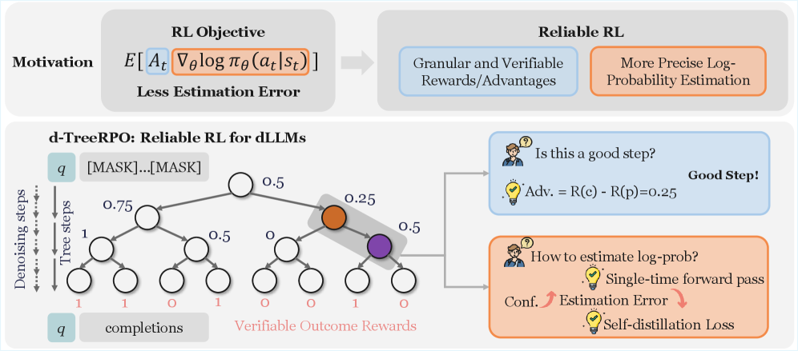

---
tags:
  - DLM
  - RL
  - REASONING
arxiv: https://arxiv.org/abs/2512.09675
github: https://github.com/THU-BPM/d-TreeRPO
website: ""
year: 2024
read: false
---

# d-TreeRPO: Towards More Reliable Policy Optimization for Diffusion Language Models

> **Links:** [arXiv](https://arxiv.org/abs/2512.09675) | [GitHub](https://github.com/THU-BPM/d-TreeRPO)
> **Tags:** #DLM #RL #REASONING

---

## Methodology

d-TreeRPO addresses two failure modes when applying RL to masked diffusion language models (DLMs):

1. **Reward sparsity** — standard GRPO assigns rewards only to fully decoded sequences, so intermediate decoding steps receive no training signal.
2. **Probability estimation gap** — estimating $\log \pi_\theta(c \mid p)$ (child given parent) requires summing log-probs across each masked position decoded, but for diffusion models the probability depends on the decoding order, creating inconsistency when using a single forward pass.

### Tree-Structured Rollouts

Rollouts are organized as trees with height $H$ and branching factor $B$. Each parent state $p$ is a partially decoded sequence; its $B$ children $C_p$ are independently sampled completions from $p$.

**Bottom-up reward assignment:**

$$R_p = \frac{1}{|C_p|} \sum_{c \in C_p} R_c$$

- $R_p$: scalar reward for parent state $p$, defined as the mean reward of its children.
- $R_c$: verifiable reward (e.g., correctness) for child completion $c$.
- $C_p$: set of $B$ children generated from $p$.

**Sibling-normalized advantage:**

$$A_p^c = R_c - R_p = R_c - \frac{1}{|C_p|} \sum_{c' \in C_p} R_{c'}$$

- $A_p^c$: advantage of transitioning from $p$ to $c$, comparing $c$ to its siblings.

This gives a dense reward signal: even intermediate states receive gradient proportional to how much better their completions are than the sibling average.

### Single-Pass Probability Estimation

For each parent-child transition $(p \to c)$, let $k$ newly decoded token positions be $d_1, \ldots, d_k$. The transition log-probability is approximated via one forward pass:

$$\widehat{\log \pi_\theta}(c \mid p) = \sum_{i=1}^{k} \log f_\theta^{d_i}(y^{d_i} \mid p)$$

- $f_\theta^{d_i}(y^{d_i} \mid p)$: model's predicted probability for token $y^{d_i}$ at position $d_i$, given masked context $p$.
- The paper proves the estimation error ratio $P(c\mid p)/\hat{P}(c\mid p)$ is bounded by $(1-\epsilon)^k$ and $\exp(k\epsilon/(1-\epsilon))$, converging to 1 as prediction confidence $\epsilon \to 0$.

### Time-Scheduled Self-Distillation

To reduce the estimation gap, a self-distillation auxiliary loss encourages the policy to become more confident (lower $\epsilon$). The teacher distribution is the current policy sharpened by temperature $\tau(t)$:

$$\mathcal{L}_{\text{distill}}(\theta) = \lambda(t) \cdot \mathbb{E}_{q,p} \left[\frac{1}{k}\sum_{i=1}^{k} D_{\text{KL}}\!\left(P_{\text{target}}^{\sigma_i}(\cdot) \,\|\, \pi_\theta^{\sigma_i}(\cdot\mid p)\right)\right]$$

- $P_{\text{target}}^{\sigma_i}$: sharpened (lower-temperature) copy of the current policy at masking step $\sigma_i$, used as a pseudo-label.
- $\sigma_i$: a specific masking order / decoding step index.
- $D_{\text{KL}}$: KL divergence, pushing the policy toward sharper predictions.

Schedules:

$$\tau(t) = \tau_{\max}\cdot\left(1 - \frac{t}{T}\right)^{\!\beta}, \qquad \lambda(t) = \lambda_{\max}\cdot\frac{e^{\gamma t/T}-1}{e^{\gamma}-1}$$

- $\tau(t)$: temperature for sharpening the teacher; starts high (softer) and decays toward 1.
- $\lambda(t)$: loss weight that grows exponentially to emphasize distillation later in training.
- $T$: total training steps; $\tau_{\max}=2$, $\beta=0.7$, $\lambda_{\max}=3\times10^{-3}$.

**Total loss:**

$$\mathcal{L}_{\text{d-TreeRPO}}(\theta) = \mathcal{L}_{\text{RL}}(\theta) + \mathcal{L}_{\text{distill}}(\theta)$$

where $\mathcal{L}_{\text{RL}}$ is a clipped importance-sampling policy gradient (GRPO-style) weighted by $A_p^c$.

---

## Experiment Setup

- **Base model:** LLaDA-8B-Instruct
- **Fine-tuning:** LoRA (rank $r=128$, scaling $\alpha=64$)
- **Optimizer:** AdamW, learning rate $3\times10^{-5}$
- **Generation:** 256 or 512 output tokens, block length $b=32$, denoising steps $N=128$
- **Tree:** height $H=2$, branch factor $B=4$
- **Rewards:** exact-match for Sudoku/Countdown; format + correctness for GSM8K/Math500
- **Hardware:** 8×H20 GPUs; convergence ~48 h
- **Baselines:** Diffu-GRPO, VRPO (LLaDA-1.5), wd1, SAPO, d2-stepMerge, TraceRL

---

## Results

### Main Results (accuracy %)

| Method | Sudoku 256 | Sudoku 512 | Countdown 256 | Countdown 512 | GSM8K 256 | GSM8K 512 | Math500 256 | Math500 512 |
|---|---|---|---|---|---|---|---|---|
| LLaDA-8B-Instruct | 6.7 | 5.5 | 19.5 | 16.0 | 76.7 | 78.2 | 32.4 | 36.2 |
| + Diffu-GRPO | 12.9 | 11.2 | 31.3 | 37.1 | 79.8 | 81.9 | 34.1 | 39.0 |
| + VRPO (LLaDA-1.5) | 12.8 | 9.6 | 22.3 | 18.0 | 80.1 | 81.5 | 35.6 | 34.8 |
| + wd1 | 25.2 | 24.2 | 51.2 | 46.1 | 80.8 | 82.3 | 34.4 | 39.0 |
| + SAPO | 20.3 | 16.1 | 52.0 | 56.3 | 80.6 | 82.1 | 33.8 | 38.4 |
| + d2-stepMerge | 76.1 | 66.2 | 52.4 | 52.1 | 81.1 | 82.0 | 34.4 | 38.5 |
| + TraceRL | 25.6 | 25.4 | 50.4 | 52.6 | 80.3 | 82.4 | 35.6 | 39.1 |
| **+ d-TreeRPO** | **92.9** | **80.3** | **71.1** | **62.1** | **81.2** | **82.6** | **37.7** | **38.9** |

*All methods fine-tune LLaDA-8B-Instruct. 256/512 = maximum generation length in tokens.*

### Ablation: Self-Distillation (256-token, accuracy %)

| Method | Sudoku | Countdown | GSM8K | Math500 |
|---|---|---|---|---|
| d-TreeRPO (full) | **92.9** | **71.1** | **81.2** | **37.7** |
| w/o distillation loss | 89.8 | 66.4 | 80.9 | 36.1 |
| w. diversity loss | 84.2 | 63.4 | 78.5 | 35.2 |

*"diversity loss" replaces self-distillation with an entropy-promoting term; hurts performance across all tasks.*

### Computational Overhead (Sudoku task)

| Method | Time/batch (s) | Model update (s) | Convergence (h) | Final acc (%) |
|---|---|---|---|---|
| Diffu-GRPO | 109 | 9.08 | ~24 | 12.9 |
| wd1 | 87 | 7.25 | ~24 | 25.2 |
| SAPO | 423 | 35.25 | ~72 | 20.3 |
| d2-stepMerge | 3456 | 288.00 | >72 | 76.1 |
| TraceRL | 604 | 43.14 | ~48 | 25.6 |
| **d-TreeRPO** | **598** | **9.96** | **~48** | **92.9** |

*d-TreeRPO matches d2-stepMerge's rollout cost but reduces model update time 29x via the single-pass estimator.*

---

## Related Papers

- [llada20](llada20.md)
- [llada21](llada21.md)
- [justgrpo](justgrpo.md)
- [mdlm](mdlm.md)
- [wino](wino.md)
