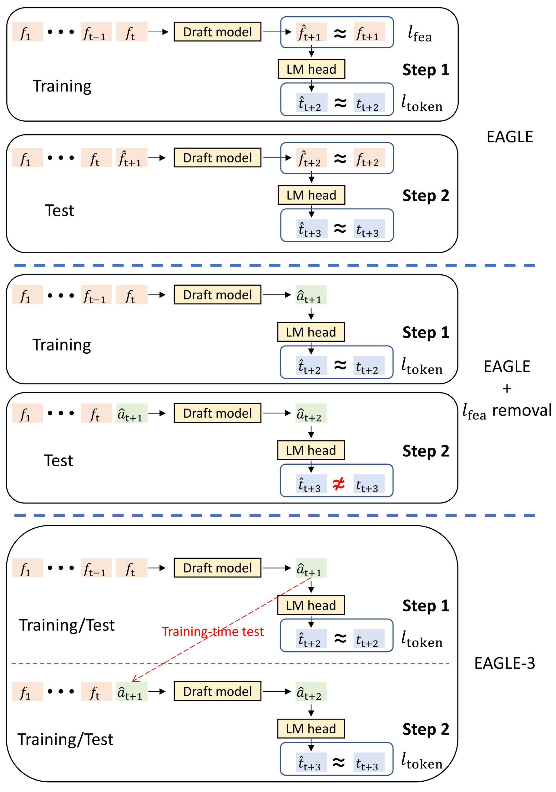

---
tags:
  - SPEC_DECODING
  - MLSYS
arxiv: "https://arxiv.org/abs/2503.01840"
github: "https://github.com/SafeAILab/EAGLE"
website: ""
year: 2025
read: false
---

# EAGLE-3: Scaling up Inference Acceleration of Large Language Models via Training-Time Test

> **Links:** [arXiv](https://arxiv.org/abs/2503.01840) | [GitHub](https://github.com/SafeAILab/EAGLE)
> **Tags:** #SPEC_DECODING #MLSYS

---

## Methodology

EAGLE-3 is a speculative decoding framework for autoregressive LLMs that addresses the data-scaling wall in EAGLE/EAGLE-2: adding more training data yields diminishing speedup gains because the draft model must predict *features* (target model's hidden states), constraining expressiveness.

### Key Changes from EAGLE-2

| Dimension | EAGLE-2 | EAGLE-3 |
|---|---|---|
| Prediction target | Top-layer feature + token | Token only |
| Loss | Feature regression + CE | CE only |
| Input features | Top-layer hidden state | Low + mid + high level features fused |
| Training procedure | Standard teacher-forcing | Training-time test (simulated multi-step) |
| Draft tree depth | 6 | 8 |

### Feature Fusion

EAGLE-3 extracts hidden states from three depth levels of the target model — low ($l$), mid ($m$), and high ($h$), each of dimension $k$. These are concatenated and projected:

$$g = \text{FC}([l\,;\,m\,;\,h]) \in \mathbb{R}^k$$

- $l, m, h \in \mathbb{R}^k$: hidden states pulled from a low, mid, and high layer of the *target* model (each has the target's hidden dimension $k$).
- $[\,;\,]$: vector concatenation ($\mathbb{R}^{3k}$); $\text{FC}$: a learned linear layer that projects back down to $\mathbb{R}^k$ so the draft model input has the original hidden size.
- $g$: the fused feature vector that the draft model consumes at each position.

This replaces EAGLE's reliance on only the topmost hidden state.

### Training-Time Test

The central novelty. During training, the draft model simulates inference-time autoregression: at step $t$, the draft model's own predicted token $\hat{x}_t$ (not the ground-truth token) is fed as input for step $t+1$. This closes the train–test distribution mismatch that causes acceptance rates to degrade when draft outputs deviate from true target features.

The attention mask is modified so each predicted position $\hat{x}_t$ can only attend to prior ground-truth context and prior predicted tokens. The loss is cross-entropy over the predicted tokens only:

$$\mathcal{L} = -\sum_t \log p_\theta(\hat{x}_{t+1} \mid \hat{x}_{\leq t},\, g_{\leq t})$$

where $g_t$ is the fused feature vector from the target model at position $t$.

### Draft Tree

Keeps the context-aware dynamic draft tree from EAGLE-2 (confidence-based pruning) but increases depth from 6 to 8 nodes, leveraging EAGLE-3's higher acceptance rates.

### Verification

Unchanged from EAGLE-2: standard speculative sampling with acceptance probability $\min\!\left(1,\;\dfrac{p(x)}{q(x)}\right)$ where $p$ is the target model and $q$ is the draft model.

---

## Experiment Setup

**Target models:** Vicuna-13B-v1.3, LLaMA-3.1-Instruct 8B/70B, LLaMA-3.3-Instruct 70B, DeepSeek-R1-Distill-LLaMA-8B

**Benchmarks:** MT-bench, HumanEval, GSM8K, Alpaca, CNN/DM

**Baselines:** Autoregressive (AR), EAGLE-2

**Production frameworks:** SGLang, vLLM

**Training data:**

| Split | Dataset | Size |
|---|---|---|
| Chat models | ShareGPT | ~68K |
| Chat models | UltraChat-200K | ~464K |
| Reasoning models | OpenThoughts-114k-math | ~114K |

Total ~8× more data than EAGLE-2.

**Hyperparameters:**

| Param | Value |
|---|---|
| Optimizer | AdamW ($\beta_1$=0.9, $\beta_2$=0.95) |
| Learning rate | 5e-5 |
| Gradient clipping | 0.5 |

---

## Results

### Speedup Ratios vs. AR Baseline (Temperature = 0)

| Model | MT-bench | HumanEval | GSM8K | Alpaca | CNN/DM | Mean |
|---|---|---|---|---|---|---|
| Vicuna-13B | 5.58× | 6.47× | 5.32× | 5.16× | 5.01× | **5.51×** |
| LLaMA-3.1-Inst 8B | 4.40× | 4.85× | 4.48× | 4.82× | 3.65× | **4.44×** |
| LLaMA-3.3-Inst 70B | 4.11× | 4.79× | 4.34× | 4.30× | 3.27× | **4.12×** |
| DeepSeek-R1-Distill 8B | 4.05× | 4.59× | 5.01× | 3.65× | 3.52× | **4.16×** |

EAGLE-3 achieves ~1.4× improvement over EAGLE-2 across all models.

### Vicuna-13B at Temperature = 1

| MT-bench | HumanEval | GSM8K | Alpaca | CNN/DM | Mean | Avg accept len |
|---|---|---|---|---|---|---|
| 4.57× | 5.15× | 4.71× | 4.49× | 4.33× | **4.65×** | 5.67 tokens |

### Production Throughput

| Framework | Batch Size | Throughput Gain |
|---|---|---|
| SGLang | 64 | **1.38×** |
| vLLM | 24 | **1.42×** |

### Ablations

| Variant | Effect |
|---|---|
| Remove training-time test | Data scaling stalls; reverts to EAGLE-2-level ceiling |
| Remove multi-layer fusion | Lower acceptance rates, especially on longer outputs |
| Remove both | ≈ EAGLE-2 baseline |

---

## Related Papers

- [dflash](dflash.md)
- [rcd](rcd.md)
- [dmax](dmax.md)