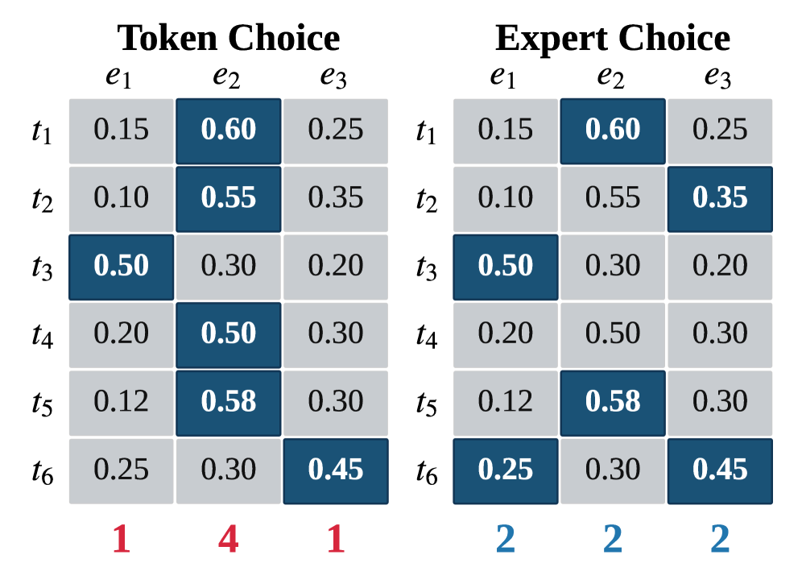

---
tags:
  - DLM
  - MLSYS
  - NLP
arxiv: "https://arxiv.org/abs/2604.01622"
github: "https://github.com/zhangshuibai/EC-DLM"
website: ""
year: 2026
read: false
---

# Expert-Choice Routing Enables Adaptive Computation in Diffusion Language Models

> **Links:** [arXiv](https://arxiv.org/abs/2604.01622) | [GitHub](https://github.com/zhangshuibai/EC-DLM)
> **Tags:** #DLM #MLSYS #NLP

---

## Methodology

### Problem: Token-Choice (TC) Routing is Ill-Suited for DLMs

Standard MoE DLMs use **token-choice (TC)** routing, where each token selects its top-$k$ experts. TC routing suffers from:
- **Load imbalance**: some experts are over-subscribed, others idle, requiring auxiliary balancing losses or capacity padding.
- **Dynamic memory allocation**: imbalanced token loads lead to high variance GPU memory usage (3.6 GB std vs. 0.0 GB for EC).
- **Poor throughput**: expert padding and rebalancing reduce GPU utilization (24.9--35.4 TFLOP/s/GPU for TC vs. 52.1 for EC).

### Expert-Choice (EC) Routing

Instead of tokens choosing experts, **each expert independently selects its top-$c$ tokens**:

$$\mathcal{T}_j = \operatorname{TopC}_i(S_{i,j},\, c), \quad \forall j \in \{1,\ldots,E\}$$

- $E$: total number of experts; $j$: expert index.
- $S_{i,j} = \mathbf{x}_i^\top \mathbf{w}_j$: dot-product gating score between token $i$ (hidden state $\mathbf{x}_i$) and expert $j$ (routing weight $\mathbf{w}_j$).
- $\operatorname{TopC}_i(\cdot, c)$: for fixed expert $j$, returns the token indices of the $c$ largest scores along the token dimension.
- $\mathcal{T}_j$: the set of $c$ tokens selected *by* expert $j$; $c$ is the per-expert capacity.

Final token representations aggregate expert outputs with softmax-normalized gates:

$$\mathbf{y}_i = \sum_{j:\, i \in \mathcal{T}_j} g_{i,j} \cdot \operatorname{FFN}_j(\mathbf{x}_i), \qquad g_{i,j} = \frac{\exp(S_{i,j})}{\sum_{j': i \in \mathcal{T}_{j'}} \exp(S_{i,j'})}$$

- $\mathbf{y}_i$: output hidden state for token $i$; sum ranges only over experts whose top-$c$ set contains $i$.
- $g_{i,j}$: softmax gate renormalized over the experts that actually selected token $i$ (not all $E$).
- $\operatorname{FFN}_j$: the $j$-th expert feed-forward network.

Capacity is set to $c = kN/E$ to match TC top-$k$ routing in expected FLOPs, where $N$ is the number of tokens and $E$ is the number of experts. EC **guarantees deterministic load balance by construction** with no auxiliary loss.

### Timestep-Dependent Expert Capacity

DLM denoising iterates over masking ratios $r \in [0,1]$. The key observation is that tokens in **low-$r$ (low-mask) steps exhibit 7--10$\times$ higher learning efficiency** (gradient signal per FLOP) than high-$r$ steps.

To exploit this, a **capacity scheduler** $k(r)$ varies expert capacity with masking ratio:

$$k(r) = \operatorname{clamp}\!\left(k_{\min} + (k_{\max} - k_{\min}) \cdot s(r),\ k_{\min},\ k_{\max}\right)$$

- $r \in [0,1]$: current masking ratio during denoising (fraction of masked tokens at this step).
- $k(r)$: per-token effective top-$k$ at mask ratio $r$; translates to expert capacity $c = k(r) N / E$.
- $s(r) \in [0,1]$: monotone schedule; linear-reverse $s(r) = 1 - r$ puts capacity at low $r$ (later denoising steps).
- $k_{\min}, k_{\max}$: capacity bounds; $\operatorname{clamp}$ keeps $k(r)$ inside them. For the 1B model: $k_{\min}=8$, $k_{\max}=32$, $\mathbb{E}[k]=20$. For the 8B-A1B model: $k_{\min}=2$, $k_{\max}=14$.

### Retrofitting TC to EC

A pretrained TC-DLM can be **retrofitted** to EC by replacing only the routing mechanism (routing weights reused, FFN expert weights frozen) and fine-tuning briefly. This achieves 1.3--1.5$\times$ faster inference decoding with comparable or improved downstream accuracy.

---

## Experiment Setup

**Models:**
- **1B model**: trained from scratch; 16 layers, hidden size 2048, 16 attention heads, 64 fine-grained experts (FFN hidden 1280), 2 shared experts; context length 2049.
- **8B-A1B model**: 8B total / 1B active parameters; same structural design, scaled up.

**Training:**
- **Optimizer**: AdamW, $\beta_1=0.9$, $\beta_2=0.95$
- **Learning rate**: $2\times10^{-4}$ with WSD (Warmup-Stable-Decay) schedule
- **Framework**: Megatron-LM with SwiGLU activations
- **Dataset**: Nemotron-CC; batch size 288 for 8B-A1B runs

**Baselines compared:**
- TC with capacity $\in \{1.0, 1.25, 1.5\}$
- TC (dropless): no token dropping, but high memory variance
- Static EC (fixed capacity $k=20$)
- Dynamic EC (linear-reverse scheduler)

**Downstream evaluation (retrofitting):** HumanEval, HumanEval+, GSM8K, MedQA.

---

## Results

### Training Throughput (1B model)

| Routing Variant | Throughput (TFLOP/s/GPU) | Relative to EC |
|---|---|---|
| EC (static) | 52.1 | 1.00x |
| TC (cap=1.0) | 35.4 | 0.68x |
| TC (cap=1.25) | 27.0 | 0.52x |
| TC (cap=1.5) | 25.9 | 0.50x |
| TC (dropless) | 24.9 | 0.48x |

EC reaches training loss 3.75 in **10.6h**, versus ~20.7h for any TC variant (~**2.0x faster** wall-clock convergence).

### Capacity Scheduler Ablation (OpenWebText, 1B model)

| Scheduler | $s(r)$ formula | PPL |
|---|---|---|
| Linear-reverse (best) | $1 - r$ | **36.5** |
| Static ($k=20$) | -- | 37.1 |
| Cosine-reverse | $(1+\cos\pi r)/2$ | 37.2 |
| Gaussian | $\tilde{g}(r)$ | 37.3 |
| Linear | $r$ | 37.5 |

*PPL = perplexity on OpenWebText (lower is better). All schedulers use the same expected capacity $\mathbb{E}[k]=20$. Linear-reverse biases compute toward low-mask-ratio steps ($r \approx 0$, near end of denoising); linear biases toward high-mask-ratio steps ($r \approx 1$, near start).*

### Retrofitting Results (TC to EC on pretrained DLM)

| Task | Metric | TC (base) | EC | Dynamic EC |
|---|---|---|---|---|
| HumanEval | Pass@1 (%) | 53.9 | 55.5 | **58.6** |
| HumanEval+ | Pass@1 (%) | 46.1 | 48.4 | **51.6** |
| GSM8K | Accuracy (%) | **74.8** | 73.8 | 73.8 |
| MedQA | Accuracy (%) | 35.6 | **36.7** | 35.7 |
| **Average** | **%** | 52.6 | 53.6 | **54.9** |

*Dynamic EC = EC with linear-reverse timestep-dependent capacity. Inference decoding is 1.3--1.5x faster than TC for both EC variants.*

---

## Related Papers

- [mdlm](mdlm.md)
- [wino](wino.md)
- [sdar](sdar.md)
- [rcd](rcd.md)
- [moe](moe.md)
- [switch](switch.md)
