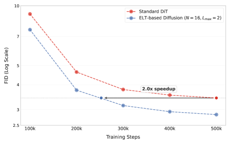

---
tags:
  - VISION
  - MLSYS
  - DEEP_LEARNING
arxiv: https://arxiv.org/abs/2604.09168
github: ""
website: ""
year: 2026
read: false
---

# ELT: Elastic Looped Transformers for Visual Generation

> **Links:** [arXiv](https://arxiv.org/abs/2604.09168)
> **Tags:** #VISION #MLSYS #DEEP_LEARNING

---

## Methodology

ELT replaces deep stacks of unique transformer layers with a weight-shared recurrent design. $N$ unique transformer blocks are applied $L$ times (loops) for an effective depth of $N \times L$, drastically reducing parameter count while maintaining compute budget.

### Core Architecture

- $N$ unique transformer blocks, looped $L$ times → effective depth $N \times L$
- Identical weights shared across all loop iterations
- At inference, loop count $L$ can be chosen freely (any-time elasticity)
- Under iso-compute, ELT uses 4× fewer parameters than equivalent non-looped baselines

### Intra-Loop Self Distillation (ILSD)

Standard looped transformers suffer when inference $L \neq$ training $L_{max}$: intermediate loop states are never trained to produce valid outputs. ILSD fixes this by treating the model as a teacher–student pair within each forward pass:

**Teacher path:** full $L_{max}$ loops, producing output $F_{(N,L_{max})}(x)$.

**Student path:** early exit at randomly sampled $L_{int} \sim \mathcal{U}(L_{min}, L_{max})$, producing $F_{(N,L_{int})}(x)$.

**Combined loss:**

$$\mathcal{L}^{\text{ILSD}}_\Theta = \mathcal{L}^{\text{GT}}\!\left(F_{(N,L_{max})}(x),\,y\right) + \lambda\,\mathcal{L}^{\text{GT}}\!\left(F_{(N,L_{int})}(x),\,y\right) + (1-\lambda)\,\mathcal{L}^{\text{dist}}\!\left(F_{(N,L_{int})}(x),\;\text{sg}\!\left(F_{(N,L_{max})}(x)\right)\right)$$

- $\Theta$: shared parameters across all loop iterations (one copy).
- $F_{(N,L)}(x)$: forward pass with $N$ unique blocks looped $L$ times on input $x$; $y$: ground-truth label / token.
- $L_{max}$: training-time loop count (teacher path); $L_{int} \sim \mathcal{U}(L_{min}, L_{max})$: random student exit loop.
- $\mathcal{L}^{\text{GT}}$: standard supervised loss against $y$; $\mathcal{L}^{\text{dist}}$: distillation loss between student and teacher (type depends on modality — see table below).
- $\lambda \in [0,1]$: linearly decays $1 \to 0$ during training — early phases anchor the student to ground truth, later phases shift to teacher mimicry.
- $\text{sg}(\cdot)$: stop-gradient applied to the teacher output so its path does not receive distillation gradient.

**Distillation loss by model type:**

| Model type | $\mathcal{L}^{\text{dist}}$ |
|---|---|
| Masked generative (MaskGIT-style) | Cross-entropy: $-\sum_{i \in \text{Mask}}\sum_{v \in \mathcal{V}} P_{(N,L_{max})}(v \mid x_{\text{mask}}) \log P_{(N,L_{int})}(v \mid x_{\text{mask}})$ |
| Diffusion (DiT-style) | Sigmoid-weighted MSE: $w(t)\,\lVert F_{(N,L_{max})}(x_t) - F_{(N,L_{int})}(x_t)\rVert_2^2$ |

**Training procedure (per iteration):**
1. Sample $L_{int} \sim \mathcal{U}(L_{min}, L_{max})$
2. Forward pass through all $L_{max}$ loops; capture intermediate representation at loop $L_{int}$
3. Compute ground-truth loss on both teacher ($L_{max}$) and student ($L_{int}$) outputs
4. Compute distillation loss comparing student to teacher (teacher is stop-gradiented)
5. Backprop through shared weights $\Theta$ via combined gradients

---

## Experiment Setup

### Model Scales (MaskGIT framework, ImageNet 256×256)

| Scale | $d_\text{model}$ | MLP dim | Heads | Unique layers $N$ | Loops $L$ |
|---|---|---|---|---|---|
| L  | 1024 | 4096 | 16 | 8 | 3 |
| L  | 1024 | 4096 | 16 | 12 | 2 |
| XL | 1152 | 4608 | 16 | 7 | 4 |

### Training Hyperparameters

**Masked Generative Models (MaskGIT-style, ImageNet 256×256):**

| Hyperparameter | Value |
|---|---|
| Batch size | 512 |
| Learning rate | $10^{-4}$ |
| Optimizer | AdamW ($\beta_1{=}0.9$, $\beta_2{=}0.96$) |
| Weight decay | $4.5 \times 10^{-2}$ |
| Training epochs | 270 |
| Label dropout | 10% |
| Sampling temperature bias / scale | 0.5 / 0.8 |

**Diffusion Models (DiT-style, ImageNet 256×256):**

| Hyperparameter | Value |
|---|---|
| Batch size | 512 |
| Learning rate | $10^{-4}$ |
| Optimizer | AdamW ($\beta_1{=}0.9$, $\beta_2{=}0.99$) |
| Weight decay | $0.01$ |
| Training steps | 500K |
| Sampler | 512-step DDPM, CFG scale 3.0 |
| Noise schedule | Shifted cosine |

**Baselines:** MaskGIT-Lg/XL (VQGAN tokenizer), DiT-XL/2, MAGVIT-L (video).

---

## Results

### ImageNet 256×256 Class-Conditional Image Generation (Masked Generative)

| Model | FID ↓ | IS ↑ | Params | Steps | GFLOPs |
|---|---|---|---|---|---|
| MaskGIT-Lg | 2.1 | 270.1 | 303M | 24 | 3.7k |
| MaskGIT-XL | 2.0 | 294.8 | 446M | 24 | 3.9k |
| **ELT-L (8N×3L)** | **2.2** | **254.3** | **101M** | 24 | 3.7k |
| **ELT-L (12N×2L)** | **2.1** | **281.8** | **152M** | 24 | 3.7k |
| **ELT-XL (7N×4L)** | **2.0** | **266.1** | **111M** | 24 | 3.9k |

*ELT-XL matches MaskGIT-XL FID (2.0) at iso-compute with 4× fewer parameters (111M vs 446M). IS = Inception Score. GFLOPs are total inference FLOPs for 24 decoding steps.*

### ImageNet 256×256 Class-Conditional Image Generation (Diffusion / DiT)

| Model | FID ↓ | Params | Depth $\mathcal{D}$ |
|---|---|---|---|
| DiT – 16 layers | 3.87 | 1.1B | 16 |
| DiT – 32 layers | 3.43 | 2.1B | 32 |
| ELT (1N×32L) | 10.30 | 69M | 32 |
| ELT (4N×8L) | 3.96 | 271M | 32 |
| **ELT (8N×4L)** | **3.16** | **539M** | 32 |
| **ELT (16N×2L)** | **2.83** | **1.1B** | 32 |

*ELT (16N×2L) outperforms DiT-32 (2.83 vs 3.43 FID) at iso-compute and iso-parameters; ELT (8N×4L) achieves better FID than DiT-32 with only half the parameters.*

*$N$ = unique (non-shared) layers; $L$ = loop count; Depth $\mathcal{D} = N \times L$.*

### UCF-101 Class-Conditional Video Generation

| Model | FVD ↓ | IS ↑ | Params | Steps | GFLOPs |
|---|---|---|---|---|---|
| MaGNeTS | 96.4±2 | 88.53±0.20 | 306M | 12 | ~1.7k |
| MAGVIT-L | 76±2 | 89.27±0.15 | 306M | 12 | ~4.3k |
| **ELT (6N×4L)** | **72.8±2.5** | **88.27±0.33** | **76M** | 12 | ~4.3k |
| **ELT (6N×6L)** | **60.8±2.7** | **87.88±0.39** | **76M** | 24 | ~13k |

*ELT (6N×4L) achieves better FVD than MAGVIT-L with 4× fewer parameters (76M vs 306M). FVD = Fréchet Video Distance (lower is better).*

### Throughput (TPU v6e, MaskGIT framework)

| Config | Scale | Throughput vs B |
|---|---|---|
| 6N×2L | B (base) | 1.0× |
| 8N×3L | L | 2.9× |
| 7N×4L | XL | 3.3× |
| 8N×4L | H | 3.5× |

*Throughput gains arise from reduced parameter count: smaller ELT models achieve higher accelerator utilisation under the same GFLOPs budget.*

### Ablation: Effect of ILSD

ILSD is essential for elastic inference. Without ILSD, generation quality degrades sharply when inference $L \neq L_{max}$. With ILSD, quality degrades gracefully across $[L_{min}, L_{max}]$, enabling compute–quality trade-offs at zero retraining cost.
