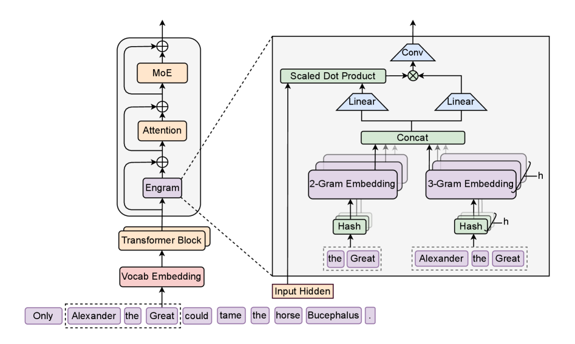
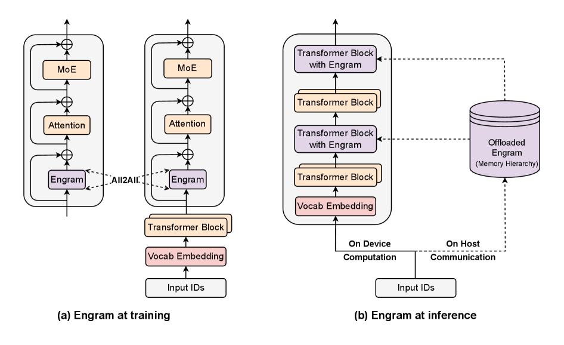
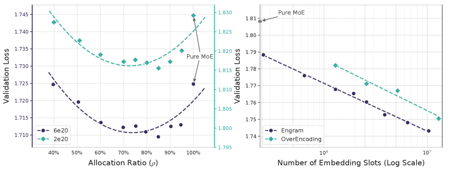
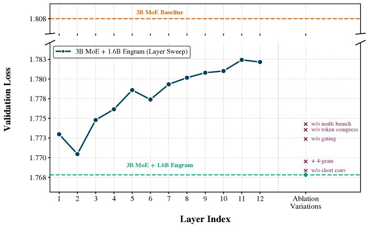
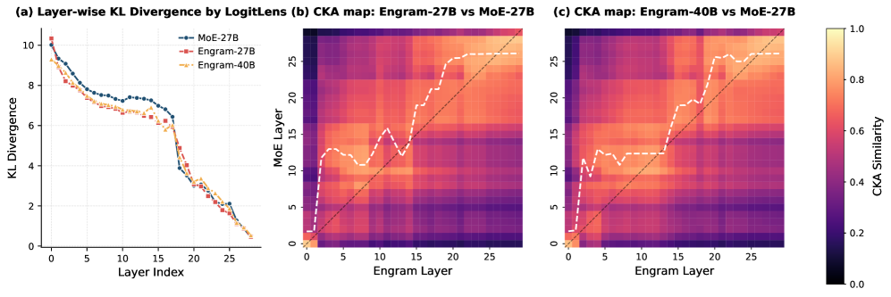
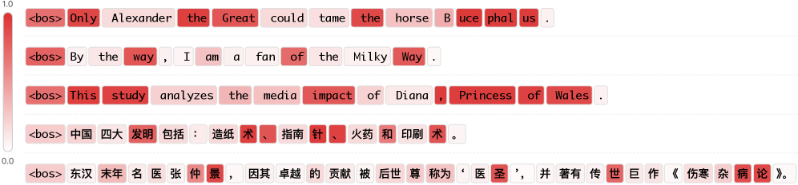

---
tags:
  - MLSYS
  - NLP
arxiv: https://arxiv.org/abs/2601.07372
github: https://github.com/deepseek-ai/Engram
website: ""
year: 2026
read: false
---

# Conditional Memory via Scalable Lookup: A New Axis of Sparsity for Large Language Models

> **Links:** [arXiv](https://arxiv.org/abs/2601.07372) | [GitHub](https://github.com/deepseek-ai/Engram)
> **Tags:** #MLSYS #NLP

---

## Methodology

Engram adds a **conditional memory module** to a transformer backbone that retrieves static NN-gram embeddings in O(1) and fuses them with dynamic hidden states. This creates a new sparsity axis — static memory — orthogonal to MoE's dynamic compute sparsity.

### Phase 1 — Sparse Retrieval via Hashed NN-grams

Tokenizer compression first collapses semantically equivalent tokens (23% vocabulary reduction via normalized IDs). Then K hash functions map each NN-gram context to an embedding table index:

$$z_{t,n,k} \triangleq \phi_{n,k}(g_{t,n}), \quad e_{t,n,k} = E_{n,k}[z_{t,n,k}]$$

$$e_t \triangleq \|_{n=2}^{N} \|_{k=1}^{K} e_{t,n,k}$$

- $g_{t,n}$: compressed NN-gram ending at position $t$ of order $n$
- $\phi_{n,k}$: $k$-th hash function for order $n$, mapping to an integer index
- $E_{n,k}$: embedding table for head $(n,k)$; lookup is deterministic (no neural routing)
- $e_t$: final retrieved embedding, formed by concatenating all $N \times K$ heads
- Orders $n = 2 \ldots N$ and heads $k = 1 \ldots K$ allow multi-scale, multi-hash coverage

### Phase 2 — Context-Aware Gating

The retrieved static embedding is modulated by the current hidden state $h_t$ before injection:

$$k_t = W_K e_t, \quad v_t = W_V e_t$$

$$\alpha_t = \sigma\!\left(\mathrm{RMSNorm}(h_t)^\top \mathrm{RMSNorm}(k_t) / \sqrt{d}\right)$$

- $W_K, W_V$: learned projections mapping the static embedding into key and value spaces
- $\alpha_t \in (0,1)$: scalar gate controlling how much of the static memory is injected
- $\sigma$: sigmoid; inner product after RMSNorm prevents scale drift

After gating, a lightweight depthwise causal convolution mixes neighboring retrieved values:

$$Y = \mathrm{SiLU}(\mathrm{Conv1D}(\mathrm{RMSNorm}(\tilde{V}))) + \tilde{V}$$

- $\tilde{V}$: gated value tensor ($\alpha_t \cdot v_t$ stacked across positions)
- Conv1D: depthwise causal convolution, kernel size 4, dilation = max NN-gram order $N$
- Residual `+ \tilde{V}` ensures the convolution only adds, never destroys, retrieved content

### Integration

Engram is inserted at two layers (layers 2 and 15 in 30-layer models). In multi-branch architectures (e.g., MoE), branch-specific gating uses learnable connection weights.

**Training sharding:** embedding tables are replicated across data-parallel ranks, avoiding MoE-style all-to-all communication.
**Inference prefetching:** retrieval indices are computed deterministically before the forward pass; host-memory prefetching overlaps with GPU computation of preceding layers. A multi-level cache (HBM → Host DRAM → NVMe) exploits the Zipfian distribution of NN-gram frequencies — 100B parameters offloaded to host DRAM incur <3% throughput penalty.

### MoE–Engram Sparsity Allocation

Given total sparse parameter budget $P_{\mathrm{sparse}}$ and mix ratio $\rho$:

$$P_{\mathrm{MoE}}^{(\mathrm{sparse})} = \rho \cdot P_{\mathrm{sparse}}, \quad P_{\mathrm{Engram}} = (1-\rho) \cdot P_{\mathrm{sparse}}$$

- $\rho$: fraction allocated to MoE experts
- $(1-\rho)$: fraction allocated to Engram embedding tables

The paper identifies a **U-shaped scaling law** for downstream loss as a function of $\rho$, with an optimal balance between neural computation and static memory.

---

## Experiment Setup

**Model configurations:**

| Model | Total Params | Architecture |
|---|---|---|
| Dense-4B | 4.1B | Dense transformer |
| MoE-27B | 26.7B | 72 routed + 2 shared experts, top-6 |
| Engram-27B | 26.7B | 55 routed experts + 5.7B Engram |
| Engram-40B | 39.5B | 55 routed experts + 18.5B Engram |

**Training hyperparameters:**

| Hyperparameter | Value |
|---|---|
| Training tokens | 262B |
| Sequence length | 4,096 |
| Vocabulary size | 129,280 |
| Backbone optimizer | Muon |
| Embedding optimizer | Adam |
| Base LR | 4e-4 |
| Embedding LR multiplier | 5x |
| Weight decay (backbone / embedding) | 0.1 / 0.0 |
| Engram hidden dim | 1,280 |
| Engram heads ($K$) | 8 |
| NN-gram orders ($N$) | 2–3 |
| Engram insertion layers | [2, 15] |
| Conv kernel size | 4 |
| mHC expansion rate | 4 |

---

## Results

### Main Results

Engram-27B (iso-parameter to MoE-27B) consistently outperforms the MoE baseline:

| Benchmark | Dense-4B | MoE-27B | Engram-27B | Engram-40B |
|---|---|---|---|---|
| Pile (loss) | 2.091 | 1.960 | 1.950 | 1.942 |
| MMLU | 48.6 | 57.4 | 60.4 | 60.6 |
| MMLU-Redux | 50.7 | 60.6 | 64.0 | 64.5 |
| MMLU-Pro | 21.1 | 28.3 | 30.1 | 31.3 |
| CMMLU | 47.9 | 57.9 | 61.9 | 63.4 |
| C-Eval | 46.9 | 58.0 | 62.7 | 63.3 |
| AGIEval | 29.1 | 38.6 | 41.8 | 45.9 |
| ARC-Easy | 76.8 | 86.5 | 89.0 | 90.1 |
| ARC-Challenge | 59.3 | 70.1 | 73.8 | 76.4 |
| BBH (EM) | 42.8 | 50.9 | 55.9 | 57.5 |
| DROP (F1) | 41.6 | 55.7 | 59.0 | 60.7 |
| HumanEval | 26.8 | 37.8 | 40.8 | 38.4 |
| GSM8K (EM) | 35.5 | 58.4 | 60.6 | 62.6 |
| MATH (EM) | 15.2 | 28.3 | 30.7 | 30.6 |

*MoE-27B and Engram-27B have the same 26.7B total parameters (iso-parameter comparison). Engram-27B replaces some MoE experts with a static Engram table.*

### Long-Context Retrieval

| Model | Context | LongPPL Book | RULER Multi-Query NIAH | Variable Tracking |
|---|---|---|---|---|
| MoE-27B | 50k | 4.38 | 84.2 | 77.0 |
| Engram-27B | 41k | 4.37 | 89.5 | 83.2 |
| Engram-27B | 50k | 4.14 | 97.0 | 89.0 |

*LongPPL = perplexity on long book passages (lower is better). RULER = retrieval benchmark scores in % (higher is better). NN-gram embeddings act as persistent token-level anchors across long spans.*

### Inference Overhead

| Model | Base (tok/s) | +100B Engram (tok/s) | Overhead |
|---|---|---|---|
| 4B-Dense | 9,031.62 | 8,858.28 | -1.9% |
| 8B-Dense | 6,315.52 | 6,140.02 | -2.8% |

*100B Engram table offloaded to host DRAM; prefetching overlaps GPU compute on preceding layers.*

### Ablations

Architecture ablation across gating and convolution variants; the full model (context-aware gating + causal conv) achieves best trade-off.

Representational alignment analysis (KL divergence + CKA heatmaps) showing Engram hidden states are complementary to the backbone.

Gating heatmap ($\alpha_t$ over token positions): gates open on knowledge-dense tokens (named entities, dates, technical terms) and close on structural tokens (punctuation, function words).

---

## Related Papers

- [deepseekmoe](deepseekmoe.md)
- [moe](moe.md)
- [dsv3](dsv3.md)
