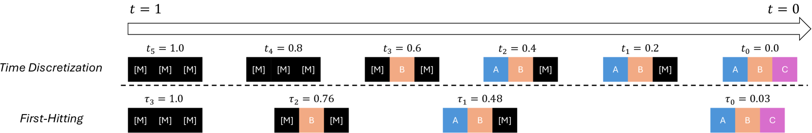

---
tags:
  - DLM
  - THEORY
  - NLP
arxiv: "https://arxiv.org/abs/2409.02908"
github: ""
website: ""
year: 2024
read: false
---

# Masked Diffusion Models are Secretly Time-Agnostic Masked Models and Exploit Inaccurate Categorical Sampling

> **Links:** [arXiv](https://arxiv.org/abs/2409.02908)
> **Tags:** #DLM #THEORY #NLP

---

## Methodology

### Core Claim: MDMs are Time-Agnostic

The paper shows that masked diffusion models (MDMs) are theoretically and empirically equivalent to plain masked models — the time variable plays no role.

**Training equivalence.** The continuous-time ELBO for MDMs with linear noise schedule $\alpha_t = 1 - t$ reduces to a discrete sum over masked-token counts $n$:

$$\mathcal{L}_\infty^{(L)} = -\sum_{n=1}^{L} \mathbb{E}_{\tilde{q}_{n|0}} \left[ \frac{1}{n} \sum_{l:\, x_n^{(l)} = \mathtt{m}} \mathbf{e}_{x_0^{(l)}}^\top \log \bar{\boldsymbol{\mu}}_\theta^{(l)}(\mathbf{x}_n) \right]$$

- $L$: sequence length.
- $n$: number of currently masked tokens; outer sum runs over all possible mask counts.
- $\tilde{q}_{n|0}$: marginal distribution over sequences with exactly $n$ masked positions given clean sequence $x_0$.
- $\mathtt{m}$: mask token.
- $\mathbf{e}_{x_0^{(l)}}$: one-hot target for position $l$.
- $\bar{\boldsymbol{\mu}}_\theta^{(l)}(\mathbf{x}_n)$: model predicted token distribution at position $l$; no time argument needed — the optimal parameterization is time-independent: $\bar{\boldsymbol{\mu}}_{\theta^*}(\mathbf{x}) = \mathbb{E}[\mathbf{e}_{x_0}]$.
- Weight $1/n$ is analogous to standard diffusion noise reweighting.

The loss is identical to a masked-language-model loss with a per-mask-count weighting, confirming that MDM training is purely about masked token prediction.

### Numerical Precision Issue in Categorical Sampling

Gumbel-based categorical sampling on 32-bit floats accumulates rounding errors that effectively lower the sampling temperature when NFE exceeds ~2,000. This causes:
- Generative perplexity to drop artificially (to ~15).
- Token entropy to monotonically decrease toward 0, collapsing output diversity.

Previously reported MDM superiority over autoregressive models at high NFE budgets is shown to be an artifact of this precision issue, not genuine quality.

### First-Hitting Sampler (FHS)

FHS replaces the original $N$-step sampler with an equivalent procedure that unmasks exactly one token per step, requiring exactly $L$ network evaluations.

**Algorithm:**

1. Initialize: $\mathbf{x} = [\mathtt{m}, \ldots, \mathtt{m}]$ (all masked), set $\tau_L = 1$.
2. For $n = L, L-1, \ldots, 1$:
   a. Sample $u_n \sim \text{Uniform}(0, 1)$.
   b. Compute the next unmasking time:
      $$\tau_{n-1} = \alpha^{-1}\!\left(1 - u_n^{1/n}\,(1 - \alpha_{\tau_n})\right)$$
      - $\tau_n$: continuous time when $n$ masked tokens remain.
      - $\alpha^{-1}$: inverse noise schedule; for linear schedule $\alpha_t = 1-t$, $\alpha^{-1}(p) = 1-p$.
      - $u_n^{1/n}$: encodes the first-hitting time at which the $n$-th token gets unmasked.
   c. Query the network: $\bar{\boldsymbol{\mu}}_\theta(\mathbf{x})$ (time-independent, no $t$ input needed).
   d. Uniformly sample one masked position $l^*$ from the $n$ currently masked positions.
   e. Sample $x_{l^*} \sim \text{Cat}(\bar{\boldsymbol{\mu}}_\theta^{(l^*)}(\mathbf{x}))$ and unmask it.
3. Return $\mathbf{x}$.

**Complexity:** $\mathcal{O}(L|\mathcal{X}|)$ vs. $\mathcal{O}(NL|\mathcal{X}|)$ for the original $N$-step sampler — up to **20× speedup** at equivalent quality.

**Variants:** Parallel FHS variants unmask multiple tokens per step, trading slight quality for additional throughput.

---

## Experiment Setup

- **Models:** SEDD Absorb, MDLM (masked diffusion LMs trained on OpenWebText).
- **Baselines:** Autoregressive language models (ARMs) at varying inference budgets.
- **Metrics:** Generative perplexity (Gen PPL), token entropy (diversity), NFE, wall-clock sampling time.
- **Caching baseline:** Network output reused when sequence is unchanged between steps, reducing NFE to $L$.

---

## Results

### Sampling Speed

| Sampler | NFE | Relative Speedup |
|---|---|---|
| Original ($N$-step, $N{=}1000$) | ${\sim}1000$ | 1× |
| Original + caching | ${\sim}L$ | up to 20× |
| FHS (proposed) | $L$ | up to 20× |

FHS matches the caching-based original at $L$ NFE while being theoretically exact and avoiding batching failures.

### Generative Quality vs. Diversity

| Sampler / Model | Gen PPL (high NFE) | Entropy Behavior |
|---|---|---|
| ARM | ~20–25 (stable) | Stable, high diversity |
| MDM — original 32-bit Gumbel, $N{=}50\text{k}$ | ~15 (artificially low) | Monotonically → 0 |
| MDM — FHS or corrected sampling | ~20–25 | Stable |

*Gen PPL: lower is better. Entropy: higher indicates more diverse outputs. The MDM apparent advantage at high NFE is an artifact of 32-bit Gumbel precision errors, not genuine quality improvement.*

### Effect of Sampling Precision (Ablation)

Switching from 32-bit to 64-bit Gumbel sampling, or using FHS (which avoids iterative Gumbel operations entirely), restores entropy to expected levels — confirming the numerical-precision root cause.

---

## Related Papers

- [mdlm](mdlm.md)
- [llada20](llada20.md)
- [llada21](llada21.md)
- [wino](wino.md)
- [ecdlm](ecdlm.md)
- [idlm](idlm.md)
- [sdar](sdar.md)
