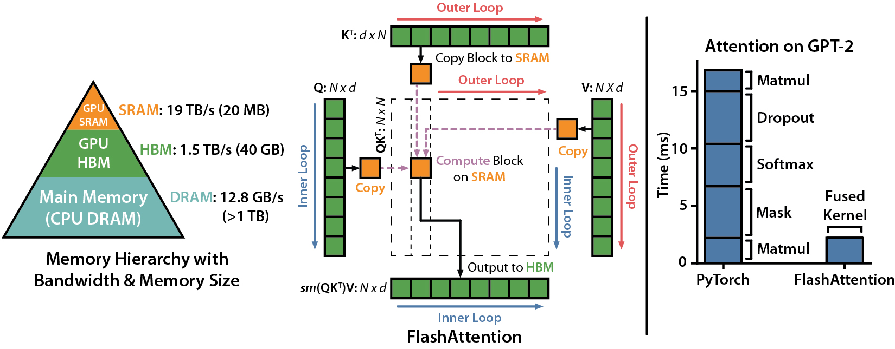

---
tags:
  - MLSYS
arxiv: "https://arxiv.org/abs/2205.14135"
github: "https://github.com/Dao-AILab/flash-attention"
website: ""
year: 2022
read: false
---

# FlashAttention

> **Links:** [arXiv](https://arxiv.org/abs/2205.14135) | [GitHub](https://github.com/Dao-AILab/flash-attention)
> **Tags:** #MLSYS

---

## Methodology

FlashAttention is an **IO-aware exact attention algorithm** that computes $\text{softmax}(QK^\top / \sqrt{d})V$ without materializing the full $N \times N$ attention matrix in GPU HBM, reducing memory access from $\Theta(Nd + N^2)$ to $\Theta(N^2 d^2 M^{-1})$ where $M$ is the SRAM size.

### Standard Attention Bottleneck

Standard attention writes three $N \times N$ matrices ($S$, $P$, dropout mask) to HBM during the forward pass and re-reads them during the backward pass. This is **memory-bound**: for $N=1024$, $d=64$ on A100, HBM reads/writes are 40.3 GB vs. 4.4 GB for FlashAttention, reducing runtime from 41.7 ms to 7.3 ms despite FlashAttention having higher FLOP count (75.2 vs. 66.6 GFLOPs due to recomputation).

### Core Techniques

**1. Tiling (blocked softmax)**

Split $Q, K, V \in \mathbb{R}^{N \times d}$ into blocks of size $B_r \times d$ and $B_c \times d$ that fit in SRAM. Use the online softmax decomposition to accumulate the output one block at a time without global normalization.

For numerically stable softmax with running statistics:

$$m(x) \triangleq \max_i x_i, \quad \ell(x) \triangleq \sum_i e^{x_i - m(x)}, \quad \text{softmax}(x) = \frac{e^{x - m(x)}}{\ell(x)}$$

For concatenated inputs $x = [x^{(1)}, x^{(2)}]$:

$$m([x^{(1)}, x^{(2)}]) = \max(m(x^{(1)}), m(x^{(2)}))$$
$$\ell([x^{(1)}, x^{(2)}]) = e^{m(x^{(1)}) - m(x)} \ell(x^{(1)}) + e^{m(x^{(2)}) - m(x)} \ell(x^{(2)})$$

Each block's partial output $\tilde{O}_i$ is rescaled by the correct normalization before accumulation.

**2. Recomputation (gradient checkpointing)**

Rather than storing the $N \times N$ matrices $S, P$ for the backward pass, FlashAttention stores only:
- Output $O \in \mathbb{R}^{N \times d}$
- Softmax normalization statistics $(m, \ell) \in \mathbb{R}^N$

During backprop, $S$ and $P$ are **recomputed on-the-fly** from $Q, K$ blocks. The backward pass uses auxiliary scalar $D_i = do_i^\top o_i$ to compute gradients:

$$dq_i = \sum_j P_{ij}(dP_{ij} - D_i) k_j, \qquad dk_j = \sum_i P_{ij}(dP_{ij} - D_i) q_i$$

This trades extra FLOPs for drastically fewer HBM reads/writes.

**3. IO Complexity**

> **Theorem.** Standard attention requires $\Theta(Nd + N^2)$ HBM accesses. FlashAttention requires $\Theta(N^2 d^2 M^{-1})$ HBM accesses. For typical $d \in \{64, 128\}$ and $M \approx 100\text{ KB}$, $d^2 \ll M$, giving an order-of-magnitude reduction.

This bound is **tight**: no exact attention algorithm can asymptotically improve on $\Omega(N^2 d^2 M^{-1})$ HBM accesses for all SRAM sizes $M \in [d, Nd]$.

### Block-Sparse FlashAttention

Extends FlashAttention to support a sparsity mask: blocks indicated as zero are entirely skipped. For sparsity ratio $s$, HBM accesses reduce by factor $s$ and runtime scales linearly in $N$.

### Block Sizes

- $B_c = \lceil M / (4d) \rceil$, $B_r = \min(\lceil M / (4d) \rceil, d)$
- On A100 (192 KB SRAM per SM, $d=64$): $B_c = B_r = 256$ saturates SRAM
- Runtime bottleneck shifts from memory to arithmetic beyond block size 256

---

## Experiment Setup

- **Hardware:** 8xA100 40GB GPUs
- **BERT-large:** trained on Wikipedia to 72.0% MLM accuracy (MLPerf 1.1 target), seq. length 512
- **GPT-2 small/medium:** trained on OpenWebText, compared against HuggingFace and Megatron-LM baselines
- **Long-range Arena (LRA):** 5 tasks (ListOps, Text, Retrieval, Image, Pathfinder), seq. lengths 1024-4096
- **Long-document classification:** MIMIC-III and ECtHR datasets, seq. lengths up to 16384
- **Path-X / Path-256:** pixel-level path-following tasks, seq. lengths 16384 / 65536
- **Attention benchmarks:** A100 80GB, head dimension $d=64$, batch size 64, 12 heads

---

## Results

### Training Speed

| Model | Implementation | Perplexity / Accuracy | Training Time | Speedup |
|---|---|---|---|---|
| BERT-large | Nvidia MLPerf 1.1 | 72.0% MLM | 20.0 +/- 1.5 min | 1.0x |
| BERT-large | FlashAttention | 72.0% MLM | **17.4 +/- 1.4 min** | **1.15x** |
| GPT-2 small | HuggingFace | 18.2 ppl | 9.5 days | 1.0x |
| GPT-2 small | Megatron-LM | 18.2 ppl | 4.7 days | 2.0x |
| GPT-2 small | FlashAttention | 18.2 ppl | **2.7 days** | **3.5x** |
| GPT-2 medium | HuggingFace | 14.2 ppl | 21.0 days | 1.0x |
| GPT-2 medium | Megatron-LM | 14.3 ppl | 11.5 days | 1.8x |
| GPT-2 medium | FlashAttention | 14.3 ppl | **6.9 days** | **3.0x** |

### Long-Range Arena

| Model | ListOps | Text | Retrieval | Image | Pathfinder | Avg | Speedup |
|---|---|---|---|---|---|---|---|
| Transformer | 36.0 | 63.6 | 81.6 | 42.3 | 72.7 | 59.3 | - |
| FlashAttention | 37.6 | 63.9 | 81.4 | 43.5 | 72.7 | 59.8 | 2.4x |
| Block-sparse FlashAttention | 37.0 | 63.0 | 81.3 | 43.6 | 73.3 | 59.6 | **2.8x** |
| Linformer | 35.6 | 55.9 | 77.7 | 37.8 | 67.6 | 54.9 | 2.5x |
| Performer | 36.8 | 63.6 | 82.2 | 42.1 | 69.9 | 58.9 | 1.8x |

### Attention Runtime Benchmark (fwd+bwd, ms, A100 80GB, $d=64$)

| Method | 128 | 256 | 512 | 1024 | 2048 | 4096 | 8192 | 65536 |
|---|---|---|---|---|---|---|---|---|
| PyTorch Attention | 0.67 | 0.70 | 1.18 | 3.67 | 13.22 | 50.44 | OOM | OOM |
| Megatron | 0.74 | 0.65 | 1.23 | 3.80 | 13.21 | OOM | OOM | OOM |
| Linformer | 1.31 | 1.25 | 1.30 | 1.29 | 3.20 | 6.10 | 11.93 | 100.52 |
| **FlashAttention** | **0.31** | **0.31** | **0.73** | 2.29 | 7.64 | 30.09 | 118.50 | 7492.85 |
| **Block-sparse FlashAttention** | 0.74 | 0.77 | 0.82 | **0.88** | **1.71** | **3.21** | **6.56** | **50.39** |

### Memory Usage (MB, A100 80GB, $d=64$)

| Method | 512 | 1024 | 2048 | 4096 | 8192 | 16384 |
|---|---|---|---|---|---|---|
| PyTorch Attention | 336 | 1184 | 4416 | 17024 | OOM | OOM |
| **FlashAttention** | **104** | **209** | **418** | **836** | **1672** | **3344** |

FlashAttention memory scales **linearly** in $N$ vs. quadratic for standard attention.

### Path-X / Path-256 (sequence classification accuracy)

| Model | Path-X (16K) | Path-256 (64K) |
|---|---|---|
| All prior Transformers and sparse variants | random | random |
| FlashAttention | **61.4** | random |
| Block-sparse FlashAttention | 56.0 | **63.1** |

### Long-document Classification (micro-F1)

| Dataset | 512 | 1024 | 2048 | 4096 | 8192 | 16384 |
|---|---|---|---|---|---|---|
| MIMIC-III | 52.8 | 50.7 | 51.7 | 54.6 | 56.4 | **57.1** |
| ECtHR | 72.2 | 74.3 | 77.1 | 78.6 | **80.7** | 79.2 |

### Ablations

**Microbenchmark: Standard vs. FlashAttention on A100 ($N=2048$, $d=64$)**

| Metric | Standard Attention | FlashAttention |
|---|---|---|
| GFLOPs | 66.6 | 75.2 |
| HBM R/W (GB) | 40.3 | **4.4** |
| Runtime (ms) | 41.7 | **7.3** |

**GPT-2 long context (FlashAttention 4K ctx vs. Megatron 1K ctx)**

| Config | Perplexity | Training Time |
|---|---|---|
| GPT-2 small, Megatron, ctx=1K | baseline | baseline |
| GPT-2 small, FlashAttention, ctx=4K | -0.7 (better) | 30% faster |

---

## Related Papers

- [dflash](dflash.md)