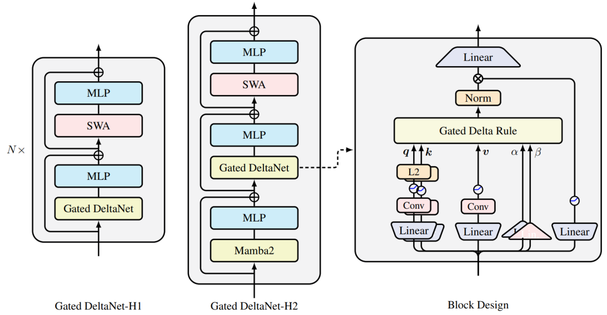

---
tags:
  - NLP
  - MLSYS
  - THEORY
  - DEEP_LEARNING
arxiv: https://arxiv.org/abs/2412.06464
github: https://github.com/NVlabs/GatedDeltaNet
website: https://research.nvidia.com/publication/2025-04_gated-delta-networks-improving-mamba2-delta-rule
year: 2025
read: false
---

# Gated Delta Networks: Improving Mamba2 with Delta Rule

> **Links:** [arXiv](https://arxiv.org/abs/2412.06464) | [GitHub](https://github.com/NVlabs/GatedDeltaNet) | [Website](https://research.nvidia.com/publication/2025-04_gated-delta-networks-improving-mamba2-delta-rule)
> **Tags:** #NLP #MLSYS #THEORY #DEEP_LEARNING

---

## Methodology

### Core Idea

Two complementary mechanisms for linear attention state control:
- **Gating** ($\alpha_t$): scalar decay that rapidly erases stale memory when $\alpha_t \to 0$
- **Delta rule** ($\beta_t$): targeted key-value update that overwrites specific associations

The **gated delta rule** combines both into a single recurrence:

$$S_t = S_{t-1}\bigl(\alpha_t (I - \beta_t k_t k_t^\top)\bigr) + \beta_t v_t k_t^\top$$

- $S_t \in \mathbb{R}^{d_v \times d_k}$: fast-weight state matrix at step $t$
- $\alpha_t \in (0,1)$: scalar data-dependent gate (controls memory decay rate)
- $\beta_t \in (0,1)$: scalar writing strength (controls update magnitude)
- $k_t \in \mathbb{R}^{d_k}$, $v_t \in \mathbb{R}^{d_v}$: L2-normalized key and value vectors
- $(I - \beta_t k_t k_t^\top)$: Householder-like projection that erases the $k_t$ direction from $S_{t-1}$ before writing

The output is $o_t = S_t q_t$ where $q_t \in \mathbb{R}^{d_k}$ is the query.

### Online Learning Interpretation

The gated delta rule is the closed-form solution to a per-step regression objective:

$$\min_{S_t} \|S_t - \alpha_t S_{t-1}\|_F^2 - 2\langle S_t k_t,\; \beta_t(v_t - \alpha_t S_{t-1} k_t)\rangle$$

| Model | Decay ($\alpha$) | Targeted update ($\beta$) |
|---|---|---|
| Linear Attention | No | No |
| Mamba2 | Yes | No |
| DeltaNet | No | Yes |
| **Gated DeltaNet** | **Yes** | **Yes** |

### Hardware-Efficient Chunkwise Training Algorithm

Extends DeltaNet's WY representation to gated recurrences. For chunk $t$ of size $C$:

$$S_{[t+1]} = \overrightarrow{S}_{[t]} + \bigl(\tilde{U}_{[t]} - \overleftarrow{W}_{[t]}\,\overrightarrow{S}_{[t]}^\top\bigr)^\top \overrightarrow{K}_{[t]}$$

$$O_{[t]} = \overrightarrow{Q}_{[t]}\,\overrightarrow{S}_{[t]}^\top + \bigl(Q_{[t]} K_{[t]}^\top \odot M\bigr)\bigl(\tilde{U}_{[t]} - \overleftarrow{W}_{[t]}\,\overrightarrow{S}_{[t]}^\top\bigr)$$

- $\overrightarrow{S}_{[t]}$: carry-in state at chunk start (from previous chunk)
- $\tilde{U}_{[t]}$: intra-chunk modified values incorporating the delta correction
- $\overleftarrow{W}_{[t]}$: cumulative decay-weighted key product (right-to-left prefix)
- $\overrightarrow{K}_{[t]}$, $\overrightarrow{Q}_{[t]}$: decay-weighted key/query matrices (left-to-right prefix)
- $M$: causal lower-triangular mask with decay corrections
- $\odot$: elementwise product

Intra-chunk gated decay product: $\gamma^j = \prod_{i=1}^{j} \alpha_i$. The algorithm maps to $O(C \cdot d_k \cdot d_v)$ tensor-core matmuls per chunk, implemented as a custom CUDA kernel.

### Block Design

Each token-mixer block:
- **Q/K paths**: Linear $\to$ shortconv (kernel 4) $\to$ SiLU $\to$ L2-norm $\to$ head split
- **V path**: Linear $\to$ shortconv $\to$ SiLU $\to$ head split
- **$\alpha$/$\beta$ scalars**: Linear projection only (no conv), per-head
- **Output gate**: Linear $\to$ SiLU applied after recurrence output
- Head dimension $d_h = 128$; macro architecture follows Llama (alternated with SwiGLU MLP)

### Hybrid Variants

| Variant | Layer pattern | Notes |
|---|---|---|
| Gated DeltaNet | All GDN layers | Pure recurrent |
| Gated DeltaNet-H1 | GDN + SWA alternating | Sliding-window attention added |
| Gated DeltaNet-H2 | Mamba2 + GDN + SWA | Triple interleaving, best quality |

*SWA = Sliding Window Attention (window = 2048 tokens)*

---

## Experiment Setup

- **Scales**: 400M and 1.3B parameters
- **Training data**: 100B tokens from FineWeb-Edu
- **Optimizer**: AdamW, peak LR $4\times10^{-4}$, weight decay 0.1, gradient clip 1.0
- **Schedule**: Cosine annealing with 1B-token warm-up
- **Batch size**: 0.5M tokens/step; sequence length 4K (SWA window 2K for hybrid models)
- **Tokenizer**: Llama2 (32K vocab)
- **Baselines**: RetNet, HGRN2, Mamba, Mamba2, DeltaNet, Samba, Transformer++

---

## Results

### Language Modeling & Common-sense Reasoning (1.3B, 100B tokens)

| Model | Wiki ppl | LMB ppl | LMB acc | PIQA | Hella. | Wino. | ARC-e | ARC-c | SIQA | BoolQ | Avg |
|---|---|---|---|---|---|---|---|---|---|---|---|
| RetNet | 19.08 | 17.27 | 40.52 | 70.07 | 49.16 | 54.14 | 67.34 | 33.78 | 40.78 | 60.39 | 52.02 |
| HGRN2 | 19.10 | 17.69 | 39.54 | 70.45 | 49.53 | 52.80 | 69.40 | 35.32 | 40.63 | 56.66 | 51.79 |
| Mamba | 17.92 | 15.06 | 43.98 | 71.32 | 52.91 | 52.95 | 69.52 | 35.40 | 37.76 | 61.13 | 53.12 |
| Mamba2 | 16.56 | 12.56 | 45.66 | 71.87 | 55.67 | 55.24 | 72.47 | 37.88 | 40.20 | 60.13 | 54.89 |
| DeltaNet | 17.71 | 16.88 | 42.46 | 70.72 | 50.93 | 53.35 | 68.47 | 35.66 | 40.22 | 55.29 | 52.14 |
| **Gated DeltaNet** | **16.42** | **12.17** | **46.65** | **72.25** | **55.76** | **57.45** | 71.21 | **38.39** | 40.63 | 60.24 | **55.32** |
| Samba | 16.13 | 13.29 | 44.94 | 70.94 | 53.42 | 55.56 | 68.81 | 36.17 | 39.96 | 62.11 | 54.00 |
| **Gated DeltaNet-H1** | **16.07** | **12.12** | **47.73** | **72.57** | **56.53** | **58.40** | 71.75 | **40.10** | 41.40 | **63.21** | **56.40** |
| **Gated DeltaNet-H2** | **15.91** | 12.55 | **48.76** | 72.19 | **56.88** | 57.77 | 71.33 | 39.07 | **41.91** | 61.55 | 56.18 |

*Wiki = WikiText-103 perplexity (lower is better); LMB = LambadaOpenAI perplexity/accuracy; Hella. = HellaSwag; Wino. = WinoGrande; ARC-e/c = ARC Easy/Challenge; Avg = average of all accuracy tasks (higher is better).*

### In-Context Retrieval on Real-World Tasks (1.3B, accuracy %)

| Model | SWDE | SQuAD | FDA | TQA | NQ | Drop | Avg |
|---|---|---|---|---|---|---|---|
| Mamba2 | 19.1 | 33.6 | 25.3 | 61.0 | 20.8 | 19.2 | 29.8 |
| DeltaNet | 17.9 | 30.9 | 18.4 | 53.9 | 17.3 | 18.6 | 26.2 |
| **Gated DeltaNet** | **25.4** | **34.8** | 23.7 | 60.0 | 20.0 | **19.8** | **30.6** |
| Transformer++ | 29.5 | 38.0 | 52.2 | 58.3 | 22.5 | 21.6 | 37.0 |
| Samba | 33.0 | 39.2 | 50.5 | 57.7 | 23.5 | 20.2 | 37.3 |
| **Gated DeltaNet-H1** | 35.6 | 39.7 | 52.0 | 60.1 | 24.6 | 22.2 | **39.0** |
| **Gated DeltaNet-H2** | **38.2** | **40.4** | 50.7 | **63.3** | **24.8** | **23.3** | **40.1** |

*SWDE = Structured Web Data Extraction; FDA = FDA Drug Label QA; TQA = TriviaQA; NQ = Natural Questions.*

### Single-Needle-in-a-Haystack (S-NIAH, 1.3B, accuracy %)

| Model | S-NIAH-1 (1K/2K/4K/8K) | S-NIAH-2 (1K/2K/4K/8K) | S-NIAH-3 (1K/2K/4K) |
|---|---|---|---|
| Mamba2 | 99.2/98.8/65.4/30.4 | 99.4/98.8/56.2/17.0 | 64.4/47.6/4.6 |
| DeltaNet | 97.4/96.8/99.0/98.8 | 98.4/45.6/18.6/14.4 | 85.2/47.0/22.4 |
| **Gated DeltaNet** | **98.4/88.4/91.4/91.8** | **100.0/99.8/92.2/29.6** | **86.6/84.2/27.6** |

*S-NIAH-1: simple passkey retrieval; S-NIAH-2: multi-distractor context retrieval; S-NIAH-3: multi-step key chaining. Numbers are accuracy % at increasing context lengths.*

### Ablations (400M models)

**Block design components (WikiText-103 ppl, lower is better):**

| Configuration | ppl |
|---|---|
| No short convolution | 30.87 |
| No output gate | 29.12 |
| No output normalization | 27.51 |
| Full Gated DeltaNet (head dim 128, L2+SiLU) | **27.35** |

**Hybrid layer order (500M/15B tokens):**

| Pattern | Wiki ppl | Avg acc |
|---|---|---|
| Mamba2 + GDN + SWA | **23.54** | **48.73** |
| GDN + Mamba2 + SWA | 24.10 | 48.01 |
| GDN + SWA only (H1) | 24.38 | 47.84 |

---

## Related Papers

- [mamba](mamba.md)
- [flashattn](flashattn.md)
