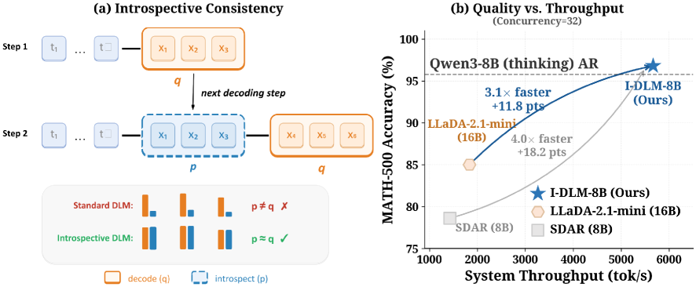

---
tags:
  - DLM
  - SPEC_DECODING
  - MLSYS
arxiv: https://arxiv.org/abs/2604.11035
github: https://github.com/Introspective-Diffusion/I-DLM
website: https://introspective-diffusion.github.io
year: 2025
read: false
---

# Introspective Diffusion Language Models

> **Links:** [arXiv](https://arxiv.org/abs/2604.11035) | [GitHub](https://github.com/Introspective-Diffusion/I-DLM) | [Website](https://introspective-diffusion.github.io)
> **Tags:** #DLM #SPEC_DECODING #MLSYS

---

## Methodology

### Core Problem: Introspective Consistency Gap

Standard masked diffusion LMs (MDLMs) use **non-causal** attention: position $i$ attends to all other positions, so the model's generation distribution $q_\theta(x^i \mid x_{-i})$ is independent of its own earlier outputs. In contrast, AR models are **causally consistent**: the AR model predicts position $i+1$ from prefix $x_{\leq i}$, so when asked to evaluate a sequence it already generated, the acceptance probability $\min(1, p/q) = 1$—it always accepts its own output. This property is called **introspective consistency**.

Formally, for a speculative-style verifier running rejection sampling, high throughput requires acceptance rate $\alpha \to 1$. MDLMs have low $\alpha$ because $p \neq q$; AR models trivially achieve $\alpha = 1$.

### Training: Introspective-Consistency (IC) Training

Given clean tokens $x_0$ and masked/noisy tokens $x_t$ (random mask rate $t \sim \text{Uniform}[0,1]$):

1. **Concatenate** the masked sequence with the clean reference: input $= [x_t \mid x_0]$, length $2L$.
2. **Causal masking**: apply strict causal attention across both halves. Position $i$ in $x_t$ attends only to $x_t^{<i}$; position $i$ in $x_0$ attends to all of $x_t$ plus $x_0^{<i}$.
3. **Logit shift**: predict token $x_0^{i+1}$ from position $i$ (maps generation at position $i$ to verification at $i+1$—the same mapping as an AR model).
4. **Dual cross-entropy losses** with auto-balanced weighting:

$$\mathcal{L}_\text{mask} = -\frac{1}{|S_t|} \sum_{\ell \in S_t} \log p_\theta(x_0^{\ell+1} \mid [x_t, x_0]_{\leq \ell})$$

$$\mathcal{L}_\text{clean} = -\frac{1}{|S_0|} \sum_{\ell \in S_0} \log p_\theta(x_0^{\ell+1} \mid [x_t, x_0]_{\leq \ell})$$

$$\mathcal{L} = \mathcal{L}_\text{mask} + \hat{s} \cdot \mathcal{L}_\text{clean}, \quad \hat{s} = \frac{\mathcal{L}_\text{mask}}{\mathcal{L}_\text{clean}}$$

- $\ell$: position index ranging over the concatenated sequence of length $2L$; $S_t \subset \{1, \ldots, 2L\}$: indices falling in the masked half, $S_0$: indices in the clean half.
- $[x_t, x_0]_{\leq \ell}$: concatenated prefix up to and including position $\ell$ under the strict causal mask defined above.
- $x_0^{\ell+1}$: the clean target token at position $\ell+1$ (logit-shift); the loss is standard next-token cross-entropy on that shifted target.
- $\hat{s}$: detached ratio (no gradient through it) that rescales $\mathcal{L}_\text{clean}$ so both losses contribute on the same order.

### Inference: Introspective Strided Decoding (ISD)

ISD generates $N$ tokens in parallel per forward pass using a speculative-decoding-style accept/reject loop:

**Bootstrap step:**
1. Append $N$ `[MASK]` tokens to the current prefix; run a single forward pass.
2. Sample proposals $\tilde{x}^k \sim q_k$ for all $N$ positions.

**Stride + introspection step** (repeat until EOS):
1. Fill accepted tokens into the sequence; append $N$ new `[MASK]` tokens.
2. Run a single forward pass; obtain **causal anchors** $p_k$ (from clean-half positions) and **proposals** $q_k$ (from masked-half positions).
3. For each position $k = 1 \ldots N$:
   - Accept with probability $\min(1,\, p_k(\tilde{x}^k) / q_k(\tilde{x}^k))$.
   - If rejected, resample from the corrected distribution $\text{normalize}(\max(0,\, p_k - q_k))$.
4. If all $N$ proposals are accepted, sample one bonus token (analogous to AR speculative decoding).

Expected tokens per forward pass (TPF): $\mathbb{E}[\text{TPF}]$ increases with per-token acceptance rate $\alpha$; at $\alpha=1$ (perfect IC) TPF $= N+1$.

**Relaxed ISD (R-ISD):** Adds a small LoRA adapter (rank 128) fine-tuned on top of the base I-DLM to further align $p \approx q$ when a quality–speed tradeoff is acceptable.

### Systems Optimizations

- **Stationary-batch scheduler**: reuses the KV cache across ISD steps by treating the growing prefix + fixed-length `[MASK]` window as a stationary batch.
- **Chunked-prefill attention**: handles the dual $[x_t \mid x_0]$ context efficiently.
- Overhead per forward pass $\approx 1.08\times$ vs. a pure AR forward pass (mostly causal-attention kernel cost).

---

## Experiment Setup

**Base models:** Qwen3-8B and Qwen3-32B (initialized from pretrained AR weights).

**Training:** IC fine-tuning on 4.5B tokens (vs. SDAR's 54B tokens—12× more efficient). Hardware: 8× H100 GPUs. Fine-tuning only—no pretraining from scratch.

**Inference:** ISD with stride $N=4$ (default), batch size 1 for latency measurements, batch sizes 1–64 for throughput measurements.

**Baselines (quality):** LLaDA-2.1-mini (16B), LLaDA-2.0/2.1-flash (100B), SDAR-8B, SDAR-30B-A3B, Qwen3-8B (AR), NBDiff-7B, WeDLM-8B, DREAM-7B, Fast-dLLM-7B, Mercury Coder Small, Gemini Diffusion.

---

## Results

### Main Quality Results (Table 1)

| Benchmark | LLaDA-2.1-mini (16B) | SDAR-8B | I-DLM-8B | Qwen3-8B | I-DLM-32B | Qwen3-32B |
|-----------|:-------------------:|:-------:|:--------:|:--------:|:---------:|:---------:|
| ARC-C | 90.2 | 91.9 | **95.8** | 95.8 | **96.8** | 97.2 |
| MMLU | 74.5 | 78.6 | 82.4 | 83.5 | 86.8 | 87.2 |
| MMLU-Pro | 64.8 | 56.9 | 73.1 | 75.1 | 79.7 | 80.1 |
| GPQA-D | 46.0 | 40.2 | 55.6 | 58.9 | 62.1 | 64.1 |
| GSM8K | 89.0 | 91.7 | **95.0** | 96.0 | 94.9 | 94.7 |
| MATH-500 | 85.0 | 78.6 | **96.8** | 95.8 | **97.6** | 97.8 |
| AIME-24 | 43.3 | 10.0 | **69.6** | 73.1 | **83.3** | 76.7 |
| AIME-25 | 43.3 | 10.0 | **60.8** | 65.4 | **80.0** | 80.0 |
| HumanEval | 86.0 | 78.7 | **93.3** | 95.1 | **96.3** | 96.3 |
| MBPP | 82.1 | 72.0 | **92.2** | 93.4 | **94.6** | 95.7 |
| LCB-v6 | 30.4 | 16.6 | **45.7** | 50.3 | **57.1** | 58.3 |
| IFEval | 83.2 | 61.4 | **84.7** | 84.7 | **84.7** | 84.5 |

*Boldface marks the best DLM result in each row. I-DLM-8B closes the quality gap to Qwen3-8B (its AR base) on most benchmarks; I-DLM-32B surpasses Qwen3-32B on AIME-24 (+6.6 pts). LCB-v6 = LiveCodeBench-v6; GPQA-D = GPQA-Diamond.*

### Throughput vs. Quality

| Model | TPS (bs=1) | MATH-500 |
|-------|:----------:|:--------:|
| Qwen3-8B (AR) | ~105 | 95.8 |
| SDAR-8B (DLM) | ~105 | 78.6 |
| **I-DLM-8B (ISD, N=4)** | **~325** | **96.8** |

*TPS = tokens per second; bs = batch size. I-DLM achieves ~3.1× higher throughput than the AR base while matching or exceeding its quality.*

### Ablations

#### Stride Size $N$ (Table 3)

| $N$ | TPF | TPS (bs=1) | MATH-500 | MBPP |
|:---:|:---:|:----------:|:--------:|:----:|
| 2 | 1.80 | 209.6 | 96.8 | 93.4 |
| 3 | 2.48 | 281.9 | 95.8 | 92.8 |
| **4** | **2.96** | **324.5** | **96.8** | **92.2** |
| 8 | 4.01 | 445.1 | 94.6 | 88.3 |

*TPF = tokens per forward pass (expected parallel tokens generated per step). $N=4$ is default—best quality at strong throughput; $N=8$ trades ~2 pts quality for higher speed.*

#### Relaxed Acceptance ($\tau$ parameter, Table 4)

| $\tau$ | HumanEval | TPF |
|:------:|:---------:|:---:|
| 0.0 (strict rejection sampling) | 93.3 | 2.63 |
| 0.5 | 91.8 | 2.72 |
| 1.0 (greedy acceptance) | 91.2 | 2.73 |

*$\tau$ relaxes the acceptance threshold: higher $\tau$ accepts more proposals, increasing TPF at a modest quality cost (~1–2 pts on HumanEval).*

---

## Related Papers

- [sdar](sdar.md)
- [mdlm](mdlm.md)
- [wino](wino.md)
- [dflash](dflash.md)
- [rcd](rcd.md)
