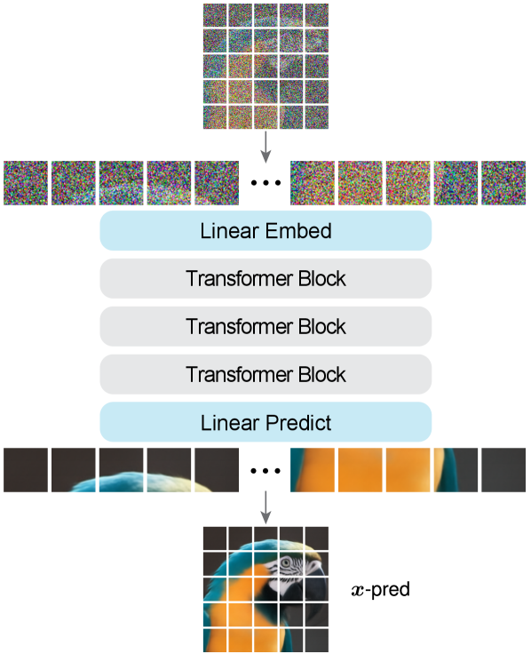

---
tags:
  - VISION
  - DEEP_LEARNING
arxiv: https://arxiv.org/abs/2511.13720
github: https://github.com/LTH14/JiT
website: ""
year: 2025
read: false
---

# Back to Basics: Let Denoising Generative Models Denoise

> **Links:** [arXiv](https://arxiv.org/abs/2511.13720) | [GitHub](https://github.com/LTH14/JiT)
> **Tags:** #VISION #DEEP_LEARNING

---

## Methodology

### Core Argument: x-Prediction vs. ε-Prediction

The central claim is grounded in the **manifold assumption**: natural images occupy a low-dimensional manifold within high-dimensional pixel space, while noise does not. As pixel dimensionality $D$ increases:

- **x-prediction** (predicting the clean image) remains tractable because the target lives on a structured low-dimensional manifold.
- **ε-prediction** (predicting noise) degrades catastrophically — noise vectors are approximately i.i.d. Gaussian, essentially uniformly distributed on a hypersphere with no low-dimensional structure to exploit.

Toy experiments verify this: with patch dimension $D=8$, all three prediction targets (x, ε, v) yield similar FID. At $D=512$ (full 256×256 pixels), only x-prediction produces coherent images; ε-prediction and v-prediction diverge.

### Flow Matching Framework (x-Prediction)

The model uses a linear interpolation (rectified flow) schedule. Given clean image $x$ and noise $\varepsilon \sim \mathcal{N}(0, I)$:

$$z_t = t \cdot x + (1 - t) \cdot \varepsilon, \quad t \in [0, 1]$$

- $z_t$: noisy sample at timestep $t$; at $t=1$, $z_t = x$ (clean); at $t=0$, $z_t = \varepsilon$ (pure noise).
- $t$: interpolation coefficient sampled from a logit-normal distribution with mean $\mu = -0.8$ (biases toward higher noise levels).

The true velocity field is $v = x - \varepsilon$. The network predicts the clean image $\hat{x} = f_\theta(z_t, t)$, from which the predicted velocity is derived:

$$\hat{v} = \frac{\hat{x} - z_t}{1 - t}$$

- $\hat{x}$: network's clean-image prediction (the x-prediction target).
- $\hat{v}$: predicted velocity, derived from $\hat{x}$ rather than predicted directly.

**Training loss** (L2 on velocity space):

$$\mathcal{L} = \mathbb{E}_{t, x, \varepsilon} \left\| v - \hat{v} \right\|^2$$

**Sampling**: ODE integration using 50-step Heun solver: $z_{t+\Delta t} = z_t + \Delta t \cdot \hat{v}$

### JiT Architecture

JiT is a **plain Vision Transformer (ViT)** applied directly to raw pixel patches, with no VAE, tokenizer, or self-supervised pre-training:

| Component | Design |
|-----------|--------|
| Input | Raw pixel patches of size $P \times P \times 3$ |
| Patch embedding | Bottleneck linear projection: patch → 128-d → hidden dim |
| Positional encoding | RoPE (Rotary Position Embedding) |
| Normalization | RMSNorm + query-key normalization |
| Activation | SwiGLU |
| Conditioning | AdaLN-Zero for time $t$ and class label |
| Class tokens | 32 in-context class tokens appended to the sequence |
| Guidance | Classifier-free guidance (CFG) |

**Model variants:**

| Model | Resolution | Patch | Seq Len | Patch Dim | Params |
|-------|------------|-------|---------|-----------|--------|
| JiT-B/16 | 256×256 | 16 | 256 | 768 | ~131M |
| JiT-L/16 | 256×256 | 16 | 256 | 768 | 432M |
| JiT-B/32 | 512×512 | 32 | 256 | 3072 | ~141M |
| JiT-B/64 | 1024×1024 | 64 | 256 | 12288 | ~131M |

*Patch Dim = $P^2 \times 3$. Sequence length stays constant at 256 tokens across resolutions by scaling patch size.*

The bottleneck embedding projects the large raw patch vector (e.g., 3072-d for 32×32 patches) down to ~128-d before expanding to the transformer hidden dim, keeping compute tractable at high resolution.

---

## Experiment Setup

- **Dataset:** ImageNet class-conditional generation (256×256, 512×512, 1024×1024)
- **Training epochs:** 200 and 600 epochs
- **Timestep sampling:** logit-normal distribution, $\mu = -0.8$ for 256×256 (tuned per resolution)
- **Prediction target:** x-prediction with v-loss
- **Guidance:** CFG at inference
- **Pixel-space baselines (no pre-training):** ADM-G, RIN, SiD2-B, PixelFlow-XL
- **Latent-space baselines:** DiT-XL/2, SiT-XL/2, REPA+SiT, LightningDiT, DDT, RAE-DiT

---

## Results

### Prediction Target Ablation (ImageNet 256×256, JiT-B/16, FID-50K)

| Prediction \ Loss | x-loss | ε-loss | v-loss |
|-------------------|--------|--------|--------|
| x-pred | 10.14 | 10.45 | **8.62** |
| ε-pred | 379.21 | 394.58 | 372.38 |
| v-pred | 107.55 | 126.88 | 96.53 |

*3×3 grid exhausting all (prediction target) × (loss function) combinations. x-loss = MSE on clean image; ε-loss = MSE on noise; v-loss = MSE on velocity. x-pred + v-loss is best. ε-pred and v-pred both fail at high pixel-space dimensionality.*

### Noise-Level Shift (ImageNet 256×256, v-loss, FID-50K)

| Logit-normal μ | x-pred | ε-pred | v-pred |
|----------------|--------|--------|--------|
| 0.0 | 14.44 | 464.25 | 120.03 |
| −0.4 | 9.79 | 372.91 | 109.93 |
| **−0.8** | **8.62** | 372.36 | 96.53 |
| −1.2 | 8.99 | 355.25 | 106.85 |

*μ = mean of logit-normal timestep distribution. More negative μ biases sampling toward lower t (noisier). μ = −0.8 is optimal for x-prediction.*

### Architecture Ablations (ImageNet 256×256, FID-50K)

| Model | Baseline | + RoPE + qk-norm | + in-context tokens |
|-------|----------|-------------------|---------------------|
| JiT-B/16 | 7.48 (6.32) | 6.69 (5.44) | 5.49 **(4.37)** |
| JiT-L/16 | — | — | 3.39 **(2.79)** |

*Outside parentheses: FID without CFG. Inside parentheses: FID with CFG. qk-norm = per-head query-key L2 normalization before softmax.*

### High-Resolution Generation (FID-50K, ~131–141M params, ~25–30 GFLOPs)

| Resolution | Model | Seq Len | Patch Dim | FID |
|------------|-------|---------|-----------|-----|
| 256×256 | JiT-B/16 | 256 | 768 | 4.37 |
| 512×512 | JiT-B/32 | 256 | 3072 | 4.64 |
| 1024×1024 | JiT-B/64 | 256 | 12288 | 4.82 |

### Scalability (ImageNet, FID-50K)

**256×256:**

| Model | 200-ep | 600-ep |
|-------|--------|--------|
| JiT-B/16 | 4.37 | 3.66 |
| JiT-L/16 | 2.79 | 2.36 |
| JiT-H/16 | 2.29 | 1.86 |
| JiT-G/16 | 2.15 | 1.82 |

**512×512:**

| Model | 200-ep | 600-ep |
|-------|--------|--------|
| JiT-B/32 | 4.64 | 4.02 |
| JiT-L/32 | 3.06 | 2.53 |
| JiT-H/32 | 2.51 | 1.94 |
| JiT-G/32 | 2.11 | 1.78 |

*B/L/H/G = Base/Large/Huge/Giant model sizes. /16, /32 = patch size in pixels.*

### Comparison with Prior Work (ImageNet 256×256, FID-50K)

| Method | Pre-training | Params | GFLOPs | FID↓ | IS↑ |
|--------|-------------|--------|--------|------|-----|
| DiT-XL/2 | SD-VAE, VGG | 675+49M | 119 | 2.27 | 278.2 |
| SiT-XL/2 | SD-VAE, VGG | 675+49M | 119 | 2.06 | 277.5 |
| REPA+SiT-XL/2 | SD-VAE, VGG, DINOv2 | 675+49M | 119 | 1.42 | 305.7 |
| LightningDiT-XL/2 | VA-VAE, VGG, DINOv2 | 675+49M | 119 | 1.35 | 295.3 |
| DDT-XL/2 | SD-VAE, VGG, DINOv2 | 675+49M | 119 | 1.26 | 310.6 |
| RAE-DiT-XL/2 | RAE, VGG, DINOv2 | 839+415M | 146 | 1.13 | 262.6 |
| ADM-G | None | 554M | 1120 | 4.59 | 186.7 |
| SiD2-B | None | 234M | 272 | 2.05 | 262.3 |
| PixelFlow-XL | None | 1.3B | 3468 | 2.05 | — |
| **JiT-L/16 (600-ep)** | **None** | **432M** | **119** | **2.36** | **271.9** |

*"Pre-training" lists tokenizer/encoder and auxiliary pretrained models required (None = pixel-space, no external pre-training). Params for latent-space methods are listed as generator+tokenizer. IS = Inception Score. GFLOPs measured for the generator network at inference.*

---

## Related Papers

- [rae](rae.md)
