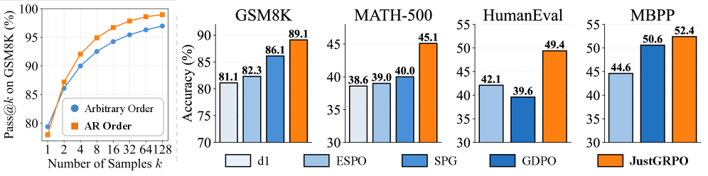

---
tags:
  - DLM
  - RL
  - REASONING
arxiv: "https://arxiv.org/abs/2601.15165"
github: "https://github.com/LeapLabTHU/JustGRPO"
website: "https://nzl-thu.github.io/the-flexibility-trap"
year: 2026
read: false
---

# The Flexibility Trap: Why Arbitrary Order Limits Reasoning Potential in Diffusion Language Models

> **Links:** [arXiv](https://arxiv.org/abs/2601.15165) | [GitHub](https://github.com/LeapLabTHU/JustGRPO) | [Website](https://nzl-thu.github.io/the-flexibility-trap)
> **Tags:** #DLM #RL #REASONING

---

## Methodology

**Core Insight: The Flexibility Trap.** Diffusion language models (dLLMs) can generate tokens in arbitrary order — but this flexibility is harmful for reasoning. When given free choice of generation order, dLLMs learn to bypass high-entropy "logical fork" tokens (e.g., *Therefore*, *Since*, *Thus*) by deferring them, prematurely collapsing the diversity of solution paths. Restricting generation to standard left-to-right autoregressive (AR) order forces the model to confront uncertain tokens, preserving exploration of the solution space.

**Evidence:** Pass@k curves on HumanEval show that AR order covers 21.3% of problems solved exclusively by AR mode, while arbitrary order covers only 0.6% exclusively — i.e., arbitrary order explores a strict subset of the AR solution space. Logical connector tokens show sharply reduced entropy under arbitrary-order decoding (entropy degradation), while AR order maintains high entropy at these critical branch points.

### Autoregressive Policy for dLLMs

A dLLM operates over masked sequences. JustGRPO defines an autoregressive policy by constructing the partially masked sequence:

$$\tilde{x}_k = [o_1, \ldots, o_{k-1},\ \underbrace{[\text{MASK}], \ldots, [\text{MASK}]}_{|o|-k+1}]$$

This enables exact per-step likelihood computation:

$$\pi_\theta^{AR}(o \mid q) = \prod_{k=1}^{|o|} \pi_\theta^{AR}(o_k \mid o_{<k}, q)$$

where $o_{<k}$ are already-generated tokens to the left, and $q$ is the prompt.

### GRPO Objective

Standard GRPO is applied directly over this AR policy. For each question $q$, $G$ completions $\{o_i\}_{i=1}^G$ are sampled, group-normalized advantages $\hat{A}_{i,k}$ are computed, and the clipped surrogate objective is maximized:

$$\mathcal{J}(\theta) = \mathbb{E}_{q,\{o_i\}} \left[ \frac{1}{G} \sum_{i=1}^G \frac{1}{|o_i|} \sum_{k=1}^{|o_i|} \left( \min\!\left(\rho_{i,k}\,\hat{A}_{i,k},\ \mathrm{clip}(\rho_{i,k}, 1{-}\varepsilon, 1{+}\varepsilon)\,\hat{A}_{i,k}\right) - \beta\,\mathbb{D}_{\mathrm{KL}} \right) \right]$$

- $G$: group size (number of rollouts sampled per prompt $q$); $o_i$: the $i$-th rollout, length $|o_i|$.
- $\hat{A}_{i,k}$: advantage for token $k$ of rollout $i$, standardized within the group of $G$ completions.
- $\rho_{i,k}$: importance-ratio between the current and behavior policy, as defined below.
- $\mathrm{clip}(\cdot, 1-\varepsilon, 1+\varepsilon)$: clamp into $[1-\varepsilon, 1+\varepsilon]$ (PPO-style trust region).
- $\beta$: KL penalty weight; $\mathbb{D}_{\mathrm{KL}}$: KL between $\pi_\theta$ and a reference policy (often set to $0$ here, per the table below).

where $\rho_{i,k} = \pi_\theta(o_{i,k} \mid o_{i,<k}, q) / \pi_{\theta_\mathrm{old}}(o_{i,k} \mid o_{i,<k}, q)$ is the probability ratio.

**Parallel Decoding Preserved:** At inference time, the model still decodes in the standard dLLM parallel fashion — only training uses the AR masking structure.

### Reward Functions

- **Math reasoning:** Binary reward — 1 if final boxed answer matches ground truth, 0 otherwise.
- **Code generation:** $r = r_\text{code} + r_\text{format}$, where $r_\text{code} \in [0,1]$ is the fraction of unit tests passed, and $r_\text{format} \in \{0.0, 0.5, 1.0\}$ penalizes invalid or syntactically broken Python.

---

## Experiment Setup

- **Base model:** LLaDA 8B Instruct
- **Datasets:** MATH (training), HumanEval/MBPP (training)
- **Evaluation benchmarks:** GSM8K, MATH-500, HumanEval, MBPP
- **Baselines:** LLaDA-1.5, LLaDOU, d1, wd1, dd-TreeRPO, ESPO, GDPO, SPG

**Training Hyperparameters:**

| Hyperparameter | Value |
|---|---|
| RL Algorithm | GRPO |
| Optimizer | AdamW |
| Learning Rate | $5 \times 10^{-6}$ |
| LR Scheduler | Constant |
| Weight Decay | 0.0 |
| Optimizer Betas $(\beta_1, \beta_2)$ | (0.9, 0.999) |
| Global Batch Size | 64 |
| Group Size $G$ | 16 |
| Policy Update Steps | 1 |
| Training Steps | 125 |
| Max Completion Length | 256 |
| Sampling Temperature | 1.0 |
| KL Penalty $\beta$ | 0.0 |

---

## Results

### Main Results

System-level comparison of RL post-training approaches on LLaDA 8B Instruct. Numbers are accuracy (%) at sequence length 128 / 256 / 512 tokens. Dashes indicate results not reported by that method.

| Method | GSM8K 128/256/512 | MATH-500 128/256/512 | HumanEval 128/256/512 | MBPP 128/256/512 |
|---|---|---|---|---|
| LLaDA-1.5 | —/83.3/— | —/—/— | 29.3/39.6/51.9 | 39.6/39.9/38.8 |
| LLaDOU | —/88.1/— | —/41.1/— | —/59.1/— | —/51.6/— |
| d1 | 73.2/81.1/82.1 | 33.8/38.6/40.2 | —/—/— | —/—/— |
| wd1 | 77.2/80.8/82.3 | 33.3/34.4/39.0 | —/—/— | —/—/— |
| dd-TreeRPO | —/81.2/82.6 | —/37.7/38.9 | —/—/— | —/—/— |
| ESPO | 80.0/82.3/83.7 | 36.0/39.0/43.4 | 28.1/42.1/50.0 | 47.4/44.6/44.2 |
| GDPO | 78.4/82.8/84.5 | 33.2/39.6/41.4 | 26.2/39.6/39.0 | 43.6/50.6/47.1 |
| SPG | 78.5/86.1/84.5 | 33.4/40.0/41.8 | —/—/— | —/—/— |
| **JustGRPO** | **83.8/89.1/89.8** | **39.0/45.1/45.2** | **37.8/49.4/48.7** | **50.6/52.4/49.0** |

*Columns show accuracy (%) at generation lengths 128/256/512 tokens.*

### Solution Space Analysis

Pass@k on HumanEval (k = 1024 samples):

| Category | Coverage |
|---|---|
| Solved exclusively by AR order | 21.3% of problems |
| Solved exclusively by arbitrary order | 0.6% of problems |

*AR order explores a strictly larger solution space; arbitrary order solutions are nearly a subset of AR solutions.*

### Training Efficiency

On 16×H100 GPUs: JustGRPO surpasses ESPO accuracy within fewer wall-clock hours and maintains a superior accuracy-vs-training-time frontier. A faster variant ("Ours-Fast") using only the top-25% highest-entropy tokens achieves even quicker convergence.

---

## Related Papers

- [mdlm](mdlm.md)
- [sdar](sdar.md)
- [wino](wino.md)
