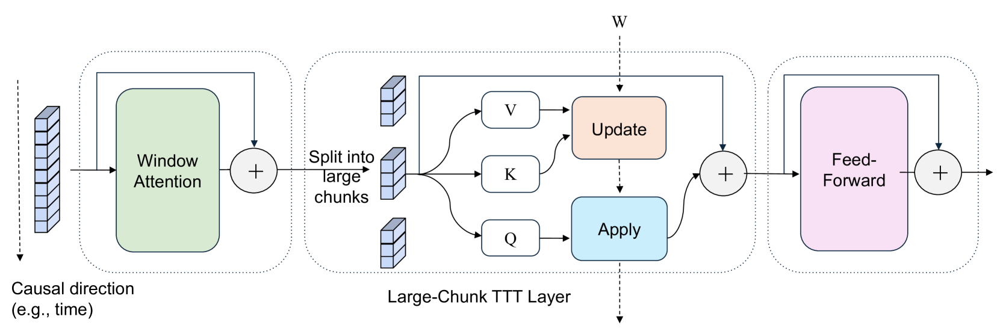

---
tags:
  - TTT
  - MLSYS
  - NLP
  - VISION
arxiv: https://arxiv.org/abs/2505.23884
github: https://github.com/a1600012888/LaCT
website: https://tianyuanzhang.com/projects/ttt-done-right
year: 2025
read: false
---

# Test-Time Training Done Right

> **Links:** [arXiv](https://arxiv.org/abs/2505.23884) | [GitHub](https://github.com/a1600012888/LaCT) | [Website](https://tianyuanzhang.com/projects/ttt-done-right)
> **Tags:** #TTT #MLSYS #NLP #VISION

---

## Methodology

LaCT (Large-Chunk Test-Time Training) scales TTT chunk sizes from the typical 16–64 tokens up to 2K–1M tokens, achieving two critical improvements simultaneously: (1) near-linear prefill compute via batch gradient descent over large chunks instead of per-token recurrence, and (2) a significantly larger fast-weight state (up to 40% of total parameters) that expresses richer context memory.

### Core Update/Apply Operations

The TTT layer maintains a **fast weight** $W$ (a SwiGLU-MLP whose parameters are updated *during inference* by gradient steps on the current sequence). Let $b$ be the chunk size (number of tokens processed in one batched update). For each token $i \in \{1, \ldots, b\}$, the preceding slow-weight attention projections produce a key $k_i \in \mathbb{R}^d$, a value $v_i \in \mathbb{R}^d$, and a query $q_i \in \mathbb{R}^d$, where $d$ is the model hidden dimension.

**Update** (compress the chunk's context into $W$):

$$g = \nabla_W \sum_{i=1}^{b} \eta_i \cdot \mathcal{L}(f_W(k_i), v_i), \quad W \leftarrow \text{L2norm}(W - g)$$

- $g$: batched gradient accumulated over all $b$ tokens of the current chunk (a tensor with the same shape as $W$).
- $\nabla_W$: partial derivative operator with respect to the fast-weight parameters $W$.
- $f_W(\cdot)$: the fast-weight function (defined below) parameterized by the current $W$; it maps a key/query vector in $\mathbb{R}^d$ back to $\mathbb{R}^d$.
- $\eta_i \in \mathbb{R}_{>0}$: a *per-token* learning rate produced by a small linear projection from the token's hidden state (learned end-to-end with the slow weights), so different tokens contribute with different step sizes.
- $\mathcal{L}(f_W(k_i), v_i) = -f_W(k_i)^\top v_i$: dot-product key–value association loss. Minimizing its negative dot product pushes $f_W(k_i)$ to align with $v_i$, so after the update the map $k_i \mapsto v_i$ is stored in $W$.
- $\text{L2norm}(\cdot)$: row-wise (or parameter-wise) $\ell_2$ normalization applied to the updated weight matrix to keep $\|W\|_2$ bounded across chunks and prevent drift.
- $\leftarrow$: in-place assignment; after the update, $W$ is carried to the next chunk.

**Apply** (read from $W$ for each query):

$$o_i = f_W(q_i)$$

- $q_i \in \mathbb{R}^d$: the query vector of token $i$ (same chunk).
- $o_i \in \mathbb{R}^d$: the TTT layer's output for token $i$, obtained by a single forward pass through the (just-updated) fast weights.

**Fast weight architecture** (SwiGLU-MLP, no bias):

$$f_W(x) = W_2\bigl[\text{SiLU}(W_1 x) \odot (W_3 x)\bigr]$$

- $x \in \mathbb{R}^d$: input vector (a key during the update, a query during the apply).
- $W_1, W_3 \in \mathbb{R}^{d_f \times d}$ and $W_2 \in \mathbb{R}^{d \times d_f}$: the three fast-weight matrices; $d_f$ is the fast-weight hidden size, which controls the total state size (e.g., $d_f = 2304$ in the 3B LM setting).
- $W$ denotes the concatenation of $\{W_1, W_2, W_3\}$ — the gradient $\nabla_W$ above is taken jointly over all three.
- $\text{SiLU}(z) = z \cdot \sigma(z)$ with $\sigma$ the sigmoid — the Swish activation, applied element-wise.
- $\odot$: element-wise (Hadamard) product between the gated path $\text{SiLU}(W_1 x)$ and the linear path $W_3 x$ (both in $\mathbb{R}^{d_f}$).

### Update Rule Variants

| Variant | Update rule |
|---------|-------------|
| GD | $W \leftarrow \text{L2norm}\bigl(W - \sum_{i=1}^{b} \eta_i \, \nabla_W \mathcal{L}_i\bigr)$ |
| Momentum | $M \leftarrow \beta M + \sum_{i=1}^{b} \eta_i \, \nabla_W \mathcal{L}_i;\quad W \leftarrow \text{L2norm}(W - M)$ |
| **Muon** | $M \leftarrow \beta M + \sum_{i=1}^{b} \eta_i \, \nabla_W \mathcal{L}_i;\quad W \leftarrow \text{L2norm}\bigl(W - \text{Muon}(M)\bigr)$ |

Notation used in the table:

- $\mathcal{L}_i \equiv \mathcal{L}(f_W(k_i), v_i)$: the per-token association loss defined above, so $\nabla_W \mathcal{L}_i$ is the gradient contributed by token $i$ alone.
- $\eta_i$: same per-token learning rate as in the core update.
- $M$: a momentum buffer with the same shape as $W$, persisted across chunks (initialized at zero).
- $\beta \in [0, 1)$: momentum decay coefficient (a fixed hyperparameter; typically $\beta \approx 0.9$).
- $\text{Muon}(\cdot)$: an orthogonalization operator. Given a matrix $M$ with (thin) SVD $M = U \Sigma V^\top$ (where $U$ and $V$ have orthonormal columns and $\Sigma$ is the diagonal matrix of singular values), $\text{Muon}(M)$ approximates $U V^\top$ — i.e., the nearest orthogonal matrix, which rescales every singular value of $M$ to $1$. This is computed in practice via a few Newton–Schulz iterations (matrix-polynomial iterations that avoid an explicit SVD), applying a form of spectral normalization to the update direction.

### Block Architecture

Each LaCT block stacks three layers with residual connections:
1. **Window attention** — local structure within the chunk
2. **Large-chunk TTT layer** — global context compression into fast weights; $W$ is passed across chunks
3. **Feed-forward layer** — channel mixing

For language modeling and video generation, SWA is fused *into* the TTT layer (sharing Q/K/V, outputs summed with a learned $\lambda$ coefficient).

### Parallelism for Long Sequences

- **Novel view synthesis** (up to 1M tokens): within-chunk parallelism; each chunk is a full image set, enabling bidirectional attention within it.
- **Video diffusion**: head-dimension parallelism across devices.
- **Language modeling**: no sequence parallelism needed at 32K.

---

## Experiment Setup

| Task | Data Structure | Chunk Size | State Size | Model Size | Max Length |
|------|---------------|-----------|-----------|-----------|-----------|
| Novel View Synthesis | Image set | Full sequence | $6d^2$ | 312M | 1M tokens |
| AR Video Diffusion | Image sequence | 3 frames | $3d^2$ / $0.75d^2$ | 1.3B / 14B | 56,160 tokens |
| Language Modeling | 1D sequence | 2K / 4K tokens | $0.75d^2$ | 760M / 3B | 32,768 tokens |

**NVS:** Trained on Objaverse (730K objects, 1.25T tokens); evaluated on GSO at 256×256 and 512×512. Scene-level: DL3DV (11K scenes, 1.8T tokens), 960×536, up to 128 input views (1M tokens). Metric: PSNR.

**Language modeling:** Long-Data-Collections (~60B tokens). Evaluated with per-token loss and S-NIAH retrieval accuracy (Ruler benchmark). 760M trained for 40B tokens; 3B trained for 60B tokens. RoPE base = 1M for 32K context.

**Video diffusion:** Fine-tuned Wan 2.1 (14B) on proprietary videos (5–10s, 16 FPS, 480×832). Teacher-forcing with interleaved noisy-clean chunks (107K tokens total). Evaluated by denoising validation loss on 2K held-out videos.

---

## Results

### Novel View Synthesis — Computational Complexity

Measured on A100 with 48 images at 512×512 (196K input tokens, 4K decoding tokens).

| Method | State Size | Prefill Compute | Decoding Compute | # Params | Prefill Speed | Rendering FPS |
|--------|-----------|----------------|-----------------|---------|--------------|--------------|
| Full Attention | $O(n)$ | $O(n^2)$ | $O(n)$ | 284M | 16.1 s | 2.3 |
| Perceiver Attention | $O(1)$ | $O(n^2)$ | $O(1)$ | 287M | 16.8 s | 34.4 |
| **LaCT (Ours)** | $O(1)$ | $O(n)$ | $O(1)$ | 312M | **1.4 s** | **38.7** |

*$n$ = number of input tokens. LaCT achieves 11.5× faster prefill than full attention while maintaining $O(1)$ state and decoding cost. PSNR is competitive with full attention and clearly outperforms Perceiver attention at both resolutions. On DL3DV at 1M tokens, LaCT surpasses LongLRM (Mamba+attention, limited to 32 views) and remains competitive up to 128 input views.*

### Language Model Baseline Comparison

Training throughput at 3B, 32K sequence length on A100-40GB.

| Method | State Size | Train TPS | Update Rule | Read-out |
|--------|-----------|----------|------------|---------|
| Transformer | — | 4.1K | — | — |
| Transformer SWA | — | 6.4K | — | — |
| GLA SWA | $384d$ | 5.0K | Diagonal gating + rank-1 outer product | Linear |
| DeltaNet SWA | $128d$ | 5.1K | Delta rule (rank-1 correction) | Linear |
| LaCT GD | $2304d$ | 5.0K | L2norm(W - sum grad) | Nonlinear MLP |
| LaCT Momentum | $2304d$ | 4.9K | Momentum + L2norm | Nonlinear MLP |
| **LaCT Muon** | $2304d$ | 4.3K | Momentum + Muon + L2norm | Nonlinear MLP |

*State size is expressed as a multiple of $d$ (model dimension); e.g., $384d$ means the state matrix has $384 \times d$ elements. LaCT state $2304d \approx 0.75d^2$ for $d = 3072$. SWA = sliding window attention augmentation added to all linear-recurrence baselines for fair comparison. TPS = tokens per second. LaCT achieves lower per-token validation loss at longer token positions and superior S-NIAH retrieval accuracy vs. GLA and DeltaNet at both 760M and 3B scale. Muon variant consistently outperforms Momentum, which outperforms GD.*

### Video Diffusion

- LaCT (1.3B and 14B) achieves comparable denoising validation loss to the full block-wise causal attention baseline.
- Outperforms both Mamba2+SWA and SWA-only baselines consistently across different window sizes and on longer held-out videos.
- Handles 56,160 visual tokens per clip; 107K tokens total under teacher-forcing.

### Ablations

**State size scaling** (NVS and LM, Muon optimizer, controlled):
- Larger state sizes consistently improve performance in both tasks.
- Largest config: $12d^2$ per block = 40% of model weights as fast weights.
- Performance gap between small and large states widens with sequence length.

**Test-time optimizer** (fixed state):
- Muon > Momentum > GD in both NVS and LM.

**Linear vs. nonlinear fast weights**:
- Nonlinear SwiGLU-MLP consistently outperforms linear $f_W(x) = Wx$ even at smaller state sizes.

**Large-chunk vs. per-token recurrence** (same state size, controlled):
- NVS: LaCT linear >> bidirectional Mamba2 at equal state $d^2$ per block.
- LM: LaCT linear ($0.25d^2$) underperforms GLA ($0.25d^2$) on 1D text (no inherent chunk structure), but LaCT with large nonlinear state ($1.5d^2$) + Muon surpasses all per-token recurrence baselines.

---

## Related Papers

- [mamba](mamba.md)
- [flashattn](flashattn.md)
