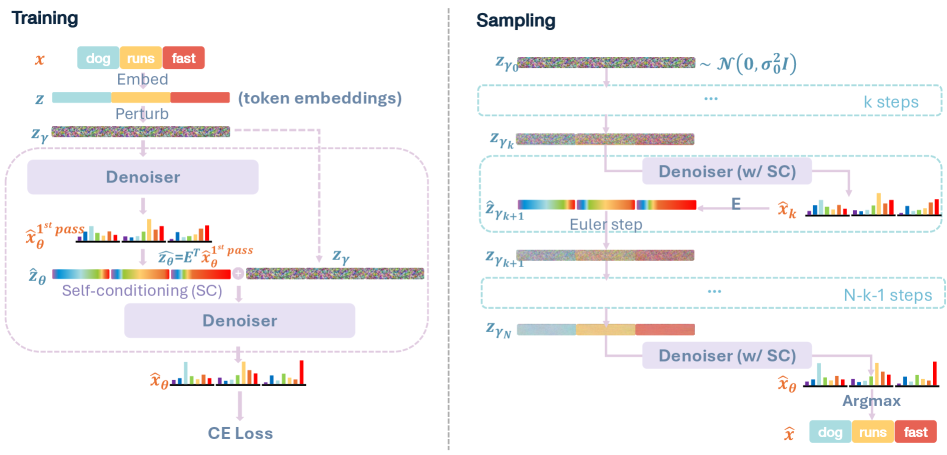

---
tags:
  - DLM
  - THEORY
  - NLP
arxiv: https://arxiv.org/abs/2604.11748
github: https://github.com/nealchen2003/LangFlow
website: ""
year: 2026
read: false
---

# LangFlow: Continuous Diffusion Rivals Discrete in Language Modeling

> **Links:** [arXiv](https://arxiv.org/abs/2604.11748) | [GitHub](https://github.com/nealchen2003/LangFlow)
> **Tags:** #DLM #THEORY #NLP

---

## Methodology

LangFlow is a continuous diffusion language model that operates in **token embedding space** and is trained via Flow Matching derived from Bregman divergence minimization. It bridges embedding-space diffusion with flow matching through a principled information-geometric lens.

### Key Contributions

1. **Bregman-divergence training objective** — Replaces MSE/score-matching with cross-entropy loss derived from the Bregman divergence between the model's predicted token distribution and the clean embedding expectation:

$$\mathcal{L}_\text{CE}(\theta) = \mathbb{E}_{\gamma \sim \pi}\left[\ell_\text{CE}(\gamma)\right]$$

$$\ell_\text{CE}(\gamma) = \mathbb{E}\left[-\frac{1}{L}\sum_{i=1}^{L} \log \hat{x}_\theta^{(i, x^{(i)})}(z_\gamma, \gamma)\right]$$

- $\theta$: model parameters.
- $\gamma$: log noise-to-signal ratio (see point 2 below); $\pi$: the training distribution over $\gamma$ (defines which noise levels to sample).
- $L$: sequence length; $i$: token position index.
- $x^{(i)}$: the ground-truth token id at position $i$ (from the clean sequence).
- $z_\gamma$: noisy embedding at noise level $\gamma$, built from the clean embeddings (see point 2).
- $\hat{x}_\theta^{(i, v)}(z_\gamma, \gamma)$: model-predicted probability of vocabulary token $v$ at position $i$; the superscript $(i, x^{(i)})$ selects the prob. assigned to the true token. This makes the loss a standard per-position cross-entropy.

The model predicts a full token probability distribution at each position; the continuous denoiser is recovered as $\hat{z}_\theta = \sum_v \hat{x}_\theta^v \cdot e_v$ (expected embedding over vocabulary).

- $v$: vocabulary index; $e_v$: the embedding vector of token $v$. So $\hat{z}_\theta$ is the probability-weighted average of token embeddings — this converts the discrete prediction back to a continuous vector for the ODE/flow.

2. **$\gamma$-path time reparameterization** — Conditions on the log noise-to-signal ratio $\gamma_t = \log(\sigma_t^2 / \alpha_t^2)$ rather than time $t \in [0,1]$. Under variance-preserving constraints:

$$\sigma_\gamma^2 = \text{sigmoid}(\gamma), \quad \alpha_\gamma^2 = \text{sigmoid}(-\gamma)$$

- $\alpha_t, \sigma_t$: the signal and noise coefficients of the forward process $z_t = \alpha_t \cdot z_0 + \sigma_t \cdot \epsilon$, where $z_0$ is the clean embedding and $\epsilon \sim \mathcal{N}(0, I)$.
- $\gamma$ monotonically maps $t$ to $(-\infty, +\infty)$: $\gamma \to -\infty$ is clean, $\gamma \to +\infty$ is pure noise; $\text{sigmoid}(\gamma) + \text{sigmoid}(-\gamma) = 1$ enforces $\alpha^2 + \sigma^2 = 1$.

This anchors learning to noise level independently of arbitrary schedule choices.

3. **Information-uniform noise schedule (Gumbel scheduler)** — The posterior entropy $H_\gamma$ is modeled as a Gumbel distribution:

$$H_\gamma = H_\infty \cdot \exp\!\left(-\exp\!\left(-\frac{\gamma - P_\mu}{P_\beta}\right)\right)$$

- $H_\gamma$: predicted posterior entropy at noise level $\gamma$ (how uncertain the model should be about the clean tokens given $z_\gamma$).
- $H_\infty$: learned asymptotic entropy (upper bound as $\gamma \to \infty$, i.e. pure noise).
- $P_\mu, P_\beta$: learned location and scale of the Gumbel CDF that shapes $H_\gamma$ along $\gamma$.

Learnable parameters $H_\infty, P_\mu, P_\beta$ are trained with a scheduler loss:

$$\mathcal{L}_\text{Scheduler} = \mathbb{E}\left[(\ell_\text{CE}(\gamma) - H_\gamma)^2\right]$$

- Regresses the entropy curve $H_\gamma$ onto the empirically observed loss $\ell_\text{CE}(\gamma)$ at each sampled noise level, so the schedule allocates equal loss (information) per $\gamma$ bucket.

The learned schedule is information-uniform, allocating equal capacity across noise levels — standard image diffusion schedules waste compute at high-SNR regions that are informationally trivial for discrete tokens.

4. **ODE-based NLL upper bound** — A tight perplexity bound via the probability flow ODE (Theorem 3.1):

$$\log p(x) \geq \mathbb{E}_z\left[\frac{LD}{2} - \frac{\|z_b\|^2}{2\sigma_b^2} + \sum_{i} \log \hat{x}_\theta^{(i,x^{(i)})}(z_a, a) - \int_a^b \frac{\alpha_\gamma}{2} \nabla \cdot \hat{z}_\theta(z_\gamma, \gamma)\, d\gamma\right]$$

- $x$: the clean token sequence whose likelihood we are lower-bounding; $D$: embedding dimension.
- $a, b$: integration endpoints on the $\gamma$ axis; $a$ is near-clean, $b$ is near-noise.
- $z_a, z_b$: noisy embeddings at those endpoints; $\sigma_b^2$: noise variance at $\gamma = b$.
- $\frac{LD}{2}$ and $\|z_b\|^2 / (2\sigma_b^2)$: Gaussian prior normalization terms.
- $\sum_i \log \hat{x}_\theta^{(i, x^{(i)})}(z_a, a)$: boundary cross-entropy at the near-clean endpoint.
- $\nabla \cdot \hat{z}_\theta$: divergence (trace of the Jacobian) of the predicted clean embedding w.r.t. $z_\gamma$ — the standard change-of-variables term for probability-flow ODEs.

This replaces prior SDE-based bounds that required many evaluations and is used for PPL reporting.

5. **Self-conditioning** — The model is conditioned on its own previous prediction $\hat{z}_\theta^{(\text{prev})}$ with 25% probability during training. This yields large simultaneous gains in both Gen. PPL and PPL — unlike in discrete diffusion where self-conditioning helps Gen. PPL but hurts PPL.

### Architecture

- **DiT**-style Transformer (12 layers, hidden size 768, 12 heads, 130M parameters) with rotary positional encoding
- Preconditioning skip connection warmed up over 5K steps

### Training Details

| Hyperparameter | LM1B | OpenWebText |
|---|---|---|
| Context length | 128 | 1024 |
| Tokenizer | bert-base-uncased | gpt2-large |
| Batch size | 512 | 512 |
| Steps | 1M | 1M |
| Self-cond. probability | 0.25 | 0.25 |
| Sampling steps (eval) | 128 | 1024 |
| Sampler | Euler ODE | Euler ODE |

---

## Experiment Setup

- **Baselines**: MDLM, SEDD Uniform, Plaid (discrete diffusion), Transformer (autoregressive)
- **Datasets**: LM1B (128-token sequences), OpenWebText (1024-token sequences)
- **Metrics**:
  - **PPL**: negative log-likelihood upper bound via ODE (lower is better; measures density estimation quality)
  - **Gen. PPL**: perplexity of unconditional samples evaluated by an external AR model (lower is better; measures sample quality)
- **Zero-shot transfer**: models trained on OWT evaluated on 7 out-of-domain benchmarks

---

## Results

### Main Results (PPL and Gen. PPL)

| Model | Type | LM1B Gen. PPL | LM1B PPL | OWT Gen. PPL | OWT PPL |
|---|---|---|---|---|---|
| Transformer | AR | 66.7 | 22.8 | 35.9 | 17.5 |
| SEDD Uniform | Discrete | — | — | 103.6 | 29.7 |
| MDLM | Discrete | 103.9 | 31.0 | 104.9 | 23.2 |
| Plaid | Discrete | 77.3 | 32.4 | — | — |
| **LangFlow** | **Continuous** | **92.2** | **30.0** | **36.5** | **24.6** |

- **PPL**: LangFlow achieves 30.0 on LM1B (best among diffusion models; MDLM: 31.0) and 24.6 on OWT (near MDLM's 23.2).
- **Gen. PPL**: LangFlow achieves 36.5 on OWT — far better than discrete diffusion baselines (MDLM: 104.9), approaching the AR Transformer (35.9).

### Zero-Shot Transfer (PPL; trained on OWT)

| Model | PTB | WikiText | LM1B | Lambada | AG News | PubMed | Arxiv |
|---|---|---|---|---|---|---|---|
| Transformer (AR) | 82.05 | **25.75** | **51.25** | **51.28** | 52.09 | 49.01 | 41.73 |
| MDLM | 95.26 | 32.83 | 67.01 | 47.52 | 61.15 | **41.89** | 37.37 |
| **LangFlow** | **81.20** | 32.28 | 68.21 | 46.93 | **69.41** | 46.74 | **38.47** |

_Lower PPL is better. Bold = best in column. LangFlow outperforms the AR Transformer on PTB, AG News, PubMed, and Arxiv (4/7 benchmarks)._

### Self-Conditioning Ablation (LM1B)

| Model | Gen. PPL | $\Delta$ Gen. PPL | PPL | $\Delta$ PPL |
|---|---|---|---|---|
| MDLM (no SC) | 103.9 | — | 31.0 | — |
| MDLM + Self-Cond. | 94.9 | −9.0 | 32.7 | **+1.7** |
| LangFlow (no SC) | 154.2 | — | 49.0 | — |
| LangFlow + Self-Cond. | **81.5** | **−72.7** | **30.0** | **−19.0** |

_SC = self-conditioning. For discrete diffusion (MDLM), self-conditioning hurts PPL (+1.7 means worse); for continuous diffusion (LangFlow), it improves both metrics simultaneously._

---

## Related Papers

- [mdlm](mdlm.md)
- [ecdlm](ecdlm.md)
- [idlm](idlm.md)
- [wino](wino.md)
