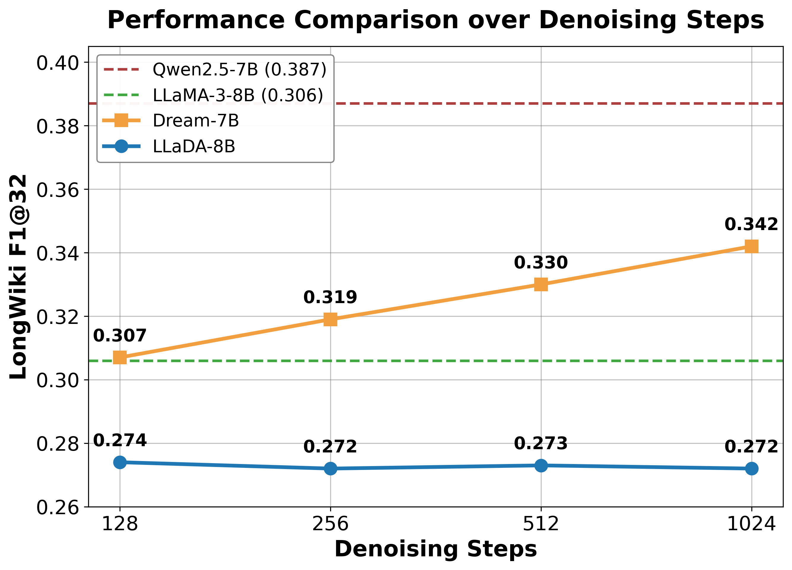

---
tags:
  - DLM
  - NLP
  - REASONING
arxiv: https://arxiv.org/abs/2604.10556
github: https://github.com/ZeroLoss-Lab/Lost-in-Diffusion
website: ""
year: 2026
read: false
---

# Lost in Diffusion: Uncovering Hallucination Patterns and Failure Modes in Diffusion Large Language Models

> **Links:** [arXiv](https://arxiv.org/abs/2604.10556) | [GitHub](https://github.com/ZeroLoss-Lab/Lost-in-Diffusion)
> **Tags:** #DLM #NLP #REASONING

---

## Methodology

*F1@32 score evolution as denoising steps $T \in \{128, 256, 512, 1024\}$ increase on LongWiki. LLaDA-8B saturates early; Dream-7B shows monotonic improvement.*

### Evaluation Framework

**Pairwise comparison design** — two control groups:
1. **Architectural alignment**: LLaDA-8B vs LLaMA-3-8B (both trained on similar data volumes)
2. **Parametric alignment**: Dream-7B vs Qwen2.5-7B (Dream fine-tuned from Qwen2.5-7B)

### Canonical Diffusion Inference

For a target sequence length $L$, the number of denoising steps is set to $T = L$, maximizing iterative refinement capacity. Temperature is zero throughout for reproducibility.

- **LLaDA decoding**: high-confidence token selection at each step
- **Dream decoding**: minimum-entropy token selection at each step

### Hallucination Assessment Tasks (HalluLens-adapted)

1. **PreciseWikiQA** — precise knowledge recall; metrics: False Refusal Rate (FRR), Hallucination Rate (HR), Correct Rate (CR)
2. **LongWiki** — long-form factual consistency; metrics: Precision, Recall@32, F1@32
3. **NonExistentRefusal** — knowledge-boundary detection (fabricated entities); metric: False Acceptance Rate (FA)

Human validation was conducted on a stratified subset (Appendix B) to verify automatic LLM-based evaluation reliability.

### dLLM-Specific Failure Modes

Three hallucination patterns unique to masked diffusion inference identified by manual inspection:

| Failure Mode | Description |
|---|---|
| **Premature Termination** | Model stops generating mid-answer; output truncated before factual content |
| **Incomplete Denoising** | Masked tokens remain in output — `[MASK]` tokens left unreplaced |
| **Context Intrusion** | Fragments from the prompt/context copied verbatim into the answer |

---

## Experiment Setup

**Models:**
- LLaDA-8B (masked diffusion; architectural control for LLaMA-3-8B)
- Dream-7B (masked diffusion; fine-tuned from Qwen2.5-7B)
- LLaMA-3-8B (autoregressive baseline)
- Qwen2.5-7B (autoregressive baseline)

**Benchmark:** HalluLens (adapted); three sub-tasks described above.

**Inference compute sweep:** $T \in \{128, 256, 512, 1024\}$ denoising steps on LongWiki to measure scaling behavior.

---

## Results

### Main Results (Table 1)

| Model | FRR ↓ | HR ↓ | CR ↑ | Prec. ↑ | Rec.@32 ↑ | F1@32 ↑ | FA ↓ |
|---|---|---|---|---|---|---|---|
| LLaMA-3-8B | 28.72 | 85.94 | 10.30 | 0.408 | 0.293 | 0.306 | 73.35 |
| LLaDA-8B | 21.40 | **95.13** | 3.92 | 0.271 | 0.306 | 0.272 | 87.10 |
| Qwen2.5-7B | **18.12** | 89.06 | **9.06** | **0.376** | **0.441** | **0.387** | 94.05 |
| Dream-7B | 26.96 | 92.54 | 6.04 | 0.345 | 0.400 | 0.340 | **98.50** |

*Columns: PreciseWikiQA (FRR, HR, CR) | LongWiki (Prec., Rec.@32, F1@32) | NonExistentRefusal (FA).*

**Legend:**
- FRR = False Refusal Rate (refuses a valid question); HR = Hallucination Rate (factually wrong answer); CR = Correct Rate
- Rec.@32 = Recall at 32 tokens; F1@32 = harmonic mean of Prec. and Rec.@32
- FA = False Acceptance Rate (accepts a nonexistent entity as real)
- Both dLLMs (LLaDA, Dream) show higher hallucination rates than their matched autoregressive counterparts

### Failure Mode Frequencies (Table 2)

| Model | Premature Termination (%) | Incomplete Denoising (%) | Context Intrusion (%) |
|---|---|---|---|
| LLaDA-8B | 18.0 | 60.0 | 38.0 |
| Dream-7B | 13.0 | 44.0 | 58.0 |

*Percentages do not sum to 100% because individual outputs can exhibit multiple failure modes simultaneously.*

### Inference Compute Scaling

- **LLaDA-8B**: F1@32 saturates at $T \approx 256$ on LongWiki; additional denoising steps yield no improvement
- **Dream-7B**: F1@32 improves monotonically as $T$ increases from 128 to 1024, suggesting minimum-entropy decoding benefits from more refinement iterations

---

## Related Papers

- [llada20](llada20.md)
- [llada21](llada21.md)
- [mdlm](mdlm.md)
- [wino](wino.md)
- [idlm](idlm.md)
- [ecdlm](ecdlm.md)
