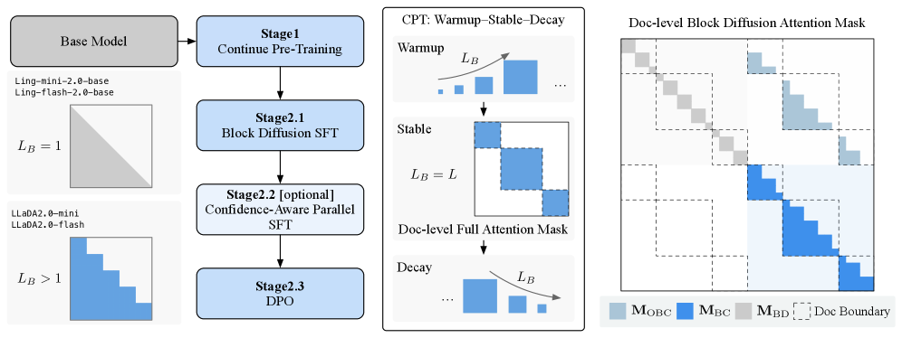

---
tags:
  - DLM
  - MLSYS
  - SPEC_DECODING
arxiv: "https://arxiv.org/abs/2512.15745"
github: ""
website: ""
year: 2025
read: false
---

# LLaDA2.0: Scaling Up Diffusion Language Models to 100B

> **Links:** [arXiv](https://arxiv.org/abs/2512.15745) | [HuggingFace](https://hf.co/collections/inclusionAI/llada-20) | [dFactory](https://github.com/inclusionAI/dFactory) | [dInfer](https://github.com/inclusionAI/dInfer)
> **Tags:** #DLM #MLSYS #SPEC_DECODING

---

## Methodology

### Overview

LLaDA2.0 converts pretrained autoregressive (AR) models into **masked diffusion language models (MDLMs)** at scale (16B and 100B MoE parameters) via a three-phase continual pre-training strategy, followed by post-training alignment with DPO and supervised fine-tuning with a confidence auxiliary loss.

### Block Diffusion Language Model (BDLM)

The sequence $\bm{x}$ of length $L$ is partitioned into $B$ blocks of size $K$. At diffusion timestep $t$, block positions are independently masked with probability controlled by $\alpha_t$. The training loss is:

$$\mathcal{L}_{\text{BDLM}}(\theta) = \mathbb{E}_{t, \bm{x}_t}\left[\frac{\alpha_{t'}}{1 - \alpha_t} \sum_{i \in \mathcal{M}} \log p_\theta(x_i \mid \bm{x}_t)\right]$$

- $\alpha_t$: noise schedule at timestep $t$; $\alpha_{t'} = d\alpha_t / dt$.
- $\mathcal{M}$: set of masked positions in the noised sequence $\bm{x}_t$.
- $p_\theta(x_i \mid \bm{x}_t)$: model prediction for masked token at position $i$ given the full noised context.

When $K = L$ (one block = full sequence), BDLM reduces to classical MDLM.

### Warmup-Stable-Decay (WSD) Pre-training

Converts an AR checkpoint into a full MDLM via three coordinated phases:

| Phase | Block Size $K$ | Attention | Purpose |
|-------|---------------|-----------|---------|
| Warmup | $1 \to 4 \to 32 \to 64 \to 4096$ | Bidirectional within block, causal across | Gradually expand masked receptive field |
| Stable | 4096 (full sequence) | Fully bidirectional | Large-scale MDLM training |
| Decay | $4096 \to 32$ | Block-causal | Distill into efficient blockwise structure for fast inference |

A **document-level attention mask** prevents cross-document attention leakage during bidirectional training on packed sequences.

**Complementary Masking:** Each training sequence is processed twice — once with a random mask $\mathcal{M}$ and once with its complement $\bar{\mathcal{M}}$ — doubling effective data utilization.

### Post-Training

**Supervised Fine-Tuning with Confidence-Aware Parallel (CAP) Loss:**

$$\mathcal{L}_{\text{SFT+CAP}}(\theta) = \mathcal{L}_{\text{SFT}}(\theta) + \lambda \mathcal{L}_{\text{conf}}(\theta)$$

- $\mathcal{L}_{\text{conf}}$: minimizes output entropy only at positions where the model's top-1 prediction is already correct, sharpening confidence for parallel token emission.
- $\lambda$: task-dependent weight.

**DPO Adaptation:** Standard DPO log-likelihoods are replaced by block diffusion ELBO estimates, maximizing the margin between ELBO of preferred vs. dispreferred responses ($\beta = 0.1$).

---

## Experiment Setup

- **Base models:** Ling-mini-2.0 (16B MoE) → **LLaDA2.0-mini**; Ling-flash-2.0 (100B MoE) → **LLaDA2.0-flash**
- **Context length:** 32k native; 64k with YaRN rope scaling
- **Inference:** block size $K = 32$; denoising confidence threshold 0.95
- **Training infra:** Megatron-LM with DP + PP + TP + CP + EP parallelism; cuDNN bidirectional attention (1.3x vs. TransformerEngine)
- **Post-training:** dFactory (on VeOmni); DPO with ELBO proxy; CAP SFT
- **Inference engine:** dInfer + SGLang
- **Evaluation:** 47 benchmarks across Knowledge, Reasoning, Coding, Math, Agent & Alignment

---

## Results

### Main Results — LLaDA2.0-mini (16B)

| Benchmark | Qwen3-8B (AR) | Ling-mini-2.0 (AR) | LLaDA2.0-mini-preview | **LLaDA2.0-mini** |
|-----------|:---:|:---:|:---:|:---:|
| **Average (47 benchmarks)** | 63.42 | 65.77 | 54.67 | **64.34** |
| MMLU | — | — | — | 80.53 |
| HumanEval | — | — | — | 86.59 |
| GSM8K | — | — | — | 94.24 |
| MATH | — | — | — | 93.22 |
| SQuAD 2.0 | — | — | — | 86.50 |
| IFEval | — | — | — | 80.78 |

### Main Results — LLaDA2.0-flash (100B)

| Benchmark | Qwen3-30B-A3B (AR) | Ling-flash-2.0 (AR) | LLaDA2.0-flash-preview | **LLaDA2.0-flash** |
|-----------|:---:|:---:|:---:|:---:|
| **Average (47 benchmarks)** | 73.60 | 72.15 | 65.97 | **73.18** |
| MMLU | — | — | — | 87.69 |
| GSM8K | — | — | — | 96.06 |
| HumanEval | — | — | — | 94.51 |
| MATH | — | — | — | 95.44 |
| DROP | — | — | — | 87.90 |
| AIME 2025 | — | — | — | 60.00 |

*preview = intermediate checkpoint before WSD decay phase completes. AR = autoregressive baselines with no parallel decoding. All scores are accuracy (%).*

### Inference Throughput (LLaDA2.0-flash)

| Setting | TPS | Speedup vs. AR |
|---------|:---:|:---:|
| Ling-flash-2.0 (AR baseline) | 237–256 | 1× |
| LLaDA2.0-flash (no CAP) | 383 | ~1.5× |
| LLaDA2.0-flash (with CAP) | 535 | **~2.1×** |

*TPS = tokens per second wall-clock throughput. CAP sharpens token confidence enabling larger parallel token batches per forward pass.*

---

## Related Papers

- [llada21](llada21.md)
- [mdlm](mdlm.md)
- [dflash](dflash.md)
- [rcd](rcd.md)
- [wino](wino.md)
- [idlm](idlm.md)
- [ecdlm](ecdlm.md)
- [sdar](sdar.md)
- [df](df.md)
- [dmax](dmax.md)
