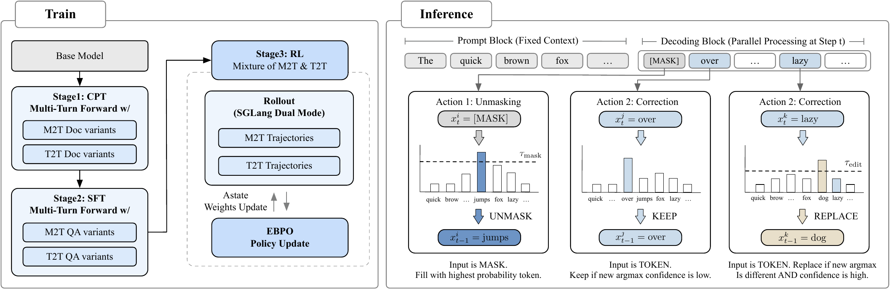

---
tags:
  - DLM
  - RL
  - SPEC_DECODING
  - MLSYS
arxiv: "https://arxiv.org/abs/2602.08676"
github: ""
website: ""
year: 2026
read: false
---

# LLaDA2.1: Speeding Up Text Diffusion via Token Editing

> **Links:** [arXiv](https://arxiv.org/abs/2602.08676)
> **Tags:** #DLM #RL #SPEC_DECODING #MLSYS

---

## Methodology

### Core Idea: Draft-and-Edit Decoding

Standard discrete diffusion (absorbing-state) forces a monotonic $\text{[MASK]} \to \text{token}$ transition. LLaDA2.1 introduces a **Token-to-Token (T2T) editing** operation on top of the conventional **Mask-to-Token (M2T)** unmasking, enabling the model to retroactively correct its own parallel-drafted outputs.

### Configurable Threshold Decoding

At each diffusion timestep $t$, let $v_t^i = \arg\max_v\, p_\theta(v \mid \bm{x}_t)$ be the top-candidate token at position $i$.

Two active update sets are defined:

$$\Gamma_t = \left\{ i \mid x_t^i = \text{[MASK]} \;\text{and}\; p_\theta(v_t^i \mid \bm{x}_t) > \tau_{\text{mask}} \right\}$$

- $\Gamma_t$: set of positions where a masked token is unmasked (M2T); triggers when confidence exceeds the unmasking threshold.
- $x_t^i$: token at position $i$ at diffusion timestep $t$.
- $\tau_{\text{mask}} \in [0,1]$: confidence threshold for M2T unmasking.

$$\Delta_t = \left\{ i \mid x_t^i \neq v_t^i \;\text{and}\; p_\theta(v_t^i \mid \bm{x}_t) > \tau_{\text{edit}} \right\}$$

- $\Delta_t$: set of positions where a generated token is replaced by a different value (T2T editing).
- $\tau_{\text{edit}} \in [0,1]$: confidence threshold for T2T editing.

The state transition applies updates on the union of both sets:

$$x_{t-1}^i = \begin{cases} v_t^i & \text{if } i \in \Gamma_t \cup \Delta_t, \\ x_t^i & \text{otherwise.} \end{cases}$$

- $x_{t-1}^i$: updated token at position $i$ for the next timestep.
- $v_t^i$: model's top-1 predicted token at position $i$ given the current sequence $\bm{x}_t$.

**Two operating modes:**
- **Speedy Mode (S Mode):** low $\tau_{\text{mask}}$ aggressively accepts uncertain M2T tokens; T2T editing corrects errors afterward → higher TPF (tokens per forward), higher throughput.
- **Quality Mode (Q Mode):** conservative $\tau_{\text{mask}}$; T2T used sparingly → higher accuracy with moderate speed gain.

### Multi-Block Editing (MBE)

Beyond single-block editing, MBE allows the model to revisit and revise previously finalized blocks when newly decoded blocks provide corrective context, at the cost of a modest reduction in TPF.

### Training: Mixture of M2T and T2T Objectives

Both CPT and SFT use a dual-stream training objective applied uniformly throughout all training stages:

- **Drafting stream (M2T):** cross-entropy loss predicting the correct token at each masked position (standard masked diffusion).
- **Editing stream (T2T):** cross-entropy loss recovering the original token from randomly perturbed (noised) positions; teaches the model to identify and rewrite artifacts.

A **Multi-turn Forward (MTF)** data augmentation exposes the model to diverse editing scenarios, enhancing editing capability.

### RL Stage: ELBO-based Block-level Policy Optimization (EBPO)

Standard policy gradient cannot be applied to dLLMs because $\log \pi_\theta(\bm{y})$ is intractable. EBPO uses the ELBO as a principled proxy and parallelizes likelihood estimation via **Vectorized Likelihood Estimation**.

The clipped surrogate objective is:

$$\mathcal{J}_{\text{EBPO}}(\theta) = \mathbb{E}_{\bm{x},\bm{y} \sim \pi_{\theta_{\text{old}}}} \left[ \min\!\left( \rho(\bm{y}|\bm{x})\,\hat{A},\; \text{clip}\!\left(\rho(\bm{y}|\bm{x}),\, 1{-}\epsilon_{\text{low}},\, 1{+}\epsilon_{\text{high}}\right)\hat{A} \right) \right]$$

- $\rho(\bm{y}|\bm{x})$: probability ratio of response $\bm{y}$ given context $\bm{x}$ between current policy $\pi_\theta$ and old policy $\pi_{\theta_{\text{old}}}$ (importance weight).
- $\hat{A}$: advantage estimate — relative quality of response $\bm{y}$ over the average under the current policy.
- $\epsilon_{\text{low}}, \epsilon_{\text{high}}$: lower and upper clipping bounds for the probability ratio.

The log probability ratio is approximated via block-level ELBO:

$$\log \rho(\bm{y}|\bm{x}) \approx \sum_{n=1}^{N} w_n \sum_{b=1}^{B} \left( \log p_\theta(\bm{y}^b \mid \bm{z}_n, \bm{x};\, \mathcal{M}) - \log p_{\theta_{\text{old}}}(\bm{y}^b \mid \bm{z}_n, \bm{x};\, \mathcal{M}) \right)$$

- $N$: number of discretized diffusion timesteps used for ELBO estimation.
- $\{t_n\}_{n=1}^N$, $\{w_n\}$: discretized timesteps and their quadrature weights.
- $B$: number of blocks in the block-autoregressive factorization.
- $\bm{y}^b$: the $b$-th block of the output sequence.
- $\bm{z}_n = \bm{y}_{t_n} \oplus \bm{y}_0$: composite input concatenating the noised output at timestep $t_n$ with the clean output $\bm{y}_0$; enables all $B$ block-conditional probabilities in a single forward pass per timestep.
- $\mathcal{M}$: block-causal mask ensuring the $b$-th block attends only to valid history (blocks $1, \ldots, b-1$).

---

## Experiment Setup

- **Models released:** LLaDA2.1-Mini (16B), LLaDA2.1-Flash (100B).
- **Baselines:** LLaDA2.0-flash/mini (same size, no editing), Ling-flash-2.0, Ling-mini-2.0, Qwen3-30B-A3B-Inst-2507 (AR), Qwen3-8B (AR).
- **Benchmarks (33 total):** Knowledge (MMLU-Pro, GPQA-Diamond, C-Eval, PHYBench, TriviaQA), Reasoning (BBH, BBEH, MuSR, ZebraLogic, PrOntoQA, HellaSwag, etc.), Coding (HumanEval+, MBPP+, LiveCodeBench, BigCodeBench, CRUXEval-O, MultiPL-E, Spider, BIRD-SQL), Math (AIME 2025, OlympiadBench, GSM-Plus, CMATH, Omni-MATH), Agent & Alignment (IFEval, BFCL v3, Nexus FC).
- **Speed metrics:** TPS (tokens/second) and TPF (tokens per forward pass).
- **Quantization:** per-block FP8 quantization.
- **Inference engine:** customized SGLang with Alpha-MoE MoE megakernel, radix caching, block-wise causal masked attention, batching for block diffusion.
- **RL framework:** EBPO built on AReaL; rollout via SGLang; distributed orchestration via ASystem.

---

## Results

### Flash (100B) Benchmark vs. Baselines

| Benchmark | Qwen3-30B-A3B | Ling-flash-2.0 | LLaDA2.0-flash Score \| TPF | LLaDA2.1-flash S Mode Score \| TPF | LLaDA2.1-flash Q Mode Score \| TPF |
|---|---|---|---|---|---|
| **Average** | 73.09 | 71.52 | 72.43 \| 3.08 | 72.34 \| 5.93 | 73.54 \| 3.64 |
| GPQA | 54.14 | 69.16 | 62.31 \| 3.29 | 66.67 \| 3.95 | 67.30 \| 2.37 |
| MMLU-Pro | 74.21 | 77.55 | 74.79 \| 2.36 | 75.31 \| 4.43 | 76.59 \| 2.62 |
| BIG-Bench Hard | 85.54 | 89.36 | 86.75 \| 2.66 | 87.82 \| 5.61 | 88.69 \| 3.28 |
| HumanEval+ | 87.88 | 87.58 | 88.41 \| 6.45 | 89.63 \| 13.81 | 89.63 \| 9.18 |
| LiveCodeBench | 46.42 | 52.48 | 42.51 \| 4.23 | 44.05 \| 6.48 | 45.37 \| 3.80 |
| AIME 2025 | 61.88 | 55.89 | 60.00 \| 4.57 | 63.33 \| 5.36 | 63.33 \| 3.46 |
| IFEval-strict | 83.73 | 81.15 | 82.62 \| 1.47 | 83.36 \| 2.24 | 83.55 \| 1.41 |

*Score \| TPF cells report accuracy (%) and TPF for diffusion models. Qwen3 and Ling are autoregressive (AR) with TPF = 1 by definition (score only shown). TPF = tokens per forward pass; higher means more tokens per decoding step. S Mode = Speedy Mode; Q Mode = Quality Mode.*

### Mini (16B) Benchmark vs. Baselines

| Benchmark | Qwen3-8B | Ling-mini-2.0 | LLaDA2.0-mini Score \| TPF | LLaDA2.1-mini S Mode Score \| TPF | LLaDA2.1-mini Q Mode Score \| TPF |
|---|---|---|---|---|---|
| **Average** | 61.59 | 64.72 | 63.39 \| 2.60 | 62.07 \| 5.34 | 63.90 \| 3.12 |
| GPQA | 48.01 | 59.41 | 47.76 \| 2.73 | 48.36 \| 3.62 | 53.28 \| 2.12 |
| MMLU-Pro | 65.83 | 67.18 | 64.27 \| 2.15 | 63.42 \| 4.22 | 64.84 \| 2.41 |
| HumanEval+ | 79.50 | 80.03 | 81.40 \| 5.16 | 80.49 \| 12.32 | 82.93 \| 7.77 |
| AIME 2025 | 22.08 | 47.66 | 36.67 \| 2.41 | 36.67 \| 6.34 | 43.33 \| 3.29 |
| IFEval-strict | 84.29 | 76.16 | 80.78 \| 1.24 | 81.33 \| 1.83 | 83.18 \| 1.25 |

### Throughput (TPS) with/without FP8 Quantization (S Mode)

| Category | Benchmark | Flash w/o Quant TPS | Flash w/ Quant TPS | Mini w/o Quant TPS | Mini w/ Quant TPS |
|---|---|---|---|---|---|
| Coding | HumanEval+ | 746.66 | 891.74 | 1496.67 | 1586.93 |
| Coding | MBPP+ | 639.47 | 761.38 | 1286.96 | 1303.96 |
| Coding | BigCodeBench | 691.14 | 801.48 | 1220.40 | 1307.45 |
| Coding | LiveCodeBench | 571.60 | 663.39 | 1015.82 | 1102.92 |
| Math | GSM-Plus | 574.65 | 667.07 | 1080.51 | 1186.18 |
| Knowledge | GPQA-Diamond | 416.92 | 477.79 | 724.30 | 784.62 |
| Instr. Following | IFEval | 219.37 | 248.25 | 338.58 | 365.52 |
| Reasoning | PrOntoQA | 770.88 | 912.16 | 880.19 | 938.93 |

*TPS = tokens per second (wall-clock throughput). w/o Quant = BF16 baseline; w/ Quant = per-block FP8. Score changes from quantization are under ±3 points across all benchmarks.*

### Multi-Block Editing (MBE) Ablation (S Mode)

| Category | Benchmark | Flash w/o MBE Score \| TPF | Flash w/ MBE Score \| TPF | Mini w/o MBE Score \| TPF | Mini w/ MBE Score \| TPF |
|---|---|---|---|---|---|
| Reasoning | ZebraLogic | 84.20 \| 5.80 | 88.20 \| 5.03 | 68.50 \| 5.38 | 70.00 \| 4.62 |
| Coding | LiveCodeBench | 44.05 \| 6.48 | 46.48 \| 5.62 | 28.85 \| 6.42 | 29.74 \| 5.44 |
| Coding | BigCodeBench | 37.11 \| 8.51 | 39.30 \| 7.00 | 30.18 \| 7.33 | 30.70 \| 6.05 |
| Math | AIME 2025 | 63.33 \| 5.36 | 70.00 \| 4.71 | 36.67 \| 6.34 | 36.67 \| 5.25 |
| **Average** | — | 70.69 \| 5.82 | 72.67 \| 5.14 | 57.63 \| 5.25 | 58.24 \| 4.59 |

*MBE = Multi-Block Editing: the model revisits and corrects earlier blocks based on newly decoded content. Score \| TPF cells report accuracy (%) and tokens-per-forward. MBE improves accuracy (especially reasoning and coding) at a ~11-12% TPF reduction.*

---

## Related Papers

- [mdlm](mdlm.md)
- [dflash](dflash.md)
- [rcd](rcd.md)
- [wino](wino.md)
- [idlm](idlm.md)
- [ecdlm](ecdlm.md)
- [sdar](sdar.md)
- [df](df.md)
- [dmax](dmax.md)
- [justgrpo](justgrpo.md)
