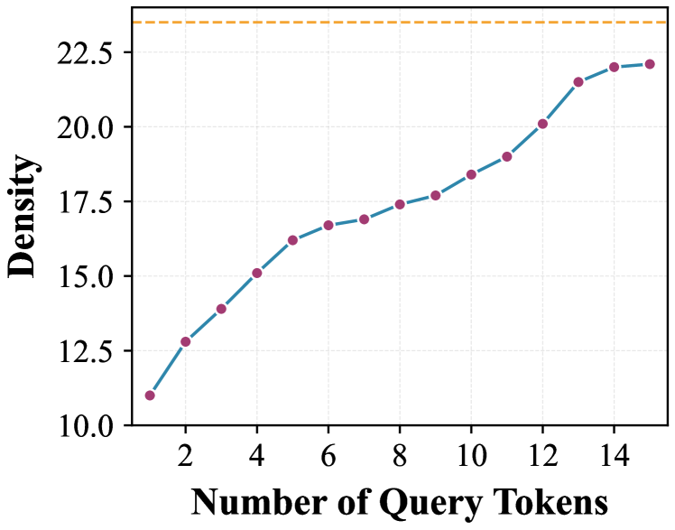

---
tags:
  - DLM
  - MLSYS
arxiv: https://arxiv.org/abs/2604.12056
github: ""
website: ""
year: 2025
read: false
---

# LoSA: Locality Aware Sparse Attention for Block-Wise Diffusion Language Models

> **Links:** [arXiv](https://arxiv.org/abs/2604.12056)
> **Tags:** #DLM #MLSYS

---

## Methodology

Block-wise diffusion language models (e.g., Trado, SDAR) attend over the full KV cache at each denoising step, causing **memory-bound attention** that becomes expensive at long contexts. Naive sparse attention (QUEST) applied to block diffusion causes a **KV Inflation** problem: the union of KV indices selected by different tokens within the same block inflates attention density far beyond the per-token budget, yielding poor quality.

LoSA solves this with two complementary observations:
1. **Locality** — a small fraction of tokens change substantially between consecutive denoising steps; most are "stable."
2. **Reuse** — stable tokens can reuse cached prefix-attention outputs from a prior step instead of recomputing.

### Algorithm

**Step 1 — Active Token Detection (Locality Pruning)**

Between consecutive denoising steps $t$ and $t{-}1$, compute per-token MSE on the query representation:

$$\delta_i = \| q_i^{(t)} - q_i^{(t-1)} \|_2^2$$

- $q_i^{(t)} \in \mathbb{R}^{d_h}$: query vector of token $i$ at step $t$; $d_h$ is the attention head dimension.
- $\delta_i$: scalar change magnitude for token $i$ between consecutive steps.

Select the top-$k_\text{active}$ tokens with the largest $\delta_i$ as **active tokens** $\mathcal{A}$; the remainder are **stable tokens** $\mathcal{S}$.

**Step 2 — Prefix Attention for Stable Tokens (Cache Reuse)**

For each stable token $i \in \mathcal{S}$, reuse the cached prefix-attention output and log-sum-exp normalizer from the previous step:

$$\mathbf{o}_i^{\text{prefix}} \leftarrow \hat{\mathbf{o}}_i^{\text{prefix},\,(t-1)}, \quad L_i^{\text{prefix}} \leftarrow \hat{L}_i^{\text{prefix},\,(t-1)}$$

- $\mathbf{o}_i^{\text{prefix}} \in \mathbb{R}^{d_h}$: unnormalized prefix-attention output for token $i$.
- $L_i^{\text{prefix}}$: log-sum-exp normalizer for token $i$'s prefix attention (used for numerically stable online-softmax merge in Step 5).
- $\hat{(\cdot)}^{(t-1)}$: cached values from the previous denoising step.

**Step 3 — Sparse Prefix Attention for Active Tokens**

For each active token $i \in \mathcal{A}$, use the QUEST selector to pick $B$ KV indices from the prefix. Take the union across active tokens:

$$\mathcal{I} = \bigcup_{i \in \mathcal{A}} \text{QUEST}(q_i, \mathbf{K}^{\text{prefix}}, B)$$

- $\mathcal{I}$: set of selected prefix KV positions (shared across active tokens to avoid redundant loads).
- $\mathbf{K}^{\text{prefix}}$: full prefix key cache.
- $B$: per-token KV budget (128/256/512/1024 in experiments).
- $\text{QUEST}(\cdot)$: page-level importance scorer that returns top-$B$ KV indices for a query.

Compute sparse prefix attention for active tokens using only $\mathcal{I}$.

**Step 4 — Dense Within-Block Attention**

All tokens attend densely to the current block's KV pairs $(\mathbf{K}^{\text{block}}, \mathbf{V}^{\text{block}})$:

$$\mathbf{o}_i^{\text{block}}, L_i^{\text{block}} \leftarrow \text{Attention}(q_i, \mathbf{K}^{\text{block}}, \mathbf{V}^{\text{block}})$$

- $\mathbf{K}^{\text{block}}, \mathbf{V}^{\text{block}}$: keys and values of the current generation block (all tokens in the block attend to each other).

**Step 5 — Online-Softmax Merge**

Combine prefix and block contributions using log-normalizer tracking:

$$\mathbf{o}_i = \frac{\exp(L_i^{\text{prefix}}) \cdot \mathbf{o}_i^{\text{prefix}} + \exp(L_i^{\text{block}}) \cdot \mathbf{o}_i^{\text{block}}}{\exp(L_i^{\text{prefix}}) + \exp(L_i^{\text{block}})}$$

- $L_i^{\text{prefix}}, L_i^{\text{block}}$: log-sum-exp normalizers for prefix and block attention respectively; used to reweight the unnormalized outputs before summing.
- This is the standard online-softmax tile-merge (identical to FlashAttention's cross-tile reduction).

---

## Experiment Setup

- **Models:** Trado-8B-Instruct, Trado-4B-Instruct, SDAR-8B-Chat (block-wise diffusion LMs).
- **Baselines:** Dense attention, QUEST sparse attention, SparseD.
- **Benchmark:** LongBench (HotPotQA, TriviaQA, NarrativeQA, Qasper, MultiFieldQA); context lengths ≥8K tokens.
- **KV budgets $B$:** 128, 256, 512, 1024 tokens per query.
- **Active token fraction:** top-50% by per-token query MSE (ablated in paper).
- **Hardware:** RTX A6000, RTX 5090.
- **No training** — purely inference-time method applied to pre-trained models.

---

## Results

### LongBench Accuracy — Trado-8B-Instruct

| Budget $B$ | Method | HotPotQA | TriviaQA | NarrativeQA | Qasper | MultiFieldQA | Avg |
|---|---|---|---|---|---|---|---|
| — | Dense | 49.45 | 84.79 | 19.04 | 17.75 | 53.29 | 44.86 |
| 128 | QUEST | 29.17 | 69.21 | 7.46 | 13.64 | 38.21 | 31.54 |
| 128 | SparseD | 38.97 | 64.64 | 13.70 | 7.95 | 39.55 | 32.96 |
| 128 | **LoSA** | **48.27** | **83.79** | **17.19** | **15.58** | **45.00** | **41.97** |
| 256 | QUEST | 32.95 | 75.23 | 8.50 | 14.04 | 42.46 | 34.64 |
| 256 | SparseD | 43.84 | 73.63 | 15.33 | 13.26 | 49.44 | 39.10 |
| 256 | **LoSA** | **44.53** | **81.82** | **19.42** | **17.11** | **47.81** | **42.14** |
| 512 | QUEST | 34.58 | 79.33 | 8.99 | 16.57 | 44.04 | 36.70 |
| 512 | SparseD | 47.84 | 80.78 | 14.08 | 13.85 | 52.16 | 41.74 |
| 512 | **LoSA** | 44.19 | **84.97** | **18.39** | 13.30 | **50.14** | **42.20** |
| 1024 | QUEST | 39.88 | 78.84 | 7.37 | 17.35 | 45.00 | 37.69 |
| 1024 | SparseD | 48.98 | 80.25 | 19.43 | 15.77 | 50.11 | 42.91 |
| 1024 | **LoSA** | **48.45** | **82.32** | **18.89** | **15.78** | **48.94** | **42.88** |

*Budget $B$: number of KV positions retrieved from prefix per query token. All scores are accuracy (%). Dense uses the full KV cache.*

### LongBench Accuracy — SDAR-8B-Chat

| Budget $B$ | Method | HotPotQA | TriviaQA | NarrativeQA | Qasper | MultiFieldQA | Avg |
|---|---|---|---|---|---|---|---|
| — | Dense | 49.35 | 85.72 | 19.06 | 18.25 | 49.49 | 44.37 |
| 128 | QUEST | 27.31 | 70.40 | 6.44 | 17.29 | 41.40 | 32.57 |
| 128 | SparseD | 42.09 | 63.08 | 12.94 | 9.04 | 36.24 | 32.68 |
| 128 | **LoSA** | **43.36** | **80.32** | **18.69** | **15.63** | **46.74** | **40.95** |
| 256 | QUEST | 32.57 | 78.36 | 8.73 | 18.21 | 43.20 | 36.21 |
| 256 | SparseD | 48.39 | 73.28 | 15.83 | 14.84 | 47.37 | 39.94 |
| 256 | **LoSA** | **45.68** | **83.16** | **15.65** | 13.17 | **48.33** | **41.20** |
| 512 | QUEST | 32.50 | 78.43 | 9.80 | 19.36 | 43.08 | 36.63 |
| 512 | SparseD | 50.52 | 81.83 | 15.44 | **18.52** | 48.93 | 43.05 |
| 512 | **LoSA** | **47.77** | **83.29** | **17.37** | 14.12 | **49.90** | **42.49** |
| 1024 | QUEST | 32.59 | 80.92 | 11.00 | 19.28 | 42.30 | 37.22 |
| 1024 | SparseD | 48.25 | 83.44 | 15.60 | 16.15 | 48.97 | 42.48 |
| 1024 | **LoSA** | **47.84** | **85.93** | **18.44** | 14.70 | **48.43** | **43.07** |

### KV-Cache Density — Trado-8B-Instruct

| Budget $B$ | Method | HotPotQA | TriviaQA | NarrativeQA | Qasper | MultiFieldQA | Avg | Reduction vs QUEST |
|---|---|---|---|---|---|---|---|---|
| 128 | QUEST | 2.93% | 3.80% | 1.90% | 6.72% | 5.87% | 4.24% | — |
| 128 | LoSA | 1.71% | 2.29% | 0.98% | 4.15% | 3.77% | 2.58% | 1.64× |
| 256 | QUEST | 5.84% | 7.07% | 3.89% | 12.47% | 11.14% | 8.08% | — |
| 256 | LoSA | 3.37% | 4.47% | 2.05% | 7.90% | 7.43% | 5.04% | 1.60× |
| 512 | QUEST | 10.74% | 13.06% | 7.24% | 23.13% | 19.71% | 14.78% | — |
| 512 | LoSA | 6.63% | 8.54% | 3.99% | 15.39% | 14.00% | 9.71% | 1.52× |
| 1024 | QUEST | 19.10% | 22.85% | 13.06% | 39.06% | 34.21% | 25.66% | — |
| 1024 | LoSA | 12.57% | 16.24% | 7.50% | 28.81% | 26.04% | 18.23% | 1.41× |

*KV-cache density = fraction of prefix KV positions accessed per query after union (KV Inflation). Lower is better. "Reduction vs QUEST" = QUEST avg ÷ LoSA avg.*

### Attention Latency

| Hardware | Attention speedup vs dense |
|---|---|
| RTX A6000 | 4.14× |
| RTX 5090 | 3.67× |

---

## Related Papers

- [sdar](sdar.md)
- [mdlm](mdlm.md)
- [wino](wino.md)
- [ecdlm](ecdlm.md)
- [idlm](idlm.md)
- [dflash](dflash.md)
- [flashattn](flashattn.md)
