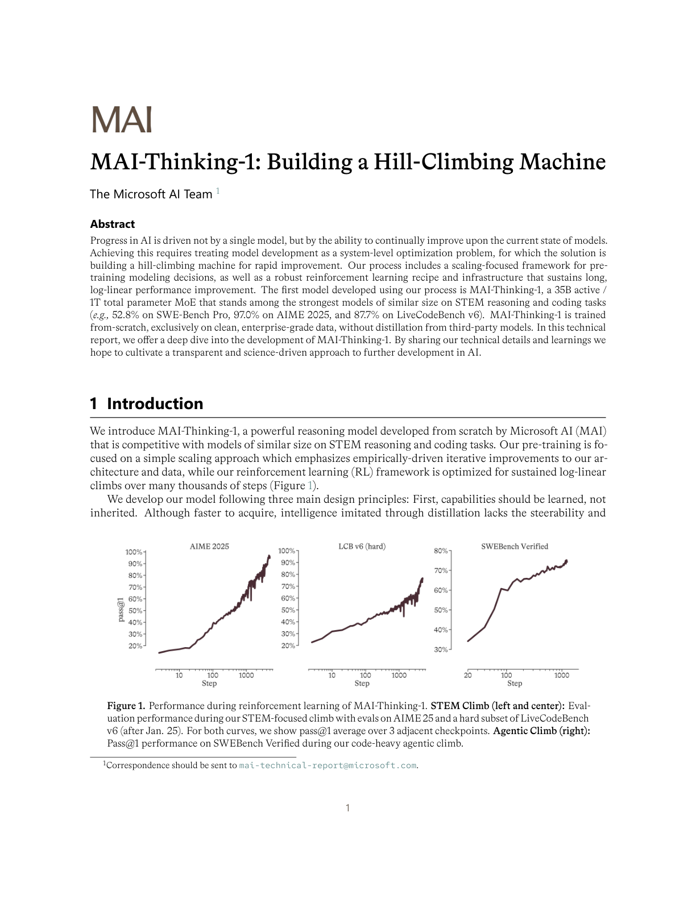
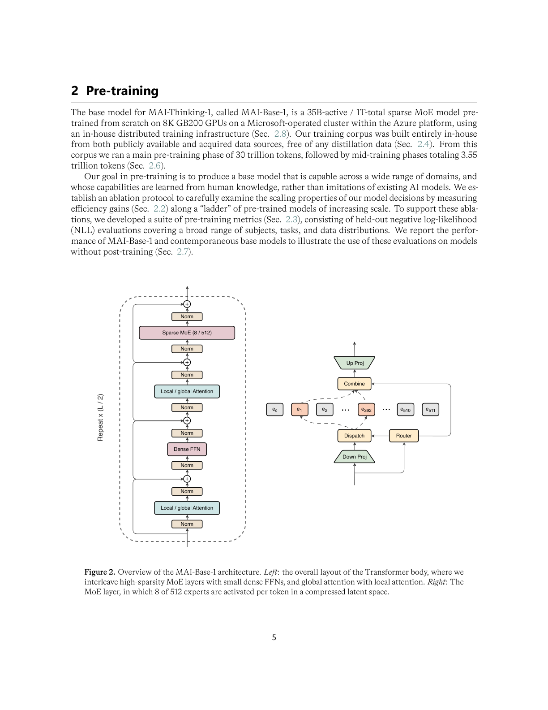
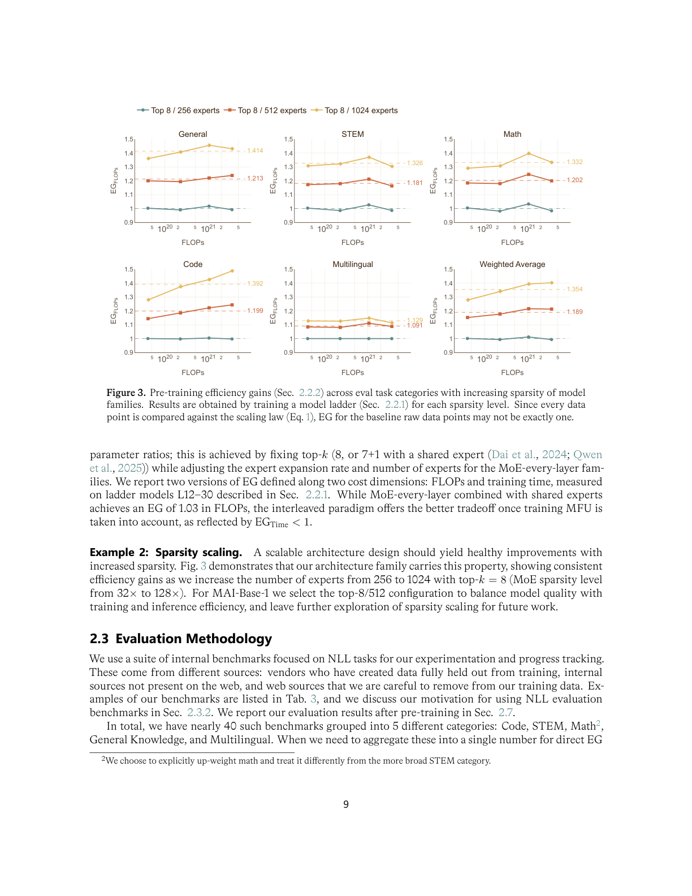
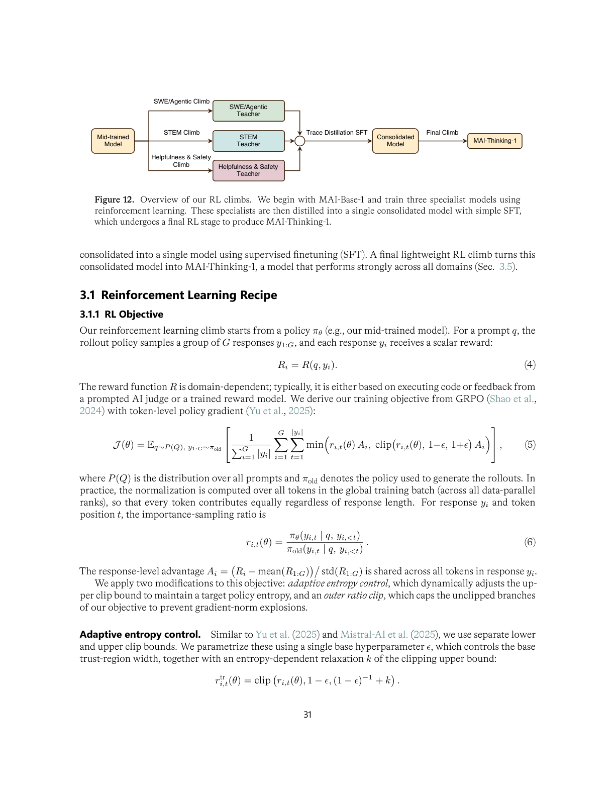
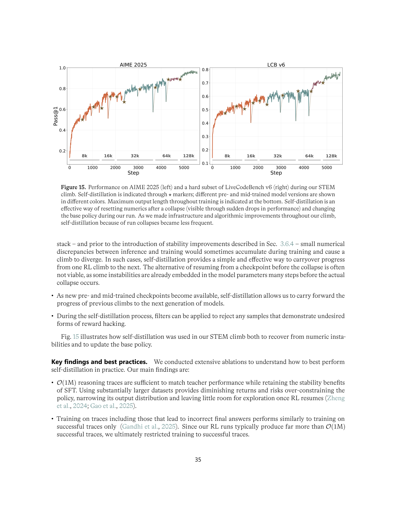

---
tags:
  - RL
  - MLSYS
  - REASONING
arxiv: https://microsoft.ai/wp-content/uploads/2026/06/main_20260602_2.pdf
github: ""
website: ""
year: 2026
read: false
---

# MAI-Thinking-1: Building a Hill-Climbing Machine

> **Links:** [Paper](https://microsoft.ai/wp-content/uploads/2026/06/main_20260602_2.pdf)
> **Tags:** #RL #MLSYS #REASONING

---

## Methodology

*Figure 1. RL performance during training. Left/Center: STEM climb — AIME 2025 (left) and hard LiveCodeBench v6 (center) pass@1 averaged over 3 adjacent checkpoints. Right: Agentic climb — SWE-Bench Verified pass@1 during agentic coding RL.*

MAI-Thinking-1 frames model development as a **hill-climbing machine**: a system-level optimization loop enabling continuous improvement via data-driven ablation, scaling-focused pretraining, and a robust RL recipe.

Three design principles:
1. Capabilities are **learned**, not inherited — trained from scratch, no distillation from third-party models.
2. **Simplicity is sustainable** — clean data, simple recipes, transparent infrastructure.
3. **Scientific rigor** — every decision validated through controlled ablations on a ladder of models.

### Model Architecture (MAI-Base-1)

*Figure 2. MAI-Base-1 architecture. Left: interleaved Sparse MoE and Dense FFN blocks with local/global attention. Right: LatentMoE layer — 8 of 512 experts activated per token in a compressed latent space (via down-projection before dispatch).*

A 35B-active / 1T-total-parameter decoder-only Transformer MoE:

| Component | Value |
|---|---|
| Layers | 78 |
| Hidden dim | 6656 |
| Expert FFN dim | 10240 |
| Down-projection (LatentMoE) | 3072 |
| Top-k / Total experts | 8 / 512 |
| KV heads | 8 |
| Context length (max) | 256K |
| Tokenizer | o200k_base (200,019 vocab) |

Key architectural choices:
- **Alternating MoE + Dense layers**: MoE and dense FFN blocks interleaved (not every layer is MoE).
- **5:1 local-to-global attention ratio**: local attention alternates with full-context global attention to reduce memory while preserving long-range modeling.
- **LatentMoE**: down-projection to 3072 before routing enables 512 experts without proportional parameter explosion.
- **Attention zero-init**: output RMSNorm gains set to zero at init, preventing representation collapse and MoE load imbalance.
- FlashAttention-4 + Ulysses-style context parallelism for long-context mid-training.

*Figure 3. Efficiency gain (EG) vs. number of experts at fixed top-k=8. Higher sparsity (more experts) consistently improves efficiency across all task categories, motivating the 8/512 design.*

### Pre-training Recipe

| Phase | Tokens | Context Length | GPUs |
|---|---|---|---|
| Pre-training | 30 T | 16,384 | 8,192 x GB200 |
| Mid-training 1 | 3.4 T | 65,536 | 8,192 x GB200 |
| Mid-training 2 | 150 B | 262,144 | 4,096 x GB200 |

**Optimizer:** AdamW, $\beta_1=0.95$, $\beta_2=0.925$, $\varepsilon=10^{-8}$, weight decay 0.1 (attention 0.01, embeddings 0.005), gradient clip 1.0.

**LR schedule:** Linear warmup ~12B tokens, cosine decay from $2\times10^{-4}$ to $2\times10^{-5}$ (final/peak ratio 0.1). No warmup for mid-training.

**Numerical precision:** BF16 default; FP8 E4M3 for forward GEMMs; FP8 E5M2 for data-gradient; BF16+FP32 accumulation for weight-gradient; FP32 for pre-softmax, router, residual, embeddings. FP8 delayed scaling (1024-step history); stochastic rounding on downcasts.

**Data:** All in-house, no synthetic/AI-generated/open-source training sets. Knowledge cutoffs: Web HTML Sep 2025, Web PDFs Dec 2025, GitHub Jun 2025, Books/journals Mar 2026. 20-gram fuzzy deduplication at 80% similarity.

### Reinforcement Learning Climb

Three **specialist models** trained independently, consolidated, then a final RL stage:

*Figure 12. RL pipeline: three specialist climbs (STEM, Agentic, Helpfulness/Safety) from the mid-trained base, consolidated via trace distillation + SFT, followed by a final lightweight RL stage to produce MAI-Thinking-1.*

**RL Objective (modified GRPO):**

$$\mathcal{L}_\text{RL} = -\mathbb{E}_{y \sim \pi_\theta} \left[ \hat{A}(q, y) \cdot \log \pi_\theta(y \mid q) \right]$$

- $q$: input prompt; $y$: generated response; $\pi_\theta$: current policy.
- $\hat{A}(q,y)$: group-relative advantage — reward of $y$ minus mean reward of a group of rollouts for the same $q$.

Two key modifications over vanilla GRPO:

1. **Adaptive entropy control**: integral controller dynamically adjusts upper clip bound $k$ to maintain target entropy $H^*$. When $\hat{H}(\pi_\theta) < H^*$, $k$ increases (more exploratory updates); when above $H^*$, $k$ decreases.

2. **Outer ratio clip**: hard clip on the policy ratio $\pi_\theta / \pi_\text{ref}$ to prevent gradient-norm spikes.

**Reward decomposition:**

$$R(q, y) = R_\text{task}(q, y) + w_\text{lang} \cdot R_\text{lang}(y) - w_\text{len} \cdot R_\text{len}(y)$$

- $R_\text{task}$: execution-based for coding; AI judge or trained reward model for other domains.
- $R_\text{lang}$: language consistency reward penalizing non-English tokens in chain-of-thought.
- $R_\text{len}$: length penalty scaled by problem difficulty; $w_\text{lang}, w_\text{len}$ are scalar weights.

**Sampling and stability:**
- Early-exit strategy cuts inference cost on easy problems.
- Pass-rate filtering removes low-variance groups (all pass or all fail).
- Top-p sampling with masking to prevent off-policy mismatch.
- Progressive rollout length: 8K tokens → 128K tokens.
- **Self-distillation**: successful traces used as SFT data to resume after infrastructure failures without losing learned capabilities.

*Figure 15. AIME 2025 and LiveCodeBench v6 (hard subset, post-Jan 2025) pass@1 during the STEM RL climb, showing sustained log-linear improvement from scratch.*

### Training Infrastructure (YOLO)

Custom in-house PyTorch distributed training framework:
- Custom Triton/CUDA/CUTLASS FP8 kernels.
- All parallelism forms: data (ZeRO 1–3), tensor (column/row-parallel), context (Ulysses), expert (degree 64 within NVL64 domain), pipeline.
- Dropless MoE with variable-size all-to-all.
- Deterministic training with bitwise reproducibility; async checkpointing to Azure Blob; Ray hot standbys for fast failover.
- Sustained MFU >20% on GB200; 1.69x efficiency gain vs. v2 baseline.

---

## Experiment Setup

**Baselines (base model):** DeepSeek v3.2 (37B/685B), DeepSeek v4 Pro (49B/1.6T), Kimi-K2 (32B/1T), Gemma 4-31B, prior MAI-23B.

**Pre-training evaluation:** 40 internal NLL benchmarks — Code 50%, STEM 17.5%, Math 17.5%, General Knowledge 10%, Multilingual 5%.

**Hardware:** 8,192 GB200 GPUs (NVL72 racks) on Azure.

---

## Results

### STEM and Agentic Coding

| Benchmark | MAI-Thinking-1 | Description |
|---|---|---|
| AIME 2025 | **97.0%** | Competition math, pass@1 |
| AIME 2026 | **94.5%** | Competition math, pass@1 |
| SWE-Bench Pro | **52.8%** | Agentic software engineering |
| LiveCodeBench v6 | **87.7%** | Competitive programming (post-Jan 2025), pass@1 |

*Results place MAI-Thinking-1 among the strongest models of similar size (35B active parameters) on STEM reasoning and coding.*

### General Capabilities (vs. Claude Sonnet 4.6)

| Category | Benchmark | Outcome |
|---|---|---|
| Knowledge | MMLU-Pro, SimpleQA Verified | Competitive |
| Instruction Following | IFBench, AdvancedIF, MultiChallenge | Strong |
| Long Context | LongBenchV2, CorpusQA | Strong |
| Safety | AIR-Bench | Matches Sonnet 4.6 |
| Cybersecurity | CyberSecEval Autocomplete | Outperforms Sonnet 4.6 |
| Tool Calling | BFCL v3 | Strong |
| Health | HealthBench Professional, MedXpertQA | Strong |

### Pre-training: Bits-Per-Byte Comparison

MAI-Base-1 outperforms all same-size contemporaneous base models (DeepSeek v3.2, Kimi-K2, Gemma 4-31B) on bits-per-byte across held-out Code, Math, STEM, and QA, and matches or exceeds models with significantly more parameters (DeepSeek v4 Pro at 1.6T total).

### MoE Sparsity Ablation

| Configuration | Weighted EG |
|---|---|
| Top-8 / 256 experts | Baseline |
| Top-8 / 512 experts | Higher |
| Top-8 / 1024 experts | Highest |

*EG (Efficiency Gain) = quality per FLOP at fixed compute budget, normalized to a dense baseline. The 8/512 design was selected to balance EG against memory and communication cost.*

---

## Related Papers

- [deepseekr1](deepseekr1.md)
- [justgrpo](justgrpo.md)
- [megatrain](megatrain.md)
- [moe](moe.md)
- [switch](switch.md)
- [deepseekmoe](deepseekmoe.md)
- [dsv3](dsv3.md)
