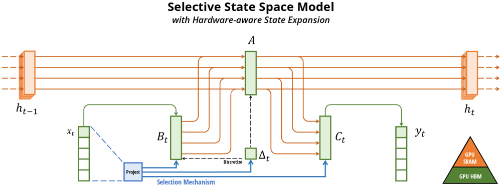

---
tags:
  - MLSYS
  - NLP
arxiv: "https://arxiv.org/abs/2312.00752"
github: "https://github.com/state-spaces/mamba"
website: ""
year: 2023
read: false
---

# Mamba: Linear-Time Sequence Modeling with Selective State Spaces

> **Links:** [arXiv](https://arxiv.org/abs/2312.00752) | [GitHub](https://github.com/state-spaces/mamba)
> **Tags:** #MLSYS #NLP

---

## Methodology

Mamba is a selective state space model (SSM) that addresses the core limitation of prior SSMs: their linear time-invariance (LTI) forces fixed transition dynamics regardless of input content. Mamba introduces a **selection mechanism** that makes SSM parameters input-dependent, combined with a **hardware-aware parallel scan algorithm** that keeps wall-clock costs competitive with convolution-based LTI models.

### Structured SSM Background

A continuous-time SSM maps input $x(t) \in \mathbb{R}$ to output $y(t) \in \mathbb{R}$ through latent state $h(t) \in \mathbb{R}^N$:

$$h'(t) = \mathbf{A}h(t) + \mathbf{B}x(t), \quad y(t) = \mathbf{C}h(t)$$

After zero-order hold (ZOH) discretization with timescale $\Delta$:

$$\bar{\mathbf{A}} = \exp(\Delta \mathbf{A}), \quad \bar{\mathbf{B}} = (\Delta \mathbf{A})^{-1}(\exp(\Delta \mathbf{A}) - \mathbf{I}) \cdot \Delta \mathbf{B}$$

$$h_t = \bar{\mathbf{A}} h_{t-1} + \bar{\mathbf{B}} x_t, \quad y_t = \mathbf{C} h_t$$

In LTI SSMs (S4), $\mathbf{A}, \mathbf{B}, \mathbf{C}, \Delta$ are all fixed parameters independent of input, enabling convolution-mode computation.

### Selection Mechanism (S6)

Mamba makes $\mathbf{B}$, $\mathbf{C}$, and $\Delta$ functions of the input $x$:

| Parameter | S4 (LTI) shape | S6 (Selective) shape |
|---|---|---|
| $\mathbf{A}$ | $(D, N)$ — fixed | $(D, N)$ — fixed |
| $\mathbf{B}$ | $(D, N)$ — fixed | $(B, L, N)$ — input-dependent |
| $\mathbf{C}$ | $(D, N)$ — fixed | $(B, L, N)$ — input-dependent |
| $\Delta$ | $(D)$ — fixed | $(B, L, D)$ — input-dependent |

Concretely:
- $s_B(x) = \text{Linear}_N(x)$
- $s_C(x) = \text{Linear}_N(x)$
- $s_\Delta(x) = \text{Broadcast}_D(\text{Linear}_1(x))$, then $\Delta = \text{softplus}(\text{Parameter} + s_\Delta(x))$

Key interpretations: large $\Delta$ focuses on the current input (resets state), small $\Delta$ persists the state and ignores the input. This recovers classical RNN gating as a special case: when $N=1, \mathbf{A}=-1, \mathbf{B}=1$, the recurrence reduces to $h_t = (1-g_t)h_{t-1} + g_t x_t$ where $g_t = \sigma(\text{Linear}(x_t))$.

### Hardware-Aware Parallel Scan

Selectivity breaks the convolution equivalence, requiring recurrent computation which naively materializes state $h$ of shape $(B, L, D, N)$ — $N\times$ larger than the input. Mamba avoids this with:

1. **Kernel fusion**: Load $(\Delta, \mathbf{A}, \mathbf{B}, \mathbf{C})$ from HBM to SRAM. Perform discretization + parallel associative scan + output projection in SRAM. Write only $(B, L, D)$ output to HBM. Reduces memory I/O by $O(N)$, yielding 20–40× speedup over naive implementation.
2. **Recomputation**: During backward pass, intermediate states of shape $(B, L, D, N)$ are recomputed from re-loaded inputs rather than stored. Memory footprint matches FlashAttention (~16 bytes/token per SSM layer vs. ~32 bytes/token for attention+MLP).
3. **Chunked scan**: For sequences too long to fit in SRAM, splits into chunks and carries intermediate scan state across chunks.

### Mamba Block Architecture

The Mamba block simplifies the H3 architecture by merging the SSM branch and gating branch into a single homogeneous block:

- Input projected to $2ED$ dimensions (expansion factor $E=2$ by default)
- One branch: short 1D convolution → S6 selective SSM
- Other branch: SiLU activation (SwiGLU-like gate)
- Branches multiplied, then projected back to $D$
- Interleaved with LayerNorm and residual connections
- Parameter count per block: $\approx 3ED^2$ (dominated by linear projections)

Two Mamba blocks match the $12D^2$ parameter count of a Transformer's MHA + MLP block pair.

---

## Experiment Setup

**Language Modeling:**
- Dataset: The Pile (GPT-NeoX-20B tokenizer)
- Model sizes: 130M, 370M, 790M, 1.4B, 2.8B parameters
- Context length: 2048 tokens; 300B total training tokens
- Optimizer: AdamW, $\beta=(0.9, 0.95)$, weight decay 0.1, gradient clip 1.0, no dropout
- LR schedule: linear warmup + cosine decay to 1e-5; peak LR at 125M=6e-4, 350M=3e-4, 760M=2.5e-4, 1.3B=2e-4; batch size 0.5M tokens
- Architecture extras: RMSNorm, no linear bias
- Baselines: Pythia, RWKV-4, Hybrid H3, Hyena, RetNet, OPT, GPT-Neo, GPT-J

**DNA Modeling:**
- Dataset: HG38 (human genome) pretraining + Great Apes classification fine-tuning
- Context lengths: $2^{10}$ to $2^{20}$ tokens
- Baselines: HyenaDNA, Transformer++

**Audio Generation (SC09):**
- Dataset: SC09 speech (1-second clips, 16 kHz); metrics: NLL, FID, IS, mIS, AM
- Architecture: SaShiMi U-Net backbone with Mamba blocks replacing S4+MLP blocks
- Baselines: SampleRNN, WaveNet, SaShiMi, WaveGAN, DiffWave

---

## Results

### Language Modeling — Zero-Shot Downstream Evaluations

| Model | Pile ppl ↓ | LAMBADA ppl ↓ | LAMBADA acc ↑ | HellaSwag ↑ | PIQA ↑ | Arc-E ↑ | Arc-C ↑ | WinoGrande ↑ | Avg ↑ |
|---|---|---|---|---|---|---|---|---|---|
| Hybrid H3-130M | — | 89.48 | 25.77 | 31.7 | 64.2 | 44.4 | 24.2 | 50.6 | 40.1 |
| Pythia-160M | 29.64 | 38.10 | 33.0 | 30.2 | 61.4 | 43.2 | 24.1 | 51.9 | 40.6 |
| **Mamba-130M** | **10.56** | **16.07** | **44.3** | **35.3** | **64.5** | **48.0** | **24.3** | **51.9** | **44.7** |
| Hybrid H3-360M | — | 12.58 | 48.0 | 41.5 | 68.1 | 51.4 | 24.7 | 54.1 | 48.0 |
| Pythia-410M | 9.95 | 10.84 | 51.4 | 40.6 | 66.9 | 52.1 | 24.6 | 53.8 | 48.2 |
| **Mamba-370M** | **8.28** | **8.14** | **55.6** | **46.5** | **69.5** | **55.1** | **28.0** | **55.3** | **50.0** |
| Pythia-1B | 7.82 | 7.92 | 56.1 | 47.2 | 70.7 | 57.0 | 27.1 | 53.5 | 51.9 |
| **Mamba-790M** | **7.33** | **6.02** | **62.7** | **55.1** | **72.1** | **61.2** | **29.5** | **56.1** | **57.1** |
| GPT-Neo 1.3B | — | 7.50 | 57.2 | 48.9 | 71.1 | 56.2 | 25.9 | 54.9 | 52.4 |
| Hybrid H3-1.3B | — | 11.25 | 49.6 | 52.6 | 71.3 | 59.2 | 28.1 | 56.9 | 53.0 |
| OPT-1.3B | — | 6.64 | 58.0 | 53.7 | 72.4 | 56.7 | 29.6 | 59.5 | 55.0 |
| Pythia-1.4B | 7.51 | 6.08 | 61.7 | 52.1 | 71.0 | 60.5 | 28.5 | 57.2 | 55.2 |
| RWKV-1.5B | 7.70 | 7.04 | 56.4 | 52.5 | 72.4 | 60.5 | 29.4 | 54.6 | 54.3 |
| **Mamba-1.4B** | **6.80** | **5.04** | **64.9** | **59.1** | **74.2** | **65.5** | **32.8** | **61.5** | **59.7** |
| GPT-Neo 2.7B | — | 5.63 | 62.2 | 55.8 | 72.1 | 61.1 | 30.2 | 57.6 | 56.5 |
| Hybrid H3-2.7B | — | 7.92 | 55.7 | 59.7 | 73.3 | 65.6 | 32.3 | 61.4 | 58.0 |
| OPT-2.7B | — | 5.12 | 63.6 | 60.6 | 74.8 | 60.8 | 31.3 | 61.0 | 58.7 |
| Pythia-2.8B | 6.73 | 5.04 | 64.7 | 59.3 | 74.0 | 64.1 | 32.9 | 59.7 | 59.1 |
| RWKV-3B | 7.00 | 5.24 | 63.9 | 59.6 | 73.7 | 67.8 | 33.1 | 59.6 | 59.6 |
| **Mamba-2.8B** | **6.22** | **4.23** | **69.2** | **66.1** | **75.2** | **69.7** | **36.3** | **63.5** | **63.3** |
| GPT-J-6B | — | 4.10 | 68.3 | 66.3 | 75.4 | 67.0 | 36.6 | 64.1 | 63.0 |
| Pythia-6.9B | 6.51 | 4.45 | 67.1 | 64.0 | 75.2 | 67.3 | 35.5 | 61.3 | 61.7 |
| RWKV-7.4B | 6.31 | 4.38 | 67.2 | 65.5 | 76.1 | 67.8 | 37.5 | 61.0 | 62.5 |

Mamba-2.8B matches or exceeds Pythia-6.9B (more than 2× larger).

### Synthetic Tasks

| Model | Architecture | Layer | Selective Copying Acc (%) |
|---|---|---|---|
| S4 | No gate | S4 | 18.3 |
| — | No gate | S6 | **97.0** |
| H3 | H3 | S4 | 57.0 |
| Hyena | H3 | Hyena | 30.1 |
| — | H3 | S6 | **99.7** |
| — | Mamba | S4 | 56.4 |
| — | Mamba | Hyena | 28.4 |
| Mamba | Mamba | S6 | **99.8** |

Induction Heads: Mamba (74K params) achieves perfect accuracy at all test lengths from $2^6$ to $2^{20}$. All Transformer variants fail to generalize beyond $2^9$ (trained at $2^8$).

### SC09 Speech Generation

| Model | Params | NLL ↓ | FID ↓ | IS ↑ | mIS ↑ | AM ↓ |
|---|---|---|---|---|---|---|
| SampleRNN | 35.0M | 2.042 | 8.96 | 1.71 | 3.02 | 1.76 |
| WaveNet | 4.2M | 1.925 | 5.08 | 2.27 | 5.80 | 1.47 |
| SaShiMi | 5.8M | 1.873 | 1.99 | 5.13 | 42.57 | 0.74 |
| WaveGAN | 19.1M | — | 2.03 | 4.90 | 36.10 | 0.80 |
| DiffWave | 24.1M | — | 1.92 | 5.26 | 51.21 | 0.68 |
| DiffWave + SaShiMi | 23.0M | — | 1.42 | 5.94 | 69.17 | 0.59 |
| **Mamba (small)** | **6.1M** | **1.852** | 0.94 | 6.26 | 88.54 | 0.52 |
| **Mamba (large)** | **24.3M** | 1.860 | **0.67** | **7.33** | **144.9** | **0.36** |
| Train reference | — | — | 0.00 | 8.56 | 292.5 | 0.16 |

### Efficiency

- Selective scan kernel: 40× faster than naive scan, up to 7× faster than FlashAttention at seq len 32K
- Inference throughput: 5× higher than Transformers (O(1) per-step recurrence vs. O(L) KV cache)
- Memory: ~16 bytes/token per SSM layer (matches FlashAttention's attention+MLP ~32 bytes/token for two layers)

### Architecture Ablations (125M, Pile, 2k context)

| Architecture | Layer | Pile ppl ↓ |
|---|---|---|
| H3 | S4 (LTI) | 10.30 |
| H3 | S6 (selective) | 8.95 |
| Mamba | S6 (selective) | **8.69** |

---

## Related Papers

- [flashattn](flashattn.md)