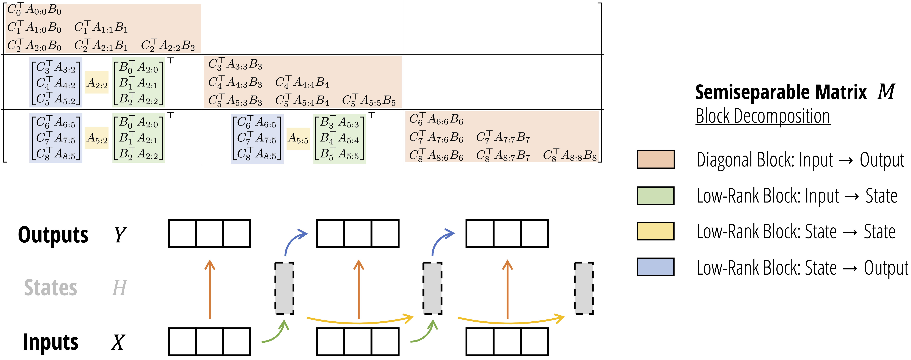

---
tags:
  - NLP
  - MLSYS
  - THEORY
arxiv: https://arxiv.org/abs/2405.21060
github: https://github.com/state-spaces/mamba
website: ""
year: 2024
read: true
---

# Transformers are SSMs: Generalized Models and Efficient Algorithms Through Structured State Space Duality

> **Links:** [arXiv](https://arxiv.org/abs/2405.21060) | [GitHub](https://github.com/state-spaces/mamba)
> **Tags:** #NLP #MLSYS #THEORY

---

## Methodology



*Figure: SSD block decomposition algorithm. The sequence transformation matrix M is partitioned into a grid of chunks; diagonal blocks use the quadratic SMA mode (intra-chunk) and off-diagonal blocks use the linear recurrent mode (inter-chunk), combining matrix-multiplication hardware efficiency with linear state-size complexity.*

### State Space Duality (SSD) Framework

The key insight is that **SSMs and attention operate on the same class of structured matrices** — $N$-semiseparable matrices — giving two equivalent algorithms for the same computation.

**Theorem (SSM = semiseparable matrix multiplication):**

$$y = \text{SSM}(A, B, C)(x) = \mathbf{M}_{\text{SS}} \cdot x$$

- $A \in \mathbb{R}^{T \times H}$: per-step scalar state decay factors (diagonal SSM, values in $[0,1]$).
- $B \in \mathbb{R}^{T \times H \times N}$: state expansion matrix (analogous to attention keys $K$).
- $C \in \mathbb{R}^{T \times H \times N}$: state contraction matrix (analogous to attention queries $Q$).
- $x \in \mathbb{R}^{T \times H \times P}$: input sequence (analogous to attention values $V$).
- $\mathbf{M}_{\text{SS}}$: lower-triangular $N$-semiseparable matrix of shape $(T, T)$ (one per head).
- $T$: sequence length; $H$: number of heads; $N$: state/feature dimension; $P$: head/value dimension.

**State Space Duality correspondence (1-SS SMA = diagonal scalar-$A$ SSM):**

| SSM parameter | Attention (SMA) parameter | Role |
|---|---|---|
| $C$ | $Q$ (queries) | State contraction / readout |
| $B$ | $K$ (keys) | State expansion / write-in |
| $x$ | $V$ (values) | Per-step input token |
| $A_{j:i} = \prod_{k=i}^{j} a_k$ | $L_{ji}$ (mask entry) | Cumulative decay / positional weight |
| $N$ (state dim) | $N$ (feature dim) | Shared hidden/feature size |

*When all per-step $a_k$ are equal, 1-SS SMA reduces to linear attention (Katharopoulos et al. 2020).*

### Structured Masked Attention (SMA)

Generalizes linear attention to a structured lower-triangular mask $L$:

**Quadratic mode** (attention-like, cost $O(T^2 N)$):

$$G = QK^\top, \quad M = G \odot L, \quad Y = MV$$

- $\odot$: elementwise product; $L$: the 1-SS causal mask matrix.

**Linear mode** (SSM-like, cost $O(TN^2)$):

$$Z_s = K_s^\top V_s \in \mathbb{R}^{N \times P}, \quad H_t = \sum_s L_{ts} Z_s, \quad Y_t = Q_t H_t$$

Both modes compute the same output; SSD uses quadratic mode inside chunks and linear mode across chunks.

### Hardware-Efficient SSD Algorithm (Theorem 6.1)

Partition the $T \times T$ transformation matrix $M$ into a $(T/Q) \times (T/Q)$ grid of $Q \times Q$ blocks (chunk size $Q$):

$$M = M_{\text{diag}} + M_{\text{off}}$$

- $M_{\text{diag}}$: block-diagonal (intra-chunk interactions).
- $M_{\text{off}}$: lower-triangular off-diagonal (inter-chunk interactions, low-rank).

**Four steps:**

1. **Diagonal blocks** — quadratic SMA within each chunk, batch-matmul, cost $O(TQN)$.
2. **Right factors** — per-chunk final state: $\text{state}^{(c)} = \sum_{s} \text{decay}_{Q\to s} \cdot B_s x_s^\top \in \mathbb{R}^{H \times P \times N}$.
3. **Center factors** — inter-chunk scalar SSM: $h^{(c)} = a^{(c)} h^{(c-1)} + \text{state}^{(c)}$, cost $O(TNP/Q)$.
4. **Left factors** — state-to-output: $Y_{\text{off}}^{(c,t)} = C_t \, h^{(c)} \cdot \text{decay}_{t}$.

Final output: $Y = Y_{\text{diag}} + Y_{\text{off}}$.

**Symbols:** $Q$ = chunk length (default 64); $h^{(c)} \in \mathbb{R}^{H \times P \times N}$ = recurrent state between chunks; $a^{(c)}$ = cumulative decay scalar for chunk $c$.

**Complexity:**

| Model | Training | Inference FLOPs | Inference Memory | Tensor cores |
|---|---|---|---|---|
| Attention | $O(T^2 N)$ | $O(TN)$ | $O(T^2)$ | Yes |
| SSM (naive scan) | $O(TN^2)$ | $O(N^2)$ | $O(TN^2)$ | No |
| **SSD** | $O(TN^2)$ | $O(N^2)$ | $O(TN)$ | **Yes** |

*SSD achieves SSM-equivalent inference cost while using tensor-core-friendly matrix multiplications throughout training.*

### Mamba-2 Block Architecture

**Key changes from Mamba-1:**

1. **Parallel projections**: $A, B, C, X$ all projected in parallel from the block input (analogous to computing $Q, K, V$ simultaneously in attention). Mamba-1 computed these sequentially. Enables **1 all-reduce per block** for tensor parallelism (vs. 2 in Mamba-1).

2. **Grouped-Input SSM (GIS)**: $B, C \in \mathbb{R}^{T \times G \times N}$ with $G$ groups, $1 \leq G \leq H$ — analogous to grouped-query attention. Reduces inter-GPU communication in tensor-parallel settings.

3. **Output normalization**: LayerNorm before output projection for stability at large scale.

**Multi-head SSM variants:**

| SSM variant | $B, C$ shape | Attention analogue | Notes |
|---|---|---|---|
| Multi-Head SSM (MHS) | $(T, H, N)$ | MHA | Full head independence |
| Multi-Input SSM (MIS) | $(T, 1, N)$ | Multi-Value Attention | Mamba-1 default |
| Grouped-Input SSM (GIS) | $(T, G, N)$ | Grouped-Query Attention | Mamba-2 default |

### Minimal SSD Implementation (Listing 1)

```python
def segsum(x):
    T = x.size(-1)
    x_cumsum = torch.cumsum(x, dim=-1)
    x_segsum = x_cumsum[..., :, None] - x_cumsum[..., None, :]
    mask = torch.tril(torch.ones(T, T, device=x.device, dtype=bool))
    return x_segsum.masked_fill(~mask, -torch.inf)

def ssd(X, A, B, C, block_len=64, initial_states=None):
    # X: (batch, length, n_heads, d_head)
    # A: (batch, length, n_heads)  -- log-decay
    # B, C: (batch, length, n_heads, d_state)
    X, A, B, C = [rearrange(x, "b (c l) ... -> b c l ...", l=block_len) for x in (X, A, B, C)]
    A = rearrange(A, "b c l h -> b h c l")
    A_cumsum = torch.cumsum(A, dim=-1)

    # Step 1: diagonal (intra-chunk, quadratic SMA)
    L = torch.exp(segsum(A))
    Y_diag = torch.einsum("bclhn,bcshn,bhcls,bcshp->bclhp", C, B, L, X)

    # Step 2: per-chunk final states
    decay_states = torch.exp(A_cumsum[:, :, :, -1:] - A_cumsum)
    states = torch.einsum("bclhn,bhcl,bclhp->bchpn", B, decay_states, X)

    # Step 3: inter-chunk recurrence (scalar SSM over T/Q chunks)
    if initial_states is None:
        initial_states = torch.zeros_like(states[:, :1])
    states = torch.cat([initial_states, states], dim=1)
    decay_chunk = torch.exp(segsum(F.pad(A_cumsum[:, :, :, -1], (1, 0))))
    new_states = torch.einsum("bhzc,bchpn->bzhpn", decay_chunk, states)
    states, final_state = new_states[:, :-1], new_states[:, -1]

    # Step 4: state-to-output
    Y_off = torch.einsum('bclhn,bchpn,bhcl->bclhp', C, states, torch.exp(A_cumsum))
    return rearrange(Y_diag + Y_off, "b c l h p -> b (c l) h p"), final_state
```

---

## Experiment Setup

| Aspect | Detail |
|---|---|
| Dataset | The Pile (GPT-NeoX tokenizer) |
| Model sizes | 130M, 370M, 780M, 1.3B, 2.7B parameters |
| Training tokens | 300B |
| Context length | 2048 tokens |
| Chunk size $Q$ | 64 |
| Head state dimension $N$ | 64–128 (fixed per scale) |
| Baselines | Mamba-1, Transformer++ (Pythia architecture), Pythia |

Scaling law study follows the same Chinchilla-optimal protocol as Mamba-1.

---

## Results

### Scaling Laws (Pile, Chinchilla-Optimal)

Mamba-2 **Pareto dominates** both Mamba-1 and Transformer++ on the scaling law frontier: for any fixed compute budget, Mamba-2 achieves lower perplexity in less wall-clock time.

### Downstream Language Modeling

Mamba-2-2.7B (300B tokens on Pile) vs. baselines:

| Baseline | Params | Training tokens | Outcome |
|---|---|---|---|
| Mamba-1 | 2.8B | 300B | Mamba-2 higher accuracy |
| Pythia | 2.8B | 300B | Mamba-2 higher accuracy |
| Pythia | 6.9B | 300B | **Mamba-2 (2.7B) outperforms 6.9B model** |

*Exact zero-shot downstream numbers (LAMBADA, HellaSwag, PIQA, Arc, WinoGrande) available via released checkpoints and `lm-evaluation-harness`.*

### SSD Kernel Speed

| Comparison | Speedup |
|---|---|
| vs. Mamba-1 optimized selective scan | **2–8×** |
| vs. FlashAttention-2 at sequence length 2K | ~1× (crossover point) |
| vs. FlashAttention-2 at sequence length 16K | **6× faster** |

### Recurrent State Capacity

SSD supports **8× larger recurrent state** than Mamba-1 with minimal slowdown, expanding long-context memory without proportional cost.

### Systems Efficiency

| Feature | Mamba-1 | Mamba-2 |
|---|---|---|
| All-reduces per block (tensor parallel) | 2 | **1** (same as Transformer) |
| Variable-length training without padding | No | **Yes** |
| Sequence parallelism | Limited | **Full** |
| Tensor-core utilization | No (scan) | **Yes** (matmul) |

---

## Related Papers

- [mamba](mamba.md)
- [flashattn](flashattn.md)
