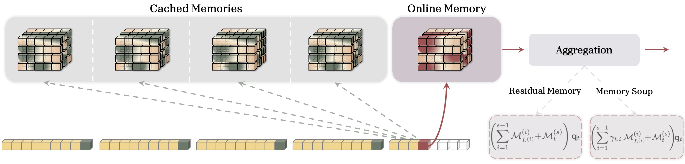

---
tags:
  - NLP
  - DEEP_LEARNING
  - MLSYS
arxiv: https://arxiv.org/abs/2602.24281
github: ""
website: ""
year: 2026
read: false
---

# Memory Caching: RNNs with Growing Memory

> **Links:** [arXiv](https://arxiv.org/abs/2602.24281)
> **Tags:** #NLP #DEEP_LEARNING #MLSYS

---

## Methodology

**Core Idea:** Memory Caching (MC) enhances recurrent models by caching compressed memory-state checkpoints at segment boundaries. Each token attends to both its current (online) memory and a set of cached memories from past segments, enabling a flexible trade-off between the $O(L)$ complexity of fixed-memory RNNs and the $O(L^2)$ growing-memory of Transformers. Total complexity is $O(NL)$ where $1 \le N \le L$ is the number of cached segments.

### Segmentation

The input sequence of length $L$ is split into $N$ segments $S^{(1)}, \ldots, S^{(N)}$ of lengths $L^{(1)}, \ldots, L^{(N)}$. Within each segment $s$, the base recurrent model updates its memory state normally. At the end of segment $s$, the final memory state $\mathcal{M}_{L^{(s)}}^{(s)}$ is cached.

- $S^{(i)}$: the $i$-th segment (a contiguous block of tokens).
- $L^{(i)}$: length (in tokens) of segment $i$; $\sum_i L^{(i)} = L$.
- $\mathcal{M}_t^{(s)}$: the recurrent memory state *within* segment $s$ after processing the first $t$ tokens of that segment; $\mathcal{M}_t^{(s)}(\mathbf{q})$ denotes reading from memory with query $\mathbf{q}$.
- $\mathcal{M}_{L^{(s)}}^{(s)}$: the *final* memory at end of segment $s$, kept as a frozen cached snapshot.

### MC Variants

**1. Residual Memory:** Additively combines online memory with all cached memories:
$$\mathbf{y}_t = \mathcal{M}_t^{(s)}(\mathbf{q}_t) + \sum_{i=1}^{s-1} \mathcal{M}_{L^{(i)}}^{(i)}(\mathbf{q}_t)$$

- $\mathbf{y}_t$: layer output at token position $t$ (which lives in the current segment $s$).
- $\mathbf{q}_t$: the query vector for token $t$, broadcast to every memory (online + all cached).

**2. Gated Residual Memory (GRM):** Adds input-dependent scalar gates $\gamma_t^{(i)} \in [0,1]$ for selective retrieval:
$$\mathbf{y}_t = \gamma_t^{(s)} \mathcal{M}_t^{(s)}(\mathbf{q}_t) + \sum_{i=1}^{s-1} \gamma_t^{(i)} \mathcal{M}_{L^{(i)}}^{(i)}(\mathbf{q}_t), \quad \gamma_t^{(i)} = \langle \mathbf{u}_t,\; \mathrm{MeanPooling}(S^{(i)}) \rangle$$

- $\gamma_t^{(i)}$: scalar gate for segment $i$'s memory at token $t$; larger means that cached segment is more useful here.
- $\mathbf{u}_t$: learned query vector from the current token (separate projection from $\mathbf{q}_t$).
- $\mathrm{MeanPooling}(S^{(i)})$: a single summary vector for segment $i$ (mean of its token embeddings).
- $\langle \cdot, \cdot \rangle$: dot product (followed by a sigmoid / softmax to keep $\gamma \in [0,1]$).

**3. Memory Soup:** Instead of summing memory outputs, interpolates the memory module *parameters* using input-dependent weights:
$$\boldsymbol{\theta}_{\mathcal{M}_t^*} = \left\{ \sum_{i=1}^{s} \gamma_t^{(i)} W_1^{(i)},\; \ldots,\; \sum_{i=1}^{s} \gamma_t^{(i)} W_c^{(i)} \right\}, \quad \mathbf{y}_t = \mathcal{M}_t^*(\mathbf{q}_t)$$

- $\boldsymbol{\theta}_{\mathcal{M}_t^*}$: the parameter set of the *mixed* memory module used at token $t$.
- $W_1^{(i)}, \ldots, W_c^{(i)}$: the $c$ weight matrices of segment $i$'s cached memory (the $c$ learnable components of a memory module, e.g., key/value/output projections).
- $\mathcal{M}_t^*$: a fresh memory module built from the mixed parameters and queried once.

**4. Sparse Selective Caching (SSC):** A router selects the top-$k$ most contextually similar cached segments:
$$\mathbf{r}_t^{(i)} = \langle \mathbf{u}_t,\; \mathrm{MeanPooling}(S^{(i)}) \rangle, \quad \mathcal{R}_t = \operatorname{Top\text{-}k}\!\left(\{\mathbf{r}_t^{(i)}\}_{i=1}^{s-1}\right)$$
$$\mathbf{y}_t = \gamma_t^{(s)} \mathcal{M}_t^{(s)}(\mathbf{q}_t) + \sum_{i \in \mathcal{R}_t} \gamma_t^{(i)} \mathcal{M}_{L^{(i)}}^{(i)}(\mathbf{q}_t)$$

- $\mathbf{r}_t^{(i)}$: router score of segment $i$ for token $t$.
- $\mathcal{R}_t$: index set of the $k$ past segments with the largest $\mathbf{r}_t^{(i)}$ (read-out is sparse: only these contribute).

### Complexity

| Segmentation Strategy | Num. Segments $N$ | Total Complexity |
|-----------------------|-------------------|------------------|
| Constant length $p$ | $L/p$ | $O(L^2/p)$ |
| Logarithmic | $\log_2 L$ | $O(p \cdot L \log L)$ |
| Fixed top-$k$ (SSC) | $k$ | $O(kL)$ |

### Base Recurrent Models

MC is architecture-agnostic and applied on top of:
- **DLA (Deep Linear Attention):** Gradient-descent memory update: $\mathcal{M}_t = \mathcal{M}_{t-1} - \eta_t \nabla\mathcal{L}(\mathcal{M}_{t-1}; \mathbf{k}_t, \mathbf{v}_t)$; $\eta_t$ is a per-token learning rate, $\mathbf{k}_t, \mathbf{v}_t$ are the key/value of the current token, and $\nabla$ is the gradient w.r.t. the memory parameters.
- **SWLA (Sliding Window Linear Attention):** $\mathcal{M}_t = \alpha_t \mathcal{M}_{t-1} + \sum_{i=t-c+1}^{t} \beta_i^{(t)} \mathbf{v}_i \mathbf{k}_i^\top$, with window size $c=2$; $\alpha_t$ is a learned decay on the previous memory, and $\beta_i^{(t)}$ is a learned per-pair write strength over the last $c$ tokens.
- **Titans (LMM):** Memory-as-a-Matrix model with surprise-based online update rule.

---

## Experiment Setup

- **Model sizes:** 760M (30B training tokens) and 1.3B (100B training tokens)
- **Training data:** FineWeb dataset; long-context training uses Long-Data-Collections
- **Training context window:** 4K tokens (default); evaluated at up to 32K tokens
- **Segment length:** 256 tokens (default); ablated over {16, 32, 64, 128, 256, 512}
- **Baselines:** Transformer++, SWLA, DLA, Titans (LMM)
- **Evaluation benchmarks:** Wikitext (perplexity), LAMBADA (ppl + accuracy), CommonsenseQA (PIQA, HellaSwag, WinoGrande, ARC-e/c, SIQA, BoolQ), Needle-In-A-Haystack (S-NIAH), in-context retrieval (SWDE, SQuAD, FDA), LongBench

---

## Results

### Language Modeling and Commonsense Reasoning

**760M parameters / 30B tokens:**

| Model | Wiki ppl | LMB ppl | LMB acc | PIQA | Hella | Wino | ARC-e | ARC-c | SIQA | BoolQ | Avg |
|-------|---------|--------|--------|------|-------|------|-------|-------|------|-------|-----|
| Transformer++ | 24.18 | 24.27 | 36.3 | 67.2 | 41.8 | 52.0 | 65.6 | 33.4 | 39.1 | 61.7 | 49.64 |
| SWLA | 23.83 | 22.74 | 36.5 | 66.9 | 44.1 | 54.9 | 64.2 | 34.1 | 39.6 | 60.1 | 50.05 |
| SWLA + GRM | 22.81 | 21.50 | 37.8 | 68.3 | 45.8 | 55.0 | 65.4 | 36.2 | 40.6 | 61.0 | 51.26 |
| SWLA + SSC | 23.06 | 22.39 | 37.2 | 67.9 | 45.2 | 54.9 | 65.2 | 35.5 | 39.8 | 60.6 | 50.79 |
| DLA | 23.12 | 22.09 | 36.1 | 68.0 | 47.9 | 52.7 | 65.8 | 34.6 | 39.1 | 59.6 | 50.48 |
| DLA + GRM | 22.91 | 20.10 | 37.5 | 69.2 | 48.7 | 52.8 | 66.1 | 36.8 | 40.3 | 59.9 | 51.41 |
| DLA + Memory Soup | 22.78 | 20.49 | 37.2 | 69.6 | 48.3 | 53.4 | 65.8 | 36.5 | 39.6 | 60.2 | 51.33 |
| Titans (LMM) | 20.04 | 21.96 | 37.4 | 69.3 | 48.5 | 52.3 | 66.3 | 35.8 | 40.1 | 62.8 | 51.56 |
| Titans + GRM | 19.14 | 20.21 | 38.3 | 70.6 | 48.4 | 54.0 | 67.5 | 36.4 | 41.7 | 63.5 | 52.55 |

**1.3B parameters / 100B tokens:**

| Model | Wiki ppl | LMB ppl | LMB acc | PIQA | Hella | Wino | ARC-e | ARC-c | SIQA | BoolQ | Avg |
|-------|---------|--------|--------|------|-------|------|-------|-------|------|-------|-----|
| Titans (LMM) | 15.60 | 11.41 | 49.1 | 73.1 | 56.3 | 59.8 | 72.4 | 40.8 | 42.1 | 61.0 | 56.82 |
| Titans + GRM | 15.37 | 11.29 | 50.4 | 74.5 | 57.4 | 61.5 | 73.8 | 42.6 | 43.9 | 62.5 | 58.33 |
| Titans + Memory Soup | 15.42 | 11.31 | 49.9 | 74.2 | 57.3 | 60.8 | 73.5 | 42.2 | 43.4 | 62.0 | 57.91 |

*Wiki ppl = Wikitext perplexity (lower is better); LMB ppl/acc = LAMBADA perplexity / accuracy; Hella = HellaSwag; Wino = WinoGrande; ARC-e/c = ARC Easy / Challenge; SIQA = Social IQa; Avg = mean accuracy over 7 classification benchmarks (higher is better).*

### Needle-In-A-Haystack (S-NIAH)

| Model | S-NIAH-1 (4K/8K/16K) | S-NIAH-2 (4K/8K/16K) | S-NIAH-3 (4K/8K/16K) |
|-------|----------------------|----------------------|----------------------|
| Transformer | 88.6 / 76.4 / 79.8 | 100 / 98.8 / 94.2 | 78.0 / 69.2 / 40.8 |
| DLA | 96.4 / 71.2 / 44.0 | 79.6 / 42.6 / 28.2 | 18.2 / 8.8 / 4.0 |
| DLA + GRM | 100 / 100 / 82.4 | 94.6 / 82.8 / 54.8 | 48.2 / 34.4 / 18.2 |
| Titans (LMM) | 100 / 100 / 100 | 99.6 / 84.6 / 75.4 | 74.2 / 42.8 / 21.2 |
| Titans + GRM | 100 / 100 / 100 | 99.8 / 96.6 / 88.2 | 89.4 / 69.0 / 32.2 |

*S-NIAH = Single Needle-In-A-Haystack; suffix 1/2/3 denotes increasing difficulty; accuracy (%) reported at three context lengths (4K / 8K / 16K tokens).*

### In-Context Retrieval (Accuracy at 512/1024/2048/16K tokens)

| Model | SWDE | SQuAD | FDA |
|-------|------|-------|-----|
| Transformer | 46.2 / 43.7 / 44.4 / 44.0 | 33.1 / 33.3 / 33.6 / 33.4 | 71.0 / 69.5 / 71.6 / 71.0 |
| DLA + GRM | 52.4 / 48.9 / 48.7 / 48.5 | 29.5 / 30.7 / 30.7 / 30.1 | 63.3 / 51.6 / 48.9 / 41.5 |
| Titans + GRM | 52.6 / 49.3 / 49.5 / 50.1 | 29.7 / 30.4 / 31.5 / 32.0 | 72.9 / 68.7 / 61.1 / 52.6 |

*SWDE, SQuAD, FDA: structured in-context retrieval tasks from LongBench; four context-length regimes (512 / 1024 / 2048 / 16K tokens).*

### LongBench (Accuracy)

| Model | NarrativeQA | QasperQA | MultiFieldQA | HotpotQA | GovReport | QMSum |
|-------|------------|---------|-------------|---------|----------|------|
| DLA | 9.4 | 17.5 | 12.1 | 11.8 | 9.5 | 7.4 |
| DLA + GRM | 11.6 | 10.3 | 19.8 | 18.2 | 13.5 | 14.1 |
| Titans (LMM) | 8.7 | 12.5 | 18.4 | 15.6 | 10.5 | 12.6 |
| Titans + GRM | 11.8 | 9.4 | 19.9 | 21.4 | 8.4 | 13.3 |

---

## Related Papers

- [mamba](mamba.md)
