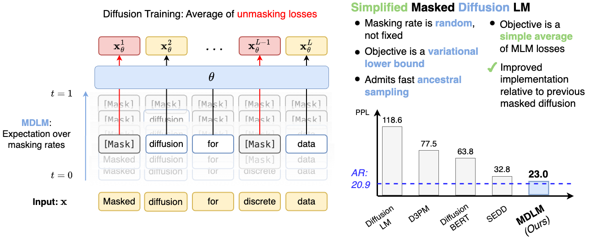

# Simple and Effective Masked Diffusion Language Models

> **Links:** [arXiv](https://arxiv.org/abs/2406.07524) | [GitHub](https://github.com/kuleshov-group/mdlm) | [Website](https://s-sahoo.com/mdlm)
> **Tags:** #DLM

---

## Methodology

MDLM unifies masked language modeling (MLM) with discrete diffusion by deriving a Rao-Blackwellized ELBO that reduces to a weighted mixture of MLM losses. The key contributions are (1) the **SUBS parameterization** which enforces zero masking probabilities and carry-over unmasking in the reverse process, and (2) simplification of the training objective to a stable, closed-form expression without requiring full transition matrix computations.

### Forward Process

Tokens are independently masked according to a monotonically decreasing noise schedule $\alpha_t \in [0,1]$:

$$q(z_t \mid x) = \text{Cat}(z_t;\; \alpha_t \cdot x + (1 - \alpha_t) \cdot m)$$

where $m$ is the mask token and $x \in \mathcal{V}^L$ is the clean sequence.

### SUBS Parameterization (Reverse Process)

The reverse process plugs a learned denoiser $x_\theta(z_t, t)$ into the true posterior:

$$p_\theta(z_s \mid z_t) = q(z_s \mid z_t,\; x = x_\theta(z_t, t))$$

Two hard constraints are imposed at every step:
- **Zero masking**: set mask-token logit to $-\infty$ so already-unmasked tokens are never re-masked.
- **Carry-over**: unmasked tokens copy through unchanged from $z_t$ to $z_s$.

### Training Objective

The continuous-time NELBO is:

$$\mathcal{L}_\infty = \mathbb{E}_q \int_0^1 \frac{\alpha'_t}{1 - \alpha_t} \sum_{\ell=1}^{L} \log \langle x_\theta^\ell(z_t, t),\, x^\ell \rangle \, dt$$

With the SUBS parameterization the KL terms collapse to a weighted cross-entropy, giving the discrete-time objective:

$$\mathcal{L}_\text{diffusion} = \sum_{i=1}^{T} \mathbb{E}_q \left[ \frac{\alpha_{t(i)} - \alpha_{s(i)}}{1 - \alpha_{t(i)}} \log \langle x_\theta(z_{t(i)}, t(i)),\, x \rangle \right]$$

This is strictly simpler and more numerically stable than the general D3PM absorbing-state loss (no sparse $\bar{Q}_t$ matrix inversions required).

### Variance Reduction

A **low-discrepancy sampler** (analogous to Kingma et al. 2021) is used to draw diffusion times, reducing gradient variance during training at no extra cost.

### Semi-Autoregressive (SAR) Generation

Sampling can be made left-to-right by restricting which positions are unmasked at each step, converting MDLM into a semi-autoregressive generator with controllable block size — no retraining required.

---

## Experiment Setup

| Dataset | Context | Tokenizer | Steps | Total Tokens |
|---------|---------|-----------|-------|--------------|
| LM1B | 128 | bert-base-uncased | 1M / 10M | 33B / 327B |
| OpenWebText (OWT) | 1 024 | GPT-2 | 1M | 262B |
| C4 (GLUE pre-train) | 128 | bert-base-uncased | — | 37B |

**Architecture:** Diffusion Transformer (DiT) with Rotary Position Embeddings (110M params for main LM1B/OWT runs). Time conditioning is removed on OWT (2x inference speedup, no perplexity cost).

**Baselines:** D3PM-absorb, SEDD, SSD-LM, AR Transformer (same size).

---

## Results

### LM1B Test Perplexity

| Model | Params | Training Tokens | PPL |
|-------|--------|----------------|-----|
| Transformer-XL Base | 0.46B | — | 23.5 |
| OmniNet_T | 100M | — | 21.5 |
| D3PM (absorb) | 70M | — | ≤76.90 |
| SEDD | 110M | 33B | ≤32.79 |
| **MDLM** | **110M** | **33B** | **≤27.04** |
| **MDLM** | **110M** | **327B** | **≤23.00** |
| AR Transformer | 110M | 327B | 20.86 |

MDLM at 327B tokens closes the gap to the AR baseline by ~14% over SEDD and achieves a 17% improvement over SEDD at matched 33B tokens.

### OpenWebText Test Perplexity

| Model | PPL |
|-------|-----|
| AR | 17.54 |
| SEDD | ≤24.10 |
| **MDLM** | **≤23.21** |

### Zero-Shot Transfer (OWT model → other corpora)

| Corpus | AR | SEDD | MDLM |
|--------|----|------|------|
| PTB | 82.05 | 100.09 | 95.26 |
| WikiText | 25.75 | 34.28 | 32.83 |
| LM1B | 51.25 | 68.20 | 67.01 |
| Lambada | 51.28 | 49.86 | **47.52** |
| AG News | 52.09 | 62.09 | 61.15 |
| PubMed | 49.01 | 44.53 | 41.89 |
| ArXiv | 41.73 | 38.48 | 37.37 |

MDLM beats SEDD on every domain; beats AR on Lambada and scientific corpora.

### Semi-Autoregressive Generation (LM1B)

| Method | Gen. PPL | Time (sec/seq) |
|--------|----------|----------------|
| SSD-LM | 35.43 | 2473.9 |
| **MDLM** | **27.18** | **89.3** |

28x faster generation with better perplexity.

### GLUE Fine-Tuning (after MDLM continued pre-training on C4)

| Task | BERT | BERT + MDLM-FT |
|------|------|----------------|
| MNLI-m / mm | 84.43 / 85.35 | 84.76 / 85.07 |
| QQP (F1) | 88.41 | 88.49 |
| GLUE Avg | 81.62 | **82.06** |

Continued MDLM pre-training (1% of total tokens) does not degrade downstream NLU and adds generative capability to the encoder.

### Ablations

| Modification | LM1B PPL delta |
|-------------|---------------|
| Full MDLM (baseline) | ≤27.04 |
| Remove low-discrepancy sampler | +1.3 |
| Remove carry-over unmasking | +0.9 |
| Replace SUBS with direct x_theta output | +2.1 |

---

## Related Papers

- [sdar](sdar.md)
- [rcd](rcd.md)
- [wino](wino.md)