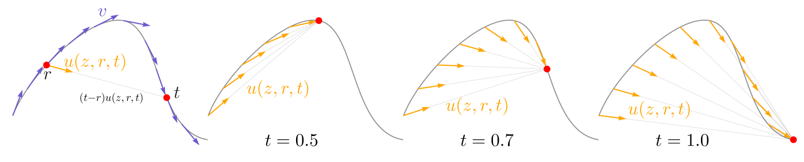

---
tags:
  - VISION
  - DEEP_LEARNING
  - THEORY
arxiv: https://arxiv.org/abs/2505.13447
github: ""
website: ""
year: 2025
read: false
---

# Mean Flows for One-step Generative Modeling

> **Links:** [arXiv](https://arxiv.org/abs/2505.13447) | [GitHub]() | [Website]()
> **Tags:** #VISION #DEEP_LEARNING #THEORY

---

## Methodology

MeanFlow replaces the instantaneous velocity field of Flow Matching with an **average velocity field** $u$. For a trajectory $z_t = (1-t)x + te$ (where $x$ is data, $e \sim \mathcal{N}(0,I)$, $t \in [0,1]$), the average velocity from time $r$ to $t$ is defined as:

$$u(z_t, r, t) = \frac{z_t - z_r}{t - r}$$

- $z_t$: noisy sample at time $t$
- $r$: reference (earlier) time, $r < t$
- $t - r$: the time interval over which displacement is averaged
- $u$: average velocity network output (same units as displacement per unit time)

**MeanFlow Identity.** The key theoretical result is a closed-form relation between $u$ and the instantaneous velocity $v$:

$$u(z_t, r, t) = v(z_t, t) - (t - r)\frac{d}{dt}u(z_t, r, t)$$

where the total time derivative expands as:

$$\frac{d}{dt}u = v(z_t, t) \cdot \partial_z u + \partial_t u$$

- $v(z_t, t) = e - x$: instantaneous velocity (closed-form along the training trajectory)
- $\partial_z u$: Jacobian of $u$ with respect to $z_t$
- $\partial_t u$: partial derivative of $u$ with respect to $t$
- The product $v \cdot \partial_z u$ is a Jacobian-vector product (JVP), computed in one forward-mode pass

This identity provides a **self-consistent regression target** for $u_\theta$ without any ad-hoc consistency constraint.

**Training (Algorithm 1).**

1. Sample $(r, t)$ with $r \le t$; 25% of batches use $r < t$ (off-diagonal), 75% use $r = t$ (reduces to standard flow matching).
2. Sample noise $e \sim \mathcal{N}(0, I)$; compute $z_t = (1-t)x + te$; set $v = e - x$.
3. Compute $u_\theta(z_t, r, t)$ and $\frac{d}{dt}u_\theta$ via a single JVP call with tangent $(v, 0, 1)$:

$$\text{jvp}(u_\theta,\ (z_t, r, t),\ (v, 0, 1)) \;\Rightarrow\; (u_\theta,\ du/dt)$$

4. Construct stop-gradient target: $u_{\text{tgt}} = \text{stopgrad}\!\left(v - (t-r)\,\frac{d}{dt}u_\theta\right)$
5. Minimize the **adaptive weighted** loss:

$$\mathcal{L} = \mathbb{E}\!\left[\,\text{sg}(w)\,\|u_\theta(z_t, r, t) - u_{\text{tgt}}\|_2^2\,\right]$$

$$w = \frac{1}{\left(\|u_\theta - u_{\text{tgt}}\|_2^2 + c\right)^p}, \quad c = 10^{-3},\; p = 1.0$$

- $\text{sg}(\cdot)$: stop-gradient operator
- $w$: adaptive per-sample weight; down-weights outlier samples with large errors
- $p = 1.0$: loss power (equivalent to inverse-square weighting of the residual norm)

**Sampling (Algorithm 2).**

- 1-NFE: $\hat{x} = e - u_\theta(e,\; r{=}0,\; t{=}1)$
- Multi-step: $z_r = z_t - (t - r)\,u_\theta(z_t, r, t)$ iterated from $t=1$ to $r=0$

**Classifier-Free Guidance (CFG).** Applied to the velocity field before training:

$$v^{\text{cfg}}(z_t, t \mid c) = \omega \cdot v(z_t, t \mid c) + (1 - \omega) \cdot v(z_t, t)$$

- $\omega$: CFG scale (optimal at $\omega = 3.0$); baked into the training target so no extra NFE is needed at inference
- $c$: class conditioning label

---

## Experiment Setup

| Setting | Value |
|---|---|
| Architecture | DiT (ViT-B/4, M/4, L/2, XL/2) |
| Dataset | ImageNet 256x256 (class-conditional); CIFAR-10 (unconditional) |
| Training epochs | 240 (80 for ablations) |
| Time distribution | Logit-normal, mu=-0.4, sigma=1.0 |
| Off-diagonal ratio (r != t) | 25% |
| Loss power p | 1.0 |
| CFG scale omega | 3.0 |
| JVP overhead | <20% of training time |
| Pre-training / distillation | None (trained from scratch) |

Baselines: Shortcut Models, iCT, iMM, ECT, sCT, Flow Matching.

---

## Results

### Main Results (ImageNet 256x256, class-conditional)

| Method | Params | NFE | FID |
|---|---|---|---|
| iCT-XL/2 | 675M | 1 | 34.24 |
| Shortcut-XL/2 | 675M | 1 | 10.60 |
| MeanFlow-B/2 | 131M | 1 | 6.17 |
| MeanFlow-M/2 | 308M | 1 | 5.01 |
| MeanFlow-L/2 | 459M | 1 | 3.84 |
| MeanFlow-XL/2 | 676M | 1 | 3.43 |
| iCT-XL/2 | 675M | 2 | 20.30 |
| iMM-XL/2 | 675M | 1x2 | 7.77 |
| MeanFlow-XL/2 | 676M | 2 | 2.93 |
| MeanFlow-XL/2+ | 676M | 2 | 2.20 |

- NFE = Number of Function Evaluations per sample
- iMM 1x2: 1 model NFE + 2 guidance NFEs
- MeanFlow-XL/2+: uses interval guidance variant at 2 NFE
- FID evaluated on 50K samples; lower is better

### CIFAR-10 Results (unconditional, 1-NFE)

| Method | FID |
|---|---|
| iCT | 2.83 |
| sCT | 2.97 |
| IMM | 3.20 |
| ECT | 3.60 |
| MeanFlow | 2.92 |

### Ablations (ImageNet 256x256, 80-epoch ViT-L/2, 1-NFE FID)

| Factor | Variant | FID |
|---|---|---|
| Baseline (r=t only, Flow Matching) | -- | 328.91 |
| Off-diagonal ratio | 100% r!=t | 67.32 |
| Off-diagonal ratio | 25% r!=t | 61.06 |
| JVP tangent | (v, 0, 1) correct | 61.06 |
| JVP tangent | (0, 0, 1) incorrect | diverges |
| Time conditioning input | (t, r) | 68.14 |
| Time conditioning input | (t, t-r) | 61.06 |
| Time sampler | Uniform | 70.33 |
| Time sampler | Logit-normal(-0.4, 1.0) | 61.06 |
| Loss power p | 0.0 (unweighted L2) | 82.47 |
| Loss power p | 0.5 (Pseudo-Huber-like) | 62.14 |
| Loss power p | 1.0 | 61.06 |
| Loss power p | 2.0 | 63.88 |
| CFG scale omega | 1.0 | 8.72 |
| CFG scale omega | 3.0 | 3.43 |
| CFG scale omega | 5.0 | 5.81 |

- All ablations isolate one factor at a time
- JVP tangent (v, 0, 1): tangent vectors for (z_t, r, t) inputs respectively; v is the instantaneous velocity, 0 for r, 1 for t
- Time conditioning (t, t-r): network receives elapsed time t and interval length t-r as separate inputs
