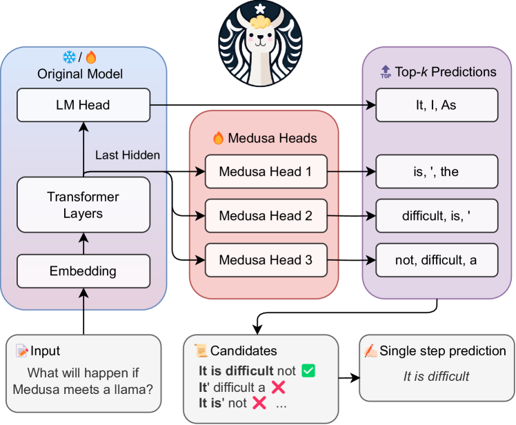

---
tags:
  - SPEC_DECODING
  - MLSYS
arxiv: "https://arxiv.org/abs/2401.10774"
github: "https://github.com/FasterDecoding/Medusa"
website: ""
year: 2024
read: false
---

# Medusa: Simple LLM Inference Acceleration Framework with Multiple Decoding Heads

> **Links:** [arXiv](https://arxiv.org/abs/2401.10774) | [GitHub](https://github.com/FasterDecoding/Medusa)
> **Tags:** #SPEC_DECODING #MLSYS

---

## Methodology

Medusa attaches $K$ extra feed-forward heads to the final hidden state of a frozen or jointly-trained LLM backbone. The $k$-th head predicts the token at position $t+k+1$ in parallel. Candidate continuations are assembled from the Cartesian product of each head's top-$s_k$ predictions, forming a tree. A single forward pass with a tree-structured attention mask verifies all candidates at once, and the longest accepted prefix is committed.

### Medusa Heads

Each head is a single residual feed-forward layer:

$$\hat{p}_t^{(k)} = \text{softmax}\!\left(W_2\,\text{SiLU}(W_1 h_t) + h_t\right)$$

- $h_t \in \mathbb{R}^d$: hidden state of the backbone at position $t$.
- $W_1, W_2$: projection matrices of the $k$-th Medusa head.
- $\hat{p}_t^{(k)}$: predicted distribution over vocabulary for the token $k$ steps ahead.

The $k$-th head is initialized so its output matches the original LM head's predictions.

### Tree Attention

Candidate tokens for head $k$ are the top-$s_k$ tokens from $\hat{p}_t^{(k)}$. The full candidate set is the Cartesian product $[s_1] \times [s_2] \times \cdots \times [s_K]$, forming a tree with

$$\text{total new tokens per step} = \sum_{k=1}^{K} \prod_{i=1}^{k} s_i$$

A Boolean attention mask restricts each node to attend only to its ancestors in the tree, enabling one forward pass to score all candidates.

- $s_k$: number of top predictions retained from head $k$.
- $K$: number of Medusa heads (default 5).

### Typical Acceptance Scheme

Replaces rejection sampling with an entropy-based threshold. A candidate token $x$ is accepted if:

$$p_{\text{orig}}(x \mid \text{ctx}) > \min\!\left(\varepsilon,\; \delta \cdot \exp(-H(p_{\text{orig}}(\cdot \mid \text{ctx})))\right)$$

- $\varepsilon$: hard minimum acceptance threshold.
- $\delta$: scaling factor.
- $H(\cdot)$: Shannon entropy of the next-token distribution; at low entropy (confident prediction) the threshold tightens, at high entropy it relaxes.

This allows the output distribution to deviate slightly from the original LM while keeping "typical" tokens, unlike strict rejection sampling.

### Optimized Tree Construction

A greedy algorithm builds the candidate tree to maximize expected acceptance length $\mathbb{E}[\text{acc. length}] = \sum_{I} \prod_{j} a_j^{(i_j)}$, where $a_k^{(i)} = \Pr[\text{true token is in top-}i] - \Pr[\text{true token is in top-}(i-1)]$ is the marginal top-$i$ accuracy of head $k$. Nodes are added greedily from parent nodes already in the tree, ranked by their marginal accuracy.

---

## Training Variants

### Medusa-1 (Frozen Backbone)

Only the Medusa heads are trained; backbone weights are frozen.

$$\mathcal{L}_{\text{M1}} = \sum_{k=1}^{K} -\lambda_k \log p_t^{(k)}(y_{t+k+1})$$

- $\lambda_k = 0.8^k$: exponentially decayed weight for heads further from the current position.
- Trained on 60k samples; ~5 h on a single A100.

### Medusa-2 (Joint Training)

Jointly fine-tunes the backbone plus heads using a combined objective:

$$\mathcal{L}_{\text{M2}} = \mathcal{L}_{\text{LM}} + \lambda_0\,\mathcal{L}_{\text{M1}}$$

Uses differential learning rates (backbone: $5 \times 10^{-4}$, heads: $2 \times 10^{-3}$) with LoRA ($r=32$, $\alpha=16$) and a two-stage warmup (40 steps).

### Self-Distillation (no external data)

When training data or ground-truth labels are unavailable (e.g., post-RLHF models), synthetic data is generated from the model itself and the backbone is fine-tuned with a KL distillation loss:

$$\mathcal{L}_{\text{distill}} = \text{KL}\!\left(p_{\text{orig},t}^{(0)} \,\|\, p_t^{(0)}\right)$$

---

## Experiment Setup

- **Base models:** Vicuna-7B, Vicuna-13B, Vicuna-33B (LLaMA-2 instruction-tuned), Zephyr-7B
- **Benchmarks:** MT-Bench (8-category chat benchmark, scored 1–10), AlpacaEval
- **Hardware:** Single A100 80 GB (training), A100 / H100 (inference)
- **Baselines:** standard autoregressive decoding; speculative decoding (SD) with smaller draft model

---

## Results

### Speedup and Quality (Medusa-2)

| Model | Acc. Rate (tokens/step) | Overhead | MT-Bench (base) | MT-Bench (Medusa) | Speedup |
|---|---|---|---|---|---|
| Vicuna-7B | 3.47 | 1.22× | 6.17 | 6.18 (+0.01) | 2.83× |
| Vicuna-13B | 3.51 | 1.23× | 6.57 | 6.43 (−0.14) | 2.83× |
| Vicuna-33B | 3.01 | 1.27× | 7.13 | 7.18 (+0.05) | 2.35× |
| Zephyr-7B | 3.14 | 1.18× | 7.32 | 7.25 (−0.07) | 2.66× |

*Acc. Rate: average number of tokens accepted per decoding step (ideally > 1 for speedup). Overhead: wall-clock overhead factor due to rejected branches. Speedup: end-to-end wall-clock vs. standard autoregressive decoding.*

### Medusa-1 Speedup (frozen backbone)

| Model | Medusa-1 Speedup | Medusa-2 Speedup |
|---|---|---|
| Vicuna-7B | 2.18× | 2.83× |
| Vicuna-13B | 2.33× | 2.83× |

### AlpacaEval Throughput

| Model | Base (tok/s) | Medusa (tok/s) | Acc. Rate | Speedup |
|---|---|---|---|---|
| Vicuna-7B | 37.07 | 106.76 | 3.23 | 2.88× |
| Vicuna-13B | 29.01 | 91.54 | 3.28 | 3.16× |
| Vicuna-33B | 17.87 | 40.43 | 2.85 | 2.26× |

### Category Breakdown (Vicuna-7B Medusa-2, MT-Bench)

| Category | Speedup |
|---|---|
| Coding | 3.29× |
| Extraction | 3.62× |

---

## Related Papers

- [eagle3](eagle3.md)
- [vllm](vllm.md)
