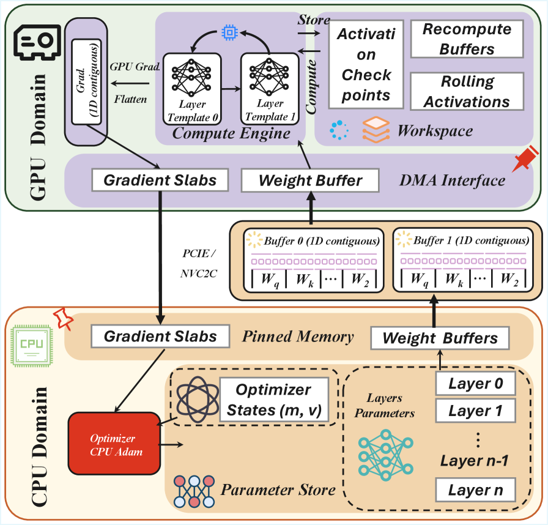

---
tags:
  - MLSYS
arxiv: "https://arxiv.org/abs/2604.05091"
github: "https://github.com/DLYuanGod/MegaTrain"
website: ""
year: 2025
read: false
---

# MegaTrain: Full Precision Training of 100B+ Parameter Large Language Models on a Single GPU

> **Links:** [arXiv](https://arxiv.org/abs/2604.05091) | [GitHub](https://github.com/DLYuanGod/MegaTrain)
> **Tags:** #MLSYS

---

## Methodology

MegaTrain inverts the conventional GPU-centric training paradigm: **host DRAM is the authoritative parameter store** and the GPU acts as a transient compute engine. Parameters, gradients, and optimizer states never need to fit in GPU HBM simultaneously.

### Memory Model

For a model with $P$ parameters in BF16 (weights + gradients = $4P$ bytes) and FP32 Adam moments ($8P$ bytes), the total footprint is $12P$ bytes, held entirely in host memory. Device memory holds only one layer's live tensors at a time.

Memory hierarchy exploited:

| Tier | H200 Capacity | Bandwidth |
|------|--------------|-----------|
| HBM3e (GPU) | 141 GB | 4.8 TB/s |
| DDR5 (host) | 2–4 TB | ~200 GB/s |
| LPDDR5X (GH200 host) | 480 GB | 512 GB/s |

### Algorithm (three phases per step)

**Phase 1 — Streaming Forward Pass**
1. Stream layer $l$ parameters from host → GPU double-buffer (prefetch layer $l+1$ concurrently).
2. Execute forward on layer $l$; checkpoint activations every $K$ layers (default $K=4$).
3. Immediately evict layer $l$ parameters from device.

**Phase 2 — Block-wise Backward Pass**
1. Load the nearest checkpoint; recompute activations within the block.
2. Stream parameters in reverse order; compute gradients.
3. Offload gradients to host immediately after computation.

**Phase 3 — CPU Optimizer Update**
- Run Adam entirely on CPU to avoid PCIe round-trips; update host parameter store in place.

### Key System Components

**Pipelined Double-Buffered Execution Engine**
Three concurrent CUDA streams overlap (a) parameter prefetch (PCIe DMA), (b) forward/backward compute (SM), and (c) gradient offload (PCIe DMA). Hides PCIe latency behind compute.

**Stateless Template Binding**
Replaces PyTorch's persistent autograd graph nodes with lightweight, dynamically bound layer templates. Eliminates per-layer graph metadata allocation (~GB for very deep models) and prevents persistent device-side tensor references that block eviction.

**Layer-Contiguous Memory Tiling**
All tensors for a single layer (weights $W$, gradients $\nabla W$, first moments $m$, second moments $v$) are packed into a single contiguous host allocation. This enables saturated sequential PCIe bandwidth instead of scattered small transfers.

**Chunked MLP Execution**
For ultra-long contexts ($\geq 256$K tokens), MLP layers are split into sub-chunks processed sequentially to bound per-layer activation memory.

---

## Experiment Setup

**Hardware:** Single NVIDIA H200 (141 GB HBM, 1.5 TB host), single NVIDIA GH200 (96 GB HBM, 480 GB host LPDDR5X), NVIDIA A6000 (48 GB), RTX 3090 (24 GB).

**Models (Qwen2.5 series):**

| Model | Params | Layers | Hidden | FFN |
|-------|--------|--------|--------|-----|
| Qwen2.5-7B | 7B | 28 | 3584 | 18944 |
| Qwen2.5-14B | 14B | 48 | 5120 | 13824 |
| Qwen2.5-32B | 32B | 64 | 5120 | 27648 |
| Qwen2.5-72B | 72B | 80 | 8192 | 29568 |
| GPT-OSS-120B (MoE) | 120B | 36 | — | — |

**Dataset:** MetaMathQA (~395K English math problem-answer pairs); 70% train split.

**Baselines:** DeepSpeed ZeRO-3, ZeRO-3 Offload, ZeRO-Infinity, PyTorch Native (DDP).

**Precision:** BF16 parameters + FP32 Adam moments (full precision training).

**Metrics:** Throughput (TFLOPS), tokens/sec, GPU/CPU memory (GB), exact-match accuracy on MetaMathQA.

---

## Results

### Throughput vs. Baselines (GH200)

| Model | Method | TFLOPS | Speedup vs ZeRO-3 |
|-------|--------|--------|-------------------|
| Qwen2.5-7B | MegaTrain | 284 | — |
| Qwen2.5-14B | MegaTrain | 264 | **1.84×** |
| Qwen2.5-32B | MegaTrain | >250 | baselines OOM |
| Qwen2.5-72B | MegaTrain | sustained | baselines OOM |
| GPT-OSS-120B | MegaTrain | sustained | baselines OOM |

*All baselines (ZeRO-3, ZeRO-Infinity) run out of memory (OOM) or suffer severe throughput degradation above 14B on a single GPU.*

### Training Accuracy (MetaMathQA, exact match)

| Model | MegaTrain | ZeRO-3 Offload | ZeRO Infinity | PyTorch Native |
|-------|-----------|----------------|---------------|----------------|
| Qwen2.5-7B | **88.99%** | 88.93% | 88.97% | 88.91% |
| Qwen2.5-14B | **92.52%** | 92.41% | 92.36% | — |

*MegaTrain matches floating-point fidelity of standard training — no accuracy loss from offloading.*

### Consumer GPU Results

| GPU | Model | Method | TFLOPS | GPU Mem | CPU Mem | tok/s |
|-----|-------|--------|--------|---------|---------|-------|
| A6000 (48 GB) | Qwen2.5-3B | MegaTrain | 49.70 | 46.74 GB | 38.3 GB | 2153 |
| A6000 (48 GB) | Qwen2.5-3B | ZeRO-3 | 23.89 | 20.33 GB | — | — |
| A6000 (48 GB) | Qwen2.5-7B | MegaTrain | 55.73 | 44.74 GB | 56.7 GB | 1219 |
| A6000 (48 GB) | Qwen2.5-7B | ZeRO-3 | 27.55 | 20.83 GB | — | — |
| A6000 (48 GB) | Qwen2.5-14B | MegaTrain | 56.82 | 44.64 GB | 104.1 GB | 641 |
| A6000 (48 GB) | Qwen2.5-14B | ZeRO-3 | OOM | — | — | — |
| RTX 3090 (24 GB) | Qwen2.5-3B | MegaTrain | 33.18 | 22.83 GB | 25.0 GB | 1792 |
| RTX 3090 (24 GB) | Qwen2.5-3B | ZeRO-3 | 23.91 | 20.32 GB | — | — |
| RTX 3090 (24 GB) | Qwen2.5-7B | MegaTrain | 35.09 | 22.63 GB | 56.7 GB | 768 |
| RTX 3090 (24 GB) | Qwen2.5-7B | ZeRO-3 | 27.49 | 20.83 GB | — | — |
| RTX 3090 (24 GB) | Qwen2.5-14B | MegaTrain | 30.19 | 21.10 GB | 103.7 GB | 341 |
| RTX 3090 (24 GB) | Qwen2.5-14B | ZeRO-3 | OOM | — | — | — |

*OOM = out of memory. CPU Mem = host DRAM used for parameter/state storage. "—" = not reported.*

### Long-Context Training (GH200, Qwen2.5-7B)

| Context | Batch | Tokens/step | Step (s) | TFLOPS | Device Mem |
|---------|-------|-------------|----------|--------|-----------|
| 1K | 158 | 162.7K | 27.05 | 284.7 | 74.2 GB |
| 8K | 25 | 204.8K | 32.36 | 294.5 | 86.5 GB |
| 32K | 6 | 196.6K | 32.18 | 316.7 | 84.0 GB |
| 128K | 1 | 131.1K | 26.13 | 305.3 | 62.1 GB |
| 256K | 1 | 262.1K | 236.1 | 401.2 | 88.2 GB |
| 512K* | 1 | 524.3K | 871.4 | 407.4 | 81.9 GB |

*\* 512K uses chunked MLP execution. Context = sequence length in tokens. Device Mem = peak GPU HBM usage.*

### Ablations (14B model, GH200, BS=96)

| Configuration | TFLOPS | Device Mem (GB) |
|---------------|--------|-----------------|
| MegaTrain (full) | **266.3** | 75.93 |
| w/o Double Buffering | 182.91 | 74.11 |
| w/o Gradient Slab Pool | 257.55 | 75.93 |
| Checkpoint Interval $K=1$ | 240.45 | 81.34 |

*Double Buffering provides the largest single contribution (+45.6% TFLOPS by hiding PCIe latency). Gradient Slab Pool adds +3.4% by reducing gradient allocation overhead. $K=1$ disables block-wise recompute savings (all activations checkpointed), hurting throughput and increasing memory.*

---

## Related Papers

- [flashattn](flashattn.md)
