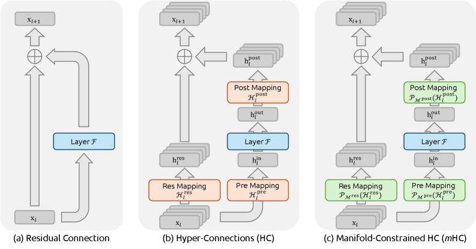

# mHC

> **Links:** [arXiv](https://arxiv.org/abs/2512.24880) | [GitHub]() | [Website]()
> **Tags:** #DEEP_LEARNING

---

## Methodology

mHC (Manifold-Constrained Hyper-Connections) extends Hyper-Connections (HC) by constraining the residual mapping matrix to the **Birkhoff polytope** (doubly stochastic matrices), restoring the identity-mapping property that HC violates and eliminating training instability.

### Background: Hyper-Connections (HC)

HC expands the residual stream dimension from $C$ to $n \times C$ and parameterizes input/output mixing with learned matrices:

$$\mathbf{x}_{l+1} = \mathcal{H}_l^{\text{res}}\mathbf{x}_l + \mathcal{H}_l^{\text{post}\top}\mathcal{F}(\mathcal{H}_l^{\text{pre}}\mathbf{x}_l, \mathcal{W}_l)$$

HC allows $\mathcal{H}_l^{\text{res}}$ to take arbitrary values, which breaks spectral-norm bounds and causes gradient explosion in large models (composite-mapping gain magnitude peaks at $\sim 3000$ in a 27B model).

### mHC: Manifold Projection

mHC constrains $\mathcal{H}_l^{\text{res}}$ to the doubly stochastic manifold:

$$\mathcal{M}^{\text{res}} = \{\mathcal{H} \in \mathbb{R}^{n \times n} \mid \mathcal{H}\mathbf{1}_n = \mathbf{1}_n,\; \mathbf{1}_n^\top\mathcal{H} = \mathbf{1}_n^\top,\; \mathcal{H} \geq 0\}$$

This guarantees $\|\mathcal{H}_l^{\text{res}}\|_2 \leq 1$ (spectral norm bounded), preservation of global-mean statistics across stream mixing, and closure under multiplication (product of doubly stochastic matrices remains doubly stochastic).

**Parameterization — step 1, generate raw coefficients:**

$$\begin{cases}
\vec{\mathbf{x}}_l' = \text{RMSNorm}(\vec{\mathbf{x}}_l) \\
\tilde{\mathcal{H}}_l^{\text{pre}} = \alpha_l^{\text{pre}} \cdot (\vec{\mathbf{x}}_l' \varphi_l^{\text{pre}}) + \mathbf{b}_l^{\text{pre}} \\
\tilde{\mathcal{H}}_l^{\text{post}} = \alpha_l^{\text{post}} \cdot (\vec{\mathbf{x}}_l' \varphi_l^{\text{post}}) + \mathbf{b}_l^{\text{post}} \\
\tilde{\mathcal{H}}_l^{\text{res}} = \alpha_l^{\text{res}} \cdot \mathrm{mat}(\vec{\mathbf{x}}_l' \varphi_l^{\text{res}}) + \mathbf{b}_l^{\text{res}}
\end{cases}$$

Gating factors $\alpha$ are initialized to $0.01$ to keep early training close to the standard residual baseline.

**Parameterization — step 2, apply manifold projection:**

$$\begin{cases}
\mathcal{H}_l^{\text{pre}} = \sigma(\tilde{\mathcal{H}}_l^{\text{pre}}) \\
\mathcal{H}_l^{\text{post}} = 2\sigma(\tilde{\mathcal{H}}_l^{\text{post}}) \\
\mathcal{H}_l^{\text{res}} = \text{Sinkhorn-Knopp}(\tilde{\mathcal{H}}_l^{\text{res}})
\end{cases}$$

$\sigma$ denotes the Sigmoid function (enforces non-negativity on $\mathcal{H}^{\text{pre}}$ / $\mathcal{H}^{\text{post}}$).

**Sinkhorn-Knopp projection:** starting from $\mathbf{M}^{(0)} = \exp(\tilde{\mathcal{H}}_l^{\text{res}})$, alternate row and column normalizations:

$$\mathbf{M}^{(t)} = \mathcal{T}_r\!\left(\mathcal{T}_c\!\left(\mathbf{M}^{(t-1)}\right)\right), \quad t_{\max} = 20$$

### Infrastructure Optimizations

**Kernel implementation (TileLang):** three fused kernels:

1. *Sinkhorn-Knopp kernel* — 20-iteration normalization with custom backward pass.
2. *Pre/post mapping kernels* — fused matrix multiplications with mixed precision (bfloat16 inputs, float32 parameters).
3. *Residual application kernels* — merged $\mathcal{H}_l^{\text{post}\top}$ and $\mathcal{H}_l^{\text{res}}$ operations, reducing reads from $3nC$ to $nC$.

**Memory recomputation:** selective checkpointing with block-synchronized boundaries. Optimal recomputation block size:

$$L_r^* \approx \sqrt{\frac{nL}{n+2}}$$

**DualPipe schedule extension:** a dedicated high-priority compute stream handles FFN post-residual kernels; persistent kernels in attention layers are disabled to allow preemption; recomputation is decoupled from pipeline-communication dependencies.

---

## Experiment Setup

### Models

| Model | Layers | Routed Experts (active) | FFN dim | Batch size | Training tokens |
|-------|--------|------------------------|---------|-----------|----------------|
| 3B | — | — | — | 320 | 39.3B |
| 9B | — | — | — | — | ~100B |
| 27B | 30 | 72 (6 active) | 1536 | 1280 | 262B / 50K steps |

Expansion rate $n = 4$ for all mHC models.

### Training Configuration

| Setting | Value |
|---------|-------|
| Optimizer | AdamW, $\beta=(0.9, 0.95)$, $\varepsilon=10^{-20}$ |
| Normalization | RMSNorm ($\varepsilon=10^{-20}$) |
| Sequence length | 4096 |
| Gating factor init | $\alpha = 0.01$ |
| Sinkhorn-Knopp iterations | $t_{\max} = 20$ |
| Loss | Standard language modeling cross-entropy |

### Baselines

- Standard Residual Connection
- Hyper-Connections (HC) with same expansion rate $n=4$

---

## Results

### Training Stability

mHC reduces composite-mapping gain magnitude from HC's $\sim 3000$ peak to $\sim 1.6$ (three orders of magnitude), matching the theoretical $\leq 1$ bound (slight deviation due to 20-iteration approximation vs. exact projection).

### Downstream Benchmarks (27B Models)

| Benchmark | Baseline | HC | mHC |
|-----------|----------|----|-----|
| BBH | 43.8 | 48.9 | **51.0** |
| DROP (F1) | 47.0 | 51.6 | **53.9** |
| GSM8K | 46.7 | 53.2 | **53.8** |
| MATH | 22.0 | 26.4 | 26.0 |
| MMLU | 59.0 | 63.0 | **63.4** |
| HellaSwag | 73.7 | 74.3 | **74.7** |
| PIQA | 78.5 | 79.9 | **80.5** |
| TriviaQA | 54.3 | 56.3 | **57.6** |

mHC final training loss is 0.021 lower than baseline.

### Ablations

#### HC Component Contributions

| $\mathcal{H}_l^{\text{res}}$ | $\mathcal{H}_l^{\text{pre}}$ | $\mathcal{H}_l^{\text{post}}$ | Absolute Loss Gap vs. Baseline |
|---|---|---|---|
| | | | 0.0 |
| ✓ | | | −0.022 |
| ✓ | ✓ | | −0.025 |
| ✓ | ✓ | ✓ | −0.027 |

The residual mapping $\mathcal{H}_l^{\text{res}}$ contributes the most; adding pre/post mappings gives further incremental gains.

### Memory Access Analysis ($n=4$)

| Method | Total read per token | Total write per token |
|--------|---------------------|-----------------------|
| Residual connection | $2C$ | $C$ |
| Hyper-Connections (HC) | $(5n+1)C + n^2 + 2n \approx 21C + 24$ | $(3n+1)C + n^2 + 2n$ |
| mHC (after kernel fusion) | $nC$ reads (residual kernels fused) | — |

### System Overhead

| Metric | Value |
|--------|-------|
| Additional wall-clock time vs. baseline (n=4, large-scale) | 6.7% |

---

## Related Papers

- [attnres](attnres.md)
- [dsv3](dsv3.md)