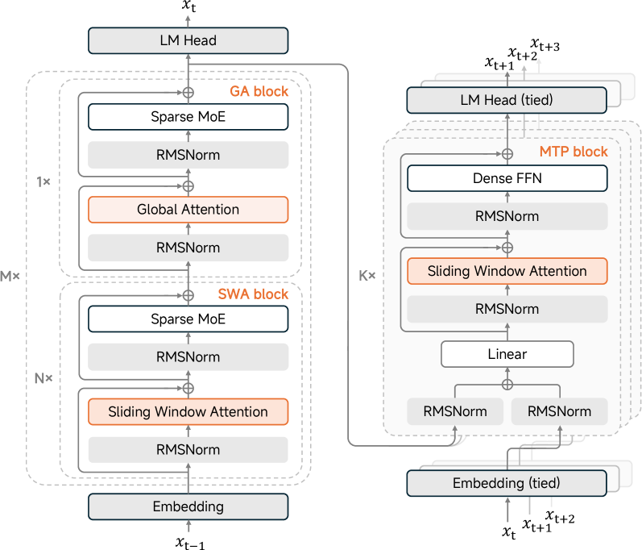
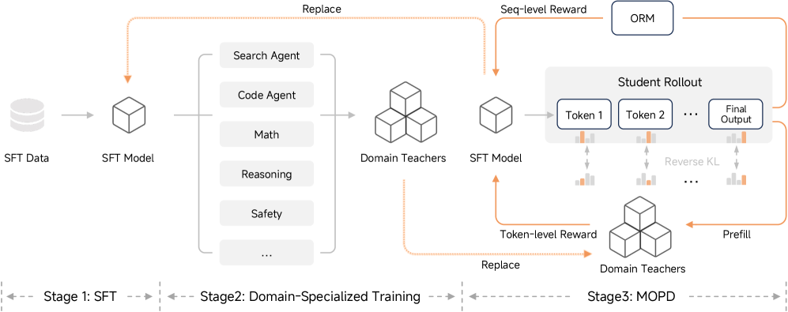
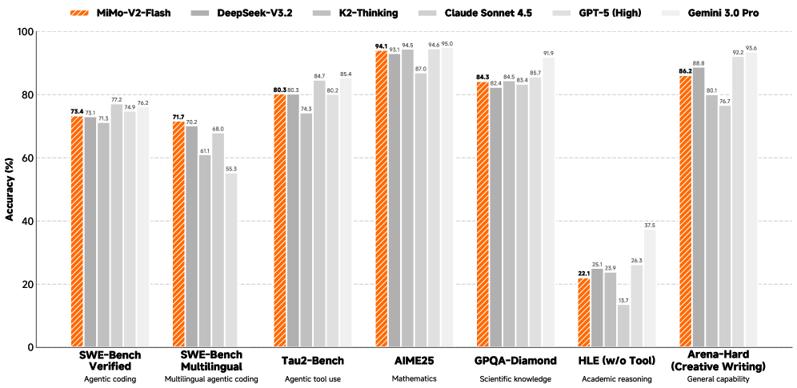
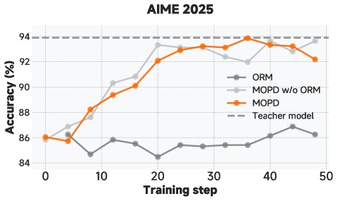
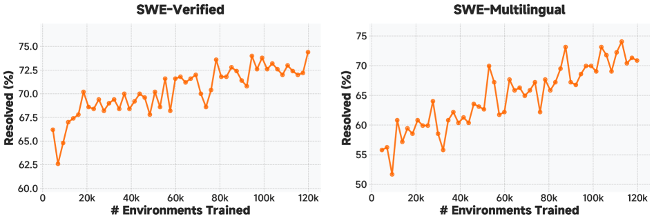

---
tags:
  - MLSYS
  - SPEC_DECODING
  - REASONING
  - RL
arxiv: https://arxiv.org/abs/2601.02780
github: ""
website: ""
year: 2026
read: false
---

# MiMo-V2-Flash Technical Report

> **Links:** [arXiv](https://arxiv.org/abs/2601.02780)
> **Tags:** #MLSYS #SPEC_DECODING #REASONING #RL

---

## Methodology

### Architecture

MiMo-V2-Flash is a 309B-parameter mixture-of-experts (MoE) model with 15B active parameters per token. It introduces a **hybrid attention architecture** that interleaves Sliding Window Attention (SWA) with global attention (GA).

Key architectural specs:

| Component | Value |
|---|---|
| Total parameters | 309B |
| Active parameters | 15B |
| Transformer layers | 48 (39 SWA + 9 GA) |
| SWA window size | 128 tokens |
| Total experts | 256 |
| Activated experts | 8 per token |
| SWA heads (Q/KV) | 64 / 8 |
| GA heads (Q/KV) | 64 / 4 |
| Head dim (Q/K, V) | 192, 128 |
| MTP block size | 0.33B params each |

The 5:1 SWA-to-GA ratio achieves roughly a $6\times$ reduction in KV-cache storage compared to full attention. Each SWA layer uses a learnable **attention sink bias**, allowing the model to assign near-zero attention to tokens it wants to suppress, enabling aggressive window compression without performance degradation.

### Multi-Token Prediction (MTP) for Speculative Decoding

During pre-training, a single lightweight MTP head (dense FFN + SWA block) is attached and trained alongside the main model. At inference time this head is replicated across multiple layers and used as a draft model for **self-speculative decoding** — no external draft model is needed.

- Pre-training uses one MTP head to avoid overhead.
- Inference uses three MTP layers, yielding up to 3.6 acceptance length and **2.6× decoding speedup**.

### Pre-Training

27 trillion tokens across three stages:

| Stage | Token range | Focus |
|---|---|---|
| 1 | 0–22T | General web, books, papers, code, STEM at 32K context |
| 2 | 22–26T | Code upsampling + 5% synthetic reasoning data |
| 3 | 26–27T | Long-context extension to 256K with long-range dependency data |

### Post-Training: Multi-Teacher On-Policy Distillation (MOPD)

Three post-training stages:
1. **Supervised Fine-Tuning (SFT)** — general instruction following.
2. **Domain-Specialized RL** — on-policy rollouts across 120K+ environments with programmatic verifiers and LLM-based reward judges for non-verifiable tasks.
3. **Multi-Teacher On-Policy Distillation** — combines token-level KL signals from domain-specialized teacher models with outcome reward model (ORM) signals.

The MOPD surrogate loss:

$$\mathcal{L}_\text{MOPD}(\theta) = -\mathbb{E}\left[\frac{1}{|y|} \sum_t w_t \hat{A}_{\text{MOPD},t} \log \pi_\theta(y_t \mid x, y_{<t})\right]$$

where the combined advantage is:

$$\hat{A}_{\text{MOPD},t} = \text{sg}\!\left[\log \frac{\pi_\text{domain}(y_t \mid x, y_{<t})}{\pi_\theta(y_t \mid x, y_{<t})}\right] + \alpha\, \hat{A}_\text{ORM}$$

- $\pi_\theta$: student policy being trained.
- $\pi_\text{domain}$: domain-specialized teacher policy.
- $\hat{A}_\text{ORM}$: outcome reward model advantage (clipped importance-sampled).
- $w_t$: per-token importance sampling weight (clipped at $[\epsilon_\text{low}, \epsilon_\text{high}]$).
- $\text{sg}[\cdot]$: stop-gradient operator — teacher KL acts as a fixed advantage signal rather than propagating through the teacher.
- $\alpha$: scalar balancing KL advantage vs. ORM advantage.

The KL divergence term encourages the student to imitate teacher token distributions; the ORM term keeps focus on final answer correctness.

---

## Experiment Setup

- **Baselines:** DeepSeek-V3.2-Thinking, Kimi-K2-Thinking, GPT-5-High, Claude-Sonnet-4.5, Gemini-3.0-Pro.
- **Coding:** SWE-Bench Verified, SWE-Bench Multilingual, LiveCodeBench-v6, HumanEval+.
- **Math:** AIME 2025, MATH (4-shot), GSM8K (8-shot).
- **General:** MMLU (5-shot), MMLU-Pro, BBH (3-shot).
- **Long-context:** LongBench V2, NIAH at 256K.
- **Speculative decoding:** acceptance length and wall-clock speedup measured with 1–3 MTP layers.

---

## Results

### Main Results

| Benchmark | MiMo-V2-Flash | DeepSeek-V3.2 | Kimi-K2 | GPT-5 High |
|---|---|---|---|---|
| MMLU-Pro | 84.9 | 85.0 | 84.6 | 87.5 |
| AIME 2025 | 94.1 | 93.1 | 94.5 | 94.6 |
| SWE-Bench Verified | 73.4 | 73.1 | 71.3 | 74.9 |
| LiveCodeBench-v6 | 85.1 | 83.3 | 83.1 | 84.5 |
| LongBench V2 | 60.6 | 58.4 | 48.1 | — |
| SWE-Bench Multilingual | 71.7 | — | — | — |
| MMLU (5-shot) | 86.7 | — | — | — |
| NIAH (256K) | 96.7% | — | — | — |

MiMo-V2-Flash matches or exceeds DeepSeek-V3.2 and Kimi-K2 with only 15B active parameters, and leads open-source models on SWE-Bench Multilingual and LongBench V2.

### Speculative Decoding Speedup

| MTP Layers | Acceptance Length | Decoding Speedup |
|---|---|---|
| 1 | ~1.8 | ~1.5× |
| 2 | ~2.8 | ~2.0× |
| 3 | 3.6 | 2.6× |

Self-speculative decoding via MTP requires no external draft model.

### MOPD vs. Baselines

MOPD outperforms standard SFT and naive on-policy RL on reasoning and coding benchmarks while reducing reward hacking. The cross-entropy between student and teacher logits correlates strongly with acceptance length in speculative decoding, motivating the KL-based distillation objective.

### Code-Agentic RL Scaling

Domain-specialized RL on code-agentic environments (120K+ SWE-Bench-style tasks) shows consistent improvement with more RL steps and generalizes to out-of-distribution agentic benchmarks.

---

## Related Papers

- [dsv3](dsv3.md)
- [dsv3_2](dsv3_2.md)
- [deepseekr1](deepseekr1.md)
- [deepseekmoe](deepseekmoe.md)
- [eagle3](eagle3.md)
- [medusa](medusa.md)
