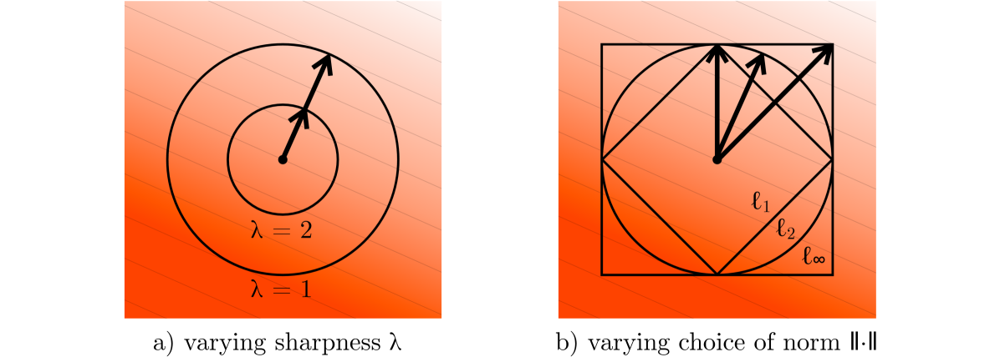

---
tags:
  - OPT
  - DEEP_LEARNING
  - THEORY
arxiv: "https://arxiv.org/abs/2409.20325"
github: ""
website: ""
year: 2024
read: false
---

# Old Optimizer, New Norm: An Anthology

> **Links:** [arXiv](https://arxiv.org/abs/2409.20325)
> **Tags:** #OPT #DEEP_LEARNING #THEORY

---

## Methodology

*Figure 1: Steepest descent under three different norms ($\ell_1$, $\ell_2$, $\ell_\infty$). (a) Increasing sharpness $\lambda$ shrinks the solution magnitude. (b) Changing the norm changes the solution direction. The optimal norm should match the geometry of the loss landscape.*

The paper reinterprets Adam, Shampoo, and Prodigy as **steepest descent under specific operator norms**, without exponential moving averages (EMA). Stripping away EMA exposes the underlying geometry of each optimizer. The central design question becomes: **which norm should be assigned to each tensor type?**

### Core Framework

**Proposition 1 (Steepest Descent).** For gradient $\mathbf{g}$ and sharpness $\lambda \geq 0$:

$$\arg\min_{\Delta\mathbf{w}} \left[ \mathbf{g}^\top \Delta\mathbf{w} + \frac{\lambda}{2}\|\Delta\mathbf{w}\|^2 \right] = -\frac{\|\mathbf{g}\|^\dagger}{\lambda} \cdot \arg\max_{\|\mathbf{t}\|=1} \mathbf{g}^\top \mathbf{t}$$

where $\|\cdot\|^\dagger$ denotes the dual norm.

### Induced Operator Norm

**Definition 1.** The $\alpha \to \beta$ induced operator norm:

$$\|\mathbf{M}\|_{\alpha \to \beta} = \max_{\mathbf{x} \in \mathbb{R}^{d_\text{in}}} \frac{\|\mathbf{M}\mathbf{x}\|_\beta}{\|\mathbf{x}\|_\alpha}$$

Tractable special cases (Proposition 8):
- $\|\mathbf{M}\|_{\ell_1 \to \ell_p} = \max_j \|\text{col}_j(\mathbf{M})\|_p$
- $\|\mathbf{M}\|_{\ell_p \to \ell_\infty} = \max_i \|\text{row}_i(\mathbf{M})\|_{p/(p-1)}$

### Optimizers as Steepest Descent

| Domain | Norm | Steepest Descent Solution | Optimizer | Cousin |
|---|---|---|---|---|
| $\mathbb{R}^n$ | Euclidean $\ell_2$ | $\Delta\mathbf{w} = -(\|\mathbf{g}\|_2 / \lambda) \cdot (\mathbf{g}/\|\mathbf{g}\|_2)$ | Vanilla GD | SGD |
| $\mathbb{R}^n$ | Infinity $\ell_\infty$ | $\Delta\mathbf{w} = -(\|\mathbf{g}\|_1 / \lambda) \cdot \text{sign}(\mathbf{g})$ | Sign descent | Adam |
| $\mathbb{R}^{m \times n}$ | Frobenius $S_2$ | $\Delta\mathbf{W} = -(\|\mathbf{G}\|_F / \lambda) \cdot (\mathbf{G}/\|\mathbf{G}\|_F)$ | Vanilla GD | SGD |
| $\mathbb{R}^{m \times n}$ | Spectral $S_\infty$ | $\Delta\mathbf{W} = -(\text{tr}\,\boldsymbol{\Sigma}/\lambda) \cdot \mathbf{U}\mathbf{V}^\top$ | Spectral descent | Shampoo |

*Legend: $S_p$ = Schatten $p$-norm ($\ell_p$ norm of singular values); $\mathbf{U}\boldsymbol{\Sigma}\mathbf{V}^\top$ = reduced SVD of gradient $\mathbf{G}$; "Cousin" = the full EMA-based optimizer that corresponds to each steepest-descent variant.*

**Adam (Propositions 2–3).** Without EMA, Adam reduces to sign descent — steepest descent under the layer-wise **max-of-max norm** $\max_l \|\Delta\mathbf{W}_l\|_{\ell_1 \to \ell_\infty}$:

$$\Delta\mathbf{W}_l = -\eta \cdot \text{sign}(\mathbf{G}_l)$$

**Shampoo (Propositions 4–5).** The update $\Delta\mathbf{W}_l = -\eta \mathbf{U}_l \mathbf{V}_l^\top$ (where $\mathbf{G}_l = \mathbf{U}_l \boldsymbol{\Sigma}_l \mathbf{V}_l^\top$) is steepest descent under the **max spectral norm** $\max_l \|\Delta\mathbf{W}_l\|_{\ell_2 \to \ell_2}$, with global step size $\eta = \frac{1}{\lambda}\sum_l \text{tr}(\boldsymbol{\Sigma}_l)$.

**Prodigy (Escape Velocity).** Parameter-free sign descent with dynamic step-size warm-up. Without EMA:

$$\eta_{t+1} = \max\!\left(\eta_t,\; \frac{\mathbf{g}_t^\top(\mathbf{w}_0 - \mathbf{w}_t)}{\|\mathbf{g}_t\|_1}\right)$$

Step size grows exponentially until weights "escape" the initial linear approximation region.

### Modular Norm Framework

**Proposition 7 (Modular Norm).** Given per-layer scale coefficients $s_1, \ldots, s_L > 0$ and per-layer norms $\|\cdot\|_1, \ldots, \|\cdot\|_L$, steepest descent under the **modular norm**:

$$\max\{s_1\|\mathbf{W}_1\|_1,\ \ldots,\ s_L\|\mathbf{W}_L\|_L\}$$

yields per-layer updates:

$$\Delta\mathbf{W}_l = -\frac{\eta}{s_l} \cdot \arg\max_{\|\mathbf{T}_l\|_l = 1} \langle \mathbf{G}_l, \mathbf{T}_l\rangle$$

This decouples norm selection per layer while maintaining a single unified optimization objective. Core design principle:

> **Different tensor types should use different operator norms based on their functional role in the network.**

### Recommended Norm Assignments by Layer Type

| Layer Type | Input Distribution | Recommended Norm | Rationale |
|---|---|---|---|
| Linear layer | RMS-normalized activations | RMS-to-RMS ($\ell_2 \to \ell_2$, rescaled spectral) | Preserves RMS magnitude through the layer |
| Embedding layer | One-hot inputs | $\ell_1$-to-RMS ($\ell_1 \to \ell_2$, rescaled) | One-hot inputs have unit $\ell_1$ norm, not $\ell_2$ norm |

*Note: RMS-to-RMS = spectral norm scaled by $1/\sqrt{d_\text{in}}$; $\ell_1$-to-RMS = maximum column $\ell_2$ norm.*

### Loss Bound Justification

**Proposition 6.** For square loss with RMS-normalized inputs and a linear predictor:

$$\mathcal{L}(\mathbf{W} + \Delta\mathbf{W}) \leq \mathcal{L}(\mathbf{W}) + \langle \nabla\mathcal{L}, \Delta\mathbf{W} \rangle + \frac{1}{2} \cdot \frac{d_\text{in}}{d_\text{out}} \cdot \|\Delta\mathbf{W}\|_{\ell_2 \to \ell_2}^2$$

This bound identifies spectral norm as the natural sharpness-controlling quantity for linear layers, motivating Shampoo-style updates.

---

## Experiment Setup

Primarily theoretical paper — no new empirical experiments. Analysis is grounded in prior results from Adam, Shampoo, and Prodigy papers.

---

## Results

### Main Results

No numerical benchmarks. The contribution is a unified theoretical framework; see the Optimizers as Steepest Descent table above.

### Key Theoretical Insights

| Insight | Detail |
|---|---|
| Adam = sign descent | Without EMA: steepest descent under $\ell_\infty$ (max-of-max) norm |
| Shampoo = spectral descent | Without EMA: steepest descent under max spectral norm |
| Prodigy = adaptive sign descent | Without EMA: sign descent with escape-velocity step size schedule |
| Modular norm unifies all three | Per-layer norm assignment recovers each as a special case |
| Embedding $\neq$ linear | Same weight shape, different input statistics → different optimal norms |
