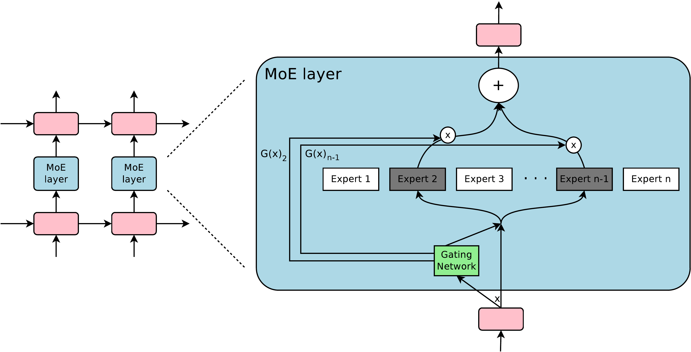

---
tags:
  - NLP
  - MLSYS
  - DEEP_LEARNING
arxiv: https://arxiv.org/abs/1701.06538
github: ""
website: ""
year: 2017
read: false
---

# Outrageously Large Neural Networks: The Sparsely-Gated Mixture-of-Experts Layer

> **Links:** [arXiv](https://arxiv.org/abs/1701.06538)
> **Tags:** #NLP #MLSYS #DEEP_LEARNING

---

## Methodology

### MoE Layer

The MoE layer consists of $n$ expert networks $E_1, \ldots, E_n$ (feed-forward networks) and a trainable gating network $G$ that outputs a sparse $n$-dimensional weight vector. The layer output is:

$$y = \sum_{i=1}^{n} G(x)_i \, E_i(x)$$

Wherever $G(x)_i = 0$, expert $E_i$ is not computed. In practice $n$ can be thousands while only $k \ll n$ experts are evaluated per input.

### Noisy Top-K Gating

Standard Softmax gating ($G_\sigma(x) = \text{Softmax}(x \cdot W_g)$) is dense. The proposed **Noisy Top-K Gating** adds trainable Gaussian noise then masks all but the top-$k$ logits:

$$G(x) = \text{Softmax}(\text{KeepTopK}(H(x),\, k))$$

$$H(x)_i = (x \cdot W_g)_i + \text{StandardNormal}() \cdot \text{Softplus}((x \cdot W_\text{noise})_i)$$

$$\text{KeepTopK}(v, k)_i = \begin{cases} v_i & \text{if } v_i \text{ is in the top-}k \text{ elements of } v \\ -\infty & \text{otherwise} \end{cases}$$

- $x \in \mathbb{R}^{d_\text{in}}$: input token representation; $W_g, W_\text{noise} \in \mathbb{R}^{d_\text{in} \times n}$: two learned projections to per-expert logits.
- $H(x)_i$: noisy logit for expert $i$; the noise std is expert-specific and positive via $\text{Softplus}(z) = \log(1 + e^z)$.
- $\text{StandardNormal}()$: a fresh sample from $\mathcal{N}(0,1)$ drawn per $(x, i)$.
- $\text{KeepTopK}$: routes at most $k$ experts; non-top entries become $-\infty$, so Softmax gives them weight $0$.

$W_g$ and $W_\text{noise}$ are trained jointly by backprop and initialized to zero so initial routing is approximately uniform.

### Hierarchical MoE

For very large expert counts, a two-level hierarchy reduces branching. For $a$ groups of $b$ experts each:

$$y_H = \sum_{i=1}^{a} \sum_{j=1}^{b} G_\text{primary}(x)_i \cdot G_i(x)_j \cdot E_{i,j}(x)$$

### Balancing Expert Utilization

Two soft-constraint auxiliary losses are added to the objective.

**Importance loss** — penalizes unequal batchwise gate-weight sums:

$$\text{Importance}(X) = \sum_{x \in X} G(x), \quad L_\text{importance}(X) = w_\text{importance} \cdot \text{CV}(\text{Importance}(X))^2$$

- $X$: a training minibatch; $\text{Importance}(X) \in \mathbb{R}^n$: total gate mass received by each expert.
- $\text{CV}(v) = \text{std}(v) / \text{mean}(v)$: coefficient of variation; squared to make the loss differentiable around the minimum.
- $w_\text{importance}$: scalar loss weight (hyperparameter).

**Load loss** — penalizes unequal example counts per expert. Uses a differentiable smooth load estimator via the noise term:

$$P(x, i) = \Phi\!\left(\frac{(x \cdot W_g)_i - \text{kth\_excl}(H(x), k, i)}{\text{Softplus}((x \cdot W_\text{noise})_i)}\right)$$

$$\text{Load}(X)_i = \sum_{x \in X} P(x, i), \quad L_\text{load}(X) = w_\text{load} \cdot \text{CV}(\text{Load}(X))^2$$

- $P(x, i)$: smooth probability (under the Gaussian noise distribution) that expert $i$ makes the top-$k$ cut for input $x$. Exact top-$k$ is non-differentiable, so it is replaced by this CDF.
- $\Phi$: standard normal CDF.
- $\text{kth\_excl}(v, k, i)$: the $k$-th largest entry of $v$ after excluding index $i$ — the threshold that expert $i$ would need to beat.
- $\text{Load}(X)_i$: expected number of tokens routed to expert $i$ in the batch.

All main experiments use $w_\text{importance} = w_\text{load} = 0.1$.

### Addressing the Shrinking Batch Problem

With $k$-of-$n$ sparse routing, each expert's effective batch shrinks to $\approx kb/n$. Mitigations:

1. **Mixed data + model parallelism**: $d$ devices share a single copy of each expert; each expert receives inputs from all $d$ data-parallel replicas, increasing its batch $d$-fold.
2. **Convolutionality**: batch all timesteps of a sequence through the MoE together.
3. **Activation recomputation**: recompute expert hidden activations on the backward pass to allow larger batches.

---

## Experiment Setup

**Architecture**: LSTM → MoE → LSTM. Embedding/LSTM/MoE I/O = 512 (small) or 1024/4096 (large). Each expert: ReLU hidden layer (size 1024) + linear output (size 512), totaling 1M params/expert. Residual connections and dropout after each layer.

**Optimizer**: Adam, linear warmup 1000 steps then inverse-sqrt decay. Large-scale runs use $\beta_1=0$ and a factored outer-product second-moment estimator to reduce memory 3x.

**Hardware**: 16–128 Tesla K40 GPUs, synchronous data + model parallelism via TensorFlow.

**Key hyperparameters**: $k=4$ (flat MoE) or $k=2$ per level (hierarchical). Batch ~300k words (1B) or ~2.5M words (100B).

**Datasets**:
- 1 Billion Word LM Benchmark (~829M words, 793k vocab)
- 100 Billion Word Google News corpus (internal)
- WMT'14 En→Fr (36M pairs), En→De (5M pairs); newstest2014 test set
- Google Production En→Fr

---

## Results

### 1 Billion Word Language Modeling Benchmark

| Model | ops/ts (M) | Params (M) | Test PPL (10 ep) | Test PPL (final) |
|---|---|---|---|---|
| LSTM-2048-512\* | 9.4 | 9.4 | 45.0 | 43.7 |
| 4xLSTM-512 | 8.4 | 8.4 | 46.0 | — |
| MoE-4 | 8.4 | 8.4 | 45.0 | — |
| MoE-32 | 8.4 | 37.8 | 39.7 | — |
| MoE-256 | 8.6 | 272.9 | 35.7 | — |
| MoE-1024-h | 8.5 | 1079 | 34.6 | — |
| MoE-4096-h | 8.9 | 4303 | 34.1 | — |
| 2xLSTM-8192-1024\* | 151 | 151 | 34.7 | **30.6** |
| MoE-34M | 33.8 | 4314 | 31.3 | — |
| **MoE-143M** | 142.7 | 4371 | **28.0** | — |

\* From Jozefowicz et al. (2016). **ops/ts** = multiply-adds per timestep in the forward pass, excluding softmax. **Params** = parameters excluding embedding and softmax (millions). **-h** = hierarchical MoE. MoE-34M / MoE-143M are high-capacity variants with 4B-parameter MoE layers and 34M / 143M ops/ts.

### 100 Billion Word Google News Corpus

| Model | ops/ts (M) | Total params (B) | PPL (0.1 ep) | PPL (1 ep) |
|---|---|---|---|---|
| 4xLSTM-512 | 8.4 | 0.1 | 54.5 | 47.0 |
| MoE-32 | 8.4 | 0.1 | 48.5 | 40.4 |
| MoE-256-h | 8.4 | 0.4 | 42.8 | 35.3 |
| MoE-1024-h | 8.5 | 1.2 | 40.3 | 32.7 |
| MoE-4096-h | 8.6 | 4.4 | 38.9 | 30.9 |
| MoE-16384-h | 8.8 | 17.3 | **38.2** | 29.7 |
| MoE-65536-h | 9.2 | 68.9 | **38.2** | **28.9** |
| MoE-131072-h | 9.7 | 137.7 | 39.8 | 29.2 |

At 65536 experts (68.9B params, 99.994% layer sparsity), 1-epoch PPL is 39% lower than the compute-matched LSTM baseline at 0.72 TFLOPS/GPU.

### Machine Translation — WMT'14 En→Fr (newstest2014)

| Model | Test PPL | Test BLEU | ops/ts | Total params | Training |
|---|---|---|---|---|---|
| MoE 2048 experts | 2.69 | 40.35 | 85M | 8.7B | 3 days / 64 K40s |
| MoE 2048 experts (longer) | **2.63** | **40.56** | 85M | 8.7B | 6 days / 64 K40s |
| GNMT | 2.79 | 39.22 | 214M | 278M | 6 days / 96 K80s |
| GNMT+RL | 2.96 | 39.92 | 214M | 278M | 6 days / 96 K80s |
| DeepAtt+PosUnk | — | 39.2 | — | — | — |

### Machine Translation — WMT'14 En→De (newstest2014)

| Model | Test PPL | Test BLEU | ops/ts | Total params |
|---|---|---|---|---|
| **MoE 2048 experts** | **4.64** | **26.03** | 85M | 8.7B |
| GNMT | 5.25 | 24.91 | 214M | 278M |
| GNMT+RL | 8.08 | 24.66 | 214M | 278M |

### Machine Translation — Google Production En→Fr

| Model | Eval PPL | Eval BLEU | Test PPL | Test BLEU | Training |
|---|---|---|---|---|---|
| **MoE 2048 experts** | **2.60** | **37.27** | **2.69** | **36.57** | 1 day / 64 K40s |
| GNMT | 2.78 | 35.80 | 2.87 | 35.56 | 6 days / 96 K80s |

### Multilingual Translation (12 Language Pairs)

| | GNMT-Mono | GNMT-Multi | MoE-Multi |
|---|---|---|---|
| Params | 278M/model | 278M | 8.7B |
| ops/ts | 212M | 212M | 102M |
| Training | various | 21 days, 96 K20s | **12 days, 64 K40s** |
| Dev PPL | — | 4.14 | **3.35** (−19%) |
| Fr→En BLEU | 36.47 | 34.40 | **37.46** |
| De→En BLEU | 31.77 | 31.17 | **34.80** |
| Ja→En BLEU | 23.41 | 21.62 | **25.91** |
| Ko→En BLEU | 25.42 | 22.87 | **28.71** |
| En→Fr BLEU | 35.37 | 34.00 | **36.59** |
| En→De BLEU | **26.43** | 23.15 | 24.53 |

**GNMT-Mono** = 12 separately trained single-pair GNMT models. **GNMT-Multi** = one GNMT model trained on all 12 pairs. MoE-Multi beats single-pair GNMT on 8 of 12 language pairs.

### Load Balancing Ablation

| $w_\text{importance}$ | $w_\text{load}$ | Test PPL | CV(Importance) | CV(Load) | max/mean Load |
|---|---|---|---|---|---|
| 0.0 | 0.0 | 39.8 | 3.04 | 3.01 | 17.80 |
| 0.2 | 0.0 | **35.6** | 0.06 | 0.17 | 1.47 |
| 0.0 | 0.2 | 35.7 | 0.22 | 0.04 | 1.15 |
| 0.1 | 0.1 | **35.6** | 0.06 | 0.05 | 1.14 |
| 1.0 | 1.0 | 35.7 | 0.03 | 0.02 | **1.07** |

**CV** = coefficient of variation. **max/mean Load** = ratio of most-loaded to average-loaded expert; lower = better for distributed hardware. Either loss alone recovers most quality vs. no loss (39.8 PPL); combining both also minimizes peak load imbalance.

---

## Related Papers

- [dsv3](dsv3.md)
- [megatrain](megatrain.md)
- [sdar](sdar.md)
