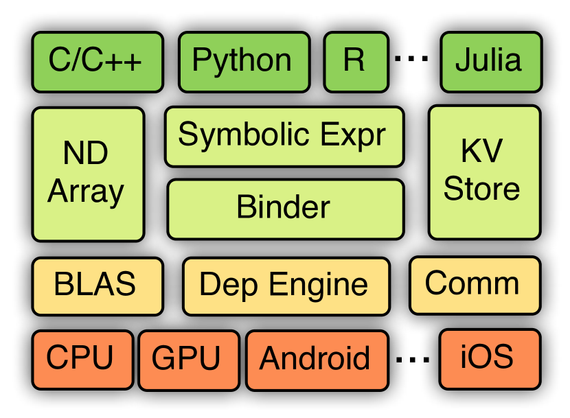

---
tags:
  - MLSYS
  - DEEP_LEARNING
arxiv: "https://arxiv.org/abs/1512.01274"
github: "https://github.com/apache/mxnet"
website: "http://dmlc.io"
year: 2015
read: false
---

# MXNet: A Flexible and Efficient Machine Learning Library for Heterogeneous Distributed Systems

> **Links:** [arXiv](https://arxiv.org/abs/1512.01274) | [GitHub](https://github.com/apache/mxnet) | [Website](http://dmlc.io)
> **Tags:** #MLSYS #DEEP_LEARNING

---

## Methodology

MXNet is a multi-language ML library that unifies **declarative symbolic computation** (computation graphs) and **imperative tensor computation** (array operations) in a single framework. The system is structured around four components: a symbolic expression engine (Symbol), an imperative array abstraction (NDArray), a dependency engine, and a distributed key-value store (KVStore).

### 1. Unified Symbolic and Imperative Computation

| Programming Style | Mechanism | Key Advantage |
|---|---|---|
| **Declarative (Symbol)** | Builds computation graph before execution | Global optimization, memory reuse, portability |
| **Imperative (NDArray)** | Executes operations immediately like NumPy | Flexible host-language integration, easy debugging |

MXNet exposes both styles simultaneously:
- `Symbol` operations compose a DAG of operators; the graph is compiled and executed by a runtime that applies optimizations.
- `NDArray` operations are lazy-evaluated and scheduled through the dependency engine; mutations (in-place updates) are tracked explicitly as write operations.

Auto-differentiation is supported on Symbol graphs: given a forward computation graph, the backward graph is derived symbolically and appended.

### 2. Dependency Engine

The engine provides correct, parallel scheduling of operations across devices without user-managed locks:

- Each resource (NDArray, random number generator, temporary buffer) is registered with a unique **tag**.
- Each submitted operation declares its **read tags** and **write tags**.
- The engine maintains a queue per tag; an operation is dispatched when no unfinished operation holds a conflicting write tag on its resources.
- Array **mutations** (e.g., SGD parameter update $w \mathrel{+}= -\eta \cdot \nabla w$) are modeled as write operations on the same tag — distinguishing MXNet from pure dataflow engines where all tensors are immutable.
- Both CPU and GPU execution are supported; cross-device copies are inserted automatically.

### 3. Memory Optimization

Two linear-time heuristics reduce intermediate activation memory:

**Inplace reuse**: Traverse the computation graph tracking a reference counter for each node's output. When the counter reaches zero (all downstream consumers have completed), the memory block is recycled for a subsequent node.

**Co-share**: Two graph nodes that cannot run in parallel (determined by the dependency graph) are allowed to share one memory block. Enabling co-share adds an artificial dependency edge to serialize the two nodes, ensuring they never overlap.

Combined effect:

| Strategy | Training Memory Reduction | Inference Memory Reduction |
|---|---|---|
| Inplace only | ~1.5× | ~2× |
| Inplace + Co-share | **~2×** | **~4×** |

*Memory savings are relative to a naive baseline with no buffer reuse. VGG-style networks require fewer than 16 MB of auxiliary memory with this scheme.*

### 4. Distributed Training: KVStore

KVStore implements a **two-level parameter server**:

- **Level-1 (intra-machine)**: An aggregation server per machine that collects gradients from all local GPUs via peer-to-peer PCIe transfers, applies the user-defined update rule, and broadcasts updated parameters back.
- **Level-2 (inter-machine)**: Each machine's level-1 server also acts as a client to a global server cluster for cross-machine synchronization.

Outbound traffic from level-1 is aggregated before being sent to level-2, reducing network bandwidth. Users select **sequential consistency** (synchronous SGD) or **eventual consistency** (asynchronous SGD) independently for each level.

### 5. System Comparison

| System | Core | Bindings | Distributed | Imperative | Declarative |
|---|---|---|---|---|---|
| Caffe | C++ | Python/MATLAB | No | No | Yes |
| Torch7 | Lua | — | No | Yes | No |
| Theano | Python | — | No | No | Yes |
| TensorFlow | C++ | Python | Yes | No | Yes |
| **MXNet** | **C++** | **Python/R/Julia/Go** | **Yes** | **Yes** | **Yes** |

*Implementation: ~50 K lines of C++ with no external ML dependencies; bindings via Cython/SWIG.*

---

## Experiment Setup

- **Single-GPU benchmark**: NVIDIA GTX 980; compared against Torch7, Caffe, TensorFlow on AlexNet, VGG, GoogleNet using the convnet-benchmarks suite.
- **Memory benchmark**: VGG and comparable architectures; measure peak internal memory under four allocation strategies (no reuse, inplace only, co-share only, inplace + co-share) for both training and inference.
- **Distributed scalability**: GoogleNet on ILSVRC12 (ImageNet 1K); 10 Amazon EC2 GPU machines; measure time per data pass and convergence curves.

---

## Results

### Single-GPU Throughput (GTX 980)

MXNet achieves throughput comparable to Torch7 and Caffe. TensorFlow runs **~2× slower** in this comparison (attributed to a lower CUDNN version used by TF at the time).

### Memory Reduction

| Network | Strategy | Training Savings | Inference Savings |
|---|---|---|---|
| All tested networks | Inplace + Co-share | ~2× | ~4× |
| VGG | Inplace + Co-share | <16 MB auxiliary overhead | — |

*Training savings = reduction in peak intermediate activation memory vs. no-reuse baseline. Inference saves more because no gradient buffers are needed.*

### Distributed Scalability (GoogleNet on ILSVRC12)

| Setup | Time per Data Pass | Speedup vs. 1 Machine |
|---|---|---|
| 1 machine (single GPU) | ~14,000 s | 1× |
| 10 machines | ~1,400 s | ~10× (super-linear) |

*Super-linear speedup arises because intra-machine gradient aggregation in level-1 KVStore reduces the gradient volume transmitted across machines; the effective per-device synchronization cost decreases faster than linearly with machine count.*

Training on 10 machines matches the convergence curve of single-machine training, reaching comparable validation accuracy after the same number of data passes.

---

## Related Papers

- [tvm](tvm.md)
