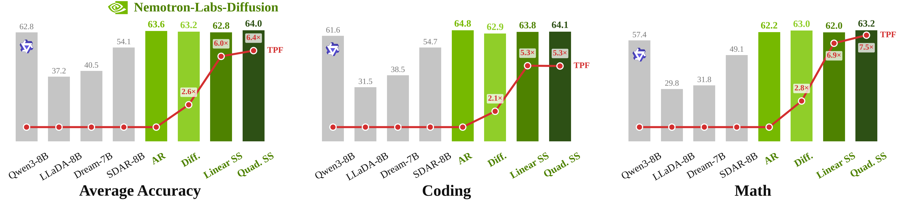
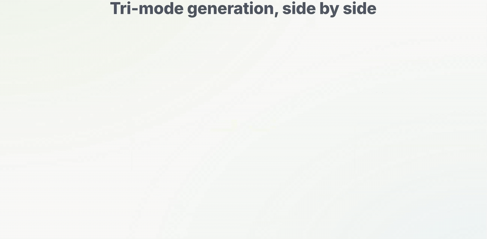

---
tags:
  - DLM
  - SPEC_DECODING
  - MLSYS
arxiv: ""
github: https://github.com/NVIDIA-NeMo/Nemotron
website: https://huggingface.co/blog/nvidia/nemotron-labs-diffusion
year: 2026
read: false
---

# Nemotron-Labs-Diffusion: A Tri-Mode Language Model Unifying Autoregressive, Diffusion, and Self-Speculation Decoding

> **Links:** [Tech Report](https://d1qx31qr3h6wln.cloudfront.net/publications/Nemotron_Diffusion_Tech_Report_v1.pdf) | [GitHub](https://github.com/NVIDIA-NeMo/Nemotron) | [HuggingFace](https://huggingface.co/collections/nvidia/nemotron-labs-diffusion) | [Website](https://huggingface.co/blog/nvidia/nemotron-labs-diffusion)
> **Tags:** #DLM #SPEC_DECODING #MLSYS

---

## Methodology

Nemotron-Labs-Diffusion (NLD) is a family of tri-mode language models trained jointly under both autoregressive (AR) and masked diffusion objectives. A single model switches among three decoding modes at inference time:

1. **AR mode** — standard left-to-right token-by-token generation (1 token per forward pass)
2. **Diffusion mode** — block-wise parallel denoising (multiple tokens per forward pass)
3. **Self-speculation mode** — diffusion drafts candidate tokens, AR verifies them; the jointly trained weights serve both roles without a separate draft model

### Training Objectives

**AR loss:**
$$\mathcal{L}_{AR}(\theta) = \mathbb{E}_{x \sim \mathcal{D}} \left[ -\sum_{i=1}^{|x|} \log p_\theta(x_i \mid x_{<i}) \right]$$

**Block-wise diffusion loss** — the sequence is partitioned into $B$ contiguous blocks $\{x^b\}_{b=1}^B$; only the current block is masked at noise level $t$:
$$\mathcal{L}_{diff}(\theta) = \mathbb{E}_{t \sim \mathcal{U}[0,1],\, \tilde{x}^b_t \sim q(\cdot|x^b)} \left[ -\frac{1}{t} \sum_{b=1}^{B} \log p_\theta(x^b \mid \tilde{x}^b_t, x^{<b}) \right]$$

- $t \in [0,1]$: noise level drawn uniformly
- $\tilde{x}^b_t$: corrupted (masked) version of block $b$ at noise level $t$
- $x^{<b}$: clean prefix of all blocks before $b$

**Joint objective:**
$$\mathcal{L}(\theta) = \mathcal{L}_{AR}(\theta) + \alpha \cdot \mathcal{L}_{diff}(\theta), \quad \alpha = 0.3$$

**Global loss averaging** — tokens are weighted equally across the whole batch rather than per-sequence:
$$\mathcal{L}_{global} = \frac{1}{NL} \sum_{n=1}^{N} \sum_{i=1}^{L} \ell_{n,i}$$

- $N$: batch size, $L$: sequence length, $\ell_{n,i}$: per-token loss

### Attention Pattern

A **dual-stream** input is used at training time: the noisy view and a clean view of the same sequence are concatenated. A strictly causal mask is applied within the clean stream (no future-token attention), so AR and diffusion objectives can be trained in a single forward-backward pass without label leakage.

### Two-Stage Training

- **Stage 1** (pure AR, $\alpha=0$): establishes strong left-to-right linguistic priors
- **Stage 2** (joint, $\alpha=0.3$): enables diffusion capability while preserving AR quality

---

## Mode 2: Diffusion Decoding

**Confidence-based sampling:** block-by-block; initialize as mask tokens, iteratively commit positions whose predicted confidence exceeds a threshold; KV cache is refreshed when a block completes.

**Trained sampler:** a 4-layer Transformer (~4.8M parameters, ~0.06% of backbone) predicts per-position whether the model's top-1 prediction is correct. Input: 144-dim features (PCA-compressed semantic embeddings of top-3 predictions + distribution statistics: top-1 probability, margin, top-3 mass, entropy). At inference, commit positions whose sampler probability exceeds a threshold. Trained on ~20M denoising trajectories from NLD-8B. Shifts the Pareto frontier: 1.3x TPF at same accuracy, or +10.6% accuracy at same TPF.

---

## Mode 3: Self-Speculation Decoding

### Linear Self-Speculation

1. **Draft** — append $k$ mask tokens to the verified prefix; diffusion mode denoises all $k$ positions in one forward pass
2. **Verify** — second forward pass with causal attention; accept the longest prefix where $x^{AR}_{n+j} = \hat{x}_{n+j}$; each cycle produces 1 to $k+1$ tokens

**LoRA-enhanced linear SS:** LoRA adapter (rank 128, $\alpha=512$, ~36M parameters, ~0.4% of backbone) applied only to the `o_proj` attention layer. Per-position LK-hybrid distribution-matching loss:

$$\mathcal{L}^{LK}_j = \lambda_j \cdot KL(\tilde{p}_j \| \tilde{q}_j) + (1 - \lambda_j) \cdot \frac{1}{2} \sum_{v \in \mathcal{U}_j} |\tilde{p}_j(v) - \tilde{q}_j(v)|$$

- $\tilde{p}_j, \tilde{q}_j$: truncated draft and target distributions over top-$K=200$ tokens at position $j$
- $\lambda_j = \exp(-\eta \cdot \text{sg}[\alpha_j])$ with $\eta=0.5$: adaptive coefficient balancing KL and L1 terms
- $\mathcal{U}_j$: union of top-$K$ supports of both distributions

Total loss: $\mathcal{L} = \mathcal{L}^{LK} + \mathcal{L}^{CE}$ with equal weights. Both drafter and verifier use temperature $\tau = 3.0$.

### Quadratic Self-Speculation

Performs drafting and verification **in a single forward pass** using a structured attention mask. An interleaved quadratic layout ($k$ fresh mask tokens after each of $k$ speculative tokens, yielding $k^2$ total positions) ensures $k$ tokens are produced per iteration regardless of when verification terminates. Optionally uses an AR-diffusion ensemble verifier:

$$p^{ens}_\theta(\cdot) = \lambda p^{AR}_\theta(\cdot) + (1-\lambda) p^{diff}_\theta(\cdot)$$

---

## Speed-of-Light (SOL) Analysis

SOL quantifies the **theoretical maximum tokens-per-forward (TPF)** achievable by diffusion decoding. Applied to NLD-8B (instruct) on 713 SPEED-Bench samples, sweeping block length $B \in \{4, 8, 16, 32\}$.

**SOL construction:** (i) oracle target via serial denoising (one position committed per pass); (ii) greedy parallel acceptance (commit all argmax-matching positions at once); (iii) recursive dynamic compaction (largest safe matching subset, simulation budget 5000 passes per block).

**Per-category SOL acceptance ratio (recursive dynamic compaction):**

| Category | BL=4 | BL=8 | BL=16 | BL=32 |
|---|---|---|---|---|
| coding | 3.32 | 5.32 | 7.50 | 10.24 |
| humanities | 2.76 | 3.76 | 5.00 | 6.93 |
| math | 3.20 | 4.90 | 7.02 | 9.30 |
| multilingual | 3.37 | 5.46 | 8.08 | 11.26 |
| qa | 2.61 | 3.46 | 4.43 | 5.63 |
| rag | 2.91 | 4.14 | 5.67 | 7.32 |
| reasoning | 2.79 | 3.87 | 5.06 | 7.22 |
| roleplay | 2.00 | 2.41 | 2.76 | 3.49 |
| stem | 2.98 | 4.11 | 5.68 | 8.01 |
| summarization | 2.71 | 3.25 | 4.48 | 6.02 |
| writing | 2.62 | 3.58 | 4.71 | 6.13 |
| **Average** | **2.89** | **4.17** | **5.68** | **7.60** |

At BL=32: SOL avg TPF = 6.02 vs. linear SS avg TPF = 3.41 — **76.5% more tokens per forward** for the SOL ceiling. Gap indicates substantial headroom for future sampler improvements.

---

## Experiment Setup

- **Base models:** continuous pretraining from Ministral3 base models
  - Stage 1: 1T tokens (pure AR); Stage 2: 300B tokens (joint, $\alpha=0.3$)
  - LR: 1e-5 to 3e-6 (WSD schedule); AdamW, weight decay 0.1
  - Batch size 512, sequence length 4096; 256 NVIDIA H100 GPUs
- **Instruct models:** SFT on 45B tokens with joint AR+diffusion ($\alpha=0.3$)
  - LR: 2.5e-6 to 2.5e-7; batch size 256, sequence length 16k; 256 H100 GPUs
  - Loss computed only on answer tokens (no prompt masking)
- **VLM:** vision encoder + 2-layer MLP projector (2x2 patch merging); backbone from NLD-8B instruct; vision components from Ministral3-8B-Instruct-2512 VLM; asymmetric dual stream strips vision token positions from noisy half
- **Evaluation:** NeMo-Skills for AR baselines; official pipelines for diffusion baselines
- **Throughput:** SGLang server on NVIDIA GB200 / RTX Pro 6000 / DGX Spark; SPEED-Bench (math, coding, reasoning, multilingual), generation capped at 1024 tokens

---

## Results

### Main Results — NLD-8B Instruct vs. SOTA

| Model | Mode | GPQA | IFEval | MMLU | HumanEval | MBPP | LCB-CPP | Math500 | GSM8K | AIME24 | AIME25 | Avg Acc | TPF |
|---|---|---|---|---|---|---|---|---|---|---|---|---|---|
| Qwen2.5-7B | AR | 37.12 | 74.58 | 74.86 | 77.44 | 81.55 | 12.33 | 75.10 | 91.89 | 13.75 | 6.88 | 54.55 | 1.00 |
| Qwen3-8B | AR | 49.24 | 87.38 | 76.66 | 81.71 | 81.88 | 21.09 | 84.80 | 92.42 | 30.21 | 22.08 | 62.75 | 1.00 |
| LLaDA-8B Instruct | Diff. | 33.30 | 59.90 | 65.50 | 49.40 | 41.00 | 4.19 | 39.20 | 79.91 | 0.00 | 0.00 | 37.24 | 1.00 |
| Dream-7B Instruct | Diff. | 33.00 | 62.50 | 67.00 | 55.50 | 58.80 | 1.25 | 43.00 | 81.00 | 0.00 | 3.33 | 40.54 | 1.00 |
| SDAR-8B Chat | Diff. | 40.20 | 61.40 | 78.60 | 78.70 | 72.00 | 13.44 | 78.60 | 91.30 | 16.67 | 10.00 | 54.09 | 1.00 |
| **NLD-8B** | AR | 44.44 | 68.65 | 79.85 | 80.49 | 85.19 | 28.85 | 88.00 | 94.01 | 33.33 | 33.33 | **63.61** | 1.00 |
| **NLD-8B** | Diff. | 43.94 | 68.32 | 78.71 | 78.66 | 83.86 | 26.16 | 85.80 | 93.03 | 46.67 | 26.67 | **63.18** | **2.57** |
| **NLD-8B** | Linear SS | 40.40 | 69.13 | 79.01 | 81.71 | 84.92 | 24.89 | 87.60 | 93.78 | 36.67 | 30.00 | **62.81** | **5.99** |
| **NLD-8B** | Quad. SS | 44.30 | 71.00 | 79.95 | 79.27 | 85.19 | 27.70 | 88.80 | 94.16 | 33.33 | 36.67 | **64.04** | **6.38** |

NLD-8B AR: +0.86% above Qwen3-8B. Quadratic SS: 6.38x TPF at +1.29% higher accuracy than Qwen3-8B.

### NLD-8B Base vs. SOTA Base Models

| Model | Mode | HumanEval | MBPP | GSM8K | Minerva Math | MMLU | Avg Acc | TPF |
|---|---|---|---|---|---|---|---|---|
| Llama-3.1-8B | AR | 35.37 | 48.80 | 54.06 | 18.22 | 65.15 | 57.04 | 1.00 |
| Ministral3-8B | AR | 42.68 | 61.60 | 80.21 | 44.58 | 76.39 | 66.75 | 1.00 |
| Qwen3-8B | AR | 64.63 | 69.40 | 86.73 | 52.94 | 76.93 | 71.58 | 1.00 |
| LLaDA-8B | Diff. | 32.32 | 40.80 | 70.96 | 27.30 | 65.86 | 54.92 | 1.00 |
| Dream-7B | Diff. | 54.88 | 56.80 | 77.18 | 39.60 | 67.00 | 65.30 | 1.00 |
| **NLD-8B** | AR | 60.37 | 68.20 | 88.25 | 66.00 | 74.68 | **71.89** | 1.00 |
| **NLD-8B** | Diff. | 62.80 | 67.00 | 87.26 | 65.16 | 74.68 | **72.13** | **2.06** |
| **NLD-8B** | Linear SS | 63.41 | 67.20 | 88.17 | 67.38 | 74.68 | **72.36** | **4.67** |
| **NLD-8B** | Quad. SS | 62.20 | 67.60 | 88.48 | 66.24 | 74.68 | **72.10** | **7.04** |

### Multi-Scale Instruct (3B / 14B)

**3B scale:**

| Model | Mode | Avg Acc | TPF |
|---|---|---|---|
| Qwen3-4B | AR | 53.23 | 1.00 |
| **NLD-3B** | AR | **55.50** | 1.00 |
| **NLD-3B** | Diff. | 52.90 | **1.91** |
| **NLD-3B** | Linear SS | **55.00** | **4.36** |
| **NLD-3B** | Quad. SS | **55.80** | **5.42** |

**14B scale:**

| Model | Mode | Avg Acc | TPF |
|---|---|---|---|
| Qwen3-14B | AR | 65.17 | 1.00 |
| **NLD-14B** | AR | **67.46** | 1.00 |
| **NLD-14B** | Diff. | 66.51 | **2.74** |
| **NLD-14B** | Linear SS | 66.36 | **5.96** |
| **NLD-14B** | Quad. SS | **68.15** | **6.92** |

### VLM Benchmarks (NLD-VLM-8B)

| Model | Mode | AI2D | ChartQA | DocVQA | MMMU | MathVista | RealWorldQA | Avg Acc | TPF |
|---|---|---|---|---|---|---|---|---|---|
| LLaDA-V-8B | Diff. | 77.8 | 78.3 | 83.9 | 48.6 | 59.7 | 63.2 | 58.2 | 1.00 |
| **NLD-VLM-8B** | AR | 75.0 | 81.3 | 89.2 | 50.3 | 60.4 | 62.6 | **59.5** | 1.00 |
| **NLD-VLM-8B** | Diff. | 74.7 | 76.6 | 88.3 | 50.4 | 58.5 | 60.3 | 57.9 | **2.46–3.15** |
| **NLD-VLM-8B** | Linear SS | 74.9 | 81.2 | 89.3 | 50.0 | 60.7 | 62.4 | **59.4** | **3.63–7.45** |

Linear SS preserves near-AR accuracy (0.1% drop) while achieving 3.63x–7.45x TPF (higher end for responses >200 tokens).

### Self-Speculation Acceptance Length vs. Eagle3 / MTP (draft length 31)

| Category | NLD Native | NLD LoRA | Eagle3 | MTP |
|---|---|---|---|---|
| coding | 6.61 | 8.57 | 3.14 | 5.97 |
| math | 6.24 | 8.14 | 2.79 | 4.80 |
| reasoning | 6.18 | 7.99 | 3.40 | 3.68 |
| multilingual | 7.96 | 10.06 | 1.91 | 4.47 |
| **Average** | **5.46** | **6.82** | **2.75** | **4.24** |

NLD LoRA: 2.5x Eagle3 and 1.6x MTP average acceptance length.

### Ablations

**Effect of each training technique (25B-token pretraining from Ministral3-8B):**

| Technique | HumanEval | MBPP | GSM8K | Minerva Math | Avg |
|---|---|---|---|---|---|
| Block-wise attention (baseline) | 39.02 | 53.40 | 82.87 | 44.58 | 54.23 |
| + Global Loss Averaging | 42.07 | 56.20 | 83.78 | 45.36 | 56.35 |
| + DP-rank Varying Masking Ratios | 45.12 | 55.80 | 81.58 | 45.66 | 57.06 |
| + Two-stage Training | 58.54 | 53.00 | 83.17 | 55.84 | 62.80 |
| + AR Loss | 64.02 | 65.60 | 86.73 | 66.44 | **70.28** |

Two-stage training (+5.74%) and AR loss (+7.48%) provide the largest gains; cumulative improvement +16.05%.

**Effect of diffusion loss weight $\alpha$ (both modes, 25B tokens):**

| $\alpha$ | Mode | HumanEval | MBPP | GSM8K | Minerva Math | Avg |
|---|---|---|---|---|---|---|
| 0.1 | AR | 58.54 | 64.60 | 87.64 | 68.02 | 68.71 |
| 0.2 | AR | 60.98 | 66.40 | 87.04 | 67.04 | 70.50 |
| **0.3** | **Diff.** | **61.59** | **64.60** | **87.64** | **65.86** | **69.77** |
| **0.3** | **AR** | **62.80** | **65.80** | **87.79** | **66.84** | **70.62** |
| 0.5 | AR | 58.54 | 65.40 | 86.81 | 67.14 | 68.96 |
| 1.0 | AR | 54.27 | 64.80 | 86.58 | 66.36 | 67.22 |

Both modes peak at $\alpha = 0.3$.

**LoRA TPF gain by model scale:**

| Scale | w/o LoRA TPF | w/ LoRA TPF | Relative Gain |
|---|---|---|---|
| 3B | 3.81 | 4.36 | +14.4% |
| 8B | 4.52 | 5.99 | +32.5% |
| 14B | 4.67 | 5.96 | +27.6% |

---

## Related Papers

- [llada20](llada20.md)
- [llada21](llada21.md)
- [mdlm](mdlm.md)
- [sdar](sdar.md)
- [eagle3](eagle3.md)
- [medusa](medusa.md)
- [rcd](rcd.md)
- [wino](wino.md)
- [ecdlm](ecdlm.md)
- [idlm](idlm.md)
