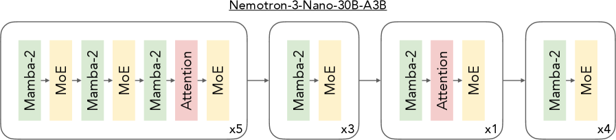

---
tags:
  - NLP
  - MLSYS
  - REASONING
  - QUANT
arxiv: https://arxiv.org/abs/2512.20856
github: ""
website: ""
year: 2024
read: false
---

# NVIDIA Nemotron 3: Efficient and Open Intelligence

> **Links:** [arXiv](https://arxiv.org/abs/2512.20856) | [NeMo-RL](https://github.com/NVIDIA-NeMo/RL) | [NeMo-Gym](https://github.com/NVIDIA-NeMo/Gym)
> **Tags:** #NLP #MLSYS #REASONING #QUANT

---

## Methodology

Nemotron 3 is a family of three open models — **Nano** (30B-A3B), **Super** (49B-A22B), and **Ultra** (253B-A20B) — built on a hybrid Mamba-Transformer MoE architecture with four main technical contributions: LatentMoE, NVFP4 training, Multi-Token Prediction (MTP), and multi-environment RL post-training.

### Hybrid Mamba-Transformer MoE Architecture

The backbone interleaves Mamba-2 recurrent layers with MoE feed-forward layers, and uses attention layers only sparingly (2 GQA KV heads). This design is chosen for inference efficiency: Mamba-2 replaces most attention layers while MoE selectively activates a small fraction of parameters per token.

**Nano specs:** 30B total / 3B active, hidden dim $d = 4096$, context length up to 1M tokens.

### LatentMoE

Standard MoE routing is bottlenecked by all-to-all communication cost that scales with hidden dimension $d$. LatentMoE routes and computes in a smaller latent dimension $\ell$ (typically $\ell = d/4$):

$$h_\text{out} = W_\text{down} \cdot \text{Experts}_\ell(W_\text{up} \cdot h)$$

- $h \in \mathbb{R}^d$: token hidden state at full model dimension.
- $W_\text{up} \in \mathbb{R}^{\ell \times d}$: down-projection into latent space before expert dispatch.
- $\text{Experts}_\ell(\cdot)$: sparse MoE computation operating in latent dimension $\ell$.
- $W_\text{down} \in \mathbb{R}^{d \times \ell}$: up-projection back to full model dimension.

This reduces routed parameter loads and all-to-all traffic by $d/\ell \approx 4\times$, allowing reinvestment into more experts and more active experts per token at the same inference cost.

| Config | Hidden dim | Experts | Active experts | Total params | Active params |
|---|---|---|---|---|---|
| Standard MoE | 4096 | 128 | 6 | 72.6B | 8.09B |
| LatentMoE | 4096 (latent: 1024) | 512 | 22 | 72.8B | 8.02B |

### NVFP4 Training

Super and Ultra are trained in NVFP4 format with fine-grained micro-block scaling (16-element blocks) and E4M3 scaling factors. Sensitive layers are kept in higher precision:

- Latent projections ($W_\text{up}$, $W_\text{down}$): BF16
- MTP heads: BF16
- QKV / attention projections: MXFP8
- Mamba output projections: MXFP8

This achieves $< 1\%$ relative loss difference vs. BF16 on Nano and $< 0.6\%$ on the 8B ablation model.

### Multi-Token Prediction (MTP)

Super and Ultra include MTP heads that predict multiple future tokens simultaneously. MTP provides two benefits:
1. **Denser training signal** — each forward pass contributes loss over several future positions.
2. **Speculative decoding at inference** — MTP draft heads propose candidates that the base model verifies in parallel.

| Benchmark | Baseline | +MTP | Δ |
|---|---|---|---|
| MMLU (5-shot) | 70.06% | 71.26% | +1.20% |
| MMLU-Pro (5-shot) | 45.05% | 47.84% | +2.79% |
| MBPP-Sanitized | 65.58% | 66.89% | +1.31% |
| ARC-Challenge (25-shot) | 86.43% | 88.05% | +1.62% |
| WinoGrande (0-shot) | 74.59% | 75.45% | +0.86% |
| RACE (0-shot) | 84.02% | 85.36% | +1.34% |
| GSM8K (8-shot) | 82.49% | 84.46% | +1.97% |

*Impact of adding MTP to an 8B-active MoE model trained for 1T tokens. Shot counts indicate few-shot evaluation protocol.*

### RL Post-Training

Post-training uses GRPO with an asynchronous actor-critic architecture across four multi-environment domains:
- Mathematical reasoning
- Competitive coding
- Software engineering
- Agentic tool use

The models support **granular reasoning budget control**, allowing the number of reasoning steps to be adjusted at inference time for accuracy–latency trade-offs.

---

## Experiment Setup

**Models:** Nemotron-3-Nano-30B-A3B, Nemotron-3-Super-49B-A22B, Nemotron-3-Ultra-253B-A20B.

**Ablation model:** 8B active / ~72.6–72.8B total parameters, trained on 1T tokens.

**Data:** Over 10 trillion tokens for pretraining; datasets and training recipes released under Apache 2.0.

**Key baselines:**
- Nemotron-Nano-12B-v2 (dense predecessor): long-context RULER comparison.
- Qwen3-30B-A3B: throughput comparison.

---

## Results

### LatentMoE vs. Standard MoE

| Benchmark | Standard MoE | LatentMoE |
|---|---|---|
| MMLU-Pro | 48.30% | 52.87% |
| MMLU | 70.10% | 72.11% |
| Code | 51.95% | 55.14% |
| Math | 78.32% | 80.19% |
| Commonsense | 81.73% | 82.10% |

*Both variants: 8B active params, 1T training tokens. LatentMoE uses 512 experts / 22 active vs. 128 experts / 6 active for Standard MoE.*

### Long Context (RULER)

| Model | 128k | 256k | 512k | 1M |
|---|---|---|---|---|
| Nemotron-Nano-12B-v2 (Dense) | 85.13 | 79.85 | 75.12 | 23.43 |
| Nemotron-3-Nano-30B-A3B (MoE) | 74.48 | 71.67 | 66.02 | 54.19 |

*RULER: higher is better. The Mamba-2 backbone enables MoE model to retain substantially higher recall at 1M-token context.*

### Throughput

Nemotron-3-Nano-30B-A3B achieves **3.3× higher throughput** vs. Qwen3-30B-A3B on reasoning workloads (8k input / 16k output sequences), attributed to Mamba-2 replacing most attention and LatentMoE reducing all-to-all communication.

---

## Related Papers

- [mamba2](mamba2.md)
- [deepseekmoe](deepseekmoe.md)
- [medusa](medusa.md)
- [vllm](vllm.md)
