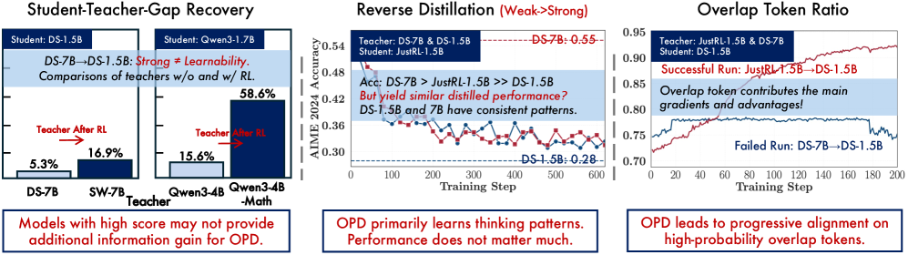

---
tags:
  - RL
  - REASONING
  - NLP
  - THEORY
arxiv: https://arxiv.org/abs/2604.13016
github: https://github.com/thunlp/OPD
website: ""
year: 2026
read: false
---

# Rethinking On-Policy Distillation of Large Language Models: Phenomenology, Mechanism, and Recipe

> **Links:** [arXiv](https://arxiv.org/abs/2604.13016) | [GitHub](https://github.com/thunlp/OPD)
> **Tags:** #RL #REASONING #NLP #THEORY

---

## Methodology

On-Policy Distillation (OPD) trains a student LLM $\pi_\theta$ by computing supervision on trajectories sampled from $\pi_\theta$ itself, rather than from a fixed teacher-generated dataset. At each step, the student samples a response $\hat{y} \sim \pi_\theta(\cdot \mid x)$ and the loss minimizes the sequence-level reverse KL divergence:

$$\mathcal{L}_{\mathrm{OPD}}(\theta) = \mathbb{E}_{x \sim \mathcal{D}_x,\; \hat{y} \sim \pi_\theta(\cdot \mid x)} \left[ \sum_{t=1}^{T} D_{\mathrm{KL}}(p_t \| q_t) \right]$$

- $p_t(v) \triangleq \pi_\theta(v \mid x, \hat{y}_{<t})$: student next-token distribution at step $t$
- $q_t(v) \triangleq \pi_T(v \mid x, \hat{y}_{<t})$: teacher distribution evaluated on the student-generated prefix
- $T$: rollout length
- $D_{\mathrm{KL}}(p_t \| q_t)$: per-token reverse KL (student-mode-seeking)

### Three Implementation Variants

| Variant | Loss | Memory Cost | Notes |
|---|---|---|---|
| **Sampled-Token** | $\log p_t(\hat{y}_t) - \log q_t(\hat{y}_t)$ | $O(BT)$ | Unbiased MC estimator of per-token reverse KL |
| **Full-Vocabulary** | $\sum_{v \in \mathcal{V}} p_t(v)\log\frac{p_t(v)}{q_t(v)}$ | $O(BTM)$ | Exact; memory-prohibitive for large vocab $M$ |
| **Top-$k$** | $D_{\mathrm{KL}}(\bar{p}_t^{(S_t)} \| \bar{q}_t^{(S_t)})$ | $O(BTk)$ | Subset KL on student top-$k$ set $S_t = \operatorname{TopK}(p_t, k)$ |

*$B$: batch size; $T$: sequence length; $M$: vocabulary size; $k$: top-$k$ cutoff; $\bar{p}_t^{(S_t)}, \bar{q}_t^{(S_t)}$: student/teacher distributions renormalized over $S_t$.*

### Two Governing Conditions for OPD Success

**Condition 1 — Thinking-pattern consistency.** Student and teacher must share compatible reasoning patterns. A large thinking-pattern mismatch weakens the token-level distillation signal regardless of the teacher's benchmark advantage.

**Condition 2 — New knowledge beyond same training pipeline.** The teacher must possess capabilities not already encountered by the student during training. A larger same-family model (e.g., R1-Distill-7B as teacher for R1-Distill-1.5B) can produce no gains — or even cause regression — if it carries no genuinely new knowledge.

### Token-Level Mechanism: High-Probability-Token Alignment

Three dynamic metrics monitored during training:

$$\mathcal{M}_{\text{overlap}} \triangleq \mathbb{E}_{t} \left[ \frac{|S_t^{(p)} \cap S_t^{(q)}|}{k} \right]$$

$$\mathcal{M}_{\text{adv}} \triangleq \mathbb{E}_{t}\!\left[ \frac{1}{|S_t^{(p)} \cap S_t^{(q)}|} \sum_{v \in S_t^{(p)} \cap S_t^{(q)}} \bar{p}_t(v)\bigl(\log \bar{q}_t(v) - \log \bar{p}_t(v)\bigr) \right]$$

$$\Delta H_t = \left| H(q_t) - H(p_t) \right|$$

- $S_t^{(p)} = \operatorname{TopK}(p_t, k)$, $S_t^{(q)} = \operatorname{TopK}(q_t, k)$: student and teacher top-$k$ token sets
- $\mathcal{M}_{\text{overlap}}$: **overlap ratio** — fraction of tokens shared in both top-$k$ sets; rises from ~72% to ~91% in successful runs
- $\mathcal{M}_{\text{adv}}$: **overlap-token advantage** — weighted log-ratio of teacher vs. student within shared tokens; approaches zero when alignment is good; large negative when student is overconfident relative to teacher within the overlap
- $\Delta H_t$: **entropy gap** — absolute mismatch in per-step entropy; small in successful runs
- Overlap tokens carry 97%–99% of combined probability mass throughout training regardless of success/failure

Successful OPD = progressive alignment on high-probability tokens at student-visited states. Failing OPD = weak gradients, persistent mismatch, stagnating performance.

### Practical Recipe

**Strategy 1 — Off-Policy Cold Start (two-stage):**
1. Sample 200K prompts from math subset of OpenThoughts3-1.2M
2. Generate one teacher rollout per prompt (Qwen3-4B Non-thinking; temp=0.7, top-p=0.95, max 12,288 tokens); filter incomplete/repetitive outputs
3. SFT student on filtered pairs using LLaMA-Factory (full-parameter) → Qwen3-1.7B-SFT
4. Run OPD on remaining ~30K deduplicated prompts; SFT-init starts with higher overlap ratio and achieves substantially higher final accuracy vs. pure OPD from base

**Strategy 2 — Teacher-Aligned Prompts:**
- Use prompts from the teacher's post-training dataset (e.g., DAPO-Math-17K for GRPO-trained teacher)
- Match the exact prompt template used during teacher post-training
- Risk: using only teacher-aligned prompts suppresses student entropy; mix with OOD prompts to preserve exploration

---

## Experiment Setup

**Student models:** Qwen3-1.7B-Base, Qwen3-1.7B (Non-thinking), R1-Distill-1.5B, R1-Distill-7B, JustRL-1.5B

**Teacher models:** Qwen3-4B (Non-thinking), Qwen3-4B-Base-GRPO (GRPO on Qwen3-4B-Base), R1-Distill-7B, Skywork-OR1-Math-7B, Qwen3-4B-Non-Thinking-RL-Math, R1-Distill-1.5B

**Training datasets:** DAPO-Math-17K (default OPD); OpenThoughts3-1.2M math subset (cold-start SFT)

**Evaluation benchmarks:** AIME 2024, AIME 2025, AMC 2023

**Metric:** avg@16 — average accuracy over 16 samples (temp=0.7, top-p=0.95, max 31,744 tokens)

**Hardware:** 8× A800 80 GB GPUs

---

## Results

### Training Hyperparameters

| Hyperparameter | GRPO Teacher Training | Default OPD |
|---|---|---|
| Base model | Qwen3-4B-Base | — |
| Epochs | 1 | 1 |
| Global batch size | 64 | 64 |
| Rollout $n$ | 8 | 4 |
| LogProb top-$k$ | — | 16 |
| Top-$k$ strategy | — | Student Top-$k$ |
| Max prompt length | 1,024 | 1,024 |
| Max response length | 7,168 | 7,168 |
| Learning rate | $1 \times 10^{-6}$ | $1 \times 10^{-6}$ |
| Temperature | 1.0 | 1.0 |
| KL coefficient | 0.0 | 0.0 |

### Main Results (Reported as Training Curves)

Results are presented as training-step accuracy curves; key qualitative findings:

| Student | Teacher | Condition | Outcome |
|---|---|---|---|
| Qwen3-1.7B-Base | Qwen3-4B-Base-GRPO | High initial overlap (thinking match) | Consistent improvement on all 3 benchmarks |
| Qwen3-1.7B-Base | Qwen3-4B (Non-thinking) | Low initial overlap (thinking mismatch) | Weaker gains; early gap not recovered |
| R1-Distill-1.5B | Skywork-OR1-Math-7B | RL post-trained teacher (new knowledge) | Large gains; high gap recovery rate |
| R1-Distill-1.5B | R1-Distill-7B | Same-pipeline larger model | Little to no improvement |
| JustRL-1.5B | R1-Distill-1.5B | Teacher = student's pre-RL checkpoint | Regression to pre-RL performance |
| JustRL-1.5B | R1-Distill-7B | Larger same-family model scoring higher | Same regression as weaker 1.5B teacher |

*Gap recovery rate = $(Acc_{\text{after OPD}} - Acc_{\text{before OPD}}) / (Acc_{\text{teacher}} - Acc_{\text{before OPD}})$.*

### Ablations: Cold Start

| Student Init | Overlap Ratio at Start | Stability | Final Accuracy |
|---|---|---|---|
| Qwen3-1.7B-Base (no cold start) | Low | Unstable | Baseline |
| Qwen3-1.7B-SFT (200K cold start) | High | Stable | Substantially better |

*Teacher: Qwen3-4B (Non-thinking). Same OPD prompts for both.*

### Ablations: Prompt Alignment

| Prompt Setting | Overlap Ratio | Student Entropy | Accuracy |
|---|---|---|---|
| Mismatched template (DAPO format) | Lower | — | Baseline |
| Teacher-aligned template | Higher | — | Better on all 3 benchmarks |
| OOD content (DeepMath subset) | Higher overlap ratio | Higher | Baseline |
| Teacher-aligned content (DAPO-Math-17K) | Lower overlap ratio; higher mass concentration on shared tokens | Lower (risk of collapse) | Better; mix with OOD recommended |
