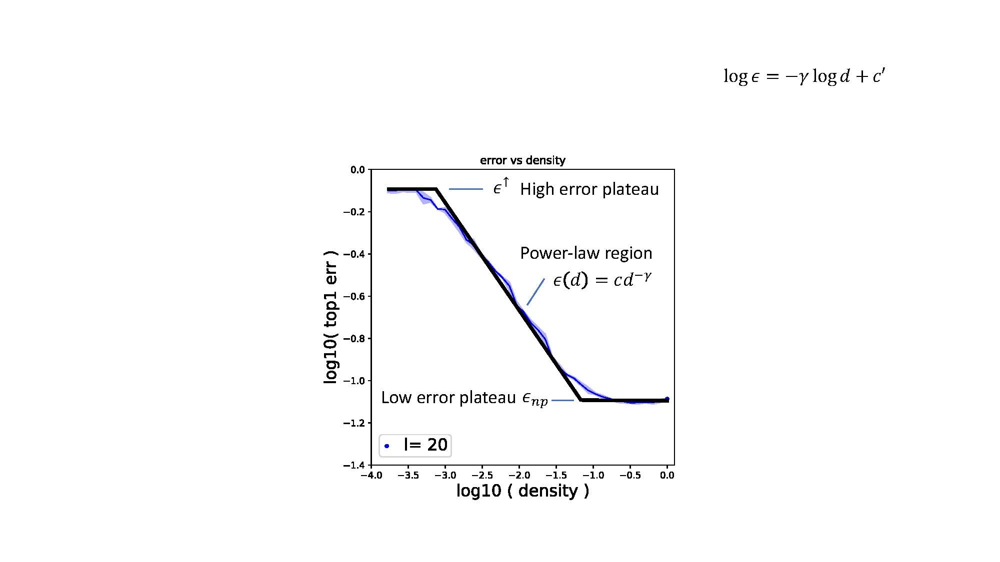

---
tags:
  - PRUNING
  - DEEP_LEARNING
  - THEORY
arxiv: https://arxiv.org/abs/2006.10621
github: ""
website: ""
year: 2021
read: false
---

# On the Predictability of Pruning Across Scales

> **Links:** [arXiv](https://arxiv.org/abs/2006.10621)
> **Tags:** #PRUNING #DEEP_LEARNING #THEORY

---

## Methodology



*The pruning error curve (log–log scale) has three regions: a **low-error plateau** at $\epsilon_{np}$ (dense regime), a **power-law region** where $\epsilon(d) \approx c d^{-\gamma}$, and a **high-error plateau** at $\epsilon^\uparrow$ (extreme sparsity). The black piecewise-linear fit illustrates the rational-form scaling law.*

### Overview

The paper derives an explicit **scaling law** for **Iterative Magnitude Pruning (IMP)** that predicts test error as a function of pruned density $d$, network depth $l$, width scaling factor $w$, and dataset size $n$. Once fit on a small number of runs, it generalizes to any configuration in the family without further experiments.

### Step 1 — Single-network functional form

For a network with fixed $(l, w, n)$, the error–density curve follows a rational power-law form (Eq. 1):

$$\hat{\epsilon}(\epsilon_{np}, d \mid l, w, n) = \epsilon_{np} \left\| \frac{d - jp\!\left(\tfrac{\epsilon^\uparrow}{\epsilon_{np}}\right)^{1/\gamma}}{d - jp} \right\|^\gamma, \quad j = \sqrt{-1}$$

Free parameters (fitted per configuration):
- $\epsilon_{np}$: unpruned test error (low-error plateau; observed, not fit)
- $\epsilon^\uparrow$: high-error plateau at extreme sparsity
- $\gamma$: slope of the power-law region on log–log axes
- $p$: density at which the high-error plateau transitions to the power-law region

Fitting: least-squares minimization of relative deviation $\delta = (\hat\epsilon - \epsilon)/\epsilon$ over all densities for each $(l,w,n)$.

**Quality:** mean $\mu < 2\%$, std $\sigma < 4\%$ relative deviation across 4,301 CIFAR-10 ResNet data points.

### Step 2 — Error-preserving invariant

Constant-error contours on the $(d, l)$ and $(d, w)$ planes are linear on log–log axes, revealing:

$$m^* = l^\phi w^\psi d$$

- $l$: depth (number of residual blocks); $w$: width scaling factor; $d \in (0,1]$: remaining density after pruning.
- $\phi, \psi$: scalar exponents fitted globally from data — how depth and width trade off against density at fixed error.
- $m^*$: effective-parameter-count invariant; two networks with matching $m^*$ sit on the same error contour.

Networks with different $(d, l, w)$ but identical $m^*$ achieve the **same test error**, making depth, width, and density mutually interchangeable.

### Step 3 — Joint scaling law (all dimensions)

Substituting $d = m^*/(l^\phi w^\psi)$ into Eq. 1 and reparameterizing $p \to p'/(l^\phi w^\psi)$ yields a joint form with **five global constants** $(\epsilon^\uparrow, \gamma, p', \phi, \psi)$:

$$\hat{\epsilon}(\epsilon_{np}, d, l, w, n) = \epsilon_{np} \left\| \frac{l^\phi w^\psi d - jp'\!\left(\tfrac{\epsilon^\uparrow}{\epsilon_{np}}\right)^{1/\gamma}}{l^\phi w^\psi d - jp'} \right\|^\gamma$$

Dataset size $n$ enters **only** through $\epsilon_{np}(l,w,n)$; no additional free parameter for $n$.

Fitting: single joint least-squares over all $(d, l, w, n)$ simultaneously.

**Quality:** $\mu < 2\%$, $\sigma < 6\%$ on CIFAR-10 (4,301 pts) and ImageNet (274 pts) jointly. Seed-to-seed variation on CIFAR-10 has $\sigma = 3.4\%$, so measurement noise explains most of the residual.

### Step 4 — Sample efficiency after law is known

| Sampling strategy | Min. experiments for stable fit ($\sigma < 1\%$) |
|---|---|
| Random $(w, l, d, n)$ tuples | ~40 individual networks |
| Random $(w, l, n)$ configs + all densities per config | ~15 configs |

### IMP Algorithm (formal)

```
Inputs: W_0 (random init), N pruning rounds, rewind epoch = 10
1. Train W_0 for 10 epochs → W_10
2. For n = 1 … N:
   a. Train m ⊙ W_10 to epoch T → W_{T,n}
   b. Prune 20% of weights in m ⊙ W_{T,n} with lowest magnitude; update mask m
3. Return mask m and weights W_{T,N}
```

- Pruning is **unstructured** and **globally** applied (no per-layer quotas).
- Biases and BatchNorm parameters are never pruned.
- Density after $k$ rounds: $d_k = 0.8^k$.

---

## Experiment Setup

| Axis | CIFAR-10 ResNet | ImageNet ResNet |
|---|---|---|
| Densities $d$ | $0.8^i$, $i \in \{0,\ldots,40\}$ | $0.8^i$, $i \in \{0,\ldots,30\}$ |
| Depths $l$ | 8, 14, 20, 26, 50, 98 | 50 (fixed) |
| Width scalings $w$ | $2^i$, $i \in \{-4,\ldots,2\}$ | $2^i$, $i \in \{-4,\ldots,0\}$ |
| Subsample fractions $n$ | $N/\{1,2,4,8,16,32,64\}$ | $N/\{1,2,4\}$ |
| Configs used | 152 $(l,w,n)$ triples → 4,301 pts | 15 triples → 274 pts |

**Additional architectures (appendix):** VGG-16 (CIFAR-10/SVHN), DenseNet-121 (CIFAR-10/SVHN), ResNet-18 (TinyImageNet).

**Training (CIFAR-10/SVHN ResNets and VGG-16):**
- 160 epochs, batch 128, SGD momentum 0.9, LR 0.1 (drop ×0.1 at epochs 80, 120)
- He uniform init; CIFAR-10 augmentation: random flip + random crop ±4 px

**Training (ImageNet ResNet-50):**
- 90 epochs, batch 1024, SGD momentum 0.9, LR 0.4 with linear warmup (epochs 1–5), drops ×0.1 at epochs 30, 60, 80
- He uniform init; random resized crop + random horizontal flip

**IMP specifics:** weight rewinding to epoch 10; 3 seeds per CIFAR-10 config, 1 seed for ImageNet.

---

## Results

### Scaling Law Fit Quality

| Scaling law | Dataset | Data points | Mean $\mu$ | Std $\sigma$ |
|---|---|---|---|---|
| Single-network (per config) | CIFAR-10 ResNet | 4,301 | $<2\%$ | $<4\%$ |
| Joint (all dims) | CIFAR-10 ResNet | 4,301 | $<2\%$ | $<6\%$ |
| Joint (all dims) | ImageNet ResNet | 274 | $<2\%$ | $<6\%$ |
| Seed variation (baseline noise) | CIFAR-10 ResNet | — | — | $3.4\%$ |

*$\mu$, $\sigma$: mean and standard deviation of relative deviation $\delta = (\hat\epsilon - \epsilon)/\epsilon$. Example: actual error 10% → predicted $10 \pm 0.6\%$ at $\sigma{=}6\%$.*

### Optimal Pruning Strategy (from scaling law)

For CIFAR-10 ResNets, analytical solution of $\argmin_{l,w,d} lw^2 d$ subject to $\hat\epsilon = \epsilon_k$ shows:
- The minimum-parameter network achieving error $\epsilon_k$ is **not** the unpruned network of minimal size pruned lightly.
- It is a **larger** unpruned network pruned until error rises to $\epsilon_k$.
- Estimated vs. actual optimal parameter count agree to within **25%**.
