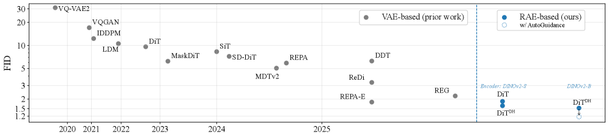

---
tags:
  - VISION
  - DEEP_LEARNING
arxiv: https://arxiv.org/abs/2510.11690
github: https://github.com/bytetriper/RAE
website: https://rae-dit.github.io/
year: 2025
read: false
---

# Diffusion Transformers with Representation Autoencoders

> **Links:** [arXiv](https://arxiv.org/abs/2510.11690) | [GitHub](https://github.com/bytetriper/RAE) | [Website](https://rae-dit.github.io/)
> **Tags:** #VISION #DEEP_LEARNING

---

## Methodology

The core idea is to replace the standard VAE latent space in Diffusion Transformers (DiT) with a **Representation Autoencoder (RAE)** — a frozen pretrained vision encoder (DINOv2, SigLIP, MAE) paired with a trained ViT decoder. This yields a high-dimensional semantic latent space that enables faster convergence and better generation quality.

### RAE Construction

1. **Freeze the encoder**: Use a pretrained vision encoder $f_\phi$ (e.g., DINOv2-B) without any fine-tuning. For a $256 \times 256$ image with patch size 16, this produces $256$ tokens each of dimension $n$ (e.g., $n = 768$ for ViT-B).

2. **Train a ViT decoder**: Learn decoder $g_\psi$ to reconstruct the image from the encoder tokens. Loss: L1 + LPIPS + GAN (adversarial). At inference, $z = f_\phi(x)$ is fed to the diffusion model; $g_\psi$ reconstructs the image.

3. **Noise-augmented decoder training**: Train $g_\psi$ on the smoothed distribution $p_n(z)$ by adding Gaussian noise $\epsilon \sim \mathcal{N}(0, \sigma^2 I)$ to clean encoder latents $z$:

$$\tilde{z} = z + \epsilon, \quad \epsilon \sim \mathcal{N}(0, \sigma^2 I)$$

- $z = f_\phi(x)$: clean encoder latent, shape $[N_\text{tokens}, n]$
- $\sigma$: noise level matching the diffusion model's output distribution
- This bridges the gap between clean training latents and noisy diffusion outputs at inference

### Matching DiT Width to Encoder Dimensionality

Standard DiT fails with RAE latents because the token dimension $n$ (e.g., 768) exceeds the DiT hidden dimension $d$ (e.g., 384 for DiT-S). The **width condition** requires:

$$d \geq n$$

If violated, training loss does not converge to zero (overfitting test fails). Solution: scale DiT hidden dimension to match or exceed $n$.

### Dimension-Dependent Noise Schedule Shift

RAE latents live in a space with effective data dimension $D = N_\text{tokens} \times n$, much larger than SD-VAE's $D' = N_\text{tokens} \times 4$. Apply a schedule shift to compensate:

$$\alpha = \sqrt{m / n}$$

where $m = 4$ (SD-VAE channel count) and $n$ is the RAE token dimension. This aligns the signal-to-noise ratio of the diffusion process with what the model expects.

- Without schedule shift: gFID = 23.08
- With schedule shift: gFID = 4.81

### DiT$^{DH}$: Wide Diffusion Head

To increase model width without quadratic attention overhead, attach a **Diffusion Head (DH)** — a shallow (2-layer), wide (hidden dim 2048) transformer module — on top of a standard DiT-XL backbone:

- Base DiT-XL processes tokens at $d = 1024$
- DH expands to $d_\text{DH} = 2048$ for final layers
- Total params: 839M (vs. 675M for DiT-XL)

---

## Experiment Setup

- **Dataset**: ImageNet-1K, class-conditional generation
- **Resolution**: 256×256 and 512×512
- **Base architecture**: LightningDiT (flow-matching DiT variant)
- **Encoders tested**: DINOv2-S/B/L (self-supervised), SigLIP2-B (language-supervised), MAE-B (masked autoencoder)
- **Patch size**: 16 (producing 256 tokens per 256×256 image)
- **Training**: 80–800 epochs; sampling with 50-step Euler solver
- **Guidance**: classifier-free guidance where reported
- **Baselines**: DiT-XL, SiT, REPA, REPA-E, DDT, EDM2, StyleGAN-XL, MAGVIT-v2

---

## Results

### Reconstruction Quality

| Encoder | rFID | Decoder GFLOPs | Top-1 Linear Probe |
|---------|------|----------------|-------------------|
| MAE-B | 0.16 | 106.7 | 68.0% |
| DINOv2-B | 0.49 | 106.7 | 84.5% |
| SigLIP2-B | 0.53 | 106.7 | 79.1% |
| SD-VAE | 0.62 | 310.4 | 8.0% |

*rFID: reconstruction FID (lower is better). Decoder is ViT-XL for all RAE variants. SD-VAE is the standard VAE used in Stable Diffusion.*

### Main Generation Results — ImageNet 256×256

| Method | Epochs | Params | gFID↓ | IS↑ | Prec↑ | Rec↑ | gFID↓ (cfg) | IS↑ (cfg) | Prec↑ | Rec↑ |
|--------|--------|--------|-------|-----|-------|------|-------------|-----------|-------|------|
| DiT-XL | 1400 | 675M | 9.62 | 121.5 | 0.67 | 0.67 | 2.27 | 278.2 | 0.83 | 0.57 |
| SiT-XL | 1400 | 675M | 8.61 | 131.7 | 0.68 | 0.67 | 2.06 | 270.3 | 0.82 | 0.59 |
| REPA | 800 | 675M | 5.78 | 158.3 | 0.70 | 0.68 | 1.29 | 306.3 | 0.79 | 0.64 |
| REPA-E | 800 | 675M | 1.70 | 217.3 | 0.77 | 0.66 | 1.15 | 304.0 | 0.79 | 0.66 |
| DiT-XL (RAE) | 800 | 676M | 1.87 | 209.7 | 0.80 | 0.63 | 1.41 | 309.4 | 0.80 | 0.63 |
| **DiT$^{DH}$-XL (RAE)** | **800** | **839M** | **1.51** | **242.9** | **0.79** | **0.63** | **1.13** | **262.6** | **0.78** | **0.67** |

*cfg: classifier-free guidance. gFID↓: generation FID (lower is better). IS↑: Inception Score (higher is better). Prec/Rec: precision/recall.*

### Generation Results — ImageNet 512×512 (with guidance)

| Method | gFID↓ | IS↑ | Prec↑ | Rec↑ |
|--------|-------|-----|-------|------|
| StyleGAN-XL | 2.41 | 267.8 | 0.77 | 0.52 |
| MAGVIT-v2 | 1.91 | 324.3 | — | — |
| DDT | 1.28 | 305.1 | 0.80 | 0.63 |
| EDM2 | 1.25 | — | — | — |
| **DiT$^{DH}$-XL (RAE)** | **1.13** | **259.6** | **0.80** | **0.63** |

### Ablations

**Width condition — standard DiT + RAE latents (convergence test):**

| Model | DINOv2-S ($n$=384) | DINOv2-B ($n$=768) | DINOv2-L ($n$=1024) |
|-------|:-----------------:|:-----------------:|:------------------:|
| DiT-S ($d$=384) | ✓ | ✗ | ✗ |
| DiT-B ($d$=768) | ✓ | ✓ | ✗ |
| DiT-L ($d$=1024) | ✓ | ✓ | ✓ |

*$n$: encoder token dimension; $d$: DiT hidden dimension. ✓ = training converges, ✗ = fails to converge. Convergence requires $d \geq n$.*

**DiT$^{DH}$ vs. DiT-XL across encoder scales (gFID):**

| Model | DINOv2-S | DINOv2-B | DINOv2-L |
|-------|:--------:|:--------:|:--------:|
| DiT-XL | 3.50 | 4.28 | 6.09 |
| DiT$^{DH}$-XL | 2.42 | 2.16 | 2.73 |

**Noise-augmented decoder effect:**

| Decoder training distribution | gFID | rFID |
|-------------------------------|------|------|
| Clean latents $p(z)$ | 4.81 | 0.49 |
| Noise-augmented $p_n(z)$ | 4.28 | 0.57 |

---

## Related Papers

- [dinov3](dinov3.md)
